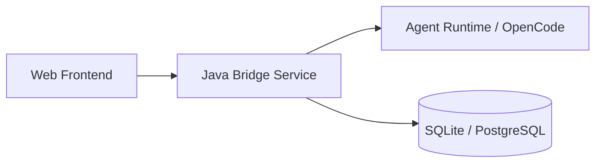
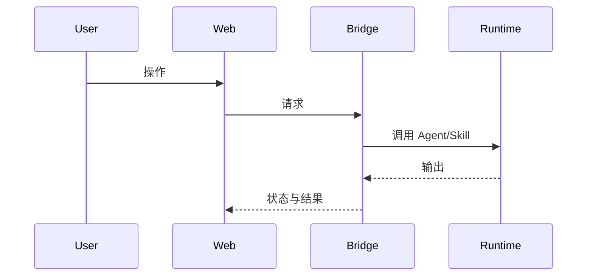

# HLD Design

Use this skill after `prd-desingn` has produced a PRD. The goal is to create a high-level design Markdown document that explains the application architecture and major module responsibilities.

## Input

The caller should provide:
- FE id and FE requirement summary.
- The PRD Markdown output from the previous step.
- Optional current architecture constraints, existing service boundaries, UI prototype notes, or integration assumptions.

If the PRD leaves gaps, make explicit assumptions and keep the design extensible.

## Output Rules

Return only one Markdown document. Do not include extra explanation before or after the document.

The document must be detailed enough for the next LLD step to derive database tables, APIs, state machines, and implementation tasks.

## Markdown Template

````markdown
# HLD: <FE id> <title>

## 1. 设计目标
- 业务目标:
- 技术目标:
- 约束:

## 2. 总体架构


## 3. 核心模块
| 模块 | 职责 | 输入 | 输出 | 扩展点 |
| --- | --- | --- | --- | --- |
|  |  |  |  |  |

## 4. 关键流程


## 5. 数据流与状态
- 主数据对象:
- 状态流转:
- 事件:
- 产物:

## 6. 接口边界
| 接口 | 方法 | 调用方 | 说明 |
| --- | --- | --- | --- |
|  |  |  |  |

## 7. 安全与权限
- 鉴权:
- 授权:
- 审计:
- 敏感数据:

## 8. 性能与可靠性
- 并发模型:
- 超时与重试:
- 缓存:
- 降级:

## 9. 风险与取舍
| 风险 | 影响 | 推荐处理 |
| --- | --- | --- |
|  |  |  |

## 10. 给 LLD 的设计输入
- 需要落库的对象:
- 需要实现的 API:
- 需要定义的状态机:
- 需要接入的运行时能力:
````
