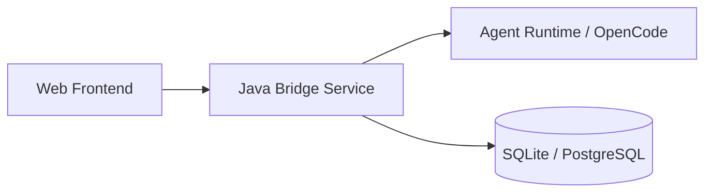
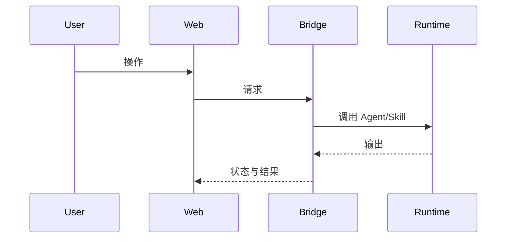
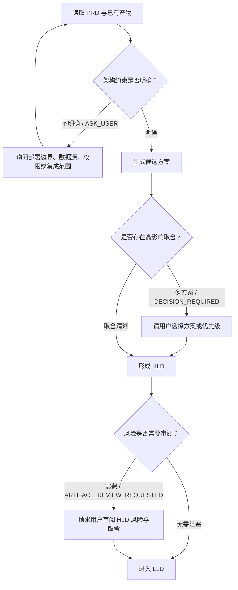

# HLD Design

Use this skill after `prd-desingn` has produced a PRD. The goal is to create a high-level design Markdown document that explains the application architecture and major module responsibilities.

## Input

The caller should provide:
- FE id and FE requirement summary.
- The PRD Markdown output from the previous step.
- Optional current architecture constraints, existing service boundaries, UI prototype notes, or integration assumptions.

If the PRD leaves gaps, make explicit assumptions and keep the design extensible.

## Output Rules

Return only one Markdown document. Do not include extra explanation before or after the document.

The document must be detailed enough for the next LLD step to derive database tables, APIs, state machines, and implementation tasks.

The document must include an agent-first branch contract:
- A Mermaid flowchart that shows the recommended HLD-stage route and branch points.
- Mermaid must use valid Mermaid 11 syntax: ASCII node ids, quoted Chinese labels, `A --> B` or `A -->|label| B` edges, and no `A -- "label" --> B` edge syntax.
- A structured interaction table. Use `ASK_USER` for missing architecture inputs, `DECISION_REQUIRED` for competing solution options, `ARTIFACT_REVIEW_REQUESTED` for design review, and `PERMISSION_REQUIRED` for sensitive external integration or data access decisions.
- The interaction table must include `是否触发`. Only mark `是` when the Agent is actively requesting user input for this run; otherwise mark `否`.
- Branches are recommendations for the Agent runtime. They are not hard DAG edges; the Agent may dynamically add repair, risk-check, or clarification actions when needed.

## Markdown Template

````markdown
# HLD: <FE id> <title>

## 1. 设计目标
- 业务目标:
- 技术目标:
- 约束:

## 2. 总体架构


## 3. 核心模块
| 模块 | 职责 | 输入 | 输出 | 扩展点 |
| --- | --- | --- | --- | --- |
|  |  |  |  |  |

## 4. 关键流程


## 5. 数据流与状态
- 主数据对象:
- 状态流转:
- 事件:
- 产物:

## 6. Agent 执行路线与分支建议


| 交互点 | 类型 | 是否触发 | 选项 | 触发条件 | 建议问题/动作 | 默认处理 |
| --- | --- | --- | --- | --- | --- | --- |
| 架构约束澄清 | ASK_USER | 否 |  | 部署、数据源、权限、第三方依赖不明确 | 询问关键约束 | 采用最低耦合 MVP 假设 |
| 方案选择 | DECISION_REQUIRED | 否 | 低风险方案 / 低成本方案 / 完整方案 | 存在多个成本/风险差异明显的方案 | 要求用户选择推荐方案 | 默认选择风险最低方案 |
| 设计审阅 | ARTIFACT_REVIEW_REQUESTED | 否 | 通过 / 退回修改 | HLD 包含高风险假设或跨系统影响 | 请求用户审阅风险与取舍 | 低风险时自动进入 LLD |
| 敏感集成授权 | PERMISSION_REQUIRED | 否 | 授权 / 拒绝 | 需要访问真实外部系统、密钥或生产数据 | 请求授权后再继续 | 不执行敏感动作 |

## 7. 接口边界
| 接口 | 方法 | 调用方 | 说明 |
| --- | --- | --- | --- |
|  |  |  |  |

## 8. 安全与权限
- 鉴权:
- 授权:
- 审计:
- 敏感数据:

## 9. 性能与可靠性
- 并发模型:
- 超时与重试:
- 缓存:
- 降级:

## 10. 风险与取舍
| 风险 | 影响 | 推荐处理 |
| --- | --- | --- |
|  |  |  |

## 11. 给 LLD 的设计输入
- 需要落库的对象:
- 需要实现的 API:
- 需要定义的状态机:
- 需要接入的运行时能力:
````
