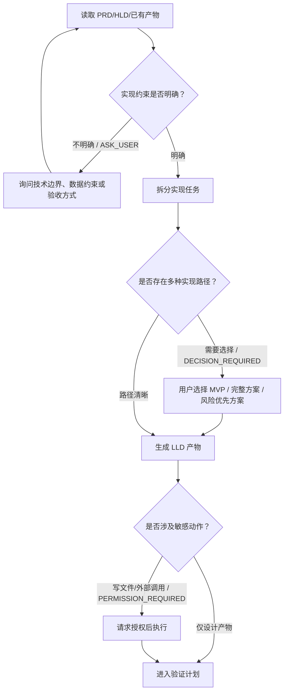

# LLD Design

Use this skill after `hld-design` has produced an HLD. The goal is to create a low-level design Markdown document that can drive implementation tasks.

## Input

The caller should provide:
- FE id and FE requirement summary.
- PRD Markdown output.
- HLD Markdown output.
- Optional codebase constraints, database choice, frontend framework, backend framework, runtime adapter details, and testing expectations.

If implementation details are undecided, recommend an MVP path first and mark future extension points separately.

## Output Rules

Return only one Markdown document. Do not include extra explanation before or after the document.

The document must be implementation-ready and should avoid vague placeholders. Use concrete names for tables, APIs, DTOs, components, and tests when possible.

The document must include an agent-first branch contract:
- A Mermaid flowchart that shows implementation-stage branches, repair paths, and user interaction points.
- Mermaid must use valid Mermaid 11 syntax: ASCII node ids, quoted Chinese labels, `A --> B` or `A -->|label| B` edges, and no `A -- "label" --> B` edge syntax.
- A structured interaction table. Use `ASK_USER` for unresolved implementation constraints, `DECISION_REQUIRED` for alternative implementation paths, `ARTIFACT_REVIEW_REQUESTED` for final LLD review, and `PERMISSION_REQUIRED` for writes, external calls, production data, deployment, or destructive actions.
- The interaction table must include `是否触发`. Only mark `是` when the Agent is actively requesting user input for this run; otherwise mark `否`.
- Keep the main stage flow stable, but explicitly list dynamic runtime actions that the Agent may add, such as validation, rollback planning, schema refinement, or test repair.

## Markdown Template

````markdown
# LLD: <FE id> <title>

## 1. 实现范围
- 本次实现:
- 暂不实现:
- 依赖前置:

## 2. 数据模型
| 表/对象 | 字段 | 类型 | 约束 | 说明 |
| --- | --- | --- | --- | --- |
|  |  |  |  |  |

## 3. 状态机
| 对象 | 状态 | 进入条件 | 退出条件 | 失败处理 |
| --- | --- | --- | --- | --- |
|  |  |  |  |  |

## 4. API 设计
| API | 方法 | 请求 | 响应 | 错误码 |
| --- | --- | --- | --- | --- |
|  |  |  |  |  |

## 5. 后端实现
- Controller:
- Service:
- Mapper/Repository:
- Runtime Adapter:
- 事务边界:

## 6. 前端实现
- 页面/组件:
- Store:
- API Client:
- 交互状态:
- 空状态/错误状态:

## 7. 工作流节点与 Skill 调用


| 节点/动作 | 类型 | 是否触发 | 选项 | Skill | 输入 | 输出产物/结果 | 触发条件 |
| --- | --- | --- | --- | --- | --- | --- | --- |
| PRD 读取 | STAGE_INPUT | 是 |  | prd-desingn | FE 需求 | PRD Markdown | 上游产物存在 |
| HLD 读取 | STAGE_INPUT | 是 |  | hld-design | FE + PRD | HLD Markdown | 上游产物存在 |
| LLD 生成 | STAGE_OUTPUT | 是 |  | lld-design | FE + PRD + HLD | LLD Markdown | 实现约束明确 |
| 实现约束澄清 | ASK_USER | 否 |  | - | 未决技术约束 | 用户补充信息 | 关键约束缺失 |
| 实现路径选择 | DECISION_REQUIRED | 否 | MVP / 完整方案 / 风险优先方案 | - | 候选实现方案 | 用户选择方案 | MVP/完整方案差异明显 |
| 敏感动作授权 | PERMISSION_REQUIRED | 否 | 授权 / 拒绝 | - | 写文件、调用外部系统、生产数据 | 授权结果 | 需要真实副作用 |
| LLD 审阅 | ARTIFACT_REVIEW_REQUESTED | 否 | 通过 / 退回修改 | - | LLD Markdown | 审阅意见 | 风险较高或影响范围较大 |

## 8. 测试计划
- 单元测试:
- 集成测试:
- 前端测试:
- 手工验证:

## 9. 迁移与兼容
- SQLite MVP:
- PostgreSQL 演进:
- OpenCode runtime 演进:

## 10. 实施任务拆分
| 任务 | 文件/模块 | 验收方式 |
| --- | --- | --- |
|  |  |  |
````
