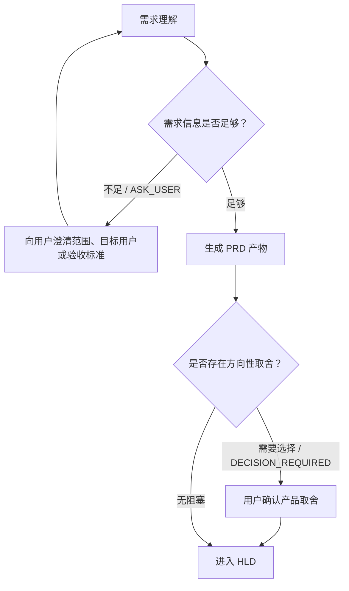

# PRD Design

Use this skill when the input is an FE requirement, such as `FE1234`, and the expected output is a PRD Markdown document.

## Input

The caller should provide:
- FE id, title, description, business background, user scenario, constraints, priority, and current workflow state.
- Optional existing conversation context or acceptance notes.

If details are incomplete, make reasonable assumptions and list them in the PRD. Do not block on questions unless the missing information changes the product direction.

## Output Rules

Return only one Markdown document. Do not include extra explanation before or after the document.

The document must be actionable for the next HLD step and should include stable anchors that later design documents can reference.

The document must include an agent-first branch contract:
- A Mermaid flowchart that shows the recommended high-level stage route and possible user interaction points.
- Mermaid must use valid Mermaid 11 syntax: ASCII node ids, quoted Chinese labels, `A --> B` or `A -->|label| B` edges, and no `A -- "label" --> B` edge syntax.
- A structured interaction table. Use `ASK_USER` when business information is missing, `DECISION_REQUIRED` when the user must choose among options, `ARTIFACT_REVIEW_REQUESTED` when a PRD should be reviewed before continuing, and `PERMISSION_REQUIRED` only for sensitive external actions.
- The interaction table must include `是否触发`. Only mark `是` when the Agent is actively requesting user input for this run; otherwise mark `否`.
- Do not mark a user interaction point as mandatory unless the missing information changes the product direction or acceptance criteria.

## Markdown Template

````markdown
# PRD: <FE id> <title>

## 1. 背景与目标
- 背景:
- 目标:
- 非目标:

## 2. 用户与场景
- 目标用户:
- 核心场景:
- 触发入口:
- 成功结果:

## 3. 需求范围
| 编号 | 需求项 | 说明 | 优先级 | 验收标准 |
| --- | --- | --- | --- | --- |
| PRD-REQ-001 |  |  | Must |  |

## 4. 交互与流程
1. 
2. 
3. 

## 5. Agent 执行路线与分支建议


| 交互点 | 类型 | 是否触发 | 选项 | 触发条件 | 建议问题/动作 | 默认处理 |
| --- | --- | --- | --- | --- | --- | --- |
| 需求澄清 | ASK_USER | 否 |  | 目标用户、范围或验收标准缺失 | 请用户补充关键业务边界 | 基于显式假设继续，并标记风险 |
| 取舍确认 | DECISION_REQUIRED | 否 | 最小可用方案 / 完整方案 / 暂缓推进 | 存在多种产品方案且影响验收 | 请用户选择优先方向 | 推荐最小可用方案 |
| 产物审阅 | ARTIFACT_REVIEW_REQUESTED | 否 | 通过 / 退回修改 | PRD 将作为后续 HLD 输入且假设较多 | 请用户确认 PRD 是否可进入 HLD | 低风险时自动进入 HLD |

## 6. 数据与状态
| 对象 | 字段/状态 | 说明 |
| --- | --- | --- |
| FE |  |  |

## 7. 权限与安全
- 身份:
- 权限:
- 审计:
- 风险:

## 8. 性能与可用性
- 性能目标:
- 并发假设:
- 降级策略:

## 9. 验收标准
- 

## 10. 待确认问题
| 问题 | 影响范围 | 建议处理 |
| --- | --- | --- |
|  |  |  |

## 11. 给 HLD 的设计输入
- 核心能力:
- 关键流程:
- 关键数据:
- 外部依赖:
````
