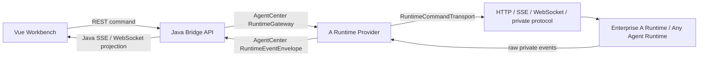

# A Runtime Adapter 对接与验证指导

> 状态：第一版对接指导
> 适用分支：`codex/a-runtime-adapter`
> 目标：在不改变 AgentCenter 前端交互合同的前提下，验证企业内部 A Runtime 或其他 Agent Runtime 是否能通过 Java Bridge Runtime Provider 接入。

当前分支已经提供第一版 A Runtime skeleton：

- `RuntimeType.A_RUNTIME`
- `ARuntimeProvider`
- `ARuntimeFakeTransport`
- `ARuntimeEventTranslator`
- `ARuntimeProviderContractTest`

这版不连接真实企业 Runtime，而是用 fake transport 固定 Provider、Transport、Translator 的边界。企业内部 Agent 验证时，优先按本文档核对协议能力；确认可行后再把 fake transport 替换为真实 HTTP/SSE、WebSocket 或混合传输实现。

## 目标边界

本方案定义 A Runtime 及其他内部 Agent Runtime 的适配要求、协议映射、代码落点和验证方式。

做：

- 保持 Vue 前端只对接 Java Bridge 的 REST、SSE 和现有会话事件模型。
- 让 Java Bridge 通过 Runtime Provider 适配 A Runtime。
- 同时允许底层 Runtime 使用 HTTP+SSE、WebSocket 或混合传输。
- 固定 AgentCenter 侧的命令、事件、确认项、工作流和会话语义。
- 给企业内部 Runtime 团队一份可核对的协议、字段、事件和验收清单。
- 支持同一套 Java Bridge 接入不同形态的 Agent：HTTP+SSE、WebSocket、远端任务 API、私有网关协议。

不做：

- 不让前端直接调用 A Runtime。
- 不要求 A Runtime 改成 OpenCode 协议。
- 不要求 WebSocket 替代 SSE。
- 不把 A Runtime 私有事件、私有 session id、私有权限模型直接暴露给前端。
- 不在第一版引入新的数据库表、生产鉴权体系或多租户实现。
- 不要求所有 Agent 都支持相同能力；不支持的能力必须声明并可降级。

## 目标架构



核心原则：

- 前端稳定：前端仍消费 `AgentSession`、`AgentMessage`、`RuntimeEventDto`、`ConfirmationRequest`。
- Provider 可替换：OpenCode、A Runtime、后续内部 Runtime 都实现同一组 Java Runtime Port。
- 协议和传输分离：AgentCenter 命令/事件是语义协议；HTTP、SSE、WebSocket 只是传输方式。
- AgentCenter 拥有主数据：`agentSessionId` 是平台主身份；A Runtime 的 session id 只是 `runtimeSessionId` 映射。

## 接入适配层要求

任何内部 Agent Runtime 接入 AgentCenter 时，都需要落到以下四层之一，而不是把私有协议散落到 Controller、Workflow 或前端：

| 层 | 当前代码示例 | 新 Agent 需要做什么 |
|----|--------------|--------------------|
| `RuntimeProvider` | `ARuntimeProvider` | 实现 AgentCenter 统一操作：创建会话、发送消息、运行 Skill、取消、资源刷新 |
| `RuntimeCommandTransport` | `ARuntimeFakeTransport` | 把统一命令发送到真实 Runtime，可用 HTTP、WebSocket、私有 SDK |
| `RuntimeEventStreamTransport` | `ARuntimeFakeTransport` | 接收 Runtime 原始事件；WebSocket 可复用同一连接 |
| `RuntimeEventTranslator` | `ARuntimeEventTranslator` | 把私有事件翻译成 AgentCenter 统一事件 |

接入时允许新增新的 Runtime Type，例如：

- `A_RUNTIME`
- `INTERNAL_AGENT`
- `CUSTOM_AGENT_X`

但每个 Runtime Type 必须只通过 Provider 注册到 `RuntimeGateway`，不能绕过 Bridge API 直接向前端暴露私有端点。

## A Runtime 必须声明的能力

A Runtime Provider 需要通过 `RuntimeCapabilities` 明确声明：

| 能力 | 含义 | 验证方式 |
|------|------|----------|
| `conversationStreaming` | 是否能持续输出对话增量 | 发送消息后能产生 `conversation.delta` 和 `conversation.completed` |
| `skillLifecycle` | 是否支持 Skill 调用或等价任务执行 | 工作流节点能发起 `skill.run` 并得到最终结果 |
| `mcpLifecycle` | 是否支持 MCP 或工具资源管理 | 能声明不支持；不支持时 UI/API 要降级 |
| `cancelSupported` | 是否支持取消当前生成 | `conversation.cancel` 能返回 ack 或明确 nack |
| `commandTransport` | 命令传输类型 | `HTTP`、`WEBSOCKET` 或 `MIXED` |
| `eventTransport` | 事件传输类型 | `SSE`、`WEBSOCKET` 或 `STREAMING_HTTP` |
| `resourceMutationMode` | 资源变更方式 | `LOCAL_FILE`、`REMOTE_API` 或 `UNSUPPORTED` |
| `supportsAsyncOperations` | 是否存在异步 ack/event 生命周期 | WebSocket 或远端任务型 Runtime 通常为 true |

能力声明要求如实表达，不要为了兼容 UI 假装支持：

- 不支持取消：`cancelSupported=false`，`conversation.cancel` 返回明确 nack。
- 不支持 MCP：`mcpLifecycle=false`，资源管理 UI 降级。
- 不支持流式输出：`conversationStreaming=false`，但仍需要最终 `conversation.completed` 或等价 final message。
- 只支持任务执行不支持自由对话：可以只实现 `skill.run`，对 `conversation.message.send` 返回明确 nack。

## 统一命令要求

A Runtime Provider 接收 AgentCenter 命令后，可以自由翻译成内部协议，但必须覆盖以下最小集合：

| AgentCenter 命令 | 用途 | A Runtime 侧要求 |
|------------------|------|------------------|
| `session.ensure` | 创建或恢复 Runtime session | 返回稳定 `runtimeSessionId` |
| `conversation.message.send` | 发送用户消息 | 返回 ack；后续事件流输出结果 |
| `conversation.cancel` | 取消当前生成 | 支持则 ack，不支持则明确 nack |
| `skill.run` 或等价 prompt | 工作流节点执行 | 能关联 `workflowInstanceId`、`workflowNodeInstanceId` |
| `permission.respond` | 用户响应权限确认 | 若 A Runtime 有权限请求则必须支持 |
| `question.reply` / `question.reject` | 用户回答 Runtime 提问 | 若 A Runtime 有原生提问则必须支持 |

所有命令都应尽量带上以下上下文：

- `operationId`
- `idempotencyKey`
- `agentSessionId`
- `runtimeSessionId`
- `projectId`
- `workItemId`
- `workflowInstanceId`
- `workflowNodeInstanceId`

其中 `operationId` 用于 ack、nack、event、timeout 的闭环关联。

### 命令 envelope 样例

Provider 内部可以使用任何真实协议，但在 AgentCenter 适配层内建议统一收敛成以下语义：

```json
{
  "id": "cmd_01",
  "type": "conversation.message.send",
  "runtimeType": "A_RUNTIME",
  "runtimeSessionId": "arun_123",
  "operationId": "op_123",
  "idempotencyKey": "agent-session-1:op_123",
  "context": {
    "agentSessionId": "agent-session-1",
    "projectId": "01DEFAULTPROJECT0000000000001",
    "workItemId": "FE-101",
    "workflowInstanceId": "wf_1",
    "workflowNodeInstanceId": "node_1"
  },
  "payload": {
    "text": "请继续完善 HLD"
  }
}
```

Runtime 或 transport 应返回 ack/nack：

```json
{
  "commandId": "cmd_01",
  "operationId": "op_123",
  "success": true,
  "message": "accepted",
  "payload": {
    "runtimeSessionId": "arun_123"
  }
}
```

ack 只表示 Runtime 已接收命令，不等于本轮输出完成；真正完成必须通过事件流返回。

## 统一事件要求

A Runtime 私有事件必须翻译为 AgentCenter 统一事件，不允许直接透传给前端。

| AgentCenter 事件 | 用途 |
|------------------|------|
| `conversation.delta` | 模型文本增量 |
| `conversation.completed` | 本轮对话完成 |
| `tool.started` | 工具调用开始 |
| `tool.completed` | 工具调用完成 |
| `permission.required` | 需要用户审批权限 |
| `input.required` | 需要用户补充输入 |
| `runtime.error` | Runtime 异常 |
| `runtime.status.changed` | Runtime 连接或执行状态变化 |
| `process.trace` | 可观察但不驱动业务状态的过程信息 |
| `skill.run.started` | Skill 或等价任务开始 |
| `skill.run.completed` | Skill 或等价任务完成 |

事件翻译要求：

- 每个事件必须能定位 `agentSessionId`。
- 工作流场景尽量携带 `workItemId`、`workflowInstanceId`、`workflowNodeInstanceId`。
- 异步 Runtime 必须回填 `operationId`。
- 重复事件必须可幂等处理，不能导致 assistant message 重复落库。

### 事件 envelope 样例

Runtime 私有事件进入 Bridge 后，应被 Translator 归一化为以下语义：

```json
{
  "protocol": "agentcenter.runtime.v1",
  "type": "conversation.delta",
  "eventId": "evt_01",
  "operationId": "op_123",
  "runtimeType": "A_RUNTIME",
  "agentSessionId": "agent-session-1",
  "runtimeSessionId": "arun_123",
  "workItemId": "FE-101",
  "workflowInstanceId": "wf_1",
  "workflowNodeInstanceId": "node_1",
  "payload": {
    "delta": "这里是模型增量输出"
  },
  "occurredAt": "2026-05-15T15:30:00+08:00"
}
```

如果底层 Agent 没有 `agentSessionId`，Provider 必须通过 `runtimeSessionId -> agentSessionId` 映射补齐；不能让私有 session id 成为前端和工作流的主身份。

## 不同 Agent 形态如何接入

### 自由对话型 Agent

最低能力：

- `session.ensure`
- `conversation.message.send`
- `conversation.delta`
- `conversation.completed`
- `runtime.error`

适配建议：

- `sendMessageWithContext` 负责发起底层对话。
- Translator 把模型 token、思考、工具 trace 分开映射；只有可展示给用户的主回答进入 `conversation.delta`。
- 若 Runtime 没有流式输出，可以只发一次 `conversation.completed`，payload 中带 final text。

### 工作流任务型 Agent

最低能力：

- `session.ensure`
- `skill.run` 或等价任务命令
- `skill.run.started`
- `skill.run.completed`
- `runtime.error`

适配建议：

- 把 AgentCenter 的 `skillName` 映射为企业 Runtime 的任务类型、Agent 名称或 prompt 模板。
- `workflowInstanceId`、`workflowNodeInstanceId` 必须贯穿命令和事件，方便右侧节点、确认项和产物归档闭环。
- 如果底层只返回最终结果，Provider 可以把最终结果包装为 `SkillRunResult`，同时补一条 `skill.run.completed` 事件。

### 权限审批型 Agent

最低能力：

- `permission.required`
- `permission.respond`
- `runtime.error`

适配建议：

- 底层权限请求不能直接弹到前端；必须转换为 AgentCenter `ConfirmationRequest` 可消费的统一事件。
- 权限响应必须携带原始 request id、`operationId` 和用户选择。
- 如果 Runtime 不支持继续执行，应把拒绝或失败映射为 `runtime.error`，并让工作流进入可恢复状态。

### 提问补充型 Agent

最低能力：

- `input.required`
- `question.reply`
- `question.reject`

适配建议：

- 底层 Agent 的问题要转换为右侧待确认/补充输入，而不是新建私有 UI。
- 用户回答回写后，Provider 负责恢复原 Runtime 操作。
- 多问题场景必须能区分 question id，避免回答串线。

### 只暴露 HTTP API 的 Agent

可以接入，但需要 Provider 自己补齐事件语义：

- 命令走 HTTP POST。
- 如果 HTTP 返回同步结果，Provider 生成 `conversation.completed` 或 `skill.run.completed`。
- 如果 HTTP 返回 task id，Provider 轮询或订阅任务状态，再生成统一事件。
- 超时、失败、非法响应统一映射为 `runtime.error`。

### WebSocket 双向 Agent

可以接入，重点是消息关联：

- 每条 frame 必须有 `messageId` 或可映射字段。
- 每条命令必须能通过 `operationId` 关联后续事件。
- reconnect 后需要恢复 `runtimeSessionId` 和未完成 operation。
- WebSocket 的 ack、业务事件、心跳、错误要分层处理，不能把心跳当业务事件入库。

## 传输适配指导

### HTTP+SSE Runtime

适合命令是短请求、输出是事件流的 Runtime。

- CommandTransport：HTTP POST。
- EventStreamTransport：SSE subscribe。
- Provider 内部负责 baseUrl、headers、auth、session id 映射。
- SSE 断线后 Provider 应负责重连并上报 `runtime.status.changed`。
- SSE 原始 event id 如果存在，应保存到 payload 或 metadata，用于断线恢复和幂等判断。

### WebSocket Runtime

适合命令和事件都走同一条双向连接的 Runtime。

- CommandTransport：WebSocket send frame。
- EventStreamTransport：WebSocket receive frame。
- 每条命令必须有 `messageId` 和 `operationId`。
- Runtime 必须返回 ack 或 nack。
- 连接生命周期必须明确：connect、ready、reconnect、closed、failed。
- 如果一条 WebSocket 承载多个 session，frame 中必须显式携带 `runtimeSessionId` 或等价 routing key。

### 混合 Runtime

适合控制面 HTTP、数据面 WebSocket/SSE 的 Runtime。

- Provider 可以按命令类型选择 transport。
- 前端不感知底层传输选择。
- 同一个 `agentSessionId` 下的事件仍进入统一事件投影。

## 当前 skeleton 的替换点

第一版代码中，真实企业接入主要替换以下位置：

| 文件 | 当前职责 | 企业接入时怎么改 |
|------|----------|------------------|
| `ARuntimeConfiguration` | 默认关闭并注册 fake Provider | 增加企业 Runtime 配置项，如 endpoint、auth、transport type |
| `ARuntimeProvider` | 统一 Runtime Provider | 保持方法签名，补充真实能力声明和错误分类 |
| `ARuntimeFakeTransport` | 本地 fake 命令和事件 | 替换为 `ARuntimeHttpSseTransport`、`ARuntimeWebSocketTransport` 或混合 transport |
| `ARuntimeEventTranslator` | raw event 到统一事件 | 根据企业 Runtime 原始事件字段补齐映射 |
| `ARuntimeProviderContractTest` | 第一版契约测试 | 加真实协议 mock、断线、nack、权限和问题场景 |

建议不要修改：

- 前端 API。
- `WorkflowCommandService` 的工作流主语义。
- `AgentSession`、`AgentMessage`、`ConfirmationRequest` 的平台主数据模型。
- OpenCode Provider 的现有 HTTP+SSE 实现。

## 企业 Runtime 需要提供的资料

验证其他 Agent 是否能接入时，请让 Runtime 团队提供以下材料：

1. 会话创建或恢复 API 样例。
2. 用户消息发送 API 或 WebSocket frame 样例。
3. 事件流样例：增量、完成、错误、工具调用、权限请求、提问。
4. 取消命令样例。
5. 权限审批或问题回答命令样例，如果支持。
6. 认证方式：header、token、cookie、mTLS、网关签名等。
7. session id、message id、task id、event id 的生命周期说明。
8. 是否支持断线恢复、幂等 key、重复事件去重。
9. 最大并发、超时、限流和错误码表。
10. 不支持的能力清单及期望降级方式。

拿到这些资料后，先做字段映射表，不急着连真实服务。

## 字段映射模板

| AgentCenter 字段 | 企业 Runtime 字段 | 必填 | 说明 |
|------------------|-------------------|------|------|
| `agentSessionId` | 待填写 | 是 | AgentCenter 主 session，不能被私有 session 替代 |
| `runtimeSessionId` | 待填写 | 是 | 底层 Runtime session 或 conversation id |
| `operationId` | 待填写 | 异步必填 | 命令、ack、事件、timeout 闭环 |
| `workItemId` | 待填写 | 工作流建议必填 | 事项上下文 |
| `workflowInstanceId` | 待填写 | 工作流建议必填 | 工作流实例 |
| `workflowNodeInstanceId` | 待填写 | 工作流建议必填 | 当前节点 |
| `messageId` | 待填写 | 建议必填 | 用户消息或 assistant 消息去重 |
| `eventId` | 待填写 | 建议必填 | 事件幂等和断线恢复 |
| `toolCallId` | 待填写 | 工具场景必填 | 工具 started/completed 配对 |
| `permissionRequestId` | 待填写 | 权限场景必填 | 权限确认闭环 |

## 验证清单

企业内部验证时优先按以下顺序核对：

1. A Runtime 能否创建或恢复 session，并返回稳定 `runtimeSessionId`。
2. Java Bridge 发送 `conversation.message.send` 后，A Runtime 能 ack。
3. A Runtime 输出能翻译为 `conversation.delta`。
4. 本轮完成时能输出 `conversation.completed`。
5. 工具调用能映射为 `tool.started` / `tool.completed`。
6. 权限审批能映射为 `permission.required`，用户响应后能继续。
7. Runtime 原生提问能映射为 `input.required`，用户回答后能继续。
8. 取消命令能成功 ack，或明确 nack 并展示不支持。
9. 断线、超时、非法响应能映射为 `runtime.error`。
10. 前端不需要新增 A Runtime 私有判断即可展示对话、工具、确认项和错误。

第一版 contract 验证命令：

```bash
cd agentcenter-bridge
./mvnw -q -Dtest=ARuntimeProviderContractTest test
```

全量回归命令：

```bash
cd agentcenter-bridge
./mvnw test
```

真实 Runtime 接入前，至少补齐以下测试：

- `session.ensure` ack 成功、nack、超时。
- `conversation.message.send` 后 delta/completed 正常归一化。
- `skill.run` 同步完成和异步完成。
- `permission.required` 到用户响应再继续。
- `input.required` 到用户回答再继续。
- WebSocket/SSE 断线重连后不重复落库。
- 同一 `operationId` 下重复事件幂等。

## 建议实施分支

当前分支已经是第一版适配分支：

```bash
git switch codex/a-runtime-adapter
```

第一版已经完成：

- 新增 `A_RUNTIME` runtime type。
- 新增 fake A Runtime transport test，不连接真实企业服务。
- 新增 A Runtime Provider skeleton。
- 用 contract test 验证同一套 Java Bridge 事件输出。

只有 fake contract 通过后，再接真实企业内部 HTTP/SSE/WebSocket。

## 通过标准

方案验证通过的最低标准：

- 企业内部 A Runtime 能对应上统一命令和事件清单。
- 能明确声明 transport 类型和认证方式。
- 能提供 session、message、event、permission、question、cancel 的最小协议样例。
- Java Bridge 不需要改前端 API 即可承载 A Runtime。
- A Runtime 私有协议可以完全收敛在 Provider/Transport/Translator 内。
- A Runtime 或其他 Agent 可以通过能力声明表达差异，并在不支持能力时明确降级。
