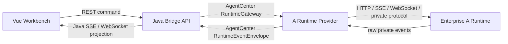

# A Runtime Adapter 验证计划

> 状态：方案验证稿
> 适用分支：`codex/from-2026-05-14-1026`
> 目标：在不改变 AgentCenter 前端交互合同的前提下，验证企业内部 A Runtime 是否能通过 Java Bridge Runtime Provider 接入。

## 目标边界

本方案只定义 A Runtime 的适配要求、协议映射和验证方式，不在当前分支实现生产代码。

做：

- 保持 Vue 前端只对接 Java Bridge 的 REST、SSE 和现有会话事件模型。
- 让 Java Bridge 通过 Runtime Provider 适配 A Runtime。
- 同时允许底层 Runtime 使用 HTTP+SSE、WebSocket 或混合传输。
- 固定 AgentCenter 侧的命令、事件、确认项、工作流和会话语义。
- 给企业内部 Runtime 团队一份可核对的协议和能力清单。

不做：

- 不让前端直接调用 A Runtime。
- 不要求 A Runtime 改成 OpenCode 协议。
- 不要求 WebSocket 替代 SSE。
- 不把 A Runtime 私有事件、私有 session id、私有权限模型直接暴露给前端。
- 不在方案分支引入新的数据库表、生产鉴权体系或多租户实现。

## 目标架构



核心原则：

- 前端稳定：前端仍消费 `AgentSession`、`AgentMessage`、`RuntimeEventDto`、`ConfirmationRequest`。
- Provider 可替换：OpenCode、A Runtime、后续内部 Runtime 都实现同一组 Java Runtime Port。
- 协议和传输分离：AgentCenter 命令/事件是语义协议；HTTP、SSE、WebSocket 只是传输方式。
- AgentCenter 拥有主数据：`agentSessionId` 是平台主身份；A Runtime 的 session id 只是 `runtimeSessionId` 映射。

## A Runtime 必须声明的能力

A Runtime Provider 需要通过 `RuntimeCapabilities` 明确声明：

| 能力 | 含义 | 验证方式 |
|------|------|----------|
| `conversationStreaming` | 是否能持续输出对话增量 | 发送消息后能产生 `conversation.delta` 和 `conversation.completed` |
| `skillLifecycle` | 是否支持 Skill 调用或等价任务执行 | 工作流节点能发起 `skill.run` 并得到最终结果 |
| `mcpLifecycle` | 是否支持 MCP 或工具资源管理 | 能声明不支持；不支持时 UI/API 要降级 |
| `cancelSupported` | 是否支持取消当前生成 | `conversation.cancel` 能返回 ack 或明确 nack |
| `commandTransport` | 命令传输类型 | `HTTP`、`WEBSOCKET` 或 `MIXED` |
| `eventTransport` | 事件传输类型 | `SSE`、`WEBSOCKET` 或 `STREAMING_HTTP` |
| `resourceMutationMode` | 资源变更方式 | `LOCAL_FILE`、`REMOTE_API` 或 `UNSUPPORTED` |
| `supportsAsyncOperations` | 是否存在异步 ack/event 生命周期 | WebSocket 或远端任务型 Runtime 通常为 true |

## 统一命令要求

A Runtime Provider 接收 AgentCenter 命令后，可以自由翻译成内部协议，但必须覆盖以下最小集合：

| AgentCenter 命令 | 用途 | A Runtime 侧要求 |
|------------------|------|------------------|
| `session.ensure` | 创建或恢复 Runtime session | 返回稳定 `runtimeSessionId` |
| `conversation.message.send` | 发送用户消息 | 返回 ack；后续事件流输出结果 |
| `conversation.cancel` | 取消当前生成 | 支持则 ack，不支持则明确 nack |
| `skill.run` 或等价 prompt | 工作流节点执行 | 能关联 `workflowInstanceId`、`workflowNodeInstanceId` |
| `permission.respond` | 用户响应权限确认 | 若 A Runtime 有权限请求则必须支持 |
| `question.reply` / `question.reject` | 用户回答 Runtime 提问 | 若 A Runtime 有原生提问则必须支持 |

所有命令都应带上以下上下文：

- `operationId`
- `idempotencyKey`
- `agentSessionId`
- `runtimeSessionId`
- `projectId`
- `workItemId`
- `workflowInstanceId`
- `workflowNodeInstanceId`

其中 `operationId` 用于 ack、nack、event、timeout 的闭环关联。

## 统一事件要求

A Runtime 私有事件必须翻译为 AgentCenter 统一事件，不允许直接透传给前端。

| AgentCenter 事件 | 用途 |
|------------------|------|
| `conversation.delta` | 模型文本增量 |
| `conversation.completed` | 本轮对话完成 |
| `tool.started` | 工具调用开始 |
| `tool.completed` | 工具调用完成 |
| `permission.required` | 需要用户审批权限 |
| `input.required` | 需要用户补充输入 |
| `runtime.error` | Runtime 异常 |
| `runtime.status.changed` | Runtime 连接或执行状态变化 |
| `process.trace` | 可观察但不驱动业务状态的过程信息 |

事件翻译要求：

- 每个事件必须能定位 `agentSessionId`。
- 工作流场景尽量携带 `workItemId`、`workflowInstanceId`、`workflowNodeInstanceId`。
- 异步 Runtime 必须回填 `operationId`。
- 重复事件必须可幂等处理，不能导致 assistant message 重复落库。

## 传输适配指导

### HTTP+SSE Runtime

适合命令是短请求、输出是事件流的 Runtime。

- CommandTransport：HTTP POST。
- EventStreamTransport：SSE subscribe。
- Provider 内部负责 baseUrl、headers、auth、session id 映射。
- SSE 断线后 Provider 应负责重连并上报 `runtime.status.changed`。

### WebSocket Runtime

适合命令和事件都走同一条双向连接的 Runtime。

- CommandTransport：WebSocket send frame。
- EventStreamTransport：WebSocket receive frame。
- 每条命令必须有 `messageId` 和 `operationId`。
- Runtime 必须返回 ack 或 nack。
- 连接生命周期必须明确：connect、ready、reconnect、closed、failed。

### 混合 Runtime

适合控制面 HTTP、数据面 WebSocket/SSE 的 Runtime。

- Provider 可以按命令类型选择 transport。
- 前端不感知底层传输选择。
- 同一个 `agentSessionId` 下的事件仍进入统一事件投影。

## 验证清单

企业内部验证时优先按以下顺序核对：

1. A Runtime 能否创建或恢复 session，并返回稳定 `runtimeSessionId`。
2. Java Bridge 发送 `conversation.message.send` 后，A Runtime 能 ack。
3. A Runtime 输出能翻译为 `conversation.delta`。
4. 本轮完成时能输出 `conversation.completed`。
5. 工具调用能映射为 `tool.started` / `tool.completed`。
6. 权限审批能映射为 `permission.required`，用户响应后能继续。
7. Runtime 原生提问能映射为 `input.required`，用户回答后能继续。
8. 取消命令能成功 ack，或明确 nack 并展示不支持。
9. 断线、超时、非法响应能映射为 `runtime.error`。
10. 前端不需要新增 A Runtime 私有判断即可展示对话、工具、确认项和错误。

## 建议实施分支

当前分支只保留方案。真正适配 A Runtime 时，从本分支创建：

```bash
git switch codex/from-2026-05-14-1026
git switch -c codex/a-runtime-adapter
```

首批代码建议只做契约验证：

- 新增 `A_RUNTIME` 或临时 `ENTERPRISE_A` runtime type。
- 新增 fake A Runtime transport test，不连接真实企业服务。
- 新增 A Runtime Provider skeleton。
- 用 contract test 验证同一套 Java Bridge 事件输出。

只有 fake contract 通过后，再接真实企业内部 HTTP/SSE/WebSocket。

## 通过标准

方案验证通过的最低标准：

- 企业内部 A Runtime 能对应上统一命令和事件清单。
- 能明确声明 transport 类型和认证方式。
- 能提供 session、message、event、permission、question、cancel 的最小协议样例。
- Java Bridge 不需要改前端 API 即可承载 A Runtime。
- A Runtime 私有协议可以完全收敛在 Provider/Transport/Translator 内。
