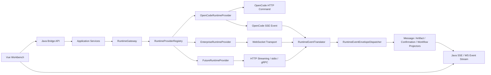
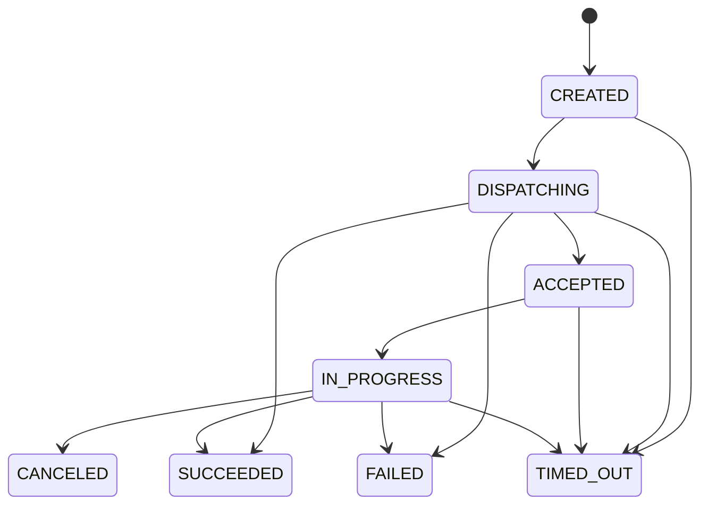

# Agent Runtime Adapter 最终设计

> 状态：目标设计
> 最近更新：2026-05-15
> 适用范围：AgentCenter Java Bridge、Runtime Provider、Runtime Transport、Runtime Event Translation

## 设计目标

AgentCenter 的前端交互协议必须稳定，底层 Agent Runtime 必须可替换。也就是说，Vue 工作台只依赖 Java Bridge 暴露的 REST、SSE 和内部 WebSocket 合同；Java Bridge 再根据具体 Runtime 的能力，把同一套 AgentCenter 命令和事件映射到不同底层协议。

目标不是用 WebSocket 替代 SSE，而是同时支持多种底层传输：

- OpenCode 这类 Runtime 可以继续使用 `HTTP command + SSE event stream`。
- 企业内部 Agent 可以使用 `WebSocket command + WebSocket event`。
- 后续也可以接入 `HTTP streaming`、`stdio/CLI`、`gRPC streaming` 或私有 RPC。

前端、工作流、待确认、会话消息和运行事件不直接感知底层传输差异。

## 核心原则

1. **前端稳定**：前端只对 Java Bridge，不直连 OpenCode 或企业 Agent Runtime。
2. **领域对象稳定**：AgentCenter 拥有 `agent_session`、`agent_message`、`runtime_event`、`confirmation_request`、`workflow_instance` 等主数据。
3. **Runtime 可替换**：底层 Runtime 只通过 Provider 接入，Provider 负责协议翻译和传输选择。
4. **协议与传输分离**：业务命令、运行事件、ack/nack 是统一语义；HTTP/SSE/WebSocket 只是承载方式。
5. **身份映射清晰**：`agentSessionId` 是 AgentCenter 主身份，`runtimeSessionId` 是底层 Runtime 映射身份。
6. **异步可追踪**：所有跨 Runtime 的长期操作都应具备 `operationId`、`messageId`、`correlationId` 或 `idempotencyKey`。
7. **失败可恢复**：Runtime 失败必须被投影成统一异常、待确认、重试或恢复指令，而不是只停留在 transport error。

## 总体架构



## 分层职责

| 层级 | 职责 | 不应该做什么 |
|------|------|--------------|
| Vue Workbench | 展示会话、事件、待确认、工作流状态 | 不识别 OpenCode 私有事件，不直连底层 Runtime |
| Java Controller | 暴露稳定 REST/SSE/WS API | 不决定底层 Runtime 私有协议 |
| Application Service | 管理会话、事项、工作流、确认项主流程 | 不拼接 Runtime 私有 HTTP/WebSocket payload |
| RuntimeGateway | 统一入口、Provider 选择、operation lifecycle | 不写特定 Runtime 的协议细节 |
| RuntimeProvider | 声明能力，组合 command/event/resource port | 不暴露私有协议给上层 |
| RuntimeTransport | 负责 HTTP/SSE/WebSocket/stdio 等网络或进程 I/O | 不解释业务语义 |
| RuntimeTranslator | 私有事件转 AgentCenter event envelope | 不写前端展示逻辑 |
| Event Projector | 统一事件投影成消息、待确认、工作流状态、产物 | 不依赖底层传输类型 |

## RuntimeGateway 目标契约

`RuntimeGateway` 是应用层访问 Runtime 的唯一入口。最终契约应同时保留旧调用方式和 context-aware 调用方式。

旧调用方式用于兼容当前代码：

```java
String ensureSession(RuntimeType runtimeType, String workItemId, String agentSessionId, String runtimeSessionId);
void sendMessage(RuntimeType runtimeType, String sessionId, String userMessage);
SkillRunResult runSkill(RuntimeType runtimeType, String sessionId, SkillInvocationRequest request);
```

目标调用方式用于可替换 Runtime：

```java
String ensureSessionWithContext(RuntimeType runtimeType, RuntimeOperationContext context);
void sendMessageWithContext(RuntimeType runtimeType, RuntimeOperationContext context, String userMessage);
SkillRunResult runSkillWithContext(RuntimeType runtimeType, RuntimeOperationContext context, SkillInvocationRequest request);
void cancelWithContext(RuntimeType runtimeType, RuntimeOperationContext context);
```

`RuntimeOperationContext` 是 Bridge 内部上下文载体，应包含：

| 字段 | 含义 |
|------|------|
| `projectId` | AgentCenter 项目身份 |
| `operationId` | Runtime operation 主键，用于异步关联 |
| `idempotencyKey` | 幂等键 |
| `messageId` | 当前 command message id |
| `correlationId` | ack/event 关联 id |
| `agentSessionId` | AgentCenter 会话 id |
| `runtimeSessionId` | 底层 Runtime 会话 id |
| `workItemId` | 事项 id |
| `workflowInstanceId` | 工作流实例 id |
| `workflowNodeInstanceId` | 工作流节点实例 id |
| `createdBy` | 操作者或系统来源 |

## 统一命令模型

Provider 接收 AgentCenter 统一命令，再转换为 Runtime 私有协议。

核心命令类型：

| Command | 语义 |
|---------|------|
| `session.ensure` | 创建或恢复 Runtime session |
| `conversation.message.send` | 发送用户消息 |
| `conversation.cancel` | 取消当前输出 |
| `skill.run` | 调用 Runtime Skill |
| `skill.install` | 安装 Skill |
| `skill.delete` | 删除 Skill |
| `skill.scan` | 扫描 Skill |
| `mcp.refresh` | 刷新 MCP |
| `mcp.config.read` | 读取 MCP 配置 |
| `mcp.config.write` | 写入 MCP 配置 |
| `permission.respond` | 回复权限请求 |
| `question.reply` | 回复 Runtime question |
| `question.reject` | 拒绝 Runtime question |

命令进入 transport 前应包装成 `RuntimeCommandEnvelope`，携带协议、类型、message、operation、session、workflow 和 payload。

## 统一事件模型

底层 Runtime 的事件必须转换成 AgentCenter 事件类型。

核心事件类型：

| Event | 用途 |
|-------|------|
| `conversation.delta` | Assistant 文本增量 |
| `conversation.completed` | 当前回复完成 |
| `tool.started` | 工具调用开始 |
| `tool.completed` | 工具调用完成 |
| `permission.requested` | Runtime 请求权限 |
| `input.required` 或 `question.requested` | Runtime 请求用户输入 |
| `runtime.status.changed` | Runtime 状态变化 |
| `runtime.error` | Runtime 错误 |
| `process.trace` | 调试、推理、生命周期等过程信息 |
| `skill.changed` | Skill 状态变化 |
| `mcp.changed` | MCP 状态变化 |

前端不得直接消费 Runtime 私有事件名。所有事件先经 `RuntimeEventEnvelopeDispatcher`，再投影为消息、待确认、工作流状态、产物或状态栏。

## Transport 选择规则

Transport 不是全局单选，而是 Provider 内部按 Runtime 能力和操作类型选择。

| Runtime 类型 | Command Transport | Event Transport | 说明 |
|--------------|-------------------|-----------------|------|
| OpenCode | HTTP | SSE | M1 当前基线 |
| Enterprise Agent | WebSocket | WebSocket | 适合企业内部双向实时协议 |
| HTTP Streaming Agent | HTTP | HTTP streaming | 适合兼容 OpenAI-like streaming |
| CLI/stdio Agent | Process stdin/stdout | stdout event parser | 适合本地进程型 Agent |

同一个 Provider 也可以混合使用多种 transport。例如资源管理继续使用 HTTP，长会话交互使用 WebSocket。

## Operation 生命周期

`runtime_operation` 是长期异步操作的追踪表。最终目标中，所有可能跨 ack/event 生命周期的操作都应创建 operation。

建议状态流：



HTTP 同步 Provider 可以在 dispatch 后直接 `SUCCEEDED`；WebSocket 或异步 Provider 应在 ack 后进入 `ACCEPTED`，再由后续 event 推进到 `IN_PROGRESS`、`SUCCEEDED` 或 `FAILED`。

## OpenCode 在目标态中的位置

OpenCode 是第一个 Runtime Provider，不是平台协议本身。

OpenCode Provider 的职责：

- HTTP `POST /session` 映射 `session.ensure`
- HTTP `POST /session/{id}/prompt_async` 映射 `conversation.message.send` / `skill.run`
- HTTP `POST /session/{id}/abort` 映射 `conversation.cancel`
- SSE `/event` 映射 Runtime event stream
- OpenCode permission/question 映射 AgentCenter confirmation
- OpenCode file-based Skill/MCP 映射 Runtime resource port

OpenCode 私有字段可以留在 Provider 和调试 payload 内，但不能成为前端或工作流的必需协议。

## 迁移路线

### Phase 1：上下文贯通

- 新增 `RuntimeOperationContext`
- 为 `RuntimeGateway`、`ConversationRuntimePort`、`AgentRuntimeAdapter` 增加 `*WithContext` 方法
- `RuntimeCommandEnvelope` 和 `RuntimeAckEnvelope` 支持 context 字段
- 会话发送、工作流节点、Runtime recovery 改用 context-aware 调用

可参考提交：`7b49a722 refactor: add runtime operation context`

### Phase 2：Provider 硬编码收口

- Skill/MCP/Confirmation 不再直接依赖 OpenCode 私有 Adapter
- Permission/Question 回复走统一 command
- Runtime resource operation 带 project/session/context

### Phase 3：Fake Runtime 契约测试

- 增加 Fake HTTP+SSE Provider
- 增加 Fake WebSocket Provider
- 同一组 Gateway contract tests 同时覆盖多 Provider

### Phase 4：企业 Runtime Provider

- 接入企业内部 Agent Runtime
- 实现 WebSocket command/event transport
- 实现私有事件 translator
- 验证 workflow、confirmation、artifact、message projector 全链路

### Phase 5：Runtime Descriptor 化

- 前端从 Java 获取 Runtime capability/descriptor
- UI 文案从 OpenCode-specific 收敛为 Runtime-neutral
- 支持按项目、工作流或会话选择 Runtime

## 验收标准

- Vue 前端 API 不因底层 Runtime 替换而变化。
- OpenCode HTTP+SSE 路径保持可用。
- 新 Provider 可以不改前端即可完成会话发送、流式回复、工具事件、待确认、取消。
- WebSocket Provider 的 ack/event 都能关联到 `operationId`。
- Runtime 错误能转换成 `runtime.error`、assistant error message 或 confirmation request。
- `./mvnw test` 通过。

## 非目标

- 不在本阶段引入 MQ、分布式事件总线或多租户权限体系。
- 不要求所有 Runtime 都支持所有能力；能力由 `RuntimeCapabilities` 声明。
- 不要求底层 Runtime 支持热切换同一会话传输协议。
- 不让前端直连 Runtime。
