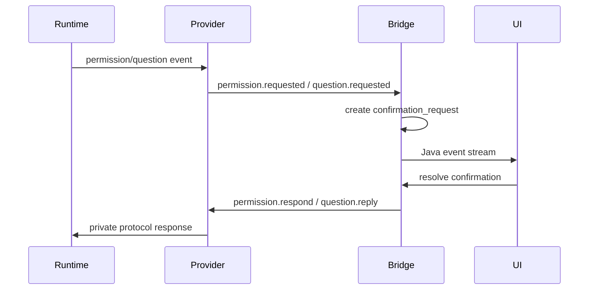

# Agent Runtime 目标态对接指导

> 状态：对接指南
> 最近更新：2026-05-15
> 适用对象：企业内部 Agent Runtime、第三方 Agent Runtime、OpenCode 以外的后续 Provider

## 对接目标

接入方只需要实现 Runtime Provider，不需要改 Vue 前端，也不应该绕过 Java Bridge。AgentCenter 会继续通过统一会话、工作流、待确认和事件投影承载用户体验。

对接完成后，底层 Runtime 可以使用自己的协议，但必须向 Java Bridge 提供统一语义：

- command：AgentCenter 让 Runtime 做什么
- ack/nack：Runtime 是否接受命令
- event：Runtime 运行过程中发生了什么
- resource：Skill、MCP、配置等资源如何读取和变更
- capability：Runtime 支持哪些能力

## 最小接入清单

一个 Runtime 至少需要实现：

| 接口/组件 | 必需 | 说明 |
|-----------|------|------|
| `RuntimeProvider` | 是 | Runtime 入口，注册到 `RuntimeProviderRegistry` |
| `RuntimeCapabilities` | 是 | 声明 command/event transport 和功能能力 |
| `ConversationRuntimePort` | 是 | session、sendMessage、cancel、runSkill |
| `RuntimeCommandTransport` | 建议 | 如果 Runtime 有明确 command/ack 协议 |
| `RuntimeEventStreamTransport` | 建议 | 如果 Runtime 有独立 event stream |
| `RuntimeEventTranslator` | 是 | 私有事件转 AgentCenter event |
| `RuntimeResourcePort` | 按需 | Skill/MCP/资源管理 |
| Contract tests | 是 | 用 Fake Runtime 证明 Bridge 契约稳定 |

## 推荐目录结构

```text
agentcenter-bridge/src/main/java/com/agentcenter/bridge/infrastructure/runtime/<runtime>/
  <Runtime>RuntimeProvider.java
  <Runtime>RuntimeAdapter.java
  <Runtime>RuntimeEventTranslator.java
  transport/
    <Runtime>CommandTransport.java
    <Runtime>EventStreamTransport.java
  dto/
    <Runtime>CommandPayload.java
    <Runtime>EventPayload.java

agentcenter-bridge/src/test/java/com/agentcenter/bridge/infrastructure/runtime/<runtime>/
  <Runtime>RuntimeProviderTest.java
  <Runtime>RuntimeEventTranslatorTest.java
  <Runtime>TransportContractTest.java
```

如果 Runtime 协议非常简单，可以先合并 Adapter 和 Transport；但 Provider、Translator、Capabilities 不建议省略。

## RuntimeType 注册

新增 Runtime 时，先扩展 `RuntimeType`：

```java
public enum RuntimeType {
    MOCK,
    OPENCODE,
    ENTERPRISE_AGENT
}
```

命名建议：

- 用业务中立名称，不使用具体部署环境名。
- 避免写死供应商内部代号。
- 如果同一 Runtime 有多种传输，不要拆成多个 RuntimeType，优先用 capabilities 或配置决定 transport。

## Provider 能力声明

Provider 必须声明 descriptor 和 capabilities。

示例：

```java
private static final RuntimeCapabilities CAPABILITIES = new RuntimeCapabilities(
    true,                       // conversationStreaming
    true,                       // skillLifecycle
    true,                       // mcpLifecycle
    true,                       // cancelSupported
    RuntimeCapabilities.WEBSOCKET,
    RuntimeCapabilities.WEBSOCKET,
    RuntimeCapabilities.REMOTE_API,
    true                        // supportsAsyncOperations
);
```

能力字段解释：

| 字段 | 含义 |
|------|------|
| `conversationStreaming` | 是否支持流式对话 |
| `skillLifecycle` | 是否支持 Skill 扫描、安装、删除或刷新 |
| `mcpLifecycle` | 是否支持 MCP 管理 |
| `cancelSupported` | 是否支持取消 |
| `commandTransport` | command 承载方式 |
| `eventTransport` | event 承载方式 |
| `resourceMutationMode` | 资源变更模式，如 `LOCAL_FILE`、`REMOTE_API` |
| `supportsAsyncOperations` | 是否需要 ack/event 异步推进 operation |

## Command 对接要求

Provider 接收统一 command 后，转换成 Runtime 私有协议。

必须支持的基础命令：

| AgentCenter Command | Runtime 侧要求 |
|--------------------|----------------|
| `session.ensure` | 返回或创建底层 session id |
| `conversation.message.send` | 接收用户输入并开始执行 |
| `conversation.cancel` | 尽力取消当前输出 |

工作流型 Runtime 还应支持：

| AgentCenter Command | Runtime 侧要求 |
|--------------------|----------------|
| `skill.run` | 运行指定 Skill 或等价任务 |
| `permission.respond` | 回复权限请求 |
| `question.reply` | 回复 Runtime 提问 |
| `question.reject` | 拒绝 Runtime 提问 |

资源型 Runtime 还应支持：

| AgentCenter Command | Runtime 侧要求 |
|--------------------|----------------|
| `skill.scan` | 返回 Skill catalog |
| `skill.install` | 安装 Skill |
| `skill.delete` | 删除 Skill |
| `mcp.config.read` | 返回 MCP 配置 |
| `mcp.config.write` | 写入 MCP 配置 |
| `mcp.refresh` | 刷新 MCP 生效状态 |

## Event 对接要求

Runtime 私有事件必须转换为 AgentCenter event envelope。

最小事件映射：

| Runtime 私有语义 | AgentCenter Event |
|------------------|-------------------|
| 文本增量 | `conversation.delta` |
| 回复结束 | `conversation.completed` |
| 工具开始 | `tool.started` |
| 工具结束 | `tool.completed` |
| 请求权限 | `permission.requested` |
| 请求用户输入 | `input.required` 或 `question.requested` |
| 执行错误 | `runtime.error` |
| 连接状态变化 | `runtime.status.changed` |
| 调试过程 | `process.trace` |

事件 payload 建议包含：

| 字段 | 说明 |
|------|------|
| `text` 或 `delta` | 文本内容 |
| `toolName` | 工具名 |
| `toolCallId` | 工具调用 id |
| `status` | 状态 |
| `errorCode` | 错误码 |
| `message` | 可读错误信息 |
| `recoverable` | 是否可恢复 |
| `rawType` | 原始 Runtime 事件类型，用于调试 |

不要让前端依赖 `rawType`。

## WebSocket Runtime 对接要求

如果 Runtime 使用 WebSocket，建议采用以下 frame 结构：

```json
{
  "kind": "COMMAND",
  "protocol": "agentcenter.runtime.v1",
  "type": "conversation.message.send",
  "messageId": "msg-...",
  "correlationId": null,
  "operationId": "op-...",
  "runtimeType": "ENTERPRISE_AGENT",
  "agentSessionId": "ags_...",
  "runtimeSessionId": "rt_...",
  "projectId": "project-...",
  "workItemId": "work-...",
  "workflowInstanceId": "wf-...",
  "workflowNodeInstanceId": "node-...",
  "payload": {}
}
```

Runtime 应返回 ack：

```json
{
  "kind": "ACK",
  "protocol": "agentcenter.runtime.v1",
  "correlationId": "msg-...",
  "operationId": "op-...",
  "success": true,
  "payload": {}
}
```

失败时返回 nack：

```json
{
  "kind": "NACK",
  "protocol": "agentcenter.runtime.v1",
  "correlationId": "msg-...",
  "operationId": "op-...",
  "success": false,
  "message": "runtime busy"
}
```

运行事件应带同一个 `operationId` 或至少带 `agentSessionId/runtimeSessionId`。

## HTTP + SSE Runtime 对接要求

如果 Runtime 使用 HTTP + SSE，推荐模式：

- HTTP command 返回 ack-like response。
- SSE event stream 只发运行事件。
- Java Provider 负责把 HTTP response 包装为 `RuntimeAckEnvelope`。
- Java EventTransport 负责重连、关闭、错误转换。

OpenCode 当前就是这个模式。

## Session 映射要求

AgentCenter 主身份：

```text
agentSessionId = AgentCenter 会话 id
```

Runtime 私有身份：

```text
runtimeSessionId = 底层 Runtime 会话 id
```

要求：

- Provider 必须维护或恢复 `agentSessionId -> runtimeSessionId` 映射。
- 事件回流时必须能找到 `agentSessionId`。
- `runtimeSessionId` 不应暴露给前端作为主身份。
- 如果底层 session 丢失，`ensureSession` 应创建替代 session，并由 Java Bridge 更新绑定。

## Permission / Question 对接要求

Runtime 请求权限或输入时，不直接阻塞前端。

推荐流程：



要求：

- confirmation 必须带 `agentSessionId`、`runtimeSessionId`、`requestId`。
- 用户回复后应走统一 command，不应让业务服务直接调用私有 Adapter。
- 回复失败应恢复 confirmation 为 pending，并发布可读错误。

## Skill / MCP 对接要求

不同 Runtime 可以有不同资源模型：

| Runtime 类型 | 推荐实现 |
|--------------|----------|
| 本地文件 Runtime | 实现文件扫描、安装、删除 |
| 远程企业 Runtime | 实现 REST 或 WebSocket resource API |
| 不支持 Skill/MCP | capabilities 声明 false，并让 UI 降级 |

资源变更应被 `runtime_operation` 跟踪。同步 Runtime 可以直接成功；异步 Runtime 应通过 ack/event 推进状态。

## 错误处理要求

所有 Runtime 错误都应归一到以下出口之一：

| 场景 | AgentCenter 行为 |
|------|------------------|
| command 被拒绝 | `RuntimeAckEnvelope.nack`，必要时创建 confirmation |
| event stream 断开 | `runtime.status.changed` 或 `runtime.error` |
| 对话失败 | assistant error message + recovery confirmation |
| workflow 节点失败 | node failed / workflow blocked / confirmation |
| 权限或问题回复失败 | confirmation 回到 pending |
| 超时 | runtime operation `TIMED_OUT`，发布可恢复错误 |

错误 payload 建议包含：

```json
{
  "errorCode": "RUNTIME_TRANSPORT_ERROR",
  "message": "connection dropped",
  "recoverable": true,
  "retryable": true
}
```

## 配置要求

每个 Runtime 应至少支持：

```yaml
agentcenter:
  runtime:
    default-type: ENTERPRISE_AGENT
    providers:
      enterprise-agent:
        enabled: true
        endpoint: ws://127.0.0.1:9001/runtime
        connect-timeout-seconds: 10
        response-timeout-seconds: 120
```

敏感配置不得写入仓库，应通过环境变量或企业配置中心注入。

## 验证清单

接入完成前，至少验证：

- `RuntimeProviderRegistry` 能发现新 Provider。
- `GET /api/runtime/{type}/descriptor` 或等价接口能返回能力描述。
- 创建会话后能得到并保存 `runtimeSessionId`。
- 发送消息后前端能看到 `conversation.delta` 和 `conversation.completed`。
- 工具调用能映射为 `tool.started/tool.completed`。
- 权限请求能生成 confirmation，用户回复能回到 Runtime。
- `cancel` 能触发 Runtime 取消或明确返回不支持。
- Runtime 断开后 Java Bridge 能发布可读错误。
- 工作流节点 `runSkill` 能完成、失败或进入待确认。
- `./mvnw test` 通过。

## Contract Test 建议

建议先不接真实 Runtime，而是实现 Fake Runtime：

1. Fake Provider 收到 `conversation.message.send` 后发两段 delta 和 completed。
2. Fake Provider 收到 tool command 后发 tool started/completed。
3. Fake Provider 可配置返回 nack。
4. Fake EventTransport 可模拟断线、重连、乱序和重复事件。

目标是证明 Java Bridge 和前端契约稳定，再替换成真实 Runtime。

## 对接交付物

每个 Runtime 接入 PR 应包含：

- Provider 实现
- Transport 实现或说明复用已有 transport
- Translator 实现
- Capabilities/Descriptor
- 配置样例
- Contract tests
- 至少一个端到端 smoke test
- README 或架构文档补充

## 常见风险

| 风险 | 规避方式 |
|------|----------|
| 前端依赖私有事件 | 只输出 AgentCenter event |
| Runtime session 泄漏成主身份 | 前端和业务主流程只使用 agentSessionId |
| WebSocket ack/event 无法关联 | 强制携带 messageId/correlationId/operationId |
| 异步 operation 长时间悬挂 | deadline + timeout scheduler |
| Skill/MCP 资源模型不同 | capabilities 降级，不强迫每个 Runtime 支持 |
| Permission/Question 绕过确认系统 | 统一映射到 confirmation |

## 推荐落地顺序

1. 合入 Runtime context 基线，参考 `7b49a722 refactor: add runtime operation context`。
2. 增加 Fake Provider contract tests。
3. 增加真实 Runtime Provider skeleton。
4. 接入 session.ensure 和 conversation.message.send。
5. 接入 event translator。
6. 接入 cancel、permission、question。
7. 接入 Skill/MCP resource 能力。
8. 做前端 smoke 验证和文档补齐。
