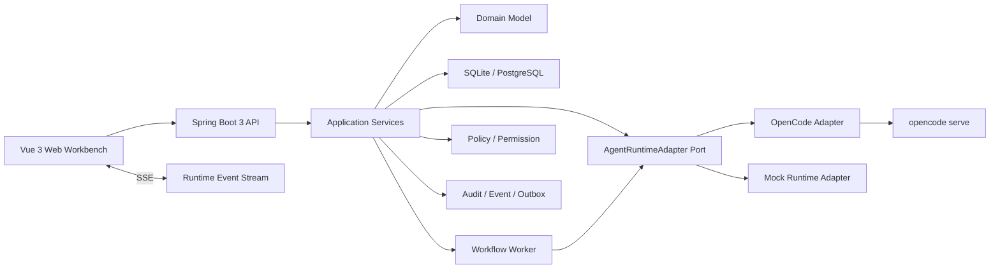
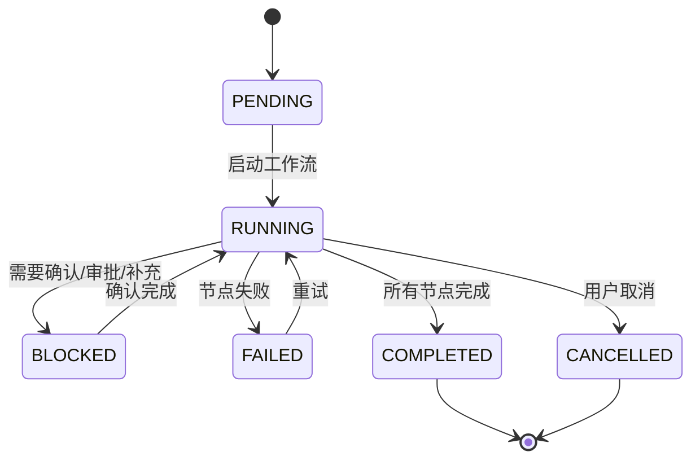
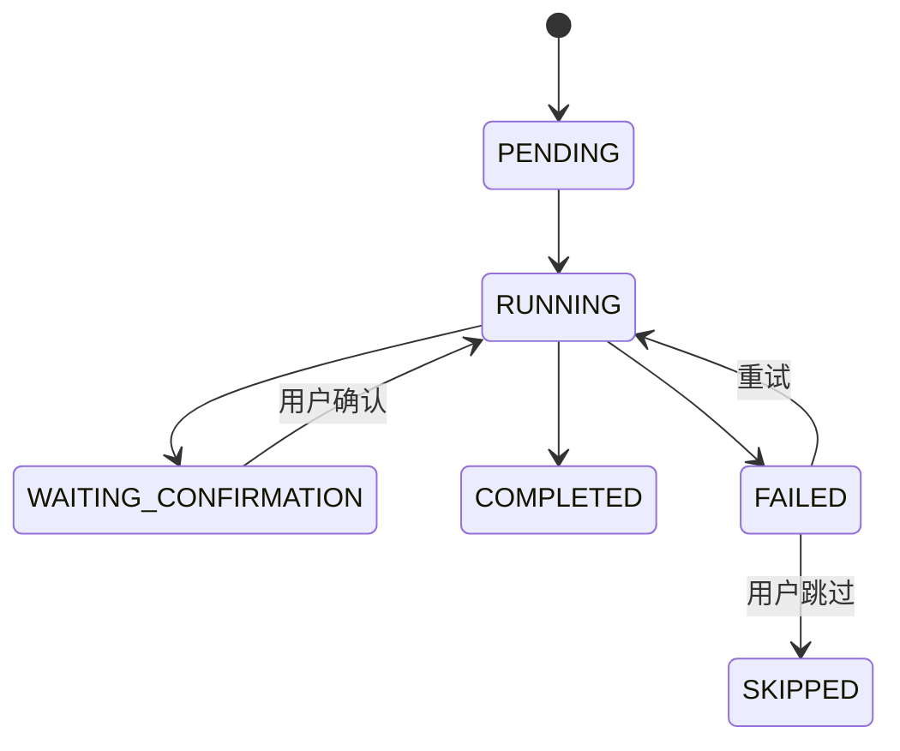
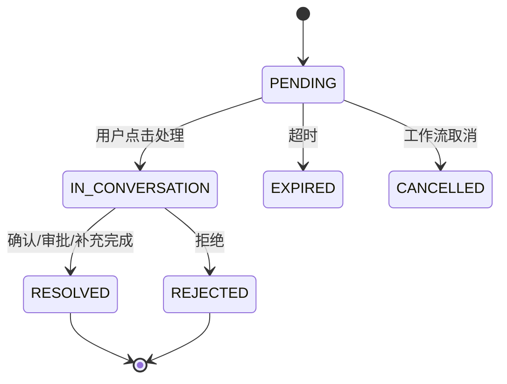

# Agent Runtime Bridge 开发蓝图

> 状态：开发设计稿
> 最近更新：2026-05-05
> 面向对象：后续使用 OpenCode 开发 Java Bridge 和 Vue 工作台时的实现基线

## 1. 设计结论

AgentCenter 后续应拆成两个主要应用：

```text
agentcenter-web       Vue 3 工作台前端
agentcenter-bridge    Java 21 / Spring Boot 3 桥接服务
```

`agentcenter-bridge` 是平台自己的控制面，不是 OpenCode 的简单代理。它负责管理项目、事项、工作流、会话、消息、产物、待确认、Skill、MCP 和运行事件；OpenCode 只是第一个被适配的 Agent Runtime。

核心结论：

- Java 端必须拥有自己的会话、消息、工作流、待确认和运行事件表。
- OpenCode session 只通过 `runtime_session_id` 映射到我们的 `agent_session`。
- 前端 Vue 只对接 Java API，不直接调用 OpenCode。
- 工作流节点本质是有输入、有 Skill、有产物、有状态的执行单元。
- `待确认` 是正式领域对象，用于承接用户确认、审批、补充信息、权限确认和异常处理。
- SQLite 用于早期验证，表结构按 PostgreSQL 可迁移方式设计。
- 先用 SSE 做流式输出；后续需要双向协作、多人在线、实时看板时再引入 WebSocket。
- 第一阶段不引入 MQ，使用数据库状态机 + outbox 表 + 后台 worker；验证后再替换为消息队列或工作流引擎。

## 2. 总体架构



### 推荐边界

| 层 | 职责 | 不做什么 |
|----|------|----------|
| Vue Web | 展示工作台、会话、事项、工作流、待确认、流式消息 | 不直接调用 OpenCode，不拼业务状态 |
| API Controller | 参数校验、鉴权、返回 DTO、SSE 连接 | 不写复杂业务流程 |
| Application Service | 编排事项、会话、工作流、运行时调用 | 不关心 OpenCode 原始协议细节 |
| Domain Model | 事项、工作流、会话、确认项的状态和规则 | 不依赖 Spring / MyBatis |
| Runtime Adapter | 适配 OpenCode、Mock、未来其他 Agent Runtime | 不成为业务主数据 |
| Persistence | MyBatis Mapper、事务、查询投影 | 不承载跨模块业务判断 |
| Worker | 异步执行节点、重试、超时、续跑 | 不直接和浏览器通信 |

## 3. 推荐工程结构

```text
agentcenter-bridge/
├── pom.xml
├── src/main/java/com/agentcenter/bridge/
│   ├── AgentCenterBridgeApplication.java
│   ├── api/
│   │   ├── WorkItemController.java
│   │   ├── WorkflowController.java
│   │   ├── AgentSessionController.java
│   │   ├── ConfirmationController.java
│   │   └── RuntimeEventStreamController.java
│   ├── application/
│   │   ├── WorkItemService.java
│   │   ├── WorkflowService.java
│   │   ├── AgentSessionService.java
│   │   ├── ConfirmationService.java
│   │   └── RuntimeBridgeService.java
│   ├── domain/
│   │   ├── workitem/
│   │   ├── workflow/
│   │   ├── session/
│   │   ├── confirmation/
│   │   ├── skill/
│   │   └── runtime/
│   ├── infrastructure/
│   │   ├── persistence/
│   │   ├── runtime/opencode/
│   │   ├── runtime/mock/
│   │   ├── security/
│   │   └── event/
│   └── worker/
│       └── WorkflowNodeWorker.java
├── src/main/resources/
│   ├── application.yml
│   ├── mapper/
│   └── db/migration/
└── src/test/
```

```text
agentcenter-web/
├── package.json
├── vite.config.ts
├── src/
│   ├── main.ts
│   ├── app/
│   ├── api/
│   ├── stores/
│   ├── views/
│   │   ├── HomeOverview.vue
│   │   ├── BoardView.vue
│   │   ├── WorkflowConfig.vue
│   │   └── ConversationWorkbench.vue
│   └── components/
│       ├── shell/
│       ├── workitem/
│       ├── conversation/
│       ├── confirmation/
│       └── workflow/
```

## 4. 领域模型

### 4.1 作用域模型

```text
tenant
  -> workspace
    -> project
      -> space
      -> iteration
      -> work_item
      -> workflow_instance
      -> agent_session
```

早期可以先把 `tenant` 和 `workspace` 固定为默认值，但表结构保留字段，避免后面补多租户时重构大面积数据。

### 4.2 事项模型

`work_item` 是 FE、US、Task、Work、缺陷、漏洞的统一表。

```text
work_item
- id                    平台内部 ID，建议 ULID
- code                  展示 ID，例如 FE1234
- type                  FE / US / TASK / WORK / BUG / VULN
- title
- description
- status                BACKLOG / TODO / IN_PROGRESS / IN_REVIEW / DONE
- priority              LOW / MEDIUM / HIGH / URGENT
- project_id
- space_id
- iteration_id
- owner_user_id
- assignee_user_id
- current_workflow_instance_id
- version               乐观锁
- created_at
- updated_at
```

推荐：前端展示使用 `code`，数据库关联使用 `id`。

### 4.3 工作流模型

工作流分定义和实例：

- `workflow_definition`：某类事项默认有哪些节点。
- `workflow_node_definition`：节点定义，绑定默认 Skill。
- `workflow_instance`：某个具体事项实际运行的一条流程。
- `workflow_node_instance`：某个节点的实际状态、输入、输出、运行记录。

```text
workflow_definition
- id
- work_item_type
- name
- version_no
- status                DRAFT / ENABLED / DISABLED
- is_default
- created_at
- updated_at

workflow_node_definition
- id
- workflow_definition_id
- node_key              requirement_refine / solution_design
- name
- order_no
- skill_name
- input_policy          WORK_ITEM_ONLY / PREVIOUS_ARTIFACT / MERGED_CONTEXT
- output_artifact_type  MARKDOWN / JSON / PATCH / REPORT
- output_name_template  requirement-design.md
- retry_limit
- timeout_seconds
- required_confirmation BOOLEAN

workflow_instance
- id
- work_item_id
- workflow_definition_id
- status                PENDING / RUNNING / BLOCKED / FAILED / COMPLETED / CANCELLED
- current_node_instance_id
- started_at
- completed_at
- created_at
- updated_at

workflow_node_instance
- id
- workflow_instance_id
- node_definition_id
- status                PENDING / RUNNING / WAITING_CONFIRMATION / FAILED / COMPLETED / SKIPPED
- input_artifact_id
- output_artifact_id
- agent_session_id
- runtime_session_id
- started_at
- completed_at
- error_message
- version
```

### 4.4 会话模型

Java 端会话是主数据，OpenCode 会话是运行时映射。

```text
agent_session
- id
- session_type          GENERAL / WORK_ITEM
- title
- work_item_id          通用会话为空
- workflow_instance_id
- runtime_type          MOCK / OPENCODE / FUTURE
- runtime_session_id    OpenCode session id
- status                ACTIVE / ARCHIVED / FAILED
- created_by
- created_at
- updated_at

agent_message
- id
- session_id
- role                  USER / ASSISTANT / SYSTEM / TOOL
- content
- content_format        TEXT / MARKDOWN / JSON
- status                STREAMING / COMPLETED / FAILED
- seq_no
- runtime_message_id
- created_by
- created_at
```

推荐规则：

- 一个 `work_item + workflow_instance` 默认对应一个主任务会话。
- 首页、看板、待确认进入同一个事项时，复用同一个任务会话。
- 通用会话不绑定事项，可以后续转成任务会话。
- 流式输出时先 SSE 推给前端，最终合并成一条 `ASSISTANT` message。

### 4.5 运行事件模型

`runtime_event` 是执行事实层，和用户可读消息分开。

```text
runtime_event
- id
- session_id
- work_item_id
- workflow_instance_id
- workflow_node_instance_id
- event_type            STATUS / ASSISTANT_DELTA / SKILL_STARTED / SKILL_COMPLETED / MCP_CALL / PERMISSION_REQUIRED / ERROR
- event_source          BRIDGE / OPENCODE / WORKFLOW / USER
- payload_json
- created_at
```

用途：

- SSE 流式投影。
- 还原执行过程。
- 生成底部执行记录。
- 驱动右侧待确认。
- 审计和排障。

### 4.6 产物模型

```text
artifact
- id
- work_item_id
- workflow_instance_id
- workflow_node_instance_id
- session_id
- artifact_type         MARKDOWN / JSON / PATCH / LOG / REPORT
- title
- content
- storage_uri           后续对象存储时使用
- version_no
- created_by
- created_at
```

早期 Markdown 直接存 `content`；后续大文件、补丁、日志包迁移到对象存储。

### 4.7 待确认模型

`待确认` 是正式领域对象，不叫 alert。

```text
confirmation_request
- id
- request_type          CONFIRM / APPROVAL / INPUT_REQUIRED / DECISION / EXCEPTION / PERMISSION
- status                PENDING / IN_CONVERSATION / RESOLVED / REJECTED / CANCELLED / EXPIRED
- project_id
- space_id
- iteration_id
- work_item_id
- workflow_instance_id
- workflow_node_instance_id
- agent_session_id
- runtime_type
- runtime_session_id
- runtime_event_id
- skill_name
- mcp_server
- mcp_tool
- title
- content
- context_summary
- options_json
- priority
- required_role
- assignee_user_id
- created_at
- updated_at
- resolved_by
- resolved_at
- resolution_comment
- resolution_payload_json

confirmation_action
- id
- confirmation_request_id
- action_type           ENTER_SESSION / APPROVE / REJECT / SUPPLEMENT / CHOOSE / RETRY / SKIP
- actor_user_id
- comment
- payload_json
- created_at
```

产品规则：

- 右侧 tab 叫 `待确认`。
- 卡片主按钮叫 `处理` 或 `进入会话`，推荐当前高保真保持 `处理`。
- 点击处理后进入任务会话。
- 会话中补充确认结果。
- Java 端更新 `confirmation_request`，恢复对应 `workflow_node_instance`。

### 4.8 Skill 和 MCP 模型

早期只做注册和调用记录，不急着做复杂市场。

```text
skill_definition
- id
- name
- display_name
- description
- runtime_type          OPENCODE / PLATFORM
- input_schema_json
- output_schema_json
- enabled
- created_at
- updated_at

mcp_server_config
- id
- name
- display_name
- transport_type        STDIO / HTTP / SSE
- command
- args_json
- env_json
- project_id
- enabled
- created_at
- updated_at

skill_invocation
- id
- workflow_node_instance_id
- session_id
- skill_name
- status                RUNNING / COMPLETED / FAILED / WAITING_CONFIRMATION
- input_json
- output_json
- error_message
- started_at
- completed_at
```

## 5. 状态机

### 5.1 工作流实例



### 5.2 工作流节点



### 5.3 待确认



## 6. FE 默认工作流推荐

| 顺序 | 节点 | Skill | 输入 | 输出 |
|------|------|-------|------|------|
| 1 | 需求整理与完善 | `fe.requirement.refine` | FE 标题、详情、上下文、已有讨论 | `requirement-design.md` |
| 2 | 方案设计 | `fe.solution.design` | `requirement-design.md`、项目技术上下文 | `solution-design.md` |
| 3 | 实施计划 | `fe.implementation.plan` | `solution-design.md`、代码结构、约束 | `implementation-plan.md` |
| 4 | 开发执行 | `fe.development.execute` | `implementation-plan.md` | patch / change summary |
| 5 | 验证与评审 | `fe.verification.review` | patch、测试结果、验收标准 | `verification-report.md` |
| 6 | 完成归档 | `fe.finalize.archive` | 全部产物和事件 | `final-summary.md` |

早期可以先实现前三个节点，后面再把开发执行和验证接入真实代码修改。

节点执行规则：

1. 节点启动时读取 `work_item` 和上一个节点产物。
2. 调用对应 Skill。
3. Skill 输出 Markdown 产物写入 `artifact`。
4. 如需用户确认，创建 `confirmation_request` 并暂停节点。
5. 用户处理确认后，节点继续执行或进入下一节点。

## 7. OpenCode Adapter 设计

Java 中定义稳定端口：

```java
public interface AgentRuntimeAdapter {
    RuntimeSession createSession(RuntimeSessionRequest request);
    void sendMessage(String sessionId, RuntimeMessageRequest request);
    void runSkill(String sessionId, SkillRunRequest request);
    void approve(String sessionId, RuntimeApprovalRequest request);
    void cancel(String sessionId);
}
```

事件不建议通过接口同步返回，而是统一进入事件发布：

```java
public interface RuntimeEventPublisher {
    void publish(RuntimeEvent event);
}
```

OpenCode Adapter 负责：

- 管理长驻 `opencode serve`。
- 创建 OpenCode session。
- 发送用户 prompt。
- 订阅 OpenCode SSE。
- 将 OpenCode 原始事件规范化为 AgentCenter `runtime_event`。
- 将 `permission_required` 转换为 `confirmation_request`。
- 将 skill/tool 失败转换为 `confirmation_request(EXCEPTION)`。

事件映射建议：

| OpenCode 原始事件 | AgentCenter 事件 |
|-------------------|------------------|
| assistant delta | `ASSISTANT_DELTA` |
| tool start | `SKILL_STARTED` |
| tool end | `SKILL_COMPLETED` |
| permission asked | `PERMISSION_REQUIRED` + `confirmation_request` |
| session error | `ERROR` + `confirmation_request(EXCEPTION)` |
| run completed | `STATUS(COMPLETED)` |

## 8. API 草案

### 8.1 事项

```text
GET  /api/work-items
GET  /api/work-items/{id}
POST /api/work-items
PUT  /api/work-items/{id}
POST /api/work-items/{id}/start-workflow
```

`POST /api/work-items/{id}/start-workflow`：

```json
{
  "workflowDefinitionId": "optional",
  "mode": "START_OR_CONTINUE"
}
```

### 8.2 工作流

```text
GET  /api/workflow-definitions
POST /api/workflow-definitions
GET  /api/workflow-instances/{id}
POST /api/workflow-instances/{id}/continue
POST /api/workflow-node-instances/{id}/retry
POST /api/workflow-node-instances/{id}/skip
```

### 8.3 会话

```text
GET  /api/agent-sessions
POST /api/agent-sessions
GET  /api/agent-sessions/{id}
GET  /api/agent-sessions/{id}/messages
POST /api/agent-sessions/{id}/messages
GET  /api/agent-sessions/{id}/events
```

`POST /api/agent-sessions`：

```json
{
  "sessionType": "WORK_ITEM",
  "workItemId": "wi_01",
  "workflowInstanceId": "wfi_01",
  "runtimeType": "OPENCODE"
}
```

`POST /api/agent-sessions/{id}/messages`：

```json
{
  "content": "继续处理这个 FE，先生成需求设计文档",
  "contentFormat": "TEXT"
}
```

### 8.4 待确认

```text
GET  /api/confirmations?status=PENDING
GET  /api/confirmations/{id}
POST /api/confirmations/{id}/enter-session
POST /api/confirmations/{id}/resolve
POST /api/confirmations/{id}/reject
```

`POST /api/confirmations/{id}/resolve`：

```json
{
  "actionType": "APPROVE",
  "comment": "确认继续进入方案设计节点",
  "payload": {
    "selectedOption": "continue"
  }
}
```

### 8.5 SSE

```text
GET /api/agent-sessions/{id}/events
```

SSE event 示例：

```json
{
  "id": "evt_01",
  "type": "SKILL_STARTED",
  "sessionId": "as_01",
  "workItemId": "wi_01",
  "workflowNodeInstanceId": "wni_01",
  "payload": {
    "skillName": "fe.requirement.refine"
  },
  "createdAt": "2026-05-05T20:00:00Z"
}
```

## 9. Vue 工作台设计

### 9.1 页面结构

```text
AppShell
├── TitleBar
├── LeftSidebar
│   ├── WorkspaceNav
│   └── ConversationList
├── CenterWorkbench
│   ├── HomeOverview
│   ├── BoardView
│   ├── WorkflowConfig
│   └── ConversationWorkbench
├── RightPanel
│   ├── ConfirmationPanel
│   └── WorkItemDetailPanel
└── StatusBar
```

### 9.2 Pinia stores

```text
useScopeStore          project / space / iteration
useWorkItemStore       metrics, list, board columns, selected item
useWorkflowStore       definitions, instances, node states
useSessionStore        sessions, messages, active SSE
useConfirmationStore   pending confirmations, processing state
useRuntimeStore        bridge/runtime status
```

### 9.3 核心交互

```text
首页点击 FE1234
  -> GET /api/work-items/{id}
  -> 右侧详情展示

点击“启动工作流/继续处理”
  -> POST /api/work-items/{id}/start-workflow
  -> POST /api/agent-sessions 或复用已有 session
  -> 中间切换 ConversationWorkbench
  -> GET /api/agent-sessions/{id}/events

OpenCode skill 需要确认
  -> Java 写 confirmation_request
  -> SSE 推 CONFIRMATION_CREATED
  -> 右侧待确认刷新

点击待确认“处理”
  -> POST /api/confirmations/{id}/enter-session
  -> 中间打开任务会话
  -> 用户回复
  -> POST /api/confirmations/{id}/resolve
  -> Java 继续 workflow_node_instance
```

## 10. SQLite 到 PostgreSQL 迁移策略

推荐做法：

- 使用 Flyway 管理 schema。
- ID 使用字符串 ULID，不依赖数据库自增。
- JSON 字段早期用 `TEXT`，应用层序列化；PostgreSQL 迁移时可改为 `JSONB`。
- 时间字段统一使用 ISO / UTC，Java 用 `OffsetDateTime`。
- 所有核心状态表保留 `version` 字段做乐观锁。
- 大文本早期可存在 SQLite，后续迁移对象存储。

SQLite 兼容字段建议：

```text
id                TEXT PRIMARY KEY
payload_json      TEXT
created_at        TEXT
updated_at        TEXT
version           INTEGER
```

PostgreSQL 目标字段：

```text
id                VARCHAR(32) PRIMARY KEY
payload_json      JSONB
created_at        TIMESTAMPTZ
updated_at        TIMESTAMPTZ
version           BIGINT
```

## 11. 后台执行与扩展策略

第一阶段不引入 MQ，避免复杂度过早上升。

推荐实现：

```text
workflow_node_instance.status = PENDING
  -> worker 扫描待执行节点
  -> 设置 RUNNING
  -> 调 RuntimeAdapter
  -> 写 runtime_event
  -> 写 artifact
  -> 创建 confirmation 或推进下一节点
```

配套表：

```text
outbox_event
- id
- aggregate_type
- aggregate_id
- event_type
- payload_json
- status          NEW / PUBLISHED / FAILED
- retry_count
- created_at
- published_at
```

未来演进：

- 单机 worker 不够时，引入 MQ。
- 工作流很复杂时，引入 Temporal / Flowable / Camunda 之类的引擎。
- 多实例部署时，节点领取使用乐观锁或数据库锁。

## 12. 安全和权限默认设计

第一版就要保留这些字段和流程：

- `created_by`、`updated_by`、`owner_user_id`、`assignee_user_id`
- 所有查询必须带 `project_id` / `space_id` 范围。
- OpenCode 调用要记录发起用户。
- 高风险 MCP / Skill 必须创建 `confirmation_request`。
- 后续接入 IAM 时，将外部用户映射到内部 `user_account`。

推荐表：

```text
user_account
- id
- external_subject
- display_name
- email
- status

project_member
- project_id
- user_id
- role
```

## 13. 推荐开发里程碑

### M1: 静态数据闭环

目标：不用 OpenCode，也能跑通前端和 Java 数据闭环。

- Spring Boot 3 项目骨架。
- SQLite + MyBatis + Flyway。
- work_item / workflow / session / message / confirmation / artifact 表。
- MockRuntimeAdapter。
- Vue 工作台展示首页、看板、详情、待确认、会话。

验收：

- 点击 FE1234 可以启动工作流。
- 自动生成一条任务会话。
- Mock skill 输出 Markdown 产物。
- 右侧生成待确认。
- 点击处理后工作流进入下一节点。

### M2: OpenCode 接入

目标：Java Bridge 真实桥接本机 OpenCode。

- OpenCodeRuntimeAdapter。
- 长驻 `opencode serve` 管理。
- 会话创建、消息发送、SSE 事件解析。
- Skill/tool 事件投影到会话。
- permission/error 转待确认。

验收：

- Vue 会话中输入消息，OpenCode 输出能流式展示。
- Skill 开始/完成显示执行卡片。
- OpenCode 需要权限时右侧出现待确认。

### M3: 工作流节点执行

目标：FE 默认工作流跑通。

- workflow worker。
- 节点状态机。
- 节点输入上下文构建。
- 节点产物写入 artifact。
- 节点确认后自动续跑。

验收：

- FE1234 从需求整理跑到方案设计。
- 每个节点有 Markdown 产物。
- 待确认能暂停和恢复流程。

### M4: 多项目和权限

目标：企业内部使用的基础隔离。

- project / space / iteration 查询过滤。
- user_account / project_member。
- 操作审计。
- 待确认分配到角色或负责人。

### M5: PostgreSQL 和生产化

目标：把 SQLite 验证结果迁移到 PG。

- PostgreSQL profile。
- JSONB 字段迁移。
- 连接池配置。
- 后台 worker 并发控制。
- 运行事件分页和归档。

## 14. 给 OpenCode 的开发提示

建议让 OpenCode 按下面顺序开发，不要一次性写完整系统：

```text
1. 先创建 agentcenter-bridge Spring Boot 3 工程。
2. 引入 MyBatis、SQLite JDBC、Flyway、Lombok 可选。
3. 建立 schema：work_item、workflow_definition、workflow_node_definition、workflow_instance、workflow_node_instance、agent_session、agent_message、runtime_event、artifact、confirmation_request、confirmation_action。
4. 写 seed 数据：FE1234、US1203、BUG0602、FE 默认工作流。
5. 实现 WorkItemController 和 WorkflowController。
6. 实现 MockRuntimeAdapter。
7. 实现启动/继续工作流接口。
8. 实现待确认列表和处理接口。
9. 实现 SSE 事件流。
10. 再接 OpenCodeRuntimeAdapter。
11. 最后写 Vue 3 工作台替换静态 HTML。
```

第一版优先保证：

- 领域模型正确。
- 状态流转清晰。
- 会话和待确认能复用同一条任务上下文。
- OpenCode 只是适配器，可以被 mock 或未来 runtime 替换。

## 15. 暂定默认值

| 不确定点 | 推荐默认值 | 原因 |
|----------|------------|------|
| 流式协议 | SSE | 单向流式输出足够，简单稳定 |
| 数据库 | SQLite 起步，PostgreSQL 目标 | 快速验证，保留生产迁移路径 |
| 工作流引擎 | 自研轻量状态机 | 早期节点简单，避免过早引入复杂引擎 |
| ID | ULID 字符串 | 跨库兼容，前端友好 |
| JSON | SQLite TEXT，PG JSONB | 保持迁移路径 |
| 会话归属 | Java AgentCenter 主数据 | 不被 OpenCode 内部结构绑定 |
| 确认模块名 | 待确认 | 更贴近人机协作，不等同告警 |
| 前端框架 | Vue 3 + Vite + Pinia | 适合工作台状态管理和快速开发 |
| 后端分层 | Controller / Application / Domain / Infrastructure | 后续 runtime、DB、权限都可替换 |

