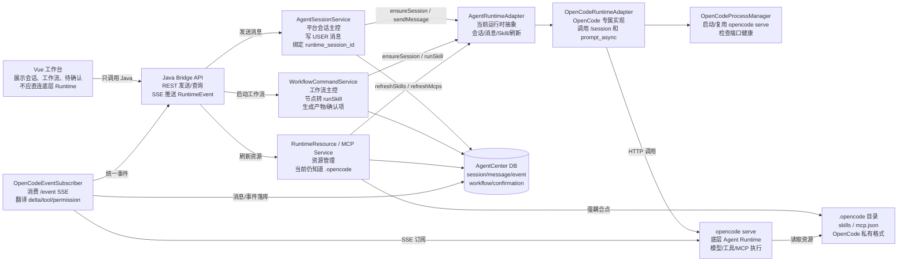
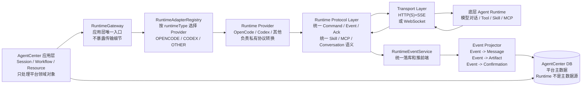
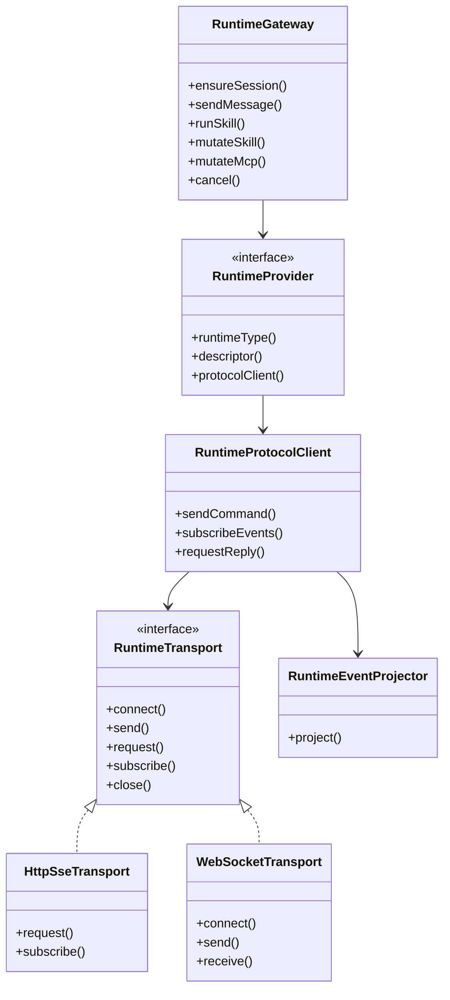
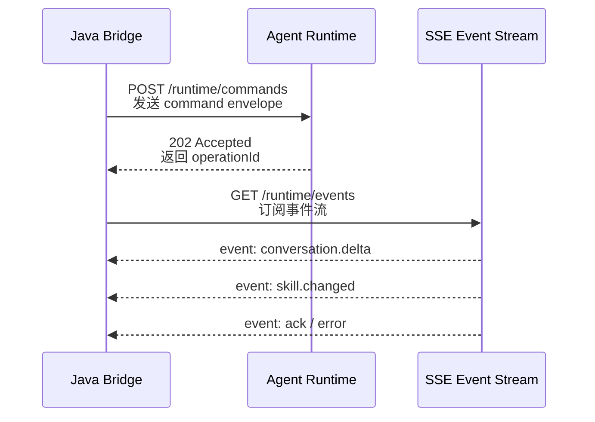
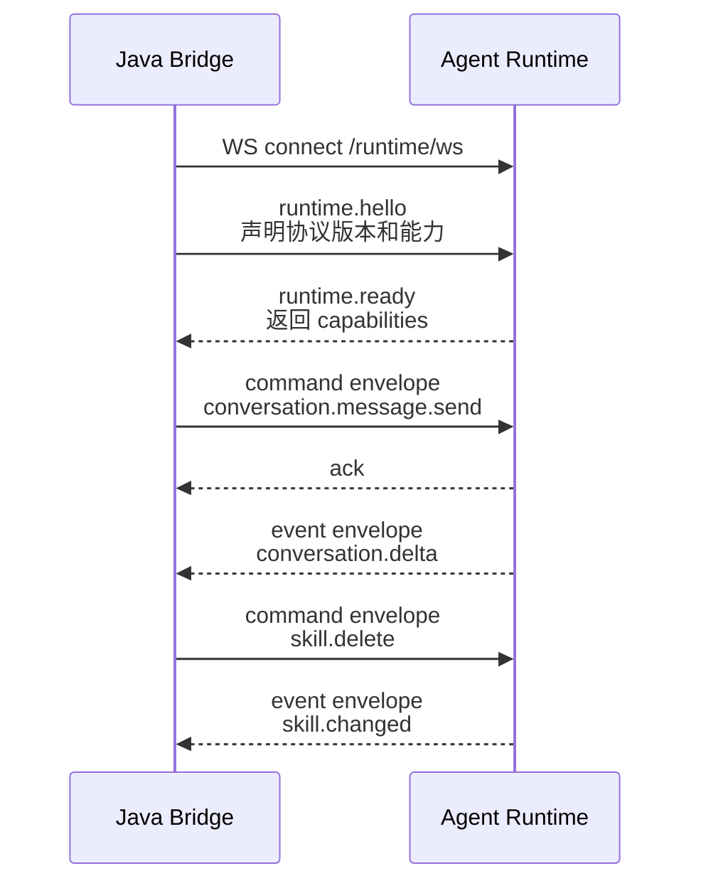
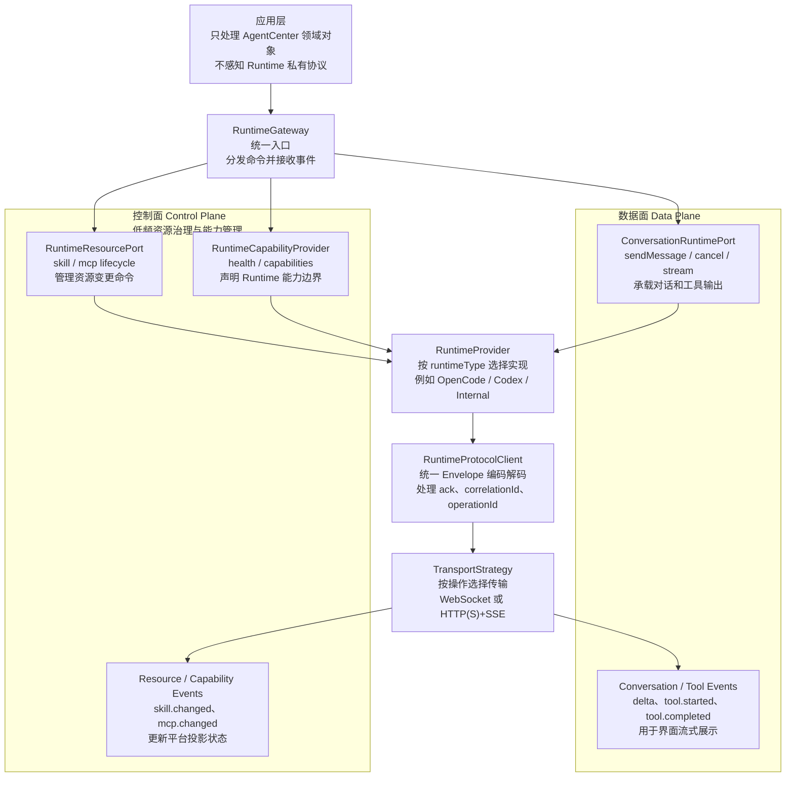
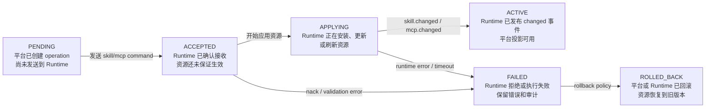
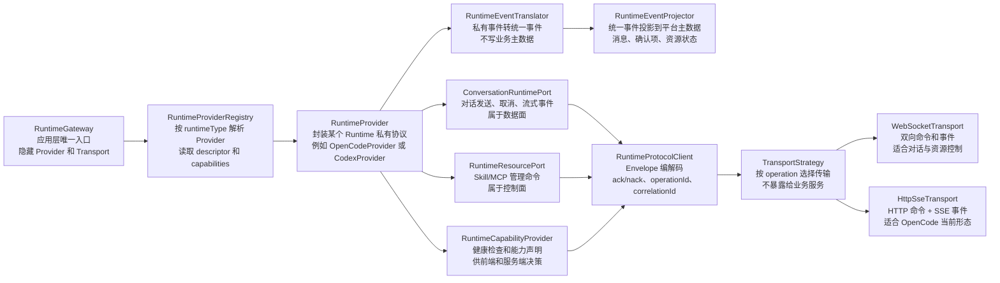

# Agent Runtime Protocol Layer Design

> 状态：未来目标架构 / 目标状态设计稿
> 最近更新：2026-05-08
> 目标读者：后续负责 Runtime 适配器重构、OpenCode/Codex/其他 Agent Runtime 接入的 Agent

本文档沉淀 AgentCenter 与底层 Agent Runtime 之间的通用协议层设计。它不是 M1 OpenCode Bridge 的替代说明，而是下一阶段重构目标：把对话通信、Skill 生命周期、MCP 生命周期、权限确认和运行事件统一到一套协议语义里，再根据 Runtime 能力选择 `HTTP(S)+SSE` 或 `WebSocket` 传输。

## 1. 设计结论

AgentCenter 应将“业务语义协议”和“网络传输方式”分开：

- 应用层只认识 AgentCenter 领域对象：会话、消息、事项、工作流、Skill、MCP、待确认、产物、运行事件。
- 协议层定义统一 `Command` / `Event` / `Ack` 信封，覆盖对话、Skill、MCP 和确认。
- 传输层负责把统一信封映射到具体通道：`HTTP(S)+SSE`、`WebSocket`，后续也可以扩展 stdio、gRPC streaming 或消息队列。
- Runtime Provider 负责私有协议转换：OpenCode 的 `.opencode`、`prompt_async`、`/event` SSE，Codex 或其他 Runtime 的 WebSocket frame，都只能出现在对应 Provider 内部。

一句话目标：

```text
业务层稳定，协议语义统一，传输可替换，Runtime 私有协议被关进 Provider。
```

这里的“传输可替换”指 Provider 可以按 Runtime 能力和操作类型选择 `WebSocket`、`HTTP(S)+SSE` 或其他传输策略；不表示同一次业务操作可以在执行中随意热切换传输。

## 2. 背景与边界

当前 M1 以 OpenCode 为第一套真实 Runtime：

- 用户消息：Java Bridge 通过 HTTP 调 `opencode serve /session/{id}/prompt_async`。
- 流式输出：Java Bridge 消费 OpenCode `/event` SSE，再推 AgentCenter SSE 给 Vue。
- Skill/MCP：当前部分逻辑直接扫描或写入 `.opencode/skills`、`.opencode/mcp.json`。

后续 Runtime 可能不同：

- 对话可能通过 WebSocket 双向通信。
- Skill 新增、删除、启用、禁用可能通过 WebSocket command 完成。
- MCP 新增、删除、启用、工具刷新也可能通过 WebSocket command 完成。
- Runtime 可能没有本地文件资源格式，也可能不暴露 SSE。

因此下一阶段重构不能只抽象 `sendMessage()`，还必须抽象 Skill/MCP 生命周期和事件投影。

## 3. 当前架构观察



当前已经有正确的起点：应用层通过 `AgentRuntimeAdapter` 调 Runtime。

主要缺口：

| 缺口 | 影响 |
|------|------|
| 没有 `RuntimeAdapterRegistry` | 多 Runtime 无法按 `runtimeType` 插拔选择 |
| `AgentRuntimeAdapter` 同时承载会话、对话、Skill、MCP 刷新 | 抽象粒度偏粗，难表达不同 Runtime 的能力差异 |
| Skill/MCP 资源管理仍知道 `.opencode` | OpenCode 私有资源格式泄漏到通用应用层 |
| OpenCode SSE Subscriber 直接写 `agent_message` | 事件翻译和平台投影职责混在一起 |
| 前端仍有 OpenCode 文案和 `runtimeType: OPENCODE` 硬编码 | UI 对底层 Runtime 有可见耦合 |

## 4. 目标架构



分层职责：

| 层 | 职责 | 不做什么 |
|----|------|----------|
| Application Services | 编排会话、工作流、资源、确认、产物 | 不调用 Runtime 私有 API |
| RuntimeGateway | 应用层统一入口，暴露平台语义命令 | 不关心 HTTP、SSE、WebSocket |
| RuntimeAdapterRegistry | 按 `runtimeType`、项目配置、能力选择 Provider | 不做业务状态流转 |
| Runtime Provider | Runtime 私有协议适配和能力声明 | 不成为平台主数据源 |
| Protocol Layer | 统一 Command/Event/Ack 信封和类型 | 不绑定具体网络通道 |
| Transport Layer | 负责连接、发送、订阅、重连、心跳、超时 | 不理解工作流和确认领域 |
| RuntimeEventService | 统一事件落库、广播给前端 | 不解析 Runtime 私有事件 |
| Event Projector | 把统一事件投影成消息、产物、确认项 | 不调用底层 Runtime |

## 5. 目标类图



类说明：

| 类 / 接口 | 说明 |
|-----------|------|
| `RuntimeGateway` | 给 `AgentSessionService`、`WorkflowCommandService`、`RuntimeResourceService` 使用的统一入口 |
| `RuntimeProvider` | 一个底层 Runtime 的完整适配包，例如 OpenCode Provider、Codex Provider |
| `RuntimeProtocolClient` | 把平台命令转换为 Runtime 可理解的协议消息，并把原始事件转换为统一事件 |
| `RuntimeTransport` | 传输抽象，屏蔽 HTTP/SSE/WebSocket 差异 |
| `HttpSseTransport` | 命令通过 HTTP(S) request，下行事件通过 SSE subscribe |
| `WebSocketTransport` | 命令、事件、Ack 都通过同一条 WebSocket 双向通道 |
| `RuntimeEventProjector` | 把统一事件投影到 `agent_message`、`artifact`、`confirmation_request` |

## 6. 统一协议信封

所有 Runtime 命令、事件、确认都使用同一套 Envelope。字段分为路由字段、幂等字段、会话字段和业务 payload。

### 6.1 Command Envelope

```json
{
  "protocol": "agentcenter.runtime.v1",
  "kind": "command",
  "type": "skill.install",
  "messageId": "cmd_01HZY7EXAMPLE000000000001",
  "correlationId": null,
  "operationId": "op_01HZY7EXAMPLE000000000001",
  "idempotencyKey": "skill.install:project-default:prd-design:v3",
  "runtimeType": "CODEX",
  "agentSessionId": "ags_01HZY7EXAMPLE000000000001",
  "runtimeSessionId": "external-session-id",
  "projectId": "project-default",
  "createdAt": "2026-05-07T10:00:00Z",
  "payload": {
    "skillName": "prd-design",
    "packageUri": "agentcenter://runtime-skills/prd-design.zip"
  }
}
```

### 6.2 Event Envelope

```json
{
  "protocol": "agentcenter.runtime.v1",
  "kind": "event",
  "type": "conversation.delta",
  "messageId": "evt_01HZY7EXAMPLE000000000001",
  "correlationId": "cmd_01HZY7EXAMPLE000000000001",
  "operationId": "op_01HZY7EXAMPLE000000000001",
  "runtimeType": "CODEX",
  "agentSessionId": "ags_01HZY7EXAMPLE000000000001",
  "runtimeSessionId": "external-session-id",
  "projectId": "project-default",
  "createdAt": "2026-05-07T10:00:02Z",
  "payload": {
    "delta": "这里是增量文本"
  }
}
```

### 6.3 Ack / Nack Envelope

```json
{
  "protocol": "agentcenter.runtime.v1",
  "kind": "ack",
  "type": "ack",
  "messageId": "ack_01HZY7EXAMPLE000000000001",
  "correlationId": "cmd_01HZY7EXAMPLE000000000001",
  "operationId": "op_01HZY7EXAMPLE000000000001",
  "runtimeType": "CODEX",
  "agentSessionId": "ags_01HZY7EXAMPLE000000000001",
  "createdAt": "2026-05-07T10:00:01Z",
  "payload": {
    "accepted": true,
    "reason": null
  }
}
```

字段约定：

| 字段 | 说明 |
|------|------|
| `protocol` | 协议版本，便于未来演进 |
| `kind` | `command`、`event`、`ack`、`nack` |
| `type` | 语义类型，例如 `conversation.message.send`、`skill.delete` |
| `messageId` | 单条协议消息 ID |
| `correlationId` | 响应或事件关联到原始命令 |
| `operationId` | 一次长操作 ID，例如一次工作流节点执行或一次 Skill 安装 |
| `idempotencyKey` | 命令幂等键，防止重试造成重复安装、重复删除或重复发送 |
| `runtimeType` | 目标 Runtime 类型 |
| `agentSessionId` | AgentCenter 平台会话 ID |
| `runtimeSessionId` | 外部 Runtime 会话 ID，不作为平台主键 |
| `payload` | 业务负载，按 `type` 定义 schema |

## 7. 命令类型

| 类型 | 用途 | 典型调用方 |
|------|------|------------|
| `runtime.capabilities.query` | 查询 Runtime 支持能力 | RuntimeGateway |
| `runtime.health.check` | 健康检查 | Health / Admin |
| `session.ensure` | 创建或恢复 Runtime session | AgentSessionService / WorkflowCommandService |
| `session.close` | 关闭 Runtime session | AgentSessionService |
| `conversation.message.send` | 发送用户消息 | AgentSessionService |
| `conversation.cancel` | 取消当前回复 | Conversation UI |
| `skill.run` | 执行工作流节点或 Skill | WorkflowCommandService |
| `skill.install` | 安装 Skill | SkillRegistryService |
| `skill.update` | 更新 Skill | SkillRegistryService |
| `skill.delete` | 删除 Skill | SkillRegistryService |
| `skill.enable` | 启用 Skill | SkillRegistryService |
| `skill.disable` | 禁用 Skill | SkillRegistryService |
| `skill.refresh` | 刷新 Runtime Skill 索引 | RuntimeResourceService |
| `mcp.upsert` | 新增或更新 MCP Server | McpRegistryService |
| `mcp.delete` | 删除 MCP Server | McpRegistryService |
| `mcp.enable` | 启用 MCP Server | McpRegistryService |
| `mcp.disable` | 禁用 MCP Server | McpRegistryService |
| `mcp.tools.refresh` | 刷新 MCP 工具快照 | McpRegistryService |
| `confirmation.resolve` | 用户处理待确认后继续 Runtime | ConfirmationService |

## 8. 事件类型

| 类型 | 用途 | 投影目标 |
|------|------|----------|
| `ack` | Runtime 接受命令 | `runtime_event` |
| `nack` | Runtime 拒绝命令 | `runtime_event` / error message |
| `conversation.delta` | 模型流式输出 | 前端 streaming message |
| `conversation.completed` | 本轮回复完成 | `agent_message` |
| `conversation.failed` | 本轮回复失败 | `agent_message` / `runtime_event` |
| `tool.started` | 工具或 Skill 开始 | `runtime_event` |
| `tool.completed` | 工具或 Skill 完成 | `runtime_event` / optional artifact |
| `tool.failed` | 工具或 Skill 失败 | `runtime_event` / node failed |
| `skill.changed` | Skill 安装、删除、启禁用完成 | `runtime_skill` / audit |
| `mcp.changed` | MCP 配置变更完成 | `project_mcp_server` / audit |
| `mcp.tools.changed` | MCP 工具快照变更 | `project_mcp_tool_snapshot` |
| `permission.required` | Runtime 请求权限确认 | `confirmation_request` |
| `input.required` | Runtime 请求用户补充输入 | `confirmation_request` |
| `runtime.status` | Runtime 状态变化 | `runtime_event` |
| `runtime.error` | Runtime 异常 | `runtime_event` / error message |

## 9. HTTP(S)+SSE 传输映射

适用场景：

- Runtime 暴露 HTTP command API。
- Runtime 用 SSE 或 HTTP streaming 输出事件。
- OpenCode M1 属于这个模式。



映射规则：

| 协议动作 | HTTP(S)+SSE 映射 |
|----------|------------------|
| `sendCommand` | `POST /runtime/commands` 或 Runtime 私有 command API |
| `requestReply` | HTTP request + response body |
| `subscribeEvents` | `GET /runtime/events` SSE |
| `ack/nack` | HTTP response 或 SSE event |
| reconnect | SSE 自动重连 + `Last-Event-ID` 或平台侧 cursor |

OpenCode Provider 可以临时映射为：

| 统一命令 | OpenCode 当前映射 |
|----------|-------------------|
| `session.ensure` | `POST /session` |
| `conversation.message.send` | `POST /session/{id}/prompt_async` |
| `conversation.delta` | `/event` 中的 `message.part.delta` |
| `permission.required` | `/event` 中的 `permission.asked` |
| `tool.started/completed` | `/event` 中的 tool part 状态 |

## 10. WebSocket 传输映射

适用场景：

- Runtime 要求对话、Skill、MCP 都通过 WebSocket 双向通信。
- Runtime 支持长连接会话、心跳、server push 和 request/response multiplexing。
- 后续 Codex 或其他 Runtime 可以采用此模式。



映射规则：

| 协议动作 | WebSocket 映射 |
|----------|----------------|
| `connect` | 建立 WebSocket，并发送 `runtime.hello` |
| `sendCommand` | 发送 `kind=command` envelope |
| `requestReply` | 用 `messageId` / `correlationId` 关联 ack 或 response event |
| `subscribeEvents` | 连接建立后持续接收 `kind=event` envelope |
| `ack/nack` | Runtime 返回 `kind=ack` / `kind=nack` frame |
| reconnect | 使用 `operationId`、cursor、幂等键恢复未完成操作 |
| heartbeat | `runtime.ping` / `runtime.pong` |

WebSocket 模式下，Skill/MCP 生命周期不再写本地 Runtime 文件，而是发统一 command：

```json
{
  "protocol": "agentcenter.runtime.v1",
  "kind": "command",
  "type": "mcp.enable",
  "messageId": "cmd_01HZY7EXAMPLE000000000002",
  "operationId": "op_01HZY7EXAMPLE000000000002",
  "runtimeType": "CODEX",
  "projectId": "project-default",
  "payload": {
    "mcpServerId": "mcp_01HZY7EXAMPLE000000000001",
    "name": "jira",
    "configRef": "agentcenter://mcp-configs/jira"
  }
}
```

## 11. Skill/MCP 资源策略

通用应用层不再写 Runtime 私有资源目录。它只负责：

1. 校验上传包、配置和权限。
2. 把平台主数据写入 `runtime_skill`、`runtime_skill_version`、`project_mcp_server`、audit 表。
3. 通过 `RuntimeGateway.mutateSkill()` 或 `RuntimeGateway.mutateMcp()` 发送统一命令。
4. 等待 Runtime 返回 `skill.changed` / `mcp.changed` / `mcp.tools.changed`。
5. 由 `RuntimeEventProjector` 更新平台投影状态。

Provider 内部负责具体落地：

| Runtime | Skill/MCP 落地方式 |
|---------|--------------------|
| OpenCode | 写 `.opencode/skills`、`.opencode/mcp.json`，必要时重启或刷新 `opencode serve` |
| Codex | 通过 WebSocket command 或 Codex API 同步资源 |
| Other | 按该 Runtime 的私有协议实现 |

这样可以避免 `.opencode` 路径泄漏到 `RuntimeResourceService` 和 `McpRegistryService`。

## 12. 数据模型影响

短期可以继续使用：

```text
agent_session.runtime_type
agent_session.runtime_session_id
workflow_node_instance.runtime_session_id
confirmation_request.runtime_type
confirmation_request.runtime_session_id
```

中期建议新增更明确的外部 Runtime 会话表：

```text
agent_runtime_session
- id
- agent_session_id
- runtime_type
- external_session_id
- transport_type
- endpoint
- working_directory
- status
- capabilities_json
- metadata_json
- created_at
- updated_at
```

建议新增 Runtime operation 表，用于跟踪长操作、重试和幂等：

```text
runtime_operation
- id
- runtime_type
- operation_type
- idempotency_key
- agent_session_id
- runtime_session_id
- status
- request_json
- last_event_id
- error_message
- created_at
- updated_at
```

## 13. 能力声明

每个 Runtime Provider 必须暴露 descriptor：

```json
{
  "runtimeType": "CODEX",
  "displayName": "Codex Runtime",
  "transportTypes": ["WEBSOCKET"],
  "capabilities": {
    "conversationStreaming": true,
    "skillLifecycle": true,
    "mcpLifecycle": true,
    "permissionRequest": true,
    "hotReloadResources": true,
    "cancelConversation": true
  }
}
```

前端展示不再硬编码 `OpenCode` 文案，而是使用 descriptor 的 `displayName` 和 capabilities。

## 14. 迁移路线

下一阶段重构建议按可回滚方式推进：

| 阶段 | 目标 | 结果 |
|------|------|------|
| P0 | 文档和协议确认 | 本文档作为目标设计基线，并确认第 16 节硬约束 |
| P1 | 引入 `RuntimeAdapterRegistry` | 应用层按 `runtimeType` 选择 Provider |
| P2 | 引入统一 Envelope | 内部先用统一命令/事件对象，不改外部行为 |
| P3 | 拆 OpenCode Provider | `.opencode`、`prompt_async`、`/event` 都收进 OpenCode Provider |
| P4 | 拆 RuntimeEventProjector | 事件翻译和消息/产物/确认项投影分离 |
| P5 | 引入 WebSocketTransport | 支持双向 Runtime Provider |
| P6 | 接入 Codex 或第二个 Runtime | 验证协议层的可插拔性 |
| P7 | 前端 Runtime descriptor 化 | 去除 OpenCode 硬编码文案 |

## 15. 审计清单

后续做重构计划时，可按下面清单审计：

- 应用层是否仍直接出现 `.opencode`、`prompt_async`、`x-opencode-directory`、OpenCode SSE event type。
- 前端是否仍硬编码 `OpenCode` 展示文案。
- Skill/MCP 新增、删除、启禁用是否走统一 Runtime command。
- Runtime 私有事件是否先翻译为统一事件，再由 Projector 落平台主数据。
- 每个 Runtime Provider 是否声明 transport 和 capabilities。
- WebSocket Runtime 是否具备 ack/nack、correlationId、operationId、heartbeat、reconnect 策略。
- HTTP+SSE Runtime 是否具备幂等键、事件 cursor 或重连恢复策略。

## 16. 设计修订：进入重构前的硬约束

本节是 2026-05-08 对目标设计的二次审视结论，用来收紧本文档口径。统一协议层的核心承诺是“业务语义稳定、Runtime 私有协议可替换”，不是“任何交互都能无条件随意切换传输”。

### 16.1 传输选择不是任意热切换

传输策略必须由 `RuntimeProvider` 根据 Runtime 能力、操作类型和失败恢复策略选择。应用层只看到统一命令和统一事件，不直接关心底层走 WebSocket 还是 HTTP+SSE。

| 操作域 | 可选传输 | 设计约束 |
|--------|----------|----------|
| 对话发送和流式回复 | WebSocket 或 HTTP(S)+SSE | 同一次 conversation operation 内传输策略应保持稳定；失败后按显式 retry/failover policy 处理 |
| Tool/Skill 执行事件 | WebSocket 或 SSE | 统一翻译为 `tool.started`、`tool.completed`、`skill.run.*` 等平台事件 |
| Skill 生命周期管理 | WebSocket command 或 HTTP API | HTTP+SSE 本身只适合事件订阅，不能单独承担管理命令；管理结果要通过状态事件确认 |
| MCP 生命周期管理 | WebSocket command 或 HTTP API | `mcp.upsert`、`mcp.delete`、`mcp.tools.refresh` 必须可追踪 operationId |
| 健康检查和能力声明 | HTTP request/response 或 WebSocket request/response | Provider 必须声明 capabilities，前端和应用层不能硬编码 OpenCode 能力 |
| 事件恢复和重放 | SSE cursor 或 WebSocket resume | 必须具备 lastEventId、operationId 或等价恢复点 |

### 16.2 数据面和控制面必须分离

对话流、工具调用流属于数据面；Skill/MCP、能力声明、健康检查、权限和资源变更属于控制面。两者可以共用统一 Envelope，但不能混用状态语义。



### 16.3 Skill/MCP 必须按异步状态机处理

对于支持 WebSocket 管理 Skill/MCP 的 Runtime，Bridge 不能把 WebSocket ack 当成资源已生效。ack 只表示 Runtime 或 Provider 已接收命令；资源真正可用必须以 `skill.changed`、`mcp.changed`、`mcp.tools.changed` 或后续 capability query 为准。



建议把 Skill/MCP 管理统一建模为 `runtime_operation`，用 `operationId` 做幂等、审计、重试和事件关联。

### 16.4 WebSocket 连接生命周期要显式设计

WebSocket Provider 推荐按 `runtimeType + project/workspace + security context` 维护长连接，而不是每条消息临时建连。单条连接内可以通过 `agentSessionId`、`operationId` 和 `correlationId` 复用多个会话或多个资源操作。

必须明确以下策略：

- heartbeat：检测 Runtime 是否仍可用。
- reconnect：断线后按 lastEventId 或 resume token 恢复。
- backpressure：Runtime 输出过快时保护 Java Bridge 和前端 SSE。
- ordering：同一 operation 内事件有序；不同 operation 之间不要求全局有序。
- close policy：项目关闭、Runtime 失效、用户取消时如何关闭或保留连接。

### 16.5 安全和审计不能放到 Provider 之外假设

协议层需要把安全边界当成一等设计对象，而不是只靠 Runtime 私有实现：

- Bridge 到 Runtime 的认证方式必须可声明，例如 token、mTLS、signed request。
- `projectId`、`workspace`、`workingDirectory` 必须由服务端绑定，不能信任前端透传。
- Skill/MCP 中的 secret 只能传 secret reference，不能把明文密钥写入事件、日志或普通配置。
- 每个管理命令必须落审计：谁发起、目标 Runtime、operationId、资源 ID、旧版本、新版本、结果。
- Runtime Provider 需要执行能力白名单，不能因为底层 Runtime 支持某功能就默认开放给所有项目。

### 16.6 事件投影要区分“展示事件”和“权威事件”

`conversation.delta` 只能用于实时展示，不能作为最终消息的唯一权威来源。最终持久化应优先依赖 `conversation.completed`，其中包含 `finalMessageId`、最终内容、产物引用、usage 和 finishReason。

投影规则建议如下：

- `conversation.delta`：进入流式缓冲，可丢失后通过 resume/replay 补齐。
- `tool.started` / `tool.completed`：写运行事件和工具执行轨迹。
- `permission.requested`：创建平台确认项，确认结果再由 Bridge 回写 Runtime。
- `skill.changed` / `mcp.changed`：更新平台资源投影状态。
- `conversation.completed`：落最终 assistant message，是会话结果的权威事件。

`RuntimeEventProjector` 必须按 `operationId`、`runtimeEventId` 或 `finalMessageId` 做幂等，避免断线重放造成重复消息、重复确认项或重复资源版本。

### 16.7 修订后的组件边界



这版边界意味着后续真正重构时，优先拆 `RuntimeGateway`、`RuntimeProviderRegistry`、`RuntimeResourcePort` 和 `RuntimeEventProjector`，再把 OpenCode 的 `.opencode` 文件访问、`prompt_async`、`/event` SSE 收回 `OpenCodeProvider` 内部。

## 17. 与现有文档关系

- [ADR-001-OPENCODE-BRIDGE-SSE-REST.md](./ADR-001-OPENCODE-BRIDGE-SSE-REST.md)：M1 OpenCode 接入决策，仍然有效。
- [OPENCODE-BRIDGE-EXECUTION-DESIGN.md](./OPENCODE-BRIDGE-EXECUTION-DESIGN.md)：OpenCode M1 实施口径，仍然是当前实现参考。
- [RUNTIME-RESOURCE-MANAGEMENT-DESIGN.md](./RUNTIME-RESOURCE-MANAGEMENT-DESIGN.md)：Skill/MCP 管理设计，需要在下一阶段按本文档补充 Runtime Provider 化。
- [AGENT-RUNTIME-WEBSOCKET-BRIDGE.md](./AGENT-RUNTIME-WEBSOCKET-BRIDGE.md)：早期 WebSocket 方案，可作为 WebSocketTransport 的历史参考，但不再作为整体协议层口径。
