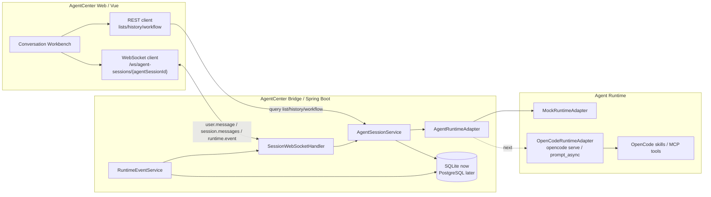
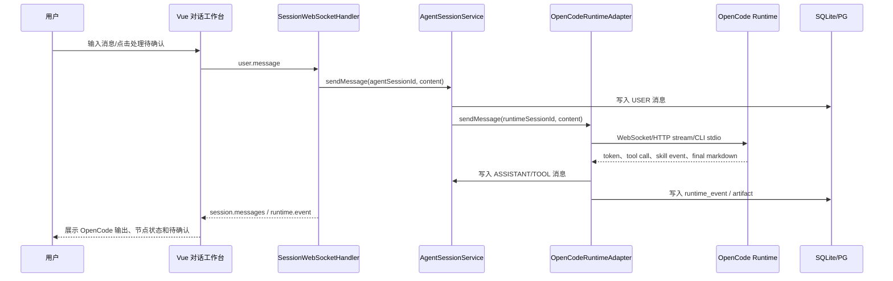
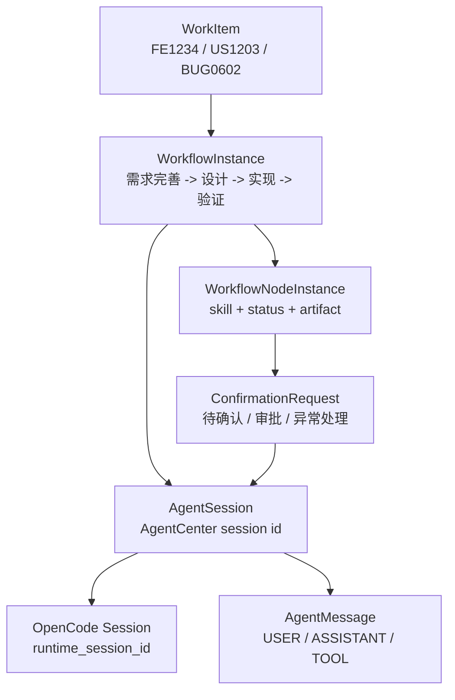

# Agent Runtime WebSocket Bridge

本文档记录 AgentCenter 与 OpenCode 类 Agent Runtime 的实时对接方案。当前实现先把前端与 Java Bridge 的实时通道改为 WebSocket；OpenCode 真实适配器后续落到 `AgentRuntimeAdapter` 后即可复用同一协议。

## 架构图



## WebSocket 事件协议

连接地址：

```text
前端开发环境：ws://localhost:5173/ws/agent-sessions/{agentSessionId}
Java Bridge 直连：ws://localhost:8080/ws/agent-sessions/{agentSessionId}
```

前端发送：

```json
{
  "type": "user.message",
  "requestId": "req_1710000000000",
  "payload": {
    "content": "继续分析这个 FE",
    "contentFormat": "TEXT"
  }
}
```

后端返回：

```json
{ "type": "session.connected", "payload": { "sessionId": "ags_xxx" } }
{ "type": "session.messages", "payload": { "sessionId": "ags_xxx", "messages": [] } }
{ "type": "runtime.event", "payload": { "eventType": "SKILL_STARTED" } }
{ "type": "error", "payload": { "message": "..." } }
```

## 会话运行时序



## 运行时接入建议

优先级建议：

1. 如果 OpenCode 提供本地 WebSocket 或 HTTP streaming API，`OpenCodeRuntimeAdapter` 直接用该接口，保持一条长连接消费 token、tool call 和 skill 状态。
2. 如果 OpenCode 只有 CLI，可先由 Java 用 `ProcessBuilder` 启动子进程并读取 stdout/stderr，把输出翻译成统一事件；浏览器侧仍然不变。
3. 不建议浏览器直连 OpenCode。浏览器只连 Java Bridge，认证、权限、审计、会话绑定、消息持久化都留在企业平台侧。

Java Bridge 对 OpenCode 的适配目标：

| 能力 | Java 侧接口 | OpenCode 侧映射 |
|------|-------------|-----------------|
| 创建会话 | `AgentRuntimeAdapter.createSession()` | 创建/恢复 OpenCode session，并回填 `runtime_session_id` |
| 发送用户消息 | `AgentRuntimeAdapter.sendMessage()` | 向指定 OpenCode session 发送 prompt |
| 执行 skill 节点 | `AgentRuntimeAdapter.runSkill()` | 调用 OpenCode skill/MCP，输出 Markdown artifact |
| 消费输出 | runtime callback/event stream | 转成 `agent_message`、`runtime_event`、`artifact` |
| 等待确认 | workflow/skill 状态机 | 生成 `confirmation_request`，右侧“待确认”展示 |

## 推荐 OpenCode 对接方式

1. Java Bridge 不直接让浏览器连接 OpenCode。
2. `OpenCodeRuntimeAdapter` 负责对接本机 `opencode serve` 或 CLI 进程。
3. `agent_session.runtime_session_id` 保存 OpenCode session id。
4. 用户输入走 WebSocket 到 Java Bridge，再由 `AgentRuntimeAdapter.sendMessage()` 转发给 OpenCode。
5. OpenCode 输出被翻译成统一的 `agent_message` 与 `runtime_event`，再通过 WebSocket 推到前端。

## 会话与工作流关系



## 边界

- REST 继续负责列表、历史、工作流查询和管理接口。
- WebSocket 负责会话内实时交互、运行事件、待确认提醒。
- 后续水平扩展时，WebSocket 连接需要 sticky session；跨实例广播建议接 Redis pub/sub。
