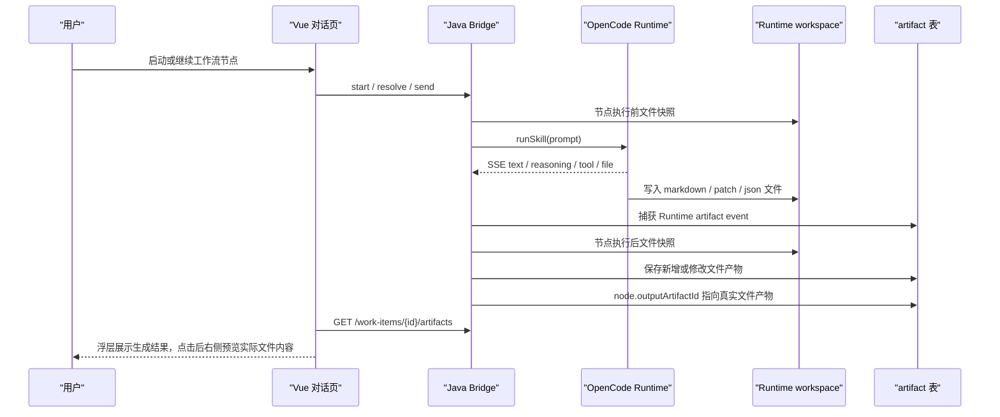

# Conversation Run Summary and File Artifacts

> 状态：实现基线
> 最近更新：2026-05-14

本文档固定对话页“场务/运行摘要”和产物预览的事实源。核心原则只有一条：**产物必须是 Runtime 或 Bridge 在运行过程中写入的真实文件；对话正文、思考摘要、系统状态行和节点总结都不能被当成产物。**

## 1. 信息分层

| 信息 | 展示位置 | 是否产物 | 说明 |
|------|----------|----------|------|
| 主回答正文 | 对话流 | 否 | 用户阅读的阶段结论或最终陈述，不进入产物列表。 |
| reasoning / text delta | 对话流阶段段落 | 否 | 用于理解 Agent 当下在想什么，完成后可折叠。 |
| read / glob / grep / bash / MCP_CALL | 对话流工具组 | 否 | 只表达运行过程和状态；工具输出结束后折叠进详情。 |
| permission / question | 输入区交互卡片 | 否 | 用户必须处理的交互，不生成产物。 |
| `message.part.file` / `patch` / `artifact` | 运行事件 + artifact 表 | 是 | OpenCode 明确报告文件产物时保存。 |
| 运行前后新增/修改的 `.md/.json/.yaml/.patch/.diff/.txt` | artifact 表 | 是 | Bridge 用文件快照兜底识别真实写入文件。 |

## 2. 识别契约

产物识别入口有两类：

1. **Runtime artifact event**：OpenCode SSE 中的 `file`、`patch`、`artifact` part 会被翻译为 `PROCESS_TRACE`，payload 包含 `kind=artifact`、`artifactId`、`filePath`。
2. **文件快照兜底**：工作流节点执行前后，Bridge 扫描 Runtime workspace，捕获本轮新增或修改的文本产物文件，并保存为 `sourceType=FILE_SNAPSHOT`。

不再使用的入口：

- 不从 assistant message 的 markdown 正文提取产物。
- 不从隐藏的 `AGENTCENTER_ARTIFACT_BEGIN/END` 内容块直接保存正文产物；只有带 `file_path` 的块才可作为文件引用。
- 不从节点状态、Skill 总结或对话中的 markdown 片段猜测产物。

## 3. 运行摘要浮层

运行摘要浮层只在对话页展示，目标是让用户随时知道当前任务推进到哪里、生成了哪些真实文件、底层调用来自哪里。

展示内容：

- **To do**：来自当前 workflow instance 的节点顺序和状态。
- **生成结果**：来自 artifact 表和 runtime artifact event 的真实文件产物，点击后打开右侧产物预览。
- **来源**：来自 runtime event 的 `eventSource`、`eventType` 和工具名，用于解释本轮调用过 OpenCode、Bridge、MCP 或工具。

交互规则：

- 默认固定在对话区右侧。
- 点击“取消固定”后收成窄条，鼠标悬停时展开。
- 打开右侧产物预览时，浮层只保留窄条，避免和右侧栏互相抢空间。
- 关闭产物预览后，浮层恢复用户之前的固定/收起状态。

## 4. 预览规则

右侧“产物预览”只展示 artifact 表中记录的产物。

读取内容优先级：

1. 如果 artifact.content 非空，直接展示。
2. 如果 artifact.content 为空，但 `filePath` 或 `storageUri` 指向 Runtime workspace 内的文本文件，Bridge 读取文件内容返回。
3. 如果路径越界、文件不存在、文件过大或非文本格式，前端显示空内容或后续下载入口，不把对话内容兜底为产物。

## 5. 验收点

- 对话正文里出现 `# PRD`、`# HLD`、`# LLD` 不会自动出现在产物预览。
- OpenCode 或 Bridge 写入 `.md` 文件后，artifact 表会记录 `filePath/sourceType`。
- 用户点击“生成结果”项，右侧预览展示文件里的 markdown 内容。
- 工作流下一节点的“上游产物”从真实文件读取，而不是从上一轮对话正文读取。
