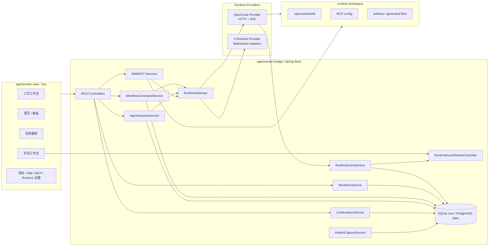
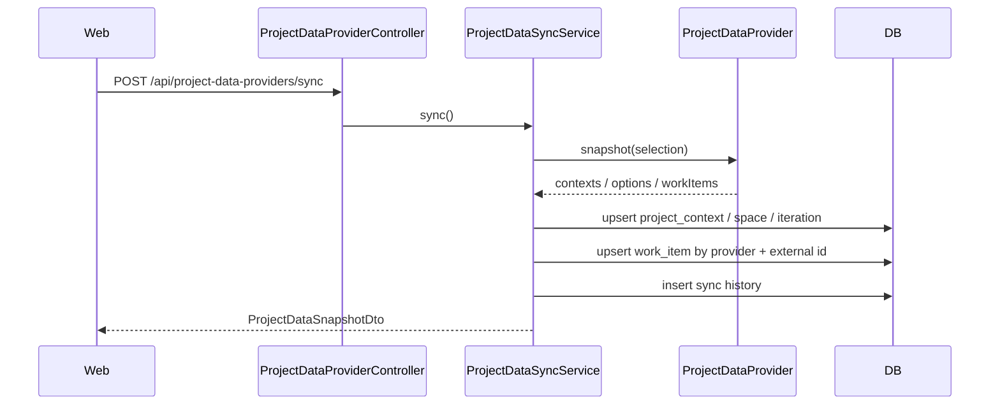
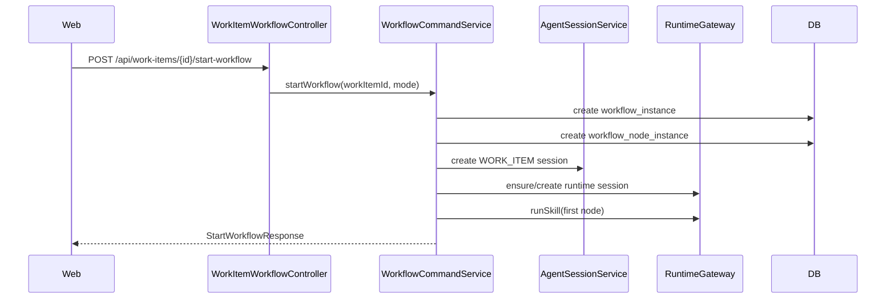
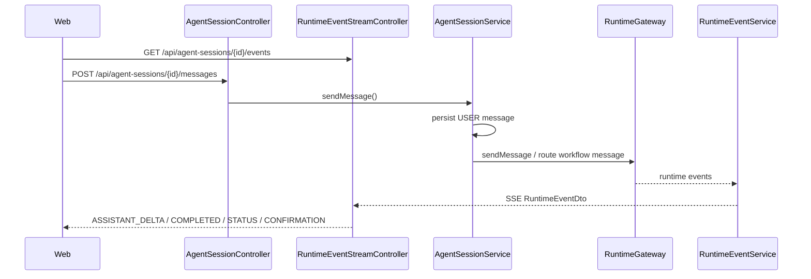
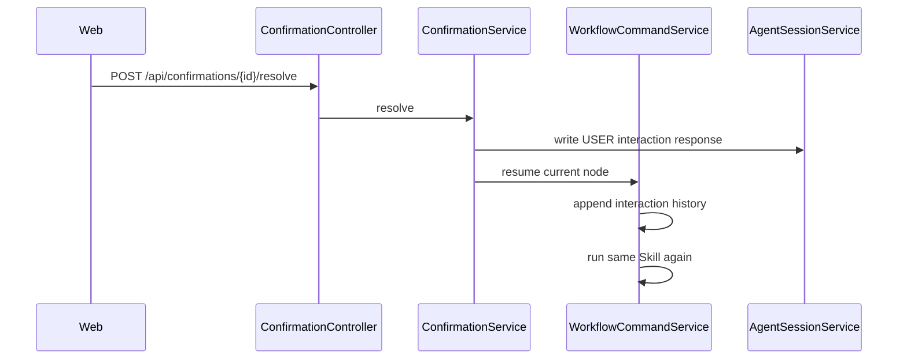

# AgentCenter 当前功能 HLD

> 状态：当前功能 HLD 基线
> 最近更新：2026-05-15
> 功能盘点基线：`6f2e04164541ae51c9e11803dcdfb0fd7d25858d`（2026-05-14 10:26:04 +0800，`docs(project-context): slim enterprise provider guidance`）
> 说明：本文按上述 10:26 commit 的工程状态定义当前功能 HLD；之后 commit 中新增的内容视为后续演进或补充文档。
> 关联文档：[当前功能 PRD](./CURRENT-FEATURE-PRD.md) | [当前功能 LLD](./CURRENT-FEATURE-LLD.md)

## 一、总体架构

当前 AgentCenter 由两个主要应用和一个运行工作目录组成：

```text
agentcenter-web
  Vue 3 工作台前端

agentcenter-bridge
  Java Spring Boot Bridge
  管理事项、工作流、会话、消息、确认、产物、Runtime 事件、Skill 和 MCP

runtime-workspace
  OpenCode / 项目 Runtime 工作目录
  包含 .opencode/skills、MCP 配置和运行产物
```

设计原则：

- Web 只调用 Bridge，不直连 OpenCode。
- Bridge 是平台控制面，不是 OpenCode 的透明代理。
- Runtime 只负责执行，业务主数据在 AgentCenter DB。
- 事件是运行事实，消息、确认、产物、看板都是投影。

## 二、容器视图



## 三、核心模块边界

| 模块 | 职责 | 不做什么 |
|------|------|----------|
| Web Shell | 页面布局、导航、上下文选择、右侧详情和通知 | 不保存业务主数据 |
| Work Item | 工作项统一模型、列表、概览、筛选 | 不直接执行 Runtime |
| Workflow | 定义、实例、节点状态、启动/继续/重跑/跳过 | 不理解 Runtime 私有协议 |
| Session | 平台会话、消息持久化、普通对话路由 | 不直接解析 OpenCode 原始事件 |
| Confirmation | 用户交互请求、处理结果、回灌当前节点 | 不把交互处理等同于节点完成 |
| Runtime Gateway | Runtime 选择、能力入口、操作跟踪 | 不做产品状态决策 |
| Runtime Provider | OpenCode / A Runtime 私有协议适配 | 不成为业务数据源 |
| Runtime Event | 运行事件落库、SSE 广播、前端投影 | 不执行业务命令 |
| Resource Governance | Skill/MCP 生命周期、审计、刷新 | 不让浏览器直接写本地配置 |
| Artifact | 产物捕获、读取、预览、安全边界 | 不把聊天消息当唯一产物源 |

## 四、关键数据流

### 4.1 项目同步流



### 4.2 工作流启动流



### 4.3 对话流



### 4.4 交互回灌流



## 五、领域对象

| 对象 | 当前表 / DTO | 说明 |
|------|--------------|------|
| Project Context | `project_context` | Provider 下的企业项目 |
| Space | `project_space` | 项目空间 |
| Iteration | `project_iteration` | 迭代 / Sprint |
| Work Item | `work_item` | FE/US/TASK/WORK/BUG/VULN |
| Workflow Definition | `workflow_definition` | 某类事项的编排模板 |
| Workflow Node Definition | `workflow_node_definition` | 阶段、Skill、输入策略、产物类型 |
| Workflow Instance | `workflow_instance` | 某工作项的一次运行 |
| Workflow Node Instance | `workflow_node_instance` | 某阶段的一次执行状态 |
| Agent Session | `agent_session` | 平台会话主数据 |
| Agent Message | `agent_message` | 消息历史 |
| Runtime Event | `runtime_event` | 运行事实事件 |
| Confirmation Request | `confirmation_request` | 用户交互请求 |
| Artifact | `artifact` | 产物记录 |
| Runtime Skill | `runtime_skill` | 项目 Skill 登记 |
| Project MCP Server | `project_mcp_server` | 项目 MCP 连接 |

## 六、API 组

| API 组 | 代表端点 |
|--------|----------|
| Work Items | `GET /api/work-items`, `GET /api/work-items/overview`, `POST /api/work-items` |
| Work Item Workflow | `POST /api/work-items/{id}/start-workflow`, `POST /api/work-items/start-workflows` |
| Workflow | `GET /api/workflow-definitions`, `PUT /api/workflow-definitions/{id}`, `POST /api/workflow-node-instances/{id}/retry` |
| Sessions | `GET /api/agent-sessions`, `POST /api/agent-sessions`, `POST /api/agent-sessions/{id}/messages` |
| Events | `GET /api/agent-sessions/{id}/events` |
| Confirmations | `GET /api/confirmations`, `POST /api/confirmations/{id}/resolve` |
| Artifacts | `GET /api/artifacts/{id}`, `GET /api/work-items/{workItemId}/artifacts` |
| Project Data | `GET/PUT/POST /api/project-data-providers/*` |
| Runtime Resources | `GET/POST/PUT/DELETE /api/projects/{projectId}/runtime/*` |
| Runtime Status | `GET /api/runtime/status`, `GET /health` |

## 七、跨模块风险

| 风险 | HLD 约束 |
|------|----------|
| 前端和后端事件字段不一致 | RuntimeEvent payload 字段需稳定，至少支持 delta/text/label 兼容 |
| Runtime session id 泄漏 | UI 和业务状态只使用 AgentCenter session id，runtime_session_id 只在 Bridge 内部映射 |
| 待确认处理错会话 | confirmation_request 必须保存 agent_session_id |
| 交互导致节点误完成 | 只有 Agent 状态 `READY_TO_ADVANCE` 才能完成节点 |
| 产物只在聊天中 | artifact 必须独立落库或绑定安全文件路径 |
| `.sisyphus` 被运行时依赖 | 产品运行态不得读取或要求 `.sisyphus/` 存在 |

## 八、验证策略

| 层 | 验证 |
|----|------|
| 前端 | `npm run typecheck`, `npm run test`, `npm run build` |
| Bridge | `./mvnw test`, 关键改动跑 `./mvnw clean package` |
| UI | Playwright 截图证据写入 `.sisyphus/evidence/` |
| Runtime | OpenCode contract test、SSE 字段 curl 验证 |
| 数据 | Flyway migration test、reset-test-data 验证 |
