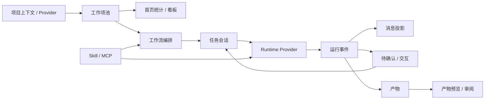

# AgentCenter 当前功能能力地图

> 状态：当前功能梳理基线
> 最近更新：2026-05-15
> 功能盘点基线：`6f2e04164541ae51c9e11803dcdfb0fd7d25858d`（2026-05-14 10:26:04 +0800，`docs(project-context): slim enterprise provider guidance`）
> 说明：本文按上述 10:26 commit 的工程状态梳理；之后 commit 中新增的内容视为后续演进或补充文档。
> 用途：给团队进行宏观分工、排期和 PRD/HLD/LLD 拆分。

本文档回答三个问题：

1. AgentCenter 当前有哪些功能能力。
2. 这些能力之间如何组成产品闭环。
3. 团队应按哪些业务能力域分工，而不是简单按前后端目录分工。

## 一、产品主线

AgentCenter 当前工程主线是：

```text
企业项目上下文
  -> FE / US / TASK / WORK / BUG / VULN 工作项池
  -> Agent-first 工作流编排
  -> 任务会话与真实 Runtime 输出
  -> 用户交互 / 待确认
  -> Markdown / JSON / PATCH / REPORT 产物
  -> Skill / MCP / Runtime 资源治理
```

一句话概括：

> 用户在一个明确的企业项目、空间、迭代作用域内，选择工作项并启动 Agent 工作流；系统通过 Java Bridge 调用 OpenCode 或未来其他 Runtime，实时展示运行过程，在关键节点让人确认，并沉淀消息、事件、产物和执行证据。

## 二、宏观能力域

| 编号 | 能力域 | 用户价值 | 当前工程承载 | 后续团队边界 |
|------|--------|----------|--------------|--------------|
| C1 | 工作台壳层与全局上下文 | 统一入口，明确当前项目/迭代/会话/详情 | Vue 三栏工作台、顶部上下文、左侧导航、右侧详情 | 前端体验组 |
| C2 | 项目数据源与工作项池 | 接入企业项目数据，统一展示 FE/US/TASK/WORK/BUG/VULN | ProjectDataProvider、work_item、同步历史 | 项目数据/平台集成组 |
| C3 | 工作项全景与看板 | 用首页和看板看清所有事项状态和节点进度 | HomeOverview、BoardView、overview API | 工作台业务组 |
| C4 | Agent-first 工作流编排 | 用大阶段和 Skill 定义处理路径，不把执行细节写死 | workflow_definition、WorkflowConfig、WorkflowCommandService | 编排引擎组 |
| C5 | 对话工作台与实时运行 | 在任务会话里看到 AI 回复、运行状态、过程和调试信息 | agent_session、agent_message、RuntimeEvent SSE、ConversationWorkbench | 对话体验组 + Runtime 组 |
| C6 | 人在环交互 / 待确认 | 承接确认、审批、补充、决策、权限和异常恢复 | confirmation_request、ConfirmationPanel、InteractionResponseForm | HITL 交互组 |
| C7 | Runtime 协议与 Provider | 隔离底层 Agent Runtime，支持 OpenCode 和未来企业 Runtime | RuntimeGateway、Provider Registry、OpenCode Provider、A Runtime 骨架 | Runtime 平台组 |
| C8 | Skill / MCP / 运行资源治理 | 让项目级 Skill 和工具连接可管理、可审计、可刷新 | SkillRegistry、McpRegistry、RuntimeResource Audit | 运行资源组 |
| C9 | 产物与证据闭环 | 把 Agent 输出沉淀为可审阅、可回放的产物 | ArtifactCapture、ArtifactController、ArtifactViewer | 产物/验证组 |
| C10 | 启动、验证与运维体验 | 本地一键启动、数据重置、测试和排障 | start.sh、Flyway、reset-test-data、测试套件 | QA / DevOps 组 |

## 三、能力闭环



主链路的关键判断标准：

- 工作项来自 Bridge API，不来自前端 mock。
- 前端只调用 Java Bridge，不直接调用 OpenCode。
- Java Bridge 拥有会话、消息、工作流、确认项、产物、运行事件主数据。
- Runtime 只作为执行引擎，不能成为业务主数据源。
- Agent 输出通过事件投影到消息、交互、产物和状态。

## 四、当前状态分层

| 层级 | 已具备能力 | 仍需重点打磨 |
|------|------------|--------------|
| 工作台 UI | 三栏布局、首页、看板、编排页、对话页、设置页、右侧详情/待确认/产物预览 | 搜索实际联动、移动端适配、统一空状态和错误恢复 |
| 项目数据 | Provider 设置、同步、snapshot、sync history、scope 查询 | 企业真实 Provider 接入、冲突策略、失败重试和可观测 |
| 工作项 | 统一类型、列表、概览、单项详情、批量启动 | 复杂关系、父子拆解、跨类型依赖、编辑体验 |
| 工作流 | 默认 PRD/HLD/LLD、项目级定义、保存新版、节点状态协议、重跑/跳过/继续 | 自动/手动推进策略沉淀、并发限制、超时恢复 |
| 会话 | 通用会话、任务会话、消息历史、SSE、取消、Prompt Debug | 多会话切换稳定性、运行中恢复、长输出性能 |
| 交互 | 待确认列表、弹窗处理、会话内交互栏、权限/决策/输入/异常 | 多交互批量回灌、产物审阅批注、交互历史检索 |
| Runtime | OpenCode Provider、HTTP 命令、SSE 订阅、事件翻译、A Runtime 骨架 | Provider 能力配置、真实企业 Runtime 合同测试 |
| 资源治理 | Skill 上传/启停/删除/刷新、MCP 导入/启停/测试/工具快照、审计 | 引用阻断、版本回滚、敏感配置脱敏和权限 |
| 产物 | Markdown 捕获、文件型产物读取、右侧预览 | 产物版本、批注、审阅闭环和外部制品存储 |
| 验证运维 | Maven/Vitest 测试、Flyway 测试、一键启动、数据重置 | E2E 截图 evidence 常态化、健康检查面板 |

## 五、团队分组建议

| 团队 | 主责能力域 | 交付物 |
|------|------------|--------|
| 产品与验收组 | C1-C10 的用户场景和验收标准 | PRD、验收清单、优先级、演示脚本 |
| 工作台前端组 | C1、C3、C5 前端、C6 前端、C9 前端 | Vue 页面、组件、Pinia store、组件测试、截图证据 |
| 项目数据组 | C2、C3 后端查询 | Provider 接口、同步、scope、work item API、集成测试 |
| 编排引擎组 | C4、C5 工作流侧、C6 服务侧 | Workflow 状态机、Prompt Composer、节点协议、恢复策略 |
| Runtime 平台组 | C7、OpenCode/A Runtime 接入 | RuntimeGateway、Provider、Transport、Translator、合同测试 |
| 运行资源组 | C8 | Skill/MCP 管理、审计、刷新、引用检查 |
| 产物与证据组 | C9、C10 验证证据 | Artifact 捕获/预览、验证框架、E2E evidence |
| QA / DevOps 组 | C10 和跨域回归 | start.sh、reset data、CI 命令、回归矩阵 |

## 六、建议里程碑

### M1：主链路可演示

- 项目数据同步后首页能展示工作项。
- 单个工作项能启动默认 PRD/HLD/LLD 工作流。
- 对话页能看到 Runtime 输出和最终消息。
- NEEDS_USER_INPUT / PERMISSION 能生成待确认并回灌当前节点。
- READY_TO_ADVANCE 能手动进入下一节点。
- Markdown 产物能捕获并在右侧预览。

### M2：团队可配置

- 每个项目可配置自己的工作流版本。
- Skill/MCP 管理具备上传、启停、刷新、审计和引用校验。
- 批量启动、重跑、跳过、异常恢复可被 QA 回归。
- Prompt Debug 和运行状态用于排障。

### M3：企业接入

- 接入真实项目数据 Provider。
- 接入企业 Runtime 或 A Runtime WebSocket 合同。
- 增加权限、审计、脱敏、配额和运行隔离。
- 形成可复用演示脚本和验收 evidence。
