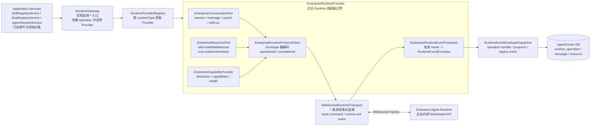
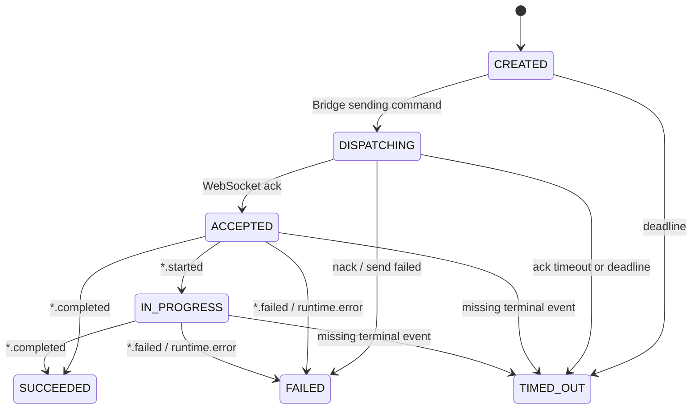

# Enterprise WebSocket Runtime Adapter Guide

> 状态：P6 接入指南 / 目标实现说明
> 最近更新：2026-05-08
> 目标读者：负责把企业内部 Agent Runtime 接入 AgentCenter Bridge 的后端工程师或 Agent

本文档说明：当企业内部 Agent Runtime 的对话、Skill 管理、MCP 管理、权限确认和事件通知都通过 WebSocket 通信时，如何在 AgentCenter Bridge 中新增一个 Runtime Adapter / Provider。

一句话目标：

```text
企业 Runtime 的 WebSocket 私有协议只进入 infrastructure provider；
Application 层继续只依赖 RuntimeGateway / RuntimeProvider / 统一 Envelope。
```

## 1. 接入边界

### 要做

- 新增一个企业 Runtime Provider，例如 `EnterpriseRuntimeProvider`。
- 新增或复用 WebSocket Transport，负责连接、发送 command、接收 ack/event、断线处理。
- 新增 Runtime 私有事件 translator，把企业 Runtime frame 转成 AgentCenter `RuntimeEventEnvelope`。
- 声明 Runtime 能力：conversation、skill lifecycle、mcp lifecycle、cancel、async operation。
- 用 `runtime_operation` 串起 Skill/MCP 等控制面命令的 `operationId`、ack、completed/failed event。
- 增加 fake WebSocket Runtime contract tests，本机不依赖真实企业 Runtime。

### 不做

- 不让前端直连企业 Runtime。
- 不在 application service 中出现企业 Runtime 的 URL、鉴权、私有 JSON 字段。
- 不把企业 Runtime 当成 AgentCenter 主数据源；平台会话、消息、资源、工作流、确认项仍由 AgentCenter DB 拥有。
- 不在 P6 第一版实现生产级横向扩展、resume token、全量事件溯源，除非企业 Runtime 已经要求。

## 2. 当前可复用边界

当前 Bridge 已经有这些抽象：

| 组件 | 代码位置 | 用途 |
|------|----------|------|
| `RuntimeGateway` | `application/runtime/RuntimeGateway.java` | 应用层唯一入口 |
| `RuntimeProvider` | `application/runtime/RuntimeProvider.java` | 聚合对话、资源、能力端口 |
| `ConversationRuntimePort` | `application/runtime/ConversationRuntimePort.java` | 会话、对话、skill run 数据面 |
| `RuntimeResourcePort` | `application/runtime/RuntimeResourcePort.java` | Skill/MCP 控制面 |
| `RuntimeCapabilities` | `application/runtime/RuntimeCapabilities.java` | Provider 能力声明 |
| `RuntimeCommandEnvelope` | `application/runtime/protocol/RuntimeCommandEnvelope.java` | Bridge -> Runtime 命令信封 |
| `RuntimeAckEnvelope` | `application/runtime/protocol/RuntimeAckEnvelope.java` | Runtime -> Bridge ack/nack 信封 |
| `RuntimeEventEnvelope` | `application/runtime/protocol/RuntimeEventEnvelope.java` | Runtime -> Bridge 统一事件信封 |
| `RuntimeCommandTransport` | `application/runtime/transport/RuntimeCommandTransport.java` | 命令发送 SPI |
| `RuntimeEventStreamTransport` | `application/runtime/transport/RuntimeEventStreamTransport.java` | 事件订阅 SPI |
| `WebSocketRuntimeTransport` | `infrastructure/runtime/websocket/WebSocketRuntimeTransport.java` | 当前统一 WebSocket transport 骨架 |
| `RuntimeOperationService` | `application/runtime/RuntimeOperationService.java` | `runtime_operation` 生命周期状态机 |
| `RuntimeEventEnvelopeDispatcher` | `application/runtime/translation/RuntimeEventEnvelopeDispatcher.java` | 统一事件分发、投影、operation 状态更新 |

P6 需要把 P5 中暂时固定的 `"default"` project id 和协议层 TODO 补齐：

- `RuntimeGateway` 的资源控制面方法应接收 `RuntimeOperationContext` 或至少接收 `projectId`。
- `RuntimeCommandEnvelope` 创建时必须带上 `operationId`、`idempotencyKey`、`projectId`。
- WebSocket ack/event 必须能通过 `operationId` 回写 `runtime_operation`。

## 3. 目标组件关系



## 4. 建议包结构

新增文件建议放在 `agentcenter-bridge/src/main/java/com/agentcenter/bridge/infrastructure/runtime/enterprise/`：

```text
enterprise/
  EnterpriseRuntimeProvider.java
  EnterpriseRuntimeProtocolClient.java
  EnterpriseRuntimeEventTranslator.java
  EnterpriseRuntimeConfig.java
  EnterpriseRuntimeProperties.java
  EnterpriseSessionRegistry.java
  EnterpriseOperationPayloadFactory.java
  EnterpriseRuntimeException.java

enterprise/transport/
  EnterpriseWebSocketTransport.java          # 如果通用 WebSocketRuntimeTransport 不够用再新增
  EnterpriseWebSocketConnectionManager.java  # 管理连接、重连、heartbeat、关闭
```

如果企业 Runtime 的 WebSocket frame 能直接使用 AgentCenter Envelope，可以优先复用 `WebSocketRuntimeTransport`。只有在以下情况才新增 `EnterpriseWebSocketTransport`：

- 企业 Runtime 的 ack/event frame 字段名和 AgentCenter Envelope 差异很大。
- 需要自定义认证握手、resume token、压缩、分片或二进制 payload。
- 需要按项目、workspace、安全上下文维护连接池。

## 5. 接入步骤

### Step 1：新增 RuntimeType

在 `RuntimeType` 中新增企业 Runtime 类型，例如：

```java
public enum RuntimeType {
    MOCK,
    OPENCODE,
    ENTERPRISE
}
```

如果企业内部命名暂时敏感，可以先用 `INTERNAL` 或 `FUTURE`，但最终应给出稳定枚举名，便于 DB、日志、审计和配置统一。

### Step 2：配置 WebSocket 连接参数

新增配置类，避免在 provider 中硬编码 URL 和 token：

```java
@ConfigurationProperties(prefix = "agentcenter.runtime.enterprise")
public record EnterpriseRuntimeProperties(
    URI websocketUri,
    String authTokenRef,
    Duration ackTimeout,
    Duration heartbeatInterval,
    Duration reconnectInitialDelay,
    Duration reconnectMaxDelay
) {}
```

配置示例：

```yaml
agentcenter:
  runtime:
    enterprise:
      websocket-uri: wss://runtime.internal.example.com/agentcenter/v1/ws
      auth-token-ref: secret://agent-runtime/bridge-token
      ack-timeout: 30s
      heartbeat-interval: 25s
      reconnect-initial-delay: 1s
      reconnect-max-delay: 30s
```

安全要求：

- token 从 secret reference 解析，不写入普通配置文件。
- WebSocket 必须使用 `wss://`，内网测试环境也建议走 TLS。
- `projectId`、workspace、user/tenant 信息由 Bridge 服务端绑定，不信任前端透传。

### Step 3：实现 Provider

`EnterpriseRuntimeProvider` 是企业 Runtime 的总入口，实现 `RuntimeProvider`。

```java
@Component
public class EnterpriseRuntimeProvider implements RuntimeProvider {

    private final EnterpriseRuntimeProtocolClient client;

    public EnterpriseRuntimeProvider(EnterpriseRuntimeProtocolClient client) {
        this.client = client;
    }

    @Override
    public RuntimeType runtimeType() {
        return RuntimeType.ENTERPRISE;
    }

    @Override
    public RuntimeDescriptor descriptor() {
        return new RuntimeDescriptor(
            "Enterprise Runtime",
            "WebSocket",
            "Enterprise internal Agent Runtime over WebSocket",
            capabilities()
        );
    }

    @Override
    public RuntimeCapabilities capabilities() {
        return new RuntimeCapabilities(
            true,
            true,
            true,
            true,
            RuntimeCapabilities.WEBSOCKET,
            RuntimeCapabilities.WEBSOCKET,
            RuntimeCapabilities.REMOTE_COMMAND,
            true
        );
    }

    // ConversationRuntimePort 与 RuntimeResourcePort 方法委托给 client
}
```

能力声明建议：

| 字段 | 企业 WebSocket Runtime 建议值 | 说明 |
|------|-------------------------------|------|
| `conversationStreaming` | `true` | 对话 delta/completed 走 WebSocket event |
| `skillLifecycle` | `true` | Skill install/delete/scan 走 WebSocket command |
| `mcpLifecycle` | `true` | MCP read/write/refresh 走 WebSocket command |
| `cancelSupported` | `true` | 支持 conversation 或 operation cancel |
| `commandTransport` | `WEBSOCKET` | 命令面全 WebSocket |
| `eventTransport` | `WEBSOCKET` | 事件面全 WebSocket |
| `resourceMutationMode` | `REMOTE_COMMAND` | 不写本地 `.opencode` 文件 |
| `supportsAsyncOperations` | `true` | ack 不等于最终成功 |

### Step 4：实现协议客户端

`EnterpriseRuntimeProtocolClient` 负责：

- 创建 `RuntimeCommandEnvelope`。
- 发送 command 并等待 ack/nack。
- 把 ack/nack 映射为 `runtime_operation` 的 `ACCEPTED` 或 `FAILED`。
- 把 WebSocket event 交给 translator 和 dispatcher。

建议核心方法：

```java
public class EnterpriseRuntimeProtocolClient {

    private final RuntimeCommandTransport commandTransport;
    private final RuntimeOperationService operationService;
    private final ObjectMapper objectMapper;

    public RuntimeAckEnvelope sendOperationCommand(
            RuntimeOperationEntity operation,
            String commandType,
            RuntimeType runtimeType,
            String agentSessionId,
            String runtimeSessionId,
            JsonNode payload) {

        RuntimeCommandEnvelope command = new RuntimeCommandEnvelope(
            RuntimeEnvelopeKind.COMMAND,
            RuntimeProtocolVersion.V1,
            commandType,
            UUID.randomUUID().toString(),
            null,
            operation.getId(),
            operation.getIdempotencyKey(),
            runtimeType,
            agentSessionId,
            runtimeSessionId,
            operation.getProjectId(),
            operation.getWorkItemId(),
            operation.getWorkflowInstanceId(),
            operation.getWorkflowNodeInstanceId(),
            payload,
            OffsetDateTime.now()
        );

        operationService.transition(operation.getId(), RuntimeOperationStatus.DISPATCHING);
        RuntimeAckEnvelope ack = commandTransport.send(command);

        if (ack.success()) {
            operationService.transition(operation.getId(), RuntimeOperationStatus.ACCEPTED);
        } else {
            operationService.transitionToFailed(operation.getId(), "RUNTIME_NACK", ack.message());
        }
        return ack;
    }
}
```

注意：

- WebSocket `ack` 只表示 Runtime 接收命令，不表示资源已经完成。
- `skill.install.completed`、`mcp.refresh.completed` 等 terminal event 才能把 operation 改为 `SUCCEEDED`。
- 同步返回成功的 Runtime 也可以直接 `DISPATCHING -> SUCCEEDED`，但企业 WebSocket Runtime 默认按异步处理。

### Step 5：实现资源控制面映射

Skill/MCP 命令推荐统一映射为 `RuntimeCommandTypes`：

| RuntimeGateway 语义 | Command type | 期望 ack | 期望 terminal event |
|---------------------|--------------|----------|---------------------|
| install skill | `skill.install` | ack accepted | `skill.install.completed` / `skill.install.failed` |
| delete skill | `skill.delete` | ack accepted | `skill.delete.completed` / `skill.delete.failed` |
| scan skills | `skill.scan` | ack accepted 或 immediate payload | `skill.changed` 或 scan result payload |
| read MCP config | `mcp.read_config` | ack with payload | 可同步完成 |
| write MCP config | `mcp.write_config` | ack accepted | `mcp.config.updated` / `runtime.error` |
| refresh MCP tools | `mcp.refresh` | ack accepted | `mcp.refresh.completed` / `mcp.refresh.failed` |
| run skill | `skill.run` | ack accepted | `skill.run.started/completed/failed` |

payload 示例：

```json
{
  "protocol": "agentcenter.runtime.v1",
  "kind": "COMMAND",
  "type": "skill.install",
  "messageId": "cmd_01J000000000000000000001",
  "correlationId": null,
  "operationId": "op_01J000000000000000000001",
  "idempotencyKey": "project-a:skill.install:prd-design:sha256-abcd",
  "runtimeType": "ENTERPRISE",
  "agentSessionId": null,
  "runtimeSessionId": null,
  "projectId": "project-a",
  "payload": {
    "skillName": "prd-design",
    "packageUri": "agentcenter://runtime-skills/project-a/prd-design.zip",
    "checksum": "sha256-abcd",
    "createdBy": "user-001"
  },
  "createdAt": "2026-05-08T11:00:00Z"
}
```

### Step 6：实现对话数据面映射

对话命令：

| 语义 | Command type | 说明 |
|------|--------------|------|
| 创建或恢复会话 | `session.ensure` | 返回 runtime session id |
| 发送用户消息 | `conversation.message.send` | payload 包含 parts/text/context |
| 取消会话或输出 | `conversation.cancel` | payload 包含 cancel reason |

事件：

| Runtime event | AgentCenter event | 投影 |
|---------------|-------------------|------|
| token/delta | `conversation.delta` | 前端实时展示，可丢失后 replay |
| final assistant message | `conversation.completed` | 权威 assistant message |
| tool start | `tool.started` | runtime event / tool trace |
| tool complete | `tool.completed` | runtime event / tool trace |
| permission request | `permission.requested` | 创建 confirmation request |
| runtime error | `runtime.error` | 错误事件、必要时失败 operation |

对话类事件通常不必全部进入 `runtime_operation`，除非它们本身代表一个长操作，如 `skill.run` 或工作流节点执行。

### Step 7：实现事件翻译器

企业 Runtime 私有 frame 示例：

```json
{
  "event": "agent.token",
  "id": "evt-1001",
  "session": "rt-ses-001",
  "op": "op_01J000000000000000000001",
  "data": {
    "text": "增量文本"
  },
  "time": "2026-05-08T11:00:02Z"
}
```

翻译后：

```json
{
  "kind": "EVENT",
  "type": "conversation.delta",
  "messageId": "evt-1001",
  "correlationId": null,
  "operationId": "op_01J000000000000000000001",
  "runtimeType": "ENTERPRISE",
  "agentSessionId": "ags_001",
  "runtimeSessionId": "rt-ses-001",
  "projectId": "project-a",
  "payload": {
    "delta": "增量文本"
  },
  "createdAt": "2026-05-08T11:00:02Z"
}
```

翻译器职责：

- 做字段映射，不写 DB。
- 补齐 `runtimeType`、`agentSessionId`、`runtimeSessionId`、`projectId`。
- 对未知事件转成 `runtime.status.changed` 或安全忽略，并记录 debug/warn。
- 对错误事件统一转 `runtime.error`，payload 中保留 `errorCode`、`message`、`recoverable`。

### Step 8：注册事件订阅

WebSocket transport 收到 event 后应走统一 dispatcher：

```java
transport.subscribe(new RuntimeEventSink() {
    @Override
    public void onEvent(RuntimeRawEvent rawEvent) {
        List<RuntimeEventEnvelope> envelopes = translator.translate(rawEvent, context);
        dispatcher.dispatch(envelopes);
    }

    @Override
    public void onError(RuntimeTransportException error) {
        // log and emit runtime.error if it affects a known session or operation
    }

    @Override
    public void onClose() {
        // mark connection unavailable, trigger reconnect policy
    }
});
```

不要让 WebSocket listener 直接写 `agent_message`、`runtime_operation` 或 Skill/MCP 表。统一事件必须先经过 translator，再由 dispatcher / projector / operation handler 处理。

## 6. WebSocket 连接生命周期

企业 Runtime Provider 推荐按以下 key 维护连接：

```text
runtimeType + projectId + workspaceId/securityContext
```

第一版如果企业 Runtime 是单租户或单环境，也可以先全局一条连接，但代码结构要保留扩展点。

### 连接状态

| 状态 | 含义 | 行为 |
|------|------|------|
| `DISCONNECTED` | 尚未连接或已关闭 | 允许 connect |
| `CONNECTING` | 正在握手 | 阻止重复 connect |
| `READY` | 可发送命令 | 正常 send/subscribe |
| `DEGRADED` | 可接收但部分功能不可用 | fail fast 控制面命令 |
| `RECONNECTING` | 断线恢复中 | queue 或 reject 新命令 |
| `CLOSED` | 主动关闭 | 清理资源，不自动重连 |

这些是 provider 内部连接状态，不是 `runtime_operation.status`。不要混用。

### 心跳

- Bridge 定期发送 ping 或 `runtime.health_check`。
- Runtime 必须在超时内返回 pong/ack。
- 连续失败达到阈值后关闭连接并进入 reconnect。

### 重连

建议策略：

- 指数退避：1s、2s、4s，最大 30s。
- 加 jitter，避免多实例同时重连。
- 重连成功后发送 `resume` 或 `runtime.health_check`。
- 如果 Runtime 支持 cursor/resume token，带上 `lastEventId` 补事件。
- 如果不支持 resume，Bridge 只能依赖 DB 中 non-terminal operation 的 timeout/reconcile。

### 背压

- 限制单连接 pending ack 数量。
- 限制单 session delta buffer。
- 对控制面命令设置 ack timeout。
- 大 payload 用 `artifactUri` / `packageUri`，不要把大文件直接塞入 WebSocket frame。

## 7. Operation 状态约定

企业 WebSocket Runtime 的控制面命令必须使用 `runtime_operation`：



实现要求：

- command 创建前先创建 operation。
- command envelope 必须带 `operationId`。
- ack 只能推进到 `ACCEPTED`，不能直接代表 `SUCCEEDED`。
- completed/failed event 必须带 `operationId`；如果 Runtime 不支持，Provider 需要用 `correlationId` 或 resource key 做保守匹配。
- terminal 状态不可被晚到事件覆盖；晚到事件可以记录到未来的 operation event history。

## 8. Idempotency 约定

控制面命令都必须提供 `idempotencyKey`。建议格式：

```text
{projectId}:{runtimeType}:{operationType}:{resourceType}:{resourceId}:{versionOrChecksum}
```

示例：

```text
project-a:ENTERPRISE:skill.install:skill:prd-design:sha256-abcd
project-a:ENTERPRISE:mcp.write_config:mcp:mcp_config:sha256-1234
project-a:ENTERPRISE:mcp.refresh:mcp:mcp_config:20260508T110000Z
```

规则：

- 同一 idempotency key 重试应返回已有 operation。
- 如果已有 operation 是 terminal success，调用方可以复用成功结果或查询资源投影。
- 如果已有 operation 是 failed/timed out，是否允许新建 operation 要由 P6 策略明确，不要偷偷覆盖。

## 9. 测试策略

真实企业 Runtime 暂时不能在本机验证时，必须用 fake WebSocket Runtime 做 contract tests。

建议测试：

| 测试 | 必须覆盖 |
|------|----------|
| `EnterpriseRuntimeProviderTest` | capability、descriptor、runtimeType |
| `EnterpriseWebSocketTransportTest` | send command、ack correlation、event delivery、timeout、malformed frame |
| `EnterpriseRuntimeProtocolClientTest` | operationId/idempotency/projectId 进入 command envelope |
| `EnterpriseRuntimeEventTranslatorTest` | 私有 event -> `RuntimeEventEnvelope` |
| `EnterpriseRuntimeOperationContractTest` | CREATED -> DISPATCHING -> ACCEPTED -> SUCCEEDED/FAILED |
| `EnterpriseRuntimeReconnectTest` | close/error 后 pending ack 失败或可恢复 |
| `RuntimeProviderRegistryTest` | `RuntimeType.ENTERPRISE` 能被 registry 找到 |

Fake Runtime 行为：

```text
1. 接收 command frame。
2. 立即返回 ACK，correlationId = command.messageId，operationId = command.operationId。
3. 对 skill/mcp 命令延迟发送 started/completed 或 failed event。
4. 支持注入 nack、timeout、connection close、malformed frame。
```

最低验收命令：

```bash
cd agentcenter-bridge
./mvnw test
./mvnw clean package
```

边界审计：

```bash
rg -n "enterprise|Enterprise|wss://|websocketUri" \
  agentcenter-bridge/src/main/java/com/agentcenter/bridge/application

rg -n "operationId|idempotencyKey|projectId" \
  agentcenter-bridge/src/main/java/com/agentcenter/bridge/infrastructure/runtime/enterprise \
  agentcenter-bridge/src/test/java/com/agentcenter/bridge/infrastructure/runtime/enterprise
```

第一条审计中，application 层不应出现企业 Runtime 私有 URL、鉴权、frame 字段；只允许通用 enum、capability 或接口引用。

## 10. 常见陷阱

| 陷阱 | 后果 | 正确做法 |
|------|------|----------|
| 把 WebSocket ack 当成功 | Skill/MCP 尚未生效但平台显示成功 | ack -> `ACCEPTED`，completed event -> `SUCCEEDED` |
| 前端直连企业 Runtime | 认证、审计、权限绕过 Bridge | 前端只连 Java Bridge |
| 在 application service 解析企业 frame | Runtime 私有协议泄漏 | frame 只在 enterprise provider/translator 内解析 |
| 不带 operationId | ack/event 无法可靠回写 operation | command、ack、event 都必须带 operationId |
| 不带 idempotencyKey | 重试可能重复安装/删除资源 | 控制面命令必须生成稳定幂等键 |
| 大文件走 WebSocket frame | 内存暴涨、连接阻塞 | 用 packageUri/artifactUri 引用对象存储或平台资源 |
| 不做 heartbeat | 半开连接导致 pending command 挂死 | ping/pong + ack timeout + reconnect |
| 多实例无 sticky/resume 策略 | 事件丢失或重复 | 第一版单实例验证，生产前补 sticky/resume/pub-sub |

## 11. P6 推荐拆分

### P6.1 Runtime Operation Context

新增 `RuntimeOperationContext`，替换当前资源控制面中临时 `"default"` project id：

```java
public record RuntimeOperationContext(
    String projectId,
    String createdBy,
    String idempotencyKey,
    String workItemId,
    String workflowInstanceId,
    String workflowNodeInstanceId
) {}
```

资源控制面方法建议演进为：

```java
String installSkill(RuntimeType runtimeType, RuntimeOperationContext context, String skillName, Path sourceDir);
void deleteSkillFiles(RuntimeType runtimeType, RuntimeOperationContext context, String relativePath, String skillName);
void writeMcpConfig(RuntimeType runtimeType, RuntimeOperationContext context, Map<String, Object> config);
void refreshMcps(RuntimeType runtimeType, RuntimeOperationContext context);
```

### P6.2 Protocol Envelope Completion

- 增加 `RuntimeCommandEnvelope.command(...)` 工厂方法，要求显式传入 `operationId`、`idempotencyKey`、`projectId`。
- 禁止控制面命令使用当前 `of(...)` 空 operation 工厂。
- ack/nack 工厂方法带回 `operationId`。

### P6.3 Enterprise Provider Skeleton

- 新增 `RuntimeType.ENTERPRISE`。
- 新增 provider、protocol client、translator、config。
- 使用 fake WebSocket Runtime 完成 contract tests。

### P6.4 Real Runtime Dry Run

真实企业 Runtime 可用后再做：

- 鉴权握手。
- session ensure。
- conversation message send。
- skill install/delete。
- mcp write/refresh。
- reconnect/resume。
- 观测指标和审计核对。

## 12. Done Criteria

企业 WebSocket Runtime Adapter 接入完成的判断标准：

- `RuntimeProviderRegistry` 能按 `RuntimeType.ENTERPRISE` 选择 provider。
- Provider capabilities 声明全 WebSocket、远程资源命令、支持异步 operation。
- Skill/MCP 控制面 command 带 `projectId`、`operationId`、`idempotencyKey`。
- ack/nack 能更新 `runtime_operation`。
- completed/failed event 能更新 `runtime_operation` 到 terminal 状态。
- 对话 delta/completed 能通过统一 dispatcher 投影到平台消息/事件。
- application 层没有企业 Runtime 私有协议泄漏。
- fake WebSocket Runtime contract tests 通过。
- `./mvnw test` 与 `./mvnw clean package` 通过。
