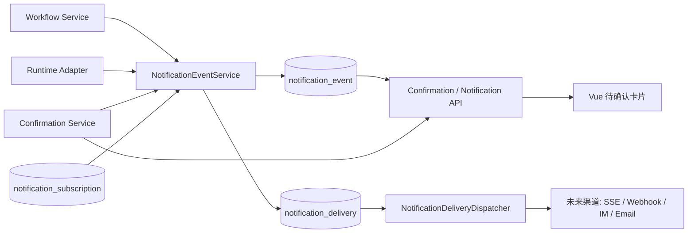
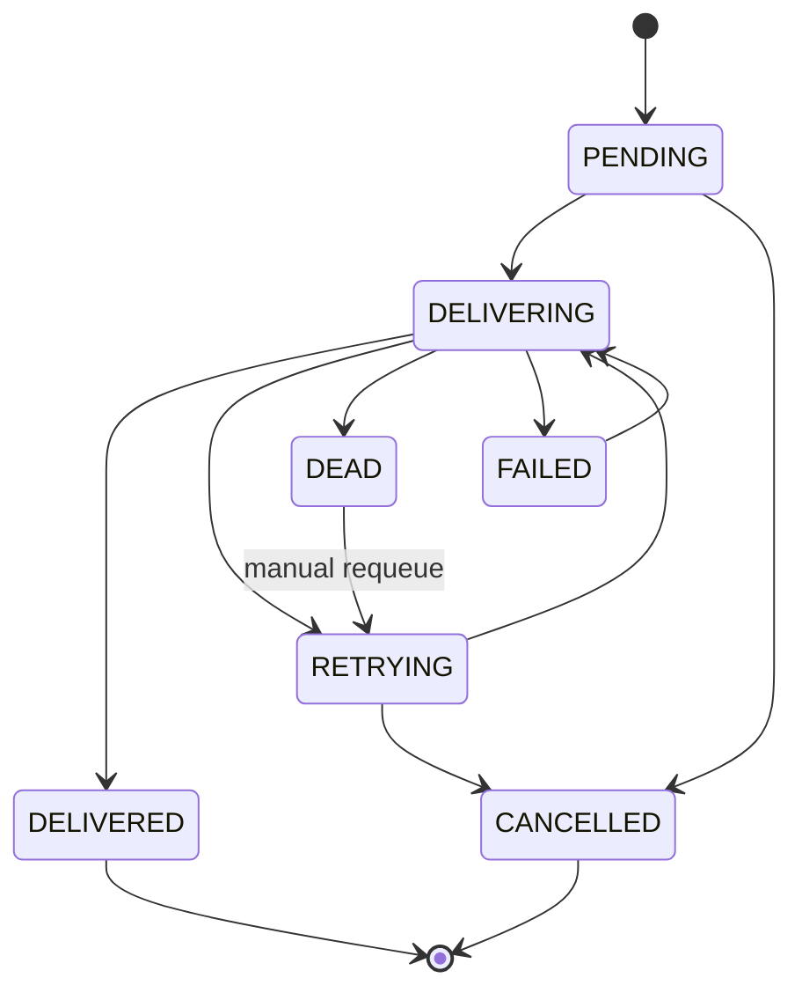

# Event Notification Model and Confirmation Card Design

> 状态：目标态设计 / 待实施
> 最近更新：2026-05-19
> 目标读者：AgentCenter Bridge、Workflow、Runtime Adapter、Vue 工作台、后续消息渠道实现者

---

## 1. 设计结论

AgentCenter 需要把“工作流发生了什么”和“通过什么渠道通知用户”拆开。

本设计新增一套面向业务通知的事件模型：

```text
notification_event
  记录已经发生、可回放、可审计的业务通知事实。

notification_delivery
  记录某个 notification_event 通过某个渠道投递给某个目标的状态、重试和补偿。

notification_subscription
  记录谁订阅哪些事件，以及未来要投递到哪些渠道。
```

当前阶段前端只实现和完善右侧待确认卡片，不改顶部通知、气泡提示和其他通知渠道。待确认卡片继续以 `confirmation_request` 作为用户动作真源，但卡片展示能力由统一的 `NotificationCardViewModel` 驱动，并从 `notification_event.card_schema_json` 或后端投影 DTO 中获得更完整的解释信息。

核心边界：

```text
runtime_event
  会话执行流、Runtime 原始进度、SSE 回放顺序。

confirmation_request
  待确认、审批、补充信息、权限请求、异常处理的动作真源。

notification_event
  用户可感知的业务通知事实和稳定展示快照。

notification_delivery
  面向不同渠道的投递账本、重试补偿和死信管理。
```

`notification_event` 不驱动工作流状态，工作流仍以 `workflow_instance`、`workflow_node_instance`、`confirmation_request` 和 Runtime 回调为真源。它负责把这些事实统一投影成可订阅、可展示、可补偿的消息事件。

---

## 2. 当前问题

### 2.1 展示问题

右侧待确认卡片当前只展示：

- 确认类型。
- 处理状态。
- 工作项编号、类型和标题。
- 节点名。
- 一个“处理”按钮。

这不足以让用户判断：

- 这是哪个任务、哪个工作流节点、哪个运行来源触发的。
- 为什么现在需要我确认。
- 申请了什么权限或需要什么输入。
- 每个动作会造成什么后果。
- 当前工作流执行到了哪里。
- 如果不处理，工作流会卡在哪里。

### 2.2 后端事件问题

当前已有 `runtime_event`、`confirmation_request` 和早期 `outbox_event`：

- `runtime_event` 适合会话执行流、Runtime 输出和 SSE 回放，但它是运行过程视角，不适合作为所有业务通知渠道的统一事实源。
- `confirmation_request` 是待确认动作真源，但它只表达“需要处理的交互”，不能覆盖工作流节点状态、测试失败、冲突、发布审批、产物覆盖等通知事实。
- `outbox_event` 只有 aggregate、payload、status、retry_count，缺少渠道目标、锁、下次重试时间、死信状态、幂等键和投递结果，不足以支撑多消息渠道。

所以需要新增一层通知事件模型，而不是继续把所有通知塞进 `runtime_event` 或 `confirmation_request`。

---

## 3. 范围

### 3.1 本轮要做

后端设计：

- 统一事件通知事实表 `notification_event`。
- 渠道投递账本 `notification_delivery`。
- 订阅配置模型 `notification_subscription`。
- 读状态模型 `notification_read_state`，作为前端通知中心和已读能力的未来扩展点。
- 事件类型、严重级别、生命周期、幂等键、重试补偿和死信策略。
- 与 `runtime_event`、`confirmation_request`、Workflow、SSE 的边界。

前端设计：

- 只完善待确认卡片组件，不改其他通知渠道 UI。
- 抽象 `ConfirmationCardViewModel`。
- 支持多场景卡片：LLD 审阅、目录权限、Runtime 中断、信息补充、测试失败、产物覆盖、合并冲突、发布审批。
- 卡片展示当前工作流节点图、任务上下文、触发原因、目的、权限范围、影响后果和动作解释。

### 3.2 本轮不做

- 不引入 MQ、Kafka、Redis Stream 或新的消息中间件。
- 不把 SSE 改成 WebSocket，也不替换现有 Runtime SSE。
- 不实现外部 IM、邮件、Webhook 的真实发送。
- 不改顶部通知中心、右侧气泡提示、全局 notification store 的视觉形态。
- 不让 `notification_event` 成为工作流状态机真源。
- 不让前端直接调用 Runtime。

---

## 4. 目标架构



设计原则：

1. 业务事实先落库，再考虑投递。
2. 一个事件可以投递到多个渠道，一个渠道失败不影响事件事实。
3. 待确认动作仍由 `confirmation_request` 处理，通知事件只提供展示快照和订阅能力。
4. 前端卡片先消费稳定 view model，不直接拼底层 payload。
5. 投递是 at-least-once，消费者必须按 `event_id` 或 `idempotency_key` 去重。

---

## 5. 领域模型

### 5.1 NotificationEvent

`notification_event` 是不可变或近似不可变的业务通知事实。它回答“发生了什么、属于哪个任务/节点、用户为什么需要知道”。

建议字段：

| 字段 | 类型 | 说明 |
|------|------|------|
| `id` | TEXT PK | 通知事件 ID |
| `seq_no` | INTEGER UNIQUE | 全局递增序号，用于 API/SSE 回放游标 |
| `idempotency_key` | TEXT UNIQUE | 幂等键，防止同一事实重复落库 |
| `event_type` | TEXT | 细粒度事件类型 |
| `event_category` | TEXT | `WORKFLOW` / `CONFIRMATION` / `RUNTIME` / `ARTIFACT` / `QUALITY` / `RELEASE` / `SYSTEM` |
| `severity` | TEXT | `INFO` / `SUCCESS` / `WARNING` / `ERROR` / `CRITICAL` |
| `priority` | TEXT | `LOW` / `MEDIUM` / `HIGH` / `URGENT` |
| `visibility` | TEXT | `USER_VISIBLE` / `INTERNAL` / `AUDIT_ONLY` |
| `lifecycle_status` | TEXT | `ACTIVE` / `RESOLVED` / `CANCELLED` / `EXPIRED` |
| `project_id` | TEXT | 项目作用域 |
| `space_id` | TEXT | 空间作用域 |
| `iteration_id` | TEXT | 迭代作用域 |
| `work_item_id` | TEXT | 工作项 |
| `workflow_instance_id` | TEXT | 工作流实例 |
| `workflow_node_instance_id` | TEXT | 工作流节点实例 |
| `agent_session_id` | TEXT | 会话 ID |
| `runtime_event_id` | TEXT | 关联 Runtime 事件 |
| `confirmation_request_id` | TEXT | 关联待确认项 |
| `artifact_id` | TEXT | 关联产物 |
| `actor_type` | TEXT | `USER` / `SYSTEM` / `RUNTIME` / `WORKFLOW` |
| `actor_id` | TEXT | 触发者 ID |
| `title` | TEXT | 用户可见标题 |
| `summary` | TEXT | 一行摘要 |
| `body` | TEXT | 详细说明 |
| `card_schema_json` | TEXT | 前端卡片稳定展示快照 |
| `payload_json` | TEXT | 结构化原始上下文 |
| `occurred_at` | TEXT | 事实发生时间 |
| `available_at` | TEXT | 最早可展示/投递时间 |
| `expires_at` | TEXT | 过期时间 |
| `created_at` | TEXT | 落库时间 |
| `updated_at` | TEXT | 状态更新时间 |

索引建议：

```sql
CREATE UNIQUE INDEX idx_notification_event_idempotency
  ON notification_event(idempotency_key);

CREATE INDEX idx_notification_event_seq
  ON notification_event(seq_no);

CREATE INDEX idx_notification_event_scope
  ON notification_event(project_id, space_id, iteration_id, seq_no);

CREATE INDEX idx_notification_event_work_item
  ON notification_event(work_item_id, seq_no);

CREATE INDEX idx_notification_event_confirmation
  ON notification_event(confirmation_request_id);

CREATE INDEX idx_notification_event_active
  ON notification_event(lifecycle_status, visibility, priority, seq_no);
```

### 5.2 NotificationDelivery

`notification_delivery` 是投递账本。它回答“某个事件是否已经通过某个渠道通知给某个目标，失败了要怎么补偿”。

建议字段：

| 字段 | 类型 | 说明 |
|------|------|------|
| `id` | TEXT PK | 投递记录 ID |
| `notification_event_id` | TEXT | 关联事件 |
| `channel_type` | TEXT | `IN_APP_CONFIRMATION_CARD` / `SSE` / `WEBHOOK` / `IM` / `EMAIL` |
| `channel_target` | TEXT | 用户、角色、会话、URL、群组等目标 |
| `subscription_id` | TEXT | 来源订阅 |
| `status` | TEXT | `PENDING` / `DELIVERING` / `DELIVERED` / `RETRYING` / `FAILED` / `DEAD` / `CANCELLED` |
| `attempt_count` | INTEGER | 已尝试次数 |
| `max_attempts` | INTEGER | 最大尝试次数 |
| `next_retry_at` | TEXT | 下次可重试时间 |
| `locked_at` | TEXT | 当前处理锁时间 |
| `locked_by` | TEXT | 当前处理者 |
| `delivered_at` | TEXT | 成功投递时间 |
| `last_error_code` | TEXT | 最近失败码 |
| `last_error_message` | TEXT | 最近失败原因 |
| `response_payload_json` | TEXT | 渠道返回摘要 |
| `created_at` | TEXT | 创建时间 |
| `updated_at` | TEXT | 更新时间 |

约束和索引：

```sql
CREATE UNIQUE INDEX idx_notification_delivery_once
  ON notification_delivery(notification_event_id, channel_type, channel_target);

CREATE INDEX idx_notification_delivery_due
  ON notification_delivery(status, next_retry_at);

CREATE INDEX idx_notification_delivery_event
  ON notification_delivery(notification_event_id);
```

### 5.3 NotificationSubscription

`notification_subscription` 是订阅配置。第一阶段可以只提供默认系统订阅，后续再开放 UI 配置。

建议字段：

| 字段 | 类型 | 说明 |
|------|------|------|
| `id` | TEXT PK | 订阅 ID |
| `subscriber_type` | TEXT | `USER` / `ROLE` / `TEAM` / `SYSTEM` |
| `subscriber_id` | TEXT | 订阅主体 |
| `channel_type` | TEXT | 渠道类型 |
| `channel_target` | TEXT | 渠道目标 |
| `filter_json` | TEXT | 事件过滤条件 |
| `enabled` | INTEGER | 是否启用 |
| `created_at` | TEXT | 创建时间 |
| `updated_at` | TEXT | 更新时间 |

默认订阅：

```text
USER_VISIBLE + CONFIRMATION + ACTIVE
  -> IN_APP_CONFIRMATION_CARD

USER_VISIBLE + WORKFLOW + HIGH/URGENT
  -> SSE, 后续可扩展到 IM/Webhook
```

### 5.4 NotificationReadState

`notification_read_state` 用于未来通知中心、已读、忽略和个人视角。待确认卡片第一阶段不依赖它。

建议字段：

| 字段 | 类型 | 说明 |
|------|------|------|
| `notification_event_id` | TEXT | 事件 ID |
| `user_id` | TEXT | 用户 ID |
| `read_at` | TEXT | 已读时间 |
| `dismissed_at` | TEXT | 忽略时间 |
| `created_at` | TEXT | 创建时间 |

主键：

```sql
PRIMARY KEY (notification_event_id, user_id)
```

---

## 6. 事件类型

事件类型分为“状态变化”、“需要动作”、“完成/解除”和“异常”。

### 6.1 Workflow

| 类型 | 何时产生 | 是否通常展示 |
|------|----------|--------------|
| `WORKFLOW_STARTED` | 工作流启动 | 是 |
| `WORKFLOW_NODE_STARTED` | 节点开始执行 | 可选 |
| `WORKFLOW_NODE_WAITING_CONFIRMATION` | 节点等待用户确认 | 是 |
| `WORKFLOW_NODE_COMPLETED` | 节点完成 | 可选 |
| `WORKFLOW_NODE_FAILED` | 节点失败 | 是 |
| `WORKFLOW_BLOCKED` | 工作流被确认、异常或依赖阻塞 | 是 |
| `WORKFLOW_RESUMED` | 用户处理后继续执行 | 是 |
| `WORKFLOW_COMPLETED` | 工作流完成 | 是 |

### 6.2 Confirmation

| 类型 | 何时产生 | 关联 |
|------|----------|------|
| `CONFIRMATION_CREATED` | 创建待确认项 | `confirmation_request_id` |
| `CONFIRMATION_ENTERED` | 用户进入会话处理 | `confirmation_request_id` |
| `CONFIRMATION_RESOLVED` | 用户通过、选择、补充、重试或跳过 | `confirmation_request_id` |
| `CONFIRMATION_REJECTED` | 用户拒绝 | `confirmation_request_id` |
| `CONFIRMATION_EXPIRED` | 超时过期 | `confirmation_request_id` |

### 6.3 Runtime

| 类型 | 何时产生 | 说明 |
|------|----------|------|
| `RUNTIME_PERMISSION_REQUIRED` | Runtime 请求权限 | 待确认卡片展示权限目的和范围 |
| `RUNTIME_RECOVERY_REQUIRED` | Runtime 执行中断，需要用户选择恢复方式 | 展示补充指令、防呆重试、跳过 |
| `RUNTIME_RECOVERY_FAILED` | 自动恢复失败 | 可升级为异常卡片 |
| `RUNTIME_CONTEXT_RESTORED` | 状态补拉或上下文恢复完成 | 一般不进入待确认 |

### 6.4 Artifact / Quality / Release

| 类型 | 何时产生 | 说明 |
|------|----------|------|
| `ARTIFACT_REVIEW_REQUIRED` | 产物需要审阅 | LLD/PRD/报告审阅 |
| `ARTIFACT_OVERWRITE_REQUIRED` | 将覆盖已有产物 | 展示旧版本、新版本、影响范围 |
| `QUALITY_TEST_FAILED` | 测试或验证失败 | 展示失败摘要、重试和跳过后果 |
| `MERGE_CONFLICT_REQUIRED` | 代码合并冲突 | 展示冲突文件、建议处理路径 |
| `RELEASE_APPROVAL_REQUIRED` | 发布前审批 | 展示环境、风险、回滚说明 |

---

## 7. 事件 Payload 合同

`notification_event.payload_json` 用于后端和渠道适配器，`card_schema_json` 用于前端稳定展示。两者不要混用。

### 7.1 基础 Payload

```json
{
  "eventType": "RUNTIME_PERMISSION_REQUIRED",
  "source": {
    "type": "OPENCODE_RUNTIME",
    "runtimeEventId": "evt_123",
    "operationId": "op_456"
  },
  "workItem": {
    "id": "wi_1",
    "code": "FE-1021",
    "type": "FE",
    "title": "登录页重构"
  },
  "workflow": {
    "instanceId": "wf_1",
    "nodeInstanceId": "node_2",
    "nodeName": "LLD",
    "nodeStatus": "WAITING_CONFIRMATION"
  },
  "confirmation": {
    "id": "confirm_1",
    "requestType": "PERMISSION",
    "status": "PENDING"
  }
}
```

### 7.2 卡片 Schema

```ts
type NotificationCardViewModel = {
  schemaVersion: 1
  cardType:
    | 'ARTIFACT_REVIEW'
    | 'PERMISSION_REQUEST'
    | 'RUNTIME_RECOVERY'
    | 'INPUT_REQUIRED'
    | 'QUALITY_FAILURE'
    | 'ARTIFACT_OVERWRITE'
    | 'MERGE_CONFLICT'
    | 'RELEASE_APPROVAL'
  eventId?: string
  confirmationId: string
  priority: 'LOW' | 'MEDIUM' | 'HIGH' | 'URGENT'
  severity: 'INFO' | 'SUCCESS' | 'WARNING' | 'ERROR' | 'CRITICAL'
  status: 'PENDING' | 'IN_CONVERSATION' | 'RESOLVED' | 'REJECTED' | 'EXPIRED'
  title: string
  subtitle: string
  compactSummary: string
  createdAt: string
  workItem: {
    id?: string
    code?: string
    type?: string
    title?: string
  }
  workflow: {
    instanceId?: string
    currentNodeInstanceId?: string
    currentNodeName?: string
    currentNodeStatus?: string
    trail: Array<{
      key: string
      name: string
      status: 'done' | 'running' | 'waiting' | 'failed' | 'pending'
      current?: boolean
    }>
  }
  explanation: {
    reason: string
    purpose?: string
    requestedCapability?: string
    permissionScope?: string
    impact?: string
    recommendation?: string
    consequenceIfIgnored?: string
  }
  facts: Array<{
    label: string
    value: string
    tone?: 'neutral' | 'info' | 'warning' | 'danger'
  }>
  actions: Array<{
    id: string
    label: string
    actionType: string
    variant: 'primary' | 'secondary' | 'danger'
    recommended?: boolean
    consequence: string
  }>
  refs: {
    runtimeEventId?: string
    artifactId?: string
    sessionId?: string
  }
}
```

### 7.3 卡片信息层级

待确认卡片必须按下面顺序展示：

1. 事件性质：审阅、权限、异常、测试失败、冲突、发布审批。
2. 任务和节点：`FE-1021 登录页重构 · LLD 节点`。
3. 工作流位置：节点图，例如 `PRD 已完成 -> HLD 已完成 -> LLD 当前等待 -> 实现 未开始`。
4. 为什么需要用户：触发原因、目的、需要判断的问题。
5. 影响和后果：批准/拒绝/补充/重试分别会怎样。
6. 动作按钮：主动作、次动作、危险动作。

不要只展示“OpenCode 请求访问目录”这种底层事件名。

---

## 8. 典型卡片场景

### 8.1 LLD 审阅

```text
标题：FE-1021 · 审阅 LLD 草稿
副标题：登录页重构 · LLD 节点 · 当前卡在方案确认
节点图：PRD 已完成 -> HLD 已完成 -> LLD 当前等待 -> 实现 未开始
原因：LLD 草稿已生成，需要确认表单状态、错误通知和企业 SSO 回归验证是否足以进入实现。
动作：
  通过并进入实现：继续生成实现计划。
  补充约束：把约束写回 LLD 后重新生成。
  重新生成：废弃当前草稿并重跑 LLD。
```

### 8.2 目录权限

```text
标题：FE-1021 · 申请目录访问权限
副标题：登录页重构 · LLD 节点 · OpenCode Runtime
节点图：PRD 已完成 -> HLD 已完成 -> LLD 当前申请权限 -> 实现 未开始
目的：读取受保护测试目录，补齐企业 SSO 回归验证材料。
权限：只读访问 runtime-workspace/.opencode/skills/protected
影响：允许一次只影响当前请求；始终允许会在当前 Runtime 会话内复用；拒绝会导致该验证分支无法继续。
动作：
  允许一次：当前请求继续。
  始终允许：本会话同类请求自动允许。
  拒绝：Runtime 收到拒绝并进入替代路径。
```

### 8.3 Runtime 执行中断

```text
标题：FE-1021 · Runtime 执行中断
副标题：LLD 节点 · Bridge 已做安全自动重试
原因：Runtime 输出断流或 adapter 返回可恢复错误。
当前状态：节点仍保留在 WAITING_CONFIRMATION。
动作：
  补充指令继续：用户给出恢复指令后继续。
  防呆重试：使用相同上下文重试一次。
  跳过：标记当前分支跳过并进入后续节点。
```

### 8.4 信息补充

```text
标题：FE-1021 · 需要补充登录策略
副标题：HLD 节点 · 缺少企业 SSO 例外条件
原因：设计无法判断是否允许密码登录兜底。
动作：
  提交补充信息：把用户答案回传 Runtime。
  进入会话：打开上下文继续讨论。
  拒绝：终止当前提问并保留节点等待。
```

### 8.5 测试失败

```text
标题：FE-1021 · 验证失败需要处理
副标题：实现节点 · npm run test 失败
原因：登录表单错误态测试未通过。
影响：继续推进会让产物进入不可信状态。
动作：
  重试修复：回到实现节点继续修复。
  补充约束：给出新的测试期望。
  跳过：记录风险并继续后续流程。
```

### 8.6 产物覆盖

```text
标题：FE-1021 · 将覆盖 LLD 产物
副标题：LLD 节点 · 已存在 FE-1021-LLD.md
原因：用户要求重新生成 LLD，会覆盖当前版本。
动作：
  覆盖并保留版本：生成新版本并归档旧版本。
  另存为新草稿：不覆盖当前正式产物。
  取消：保持当前产物不变。
```

### 8.7 合并冲突

```text
标题：FE-1021 · 合并冲突需要确认
副标题：实现节点 · 3 个文件存在冲突
原因：当前分支和远程 1026 分支同时修改了登录页状态处理。
动作：
  使用当前分支优先：保留本地实现。
  使用远程优先：以远程为准重新适配。
  进入会话处理：打开冲突文件和上下文。
```

### 8.8 发布审批

```text
标题：FE-1021 · 发布前审批
副标题：Release 节点 · staging -> production
原因：验证通过，但生产发布需要人工审批。
影响：通过后触发部署；拒绝则工作流停留在 Release 节点。
动作：
  批准发布：进入部署。
  延后发布：保留待确认。
  拒绝发布：记录原因并阻断发布。
```

---

## 9. 后端服务设计

### 9.1 NotificationEventService

职责：

- 接收 Workflow、Runtime、Confirmation 产生的领域通知事实。
- 生成 `idempotency_key`。
- 写入 `notification_event`。
- 根据订阅规则创建 `notification_delivery`。
- 返回事件 ID 和 seq 游标。

核心接口草案：

```java
public interface NotificationEventService {
    NotificationEventDto record(NotificationEventCommand command);
    Optional<NotificationEventDto> findById(String id);
    List<NotificationEventDto> replay(NotificationReplayQuery query);
    void resolveLinkedConfirmation(String confirmationRequestId, NotificationResolution resolution);
}
```

幂等键建议：

```text
confirmation created:
  confirmation:{confirmationRequestId}:created

confirmation resolved:
  confirmation:{confirmationRequestId}:resolved:{resolvedAt}

workflow node waiting:
  workflow-node:{workflowNodeInstanceId}:waiting-confirmation:{confirmationRequestId}

runtime permission:
  runtime-permission:{runtimeSessionId}:{interactionId}

artifact overwrite:
  artifact-overwrite:{workItemId}:{artifactPath}:{targetVersion}
```

### 9.2 NotificationCardProjectionService

职责：

- 把 `confirmation_request`、`work_item`、`workflow_node_instance`、`runtime_event` 和 artifact 摘要投影成 `NotificationCardViewModel`。
- 生成 `card_schema_json`。
- 对不同场景给出稳定文案和动作后果。

第一阶段可以只给 `confirmation_request` 增强 DTO，不必让前端直接查询 `notification_event`。

### 9.3 NotificationDeliveryService

职责：

- 按订阅规则创建投递记录。
- 提供待投递扫描。
- 标记成功、失败、重试和死信。
- 支持人工重新投递。

核心接口草案：

```java
public interface NotificationDeliveryService {
    void enqueueDeliveries(NotificationEventEntity event);
    List<NotificationDeliveryEntity> claimDueDeliveries(String workerId, int limit);
    void markDelivered(String deliveryId, String responsePayloadJson);
    void markRetryableFailure(String deliveryId, String errorCode, String errorMessage);
    void markDead(String deliveryId, String errorCode, String errorMessage);
    void requeueDeadDelivery(String deliveryId);
}
```

### 9.4 NotificationDeliveryDispatcher

第一阶段可以不启用真实外部渠道，但设计应预留调度器：

```text
每 10 秒扫描：
  status in (PENDING, RETRYING, FAILED)
  next_retry_at <= now
  locked_at is null or locked_at < now - lock_timeout

抢占锁：
  status -> DELIVERING
  locked_at -> now
  locked_by -> workerId

调用 channel adapter：
  成功 -> DELIVERED
  可重试失败 -> RETRYING + next_retry_at
  不可重试失败 -> DEAD
```

---

## 10. 重试和补偿机制

落库后的事件事实不重试投递语义。重试只发生在 `notification_delivery`。

### 10.1 状态机



### 10.2 Backoff

建议默认重试间隔：

```text
attempt 1: 30 seconds
attempt 2: 2 minutes
attempt 3: 10 minutes
attempt 4: 30 minutes
attempt 5: 2 hours
attempt 6: 6 hours
attempt 7: 12 hours
attempt 8: DEAD
```

实际写入 `next_retry_at` 时加 0-20% jitter，避免多渠道同时重试。

### 10.3 幂等和去重

必须同时做三层幂等：

1. `notification_event.idempotency_key` 唯一，防止同一事实重复生成事件。
2. `notification_delivery(notification_event_id, channel_type, channel_target)` 唯一，防止同一渠道重复创建投递。
3. 渠道 payload 带 `eventId` 和 `deliveryId`，外部消费者按 `eventId` 去重。

### 10.4 崩溃恢复

如果进程在 `DELIVERING` 期间崩溃，下一轮扫描可以认领：

```text
status = DELIVERING
locked_at < now - lock_timeout
```

重新认领时：

- `attempt_count` 不回退。
- `locked_by` 改成新 worker。
- 若超过 `max_attempts`，直接进入 `DEAD`。

### 10.5 失败分类

| 失败类型 | 处理 |
|----------|------|
| 网络超时 | `RETRYING` |
| 429 / 限流 | `RETRYING`，使用更长 backoff |
| 5xx | `RETRYING` |
| 4xx 配置错误 | `DEAD` |
| 目标不存在 | `DEAD` |
| payload 不合法 | `DEAD`，需要修复代码或数据 |
| 本地数据库锁 | 当前事务重试，失败后保留待扫描状态 |

### 10.6 人工补偿

需要预留后台接口或运维命令：

```text
GET  /api/notification-deliveries?status=DEAD
POST /api/notification-deliveries/{id}/requeue
POST /api/notification-deliveries/{id}/cancel
```

M1 可以先不开放 UI，但表结构和 service 要支持。

---

## 11. 事务边界

### 11.1 创建待确认

```text
同一事务内：
  1. insert confirmation_request
  2. insert notification_event(CONFIRMATION_CREATED / 具体业务类型)
  3. insert notification_delivery(IN_APP_CONFIRMATION_CARD)

事务提交后：
  4. publish runtime_event(CONFIRMATION_CREATED)
  5. SSE 推给当前会话
```

理由：

- 待确认卡片必须可由 DB 恢复。
- SSE 丢失时，前端仍可通过 `GET /api/confirmations` 补拉。
- `runtime_event` 仍服务会话执行流，不作为卡片唯一来源。

### 11.2 解决待确认

```text
同一事务内：
  1. update confirmation_request status
  2. insert confirmation_action
  3. insert notification_event(CONFIRMATION_RESOLVED / REJECTED)
  4. update linked notification_event lifecycle_status = RESOLVED

事务提交后：
  5. 回调 Runtime 或恢复 Workflow
  6. publish runtime_event(CONFIRMATION_RESOLVED)
```

如果 Runtime 回调失败：

- 不回滚用户已经提交的确认动作。
- 创建 `RUNTIME_RECOVERY_REQUIRED` 或 `RUNTIME_RECOVERY_FAILED` 通知事件。
- 让用户通过异常卡片选择补充指令、重试或跳过。

### 11.3 工作流状态变化

工作流状态仍以 `workflow_node_instance.status` 为真源。通知事件只在关键状态变化时记录：

```text
RUNNING -> WAITING_CONFIRMATION
RUNNING -> FAILED
WAITING_CONFIRMATION -> RUNNING
RUNNING -> COMPLETED
```

不要为高频心跳或普通 trace 生成通知事件。

---

## 12. API 设计

### 12.1 查询通知事件

```http
GET /api/notification-events?afterSeq=120&limit=100&visibility=USER_VISIBLE&status=ACTIVE
```

响应：

```json
{
  "items": [
    {
      "id": "notif_1",
      "seqNo": 121,
      "eventType": "RUNTIME_PERMISSION_REQUIRED",
      "eventCategory": "RUNTIME",
      "severity": "WARNING",
      "priority": "HIGH",
      "lifecycleStatus": "ACTIVE",
      "workItemId": "wi_1",
      "confirmationRequestId": "confirm_1",
      "title": "FE-1021 · 申请目录访问权限",
      "summary": "登录页重构 · LLD 节点 · OpenCode Runtime",
      "cardSchemaJson": "{...}",
      "createdAt": "2026-05-19T10:18:00+08:00"
    }
  ],
  "nextAfterSeq": 121
}
```

### 12.2 查询工作项通知

```http
GET /api/work-items/{workItemId}/notification-events?limit=100
```

用于工作项详情页或审计页。

### 12.3 待确认增强

短期让前端卡片继续走现有接口：

```http
GET /api/confirmations?status=PENDING
GET /api/confirmations?status=IN_CONVERSATION
```

在 `ConfirmationRequestDto` 增加可选字段：

```ts
interface ConfirmationRequestDto {
  notificationEventId?: string | null
  notificationSeverity?: NotificationSeverity | null
  notificationEventType?: NotificationEventType | null
  cardSchemaJson?: string | null
}
```

这样前端无需等待完整通知中心 API，就能重构待确认卡片。

### 12.4 SSE

不替换现有 Runtime SSE。后续如需要全局通知流，新增：

```http
GET /api/notification-events/stream?afterSeq=120
```

事件名：

```text
notification.event
notification.delivery.failed
notification.delivery.dead
```

当前阶段不要求实现。

---

## 13. 前端待确认卡片设计

### 13.1 组件边界

保持现有结构：

```text
ConfirmationPanel.vue
  -> ConfirmationCard.vue
     -> InteractionResponseForm.vue
```

新增或调整：

```text
confirmationCardProjector.ts
  ConfirmationRequestDto -> ConfirmationCardViewModel

ConfirmationWorkflowTrail.vue
  复用首页/工作流列表的节点 chip 视觉语言

ConfirmationCard.vue
  按 ViewModel 展示，不直接拼各种 DTO 字段
```

本轮不改：

- `NotificationBubbles.vue`
- `stores/notifications.ts`
- 顶部通知入口。
- 其他 transient toast。

### 13.2 卡片布局

```text
Header
  类型 badge + 优先级 + 时间

Title
  FE-1021 · 审阅 LLD 草稿
  登录页重构 · LLD 节点 · 当前卡在方案确认

WorkflowTrail
  PRD done -> HLD done -> LLD waiting -> 实现 pending

Explanation
  目的 / 原因 / 权限 / 影响 / 推荐

Actions
  主动作、次动作、危险动作
```

### 13.3 视觉状态

| 状态 | 卡片语义 |
|------|----------|
| `PENDING` | 可处理，主按钮可用 |
| `IN_CONVERSATION` | 用户已进入会话，卡片保留但弱化按钮 |
| `RESOLVED` | 从待确认列表移除，详情页可作为历史展示 |
| `REJECTED` | 从待确认列表移除，历史展示红色结果 |
| `EXPIRED` | 禁用动作，提示重新触发 |

### 13.4 动作按钮规则

按钮文案必须描述业务后果，而不是底层 action：

| actionType | 推荐文案示例 |
|------------|--------------|
| `APPROVE` | `通过并进入实现` / `允许一次` / `批准发布` |
| `REJECT` | `拒绝` / `拒绝发布` |
| `SUPPLEMENT` | `补充约束` / `提交补充信息` |
| `RETRY` | `重新生成` / `重试修复` |
| `SKIP` | `跳过并记录风险` |
| `ADVANCE` | `继续下一节点` |
| `CHOOSE` | 根据选项 label 展示 |

每个动作都要有 `consequence`，用于按钮旁说明或弹窗确认。

---

## 14. 渐进实施计划

### Phase 1: 后端事件事实和卡片投影

改动：

- 新增 Flyway migration：
  - `notification_event`
  - `notification_delivery`
  - `notification_subscription`
  - `notification_read_state`
- 新增 domain enum：
  - `NotificationEventType`
  - `NotificationEventCategory`
  - `NotificationSeverity`
  - `NotificationLifecycleStatus`
  - `NotificationChannelType`
  - `NotificationDeliveryStatus`
- 新增 mapper/entity/service：
  - `NotificationEventMapper`
  - `NotificationDeliveryMapper`
  - `NotificationEventService`
  - `NotificationCardProjectionService`
- 在确认创建和解决链路写入 notification event。
- `ConfirmationRequestDto` 增加卡片字段。

验收：

- 创建待确认时能落 `notification_event`。
- 解决待确认时能把创建事件标记为 `RESOLVED`，并创建 resolved 事件。
- 重复 Runtime 权限事件不会重复创建通知事实。
- 前端不依赖 notification API 也能拿到 `cardSchemaJson`。

### Phase 2: 前端待确认卡片升级

改动：

- 新增 `confirmationCardProjector.ts`。
- 重构 `ConfirmationCard.vue` 展示完整 card view model。
- 增加 `ConfirmationWorkflowTrail.vue`。
- 补齐 8 类场景测试数据和组件测试。

验收：

- 每张卡片能明确任务编号、节点、当前位置、目的、权限/影响、动作后果。
- LLD 审阅、权限、Runtime 中断、信息补充、测试失败、产物覆盖、合并冲突、发布审批都有稳定展示。
- 不改 notification bubbles 和顶部通知渠道。

### Phase 3: 投递调度器和死信补偿

改动：

- 新增 `NotificationDeliveryDispatcher`。
- 新增 channel adapter 接口。
- 先实现 no-op / log / in-app delivery adapter。
- 提供死信查询和 requeue service。

验收：

- 投递失败会进入 backoff。
- 超过最大次数进入 `DEAD`。
- 进程崩溃后 `DELIVERING` 可以被重新认领。
- 重复扫描不会重复投递同一目标。

### Phase 4: 全局通知 API 和未来渠道

改动：

- `GET /api/notification-events`
- `GET /api/notification-events/stream`
- read/dismiss API。
- Webhook/IM/Email adapter。

验收：

- 不影响当前待确认卡片。
- 外部渠道按订阅规则接入。
- 用户可以按事件 ID 追踪投递状态。

---

## 15. 迁移和兼容

### 15.1 与 existing outbox_event 的关系

`outbox_event` 可以保留，不建议继续扩展为通知投递账本。原因：

- 缺少渠道目标。
- 缺少投递锁。
- 缺少下次重试时间。
- 缺少 dead letter 状态。
- 缺少 per-channel 幂等约束。

后续如果确认 `outbox_event` 没有运行时依赖，可以标记为 legacy，并在文档治理中说明替代关系。

### 15.2 与 runtime_event 的关系

不要删除或替换 `runtime_event`：

- 对话 UI 仍需要 Runtime 原始执行流。
- SSE 历史回放仍按 session 依赖 `runtime_event.seq_no`。
- 调试和执行过程展示仍需要 Runtime payload 保真。

通知事件只抽取用户需要知道或需要动作的业务事实。

### 15.3 与 confirmation_request 的关系

`confirmation_request` 继续是动作真源：

- 是否可处理看 `confirmation_request.status`。
- 用户提交动作仍调 `ConfirmationService.resolve`。
- 卡片展示可以使用 `notification_event.card_schema_json`，但不能只靠通知事件判断能不能操作。

---

## 16. 验证策略

### 16.1 Bridge

必跑：

```bash
cd agentcenter-bridge && ./mvnw test
```

新增测试建议：

- migration test：四张新表和关键索引存在。
- mapper test：`notification_event` 幂等插入、按 seq replay、按 work item 查询。
- service test：创建 confirmation 时生成 event 和 delivery。
- service test：resolve confirmation 时更新 lifecycle 并生成 resolved event。
- retry test：delivery 从 PENDING 到 RETRYING、DEAD、manual requeue。
- crash recovery test：超时的 DELIVERING 可被重新 claim。

### 16.2 Web

必跑：

```bash
cd agentcenter-web && npm run typecheck
cd agentcenter-web && npm run test -- ConfirmationCard
```

新增测试建议：

- `confirmationCardProjector` 覆盖 8 类场景。
- `ConfirmationCard` 展示 workflow trail。
- 权限卡片展示 purpose、scope、impact。
- LLD 审阅卡片展示动作 consequence。
- 无 `cardSchemaJson` 时能从旧 DTO 降级展示。

### 16.3 UI Evidence

高保真和实现截图应放入：

```text
.sisyphus/evidence/
```

建议截图：

- 待确认列表展示 8 类场景。
- 权限卡片展开状态。
- LLD 审阅卡片含 workflow trail。
- 移动或窄宽度下按钮不溢出。

---

## 17. 风险和决策

| 决策 | 理由 | 风险 |
|------|------|------|
| 新增 `notification_event`，不复用 `runtime_event` | Runtime 事件是执行流，通知事件是业务事实 | 存在一定数据冗余，需要明确边界 |
| 新增 `notification_delivery`，不扩展旧 `outbox_event` | 多渠道投递需要目标、锁、backoff 和死信 | 需要新增 migration 和 mapper |
| 待确认仍以 `confirmation_request` 为动作真源 | 保持现有工作流和 Runtime 回调稳定 | 卡片 view model 需要和确认状态同步 |
| 第一阶段前端只改卡片 | 符合当前产品边界，避免通知渠道 UI scope creep | 顶部通知中心暂时无法体现新模型 |
| 投递使用 at-least-once | 简单可靠，适合 SQLite 和未来外部渠道 | 消费端必须做幂等 |

---

## 18. 最小实施切片

如果要用最小风险落地，建议第一批只做：

1. 新增 `notification_event` 和 `notification_delivery` 表。
2. 创建待确认时写 `notification_event`，并生成 `card_schema_json`。
3. `ConfirmationRequestDto` 返回 `cardSchemaJson`。
4. 前端 `ConfirmationCard` 使用 view model 展示 LLD 审阅、权限、Runtime 中断三类核心场景。
5. 暂不启用外部 dispatcher，只保证表结构和 service 支持 retry。

第二批再补齐 dispatcher、死信、全局通知流和更多卡片场景。
