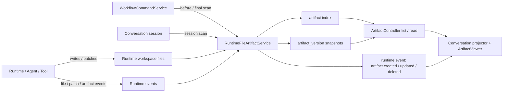

# File-first Artifact Preview Design

> 状态：目标设计 / 待实施
> 日期：2026-05-18
> 范围：`agentcenter-bridge/`、`agentcenter-web/`、Runtime 工作目录产物索引与预览
> 关联文档：[MARKDOWN-ARTIFACT-REVIEW-CLOSURE-DESIGN.md](./MARKDOWN-ARTIFACT-REVIEW-CLOSURE-DESIGN.md)

## 1. 背景与结论

用户期望的产物预览不是“把对话文本或数据库内容展示出来”，而是：

- 工作流、通用对话、任务对话中由 Agent、Runtime、工具产生的任何文件输出都算产物。
- 文件被创建、覆盖、patch 或增量修改时，即使没有完全生成、没有完善，也应该可以在前端看到可预览入口。
- 数据库只负责索引、状态、审计和缓存；文件才是产物源。
- 对话内容可以引用产物，但不应替代产物本身。

因此目标态应从当前的 `artifactId + artifact.content` 驱动，调整为 **file-first artifact preview**：

```text
产物 = 运行工作区内由一次会话 / 工作流节点 / 工具调用产生或修改的普通文件
预览 = 读取受控工作区中的文件快照或当前文件内容，并按类型提供渲染、降级和状态提示
数据库 = 文件产物索引、版本、状态、审计与兼容缓存，不是产物真源
```

## 2. 当前分支基线

当前分支存在三条产物捕获路径，它们都没有完整覆盖“任何文件输出 / 修改都是产物”的要求。

| 路径 | 当前代码位置 | 当前行为 | 主要问题 |
|------|--------------|----------|----------|
| 工作流节点完成产物 | `agentcenter-bridge/src/main/java/com/agentcenter/bridge/application/WorkflowCommandService.java` | 节点到达 `READY_TO_ADVANCE` 并被接受后，把 `SkillExecutionResult.outputContent()` 持久化为 `artifact.content`，再写入 `workflow_node_instance.outputArtifactId` | 只有最终文本输出才算产物；`IN_PROGRESS` 中间文件不可见；节点失败或等待确认时文件无法稳定预览 |
| 对话消息 Markdown 标记 | `AssistantMessageProjector.java`、`ArtifactCaptureService.java` | 从 assistant message content 中解析 `<!-- AGENTCENTER_ARTIFACT_BEGIN ... -->` 片段并创建 artifact | 产物源变成对话文本；没有写入文件的内容也会被当作产物；不能覆盖普通文件修改 |
| Runtime 事件投影 | `OpenCodeRuntimeEventTranslator.java`、`RuntimeEventEnvelopeDispatcher.java`、`ArtifactCaptureService.java` | 把 runtime file / patch / artifact part 翻译成 `PROCESS_TRACE kind=artifact`，再插入 artifact 记录，通常只有 `storageUri/filePath`，`content=null` | 依赖 Runtime 是否发出特定事件；没有版本和稳定状态；patch/路径事件可能读不到正确内容 |
| 产物读取 API | `ArtifactController.java` | 优先返回 DB `content`；没有 content 时再尝试读取 `storageUri/filePath` 指向的文本文件 | DB 优先级错误；文件大小、类型和错误状态不可见；无法列出会话或节点内所有产物 |
| 前端预览入口 | `ConversationWorkbench.vue`、`ArtifactViewer.vue` | 前端选择最新 `artifactId`，再调用详情接口渲染 content | 没有 `artifactId` 的文件不可见；只偏向单个最新产物；不支持未完成、过大、二进制、缺失等状态 |

当前设计的问题不是“某个预览组件不够强”，而是 **产物识别模型选错了主语**：系统在找“对话或数据库里有没有 artifact 记录”，而不是找“这次执行到底产生或修改了哪些文件”。

## 3. 产品契约

### 3.1 什么算产物

在目标态中，只要满足以下条件，就应被记录为产物：

1. 文件位于受控 Runtime 工作目录或明确授权的会话工作目录内。
2. 文件是普通文件，且在某次通用对话、任务对话、工作流节点或工具调用期间被创建、修改、删除或覆盖。
3. 文件可关联到至少一个执行上下文：`sessionId`、`workflowInstanceId`、`workflowNodeInstanceId`、`workItemId`、`runtimeEventId` 中的一个或多个。

这包括但不限于：

- Markdown、代码、JSON、CSV、日志、测试报告。
- 图片、截图、视频、PDF、Word、Excel、PPT 等二进制或结构化文件。
- 空文件、草稿文件、半成品文件、仍在写入的文件。
- patch 目标文件、工具生成文件、Agent 手动修改文件。

### 3.2 什么不算产物

以下内容不应被当作产物源：

- 单纯的对话消息文本。
- 只存在数据库中的中间字段、状态、确认项或事件 payload。
- Runtime 遥测、心跳、token 统计、内部 session mapping。
- 受控工作区之外的任意宿主机文件。
- `.git/`、依赖缓存、构建缓存、数据库文件、密钥文件等默认排除路径。

对话消息可以展示“产物说明”和“产物链接”，但不能成为产物的唯一来源。

## 4. 设计原则

1. **文件优先**：文件系统是产物真源；DB 只保存索引、版本、状态和兼容缓存。
2. **任何阶段可见**：`IN_PROGRESS`、等待确认、失败、人工暂停时都可以出现产物卡片。
3. **预览能力分层**：能渲染就渲染，不能渲染也展示文件名、路径、大小、类型和状态。
4. **事件与扫描互补**：Runtime 事件用于快速发现文件；执行前后 manifest diff 用于兜底。
5. **版本可追溯**：同一路径多次修改应形成版本或至少保留 hash、mtime、size 的变更历史。
6. **安全边界明确**：只读受控根目录内文件；路径必须标准化；大文件、二进制、敏感路径降级。
7. **兼容当前数据**：现有 message block 和 `artifact.content` 继续可读，但降级为 legacy source。

## 5. 目标架构



新增核心服务建议命名为 `RuntimeFileArtifactService`，它不替代现有 `ArtifactCaptureService`，而是把后者从“消息片段捕获器”收敛为兼容入口之一。

### 5.1 后端职责分层

| 模块 | 目标职责 |
|------|----------|
| `RuntimeWorkspace` | 继续统一解析受控工作目录，作为所有文件路径安全校验的根 |
| `RuntimeFileArtifactService` | 对文件做 baseline、diff、upsert、版本记录、预览状态判定 |
| `ArtifactCaptureService` | 兼容 legacy message block；Runtime 事件捕获转交给 `RuntimeFileArtifactService` |
| `RuntimeEventEnvelopeDispatcher` | 收到 file / patch / artifact 事件时立即触发单文件捕获，并发布 artifact update 事件 |
| `WorkflowCommandService` | 在节点执行前记录 manifest，节点执行中和结束后做增量扫描；不要再把 `outputContent` 当唯一产物 |
| `ArtifactController` | 提供 list/read/version API；默认读取文件或文件快照，DB content 只做 legacy fallback |

### 5.2 前端职责分层

| 模块 | 目标职责 |
|------|----------|
| `conversationProjector` | 把 artifact events 投影成稳定产物卡片，而不是只依赖 message marker |
| `ConversationWorkbench.vue` | 展示当前会话 / 节点的产物列表；新产物或新版本可自动打开，但不强制覆盖用户正在看的产物 |
| `ArtifactEvidenceInline.vue` | 展示产物文件、状态、版本、来源节点和可预览能力 |
| `ArtifactViewer.vue` | 支持文本、Markdown、代码、JSON、图片、降级 metadata、错误态和更新中状态 |
| `api/artifacts.ts` | 提供按 `sessionId`、`workflowNodeInstanceId`、`workflowInstanceId` 查询产物列表的接口 |

## 6. 数据模型

### 6.1 `artifact`

`artifact` 表代表一个逻辑产物，通常由“执行上下文 + 相对路径”确定。

| 字段 | 含义 |
|------|------|
| `id` | 产物 ID |
| `work_item_id` | 所属事项，可为空 |
| `workflow_instance_id` | 所属工作流实例，可为空 |
| `workflow_node_instance_id` | 所属工作流节点实例，可为空 |
| `session_id` | 所属对话 session，可为空 |
| `source_kind` | `FILE_SNAPSHOT`、`RUNTIME_FILE_EVENT`、`RUNTIME_PATCH_EVENT`、`LEGACY_MESSAGE_BLOCK`、`WORKFLOW_OUTPUT_LEGACY` |
| `relative_path` | 相对 Runtime 工作目录的安全路径 |
| `storage_uri` | `workspace://...` 或 legacy URI |
| `file_name` | 展示名 |
| `mime_type` | MIME 类型或推断类型 |
| `size_bytes` | 当前文件大小 |
| `content_hash` | 当前内容 hash |
| `lifecycle_status` | `UPDATING`、`READY`、`STALE`、`DELETED` |
| `preview_status` | `READY`、`EMPTY`、`TOO_LARGE`、`UNSUPPORTED`、`MISSING`、`OUT_OF_WORKSPACE`、`READ_ERROR` |
| `latest_version_id` | 最新版本，可选 |
| `metadata_json` | Runtime event id、node key、capture reason、错误信息等 |
| `created_at` / `updated_at` | 审计时间 |

唯一性建议：

```text
unique(session_id, workflow_node_instance_id, relative_path)
```

对于没有 workflow node 的通用对话，使用 `session_id + relative_path`；对于跨节点复用文件，可允许同一路径在不同节点形成不同 artifact，也可以在 UI 聚合展示。

### 6.2 `artifact_version`

建议新增版本表，避免同一路径多次修改只剩最后状态。

| 字段 | 含义 |
|------|------|
| `id` | 版本 ID |
| `artifact_id` | 所属产物 |
| `version_no` | 单产物递增版本号 |
| `relative_path` | 捕获时路径 |
| `storage_uri` | 捕获时 URI |
| `size_bytes` | 捕获时大小 |
| `content_hash` | 捕获时 hash |
| `lifecycle_status` | 捕获时生命周期 |
| `preview_status` | 捕获时预览状态 |
| `captured_at` | 捕获时间 |
| `metadata_json` | 捕获原因、runtime event、错误信息 |

第一期可以不复制完整文件内容，只保存文件 hash 和 metadata；后续如果需要历史回放，再引入 snapshot blob 或对象存储。

## 7. 捕获流程

### 7.1 执行前 baseline

每次 workflow node 或 conversation run 开始前：

1. 解析受控 workspace root。
2. 扫描允许路径，生成 manifest：`relativePath -> size, mtime, hash(optional)`。
3. manifest 存在内存或短期 DB metadata 中，不作为产物展示。

baseline 的目的是知道“这次执行改了什么”，不是把工作区已有文件全部展示出来。

### 7.2 执行中事件捕获

当 Runtime 推送以下事件时立即捕获：

- file created / modified / deleted。
- patch applied。
- artifact part。
- tool output 中携带的安全文件路径。

捕获动作：

1. 规范化路径并确认仍在 workspace root 内。
2. 读取文件 metadata；能读取内容时计算 hash。
3. 按 `session/node/path` upsert artifact。
4. 若 hash、size、mtime、status 变化，创建 artifact version。
5. 发布 `artifact.created` 或 `artifact.updated` 事件给前端。

### 7.3 执行中节流扫描

Runtime 不一定会对所有文件修改发事件，所以需要节流扫描兜底：

- 执行中每 2-5 秒扫描一次 changed manifest。
- 只处理新增、mtime/size 变化、删除的文件。
- 对仍在快速变化的文件标记 `UPDATING`，但仍允许预览当前可读内容。

### 7.4 执行结束兜底扫描

无论节点结果是完成、失败、等待确认、人工中断还是 `READY_TO_ADVANCE`，都执行 final diff scan：

1. 对比 baseline manifest。
2. 捕获所有新增、修改、删除文件。
3. 把稳定文件标记为 `READY`。
4. 保留失败节点的产物，方便用户看到半成品和错误现场。

这一步是“任何文件输出 / 修改都是产物”的关键兜底。

## 8. 预览策略

`ArtifactController` 应从“返回 artifact.content”调整为“按 source 和 preview status 读取文件或快照”。

| 文件类型 | 预览策略 |
|----------|----------|
| Markdown / text / code / JSON / YAML / CSV / log | 读取前 N MB 文本内容，返回 `content`、`truncated`、`language` |
| 图片 | 返回安全 workspace URL 或 base64/stream token，由前端直接渲染 |
| PDF / Office / 视频 | 第一期展示 metadata、下载/打开入口；后续可加缩略图或文档渲染 |
| 空文件 | 返回 `previewStatus=EMPTY`，仍展示产物卡片 |
| 大文件 | 返回 `previewStatus=TOO_LARGE`、大小、路径和操作入口 |
| 不支持类型 | 返回 `previewStatus=UNSUPPORTED`，不隐藏产物 |
| 文件缺失 | 返回 `previewStatus=MISSING`，保留索引和版本信息 |
| 越界路径 | 返回 `previewStatus=OUT_OF_WORKSPACE`，不读取内容 |

重要调整：

- DB `content` 只用于 legacy artifact；文件型 artifact 优先读取文件。
- 预览失败是产物状态，不是“没有产物”。
- `IN_PROGRESS` 文件应返回 `lifecycleStatus=UPDATING`，前端展示“仍在更新”。

## 9. API 契约

### 9.1 查询产物列表

```http
GET /api/artifacts?sessionId={sessionId}
GET /api/artifacts?workflowInstanceId={workflowInstanceId}
GET /api/artifacts?workflowNodeInstanceId={nodeInstanceId}
```

响应字段建议：

```json
{
  "items": [
    {
      "id": "art_01",
      "fileName": "design.md",
      "relativePath": "artifacts/design.md",
      "mimeType": "text/markdown",
      "sizeBytes": 12034,
      "contentHash": "sha256:...",
      "lifecycleStatus": "UPDATING",
      "previewStatus": "READY",
      "sourceKind": "FILE_SNAPSHOT",
      "sessionId": "ses_01",
      "workflowNodeInstanceId": "node_01",
      "latestVersionId": "ver_03",
      "updatedAt": "2026-05-18T10:30:00Z"
    }
  ]
}
```

### 9.2 读取产物

```http
GET /api/artifacts/{artifactId}
GET /api/artifacts/{artifactId}?versionId={versionId}
```

响应应包含：

- artifact metadata。
- preview metadata。
- 可渲染文本或安全资源 URL。
- `truncated`、`errorMessage`、`versions` 等辅助字段。

### 9.3 事件推送

Runtime event stream 中建议新增或规范化 payload：

```json
{
  "type": "artifact.updated",
  "artifactId": "art_01",
  "versionId": "ver_03",
  "relativePath": "artifacts/design.md",
  "lifecycleStatus": "UPDATING",
  "previewStatus": "READY",
  "captureReason": "runtime_patch_event"
}
```

前端收到事件后更新产物列表；如果用户当前没有锁定其他产物，可以自动打开最新版本。

## 10. 工作流语义调整

当前 `READY_TO_ADVANCE` 同时承担“节点结果可推进”和“产物可展示”的语义，目标态需要拆开：

| 语义 | 目标处理 |
|------|----------|
| 节点是否可推进 | 仍由工作流状态机、用户确认和 `READY_TO_ADVANCE` 决定 |
| 是否有产物 | 由文件捕获和 artifact index 决定，与节点是否完成解耦 |
| 产物是否可审阅 | 由 `ARTIFACT_REVIEW` 绑定 artifact/version 决定 |
| 产物是否完整 | 由 `lifecycleStatus` 和版本稳定性表达 |

因此：

- 节点仍在运行时，前端也能看到 `UPDATING` 产物。
- 节点失败时，用户仍能预览失败前写出的文件。
- 节点等待确认时，确认卡应绑定真实 artifact/version，而不是只绑定文本摘要。
- 节点推进不应依赖“是否存在 DB content”。

## 11. 前端交互目标态

1. 对话流中出现产物事件时，插入或更新产物卡片。
2. 产物区域默认展示当前上下文的全部产物，而不是单个 latest artifact。
3. 新产物出现时可自动打开；用户手动选择后，不再被后续事件抢焦点。
4. 产物卡片展示：
   - 文件名、相对路径、来源节点/会话。
   - 生命周期：更新中、已就绪、已删除、读取失败。
   - 预览能力：可预览、过大、不支持、空文件。
   - 版本号或更新时间。
5. `ArtifactViewer` 不把不可预览当空白页，而是展示明确降级态。

## 12. 兼容与迁移

1. 保留当前 `/api/artifacts/{id}`，扩展字段而不是破坏调用方。
2. 现有 `artifact.content` 数据标记为 `LEGACY_MESSAGE_BLOCK` 或 `WORKFLOW_OUTPUT_LEGACY`。
3. `outputArtifactId` 继续可用，但不再是前端唯一产物入口；前端应优先 list 当前 session/node artifacts。
4. Markdown message marker 捕获保留一段时间，作为 legacy fallback；新 Runtime 文件产物不需要 message marker。
5. 旧文档 [MARKDOWN-ARTIFACT-REVIEW-CLOSURE-DESIGN.md](./MARKDOWN-ARTIFACT-REVIEW-CLOSURE-DESIGN.md) 的 “artifacts/*.md 唯一产物源” 应被本设计扩展为 “受控工作区内任何新增/修改文件都是产物源”。

## 13. 安全与可靠性

必须满足以下边界：

- 所有路径经过 `Path.normalize()` 和 workspace root containment 校验。
- 不跟随越界 symlink；必要时使用 `toRealPath()` 校验。
- 默认排除 `.git/`、`node_modules/`、`target/`、`dist/`、构建缓存、数据库文件、密钥文件。
- 对大文件设置读取上限；hash 可按大小阈值降级为 `size+mtime`。
- 读取失败、权限失败、文件消失都写入 `previewStatus`，不吞掉。
- 前端不直接拼接本地绝对路径访问文件，必须通过 Bridge API 或安全资源 URL。

## 14. 验收标准

### 后端

- 工作流节点运行中创建一个 Markdown 文件，前端可在节点完成前看到产物卡片。
- 工作流节点运行中修改一个已有代码文件，产物列表展示该文件，并产生新版本或更新时间。
- Runtime 没有发 artifact event 时，final diff scan 仍能捕获新增/修改文件。
- 节点失败、等待确认、人工暂停时，已写出的文件仍可预览。
- 大文件、二进制、空文件、缺失文件都有明确 `previewStatus`。
- 越界路径不会被读取。

### 前端

- 对话中不再依赖 message marker 才出现产物。
- 当前会话 / 当前节点的多个产物都可见。
- `UPDATING` 产物可以预览当前内容，并显示仍在更新。
- 不可预览文件展示 metadata 和原因，而不是空白。
- `ARTIFACT_REVIEW` 绑定真实 artifact/version。

### 验证命令

```bash
cd agentcenter-bridge
./mvnw test

cd ../agentcenter-web
npm run typecheck
npm run test
```

UI 变更需要通过 Playwright 留存 evidence 到 `.sisyphus/evidence/`。

## 15. 关键决策

| 决策 | 选择 | 原因 |
|------|------|------|
| 产物真源 | 文件系统 | 用户要求任何文件输出 / 修改都可预览，DB 与对话文本无法完整表达 |
| 发现机制 | Runtime 事件 + manifest diff | 事件实时，diff 兜底 |
| 预览时机 | 执行中即可展示 | 半成品也是用户需要看到的产物 |
| 版本策略 | 同一路径多次修改形成版本 | 支持审阅、确认和回退分析 |
| 兼容策略 | legacy artifact 保留 | 不破坏现有 message block 和 workflow output |
| 安全边界 | 只读受控 workspace | 避免任意文件读取和路径穿越 |
