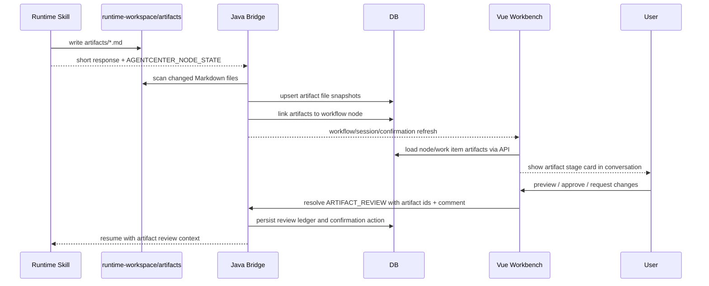

# Markdown Artifact Review Closure Design

> 状态：待实施
> 基线：`codex/from-2026-05-14-1026` / `6f2e0416`
> 创建：2026-05-15

## 背景

AgentCenter 的 PRD / HLD / LLD 类 Runtime Skill 已经在运行规则中要求先把阶段文档写入当前 runtime workspace 的 `artifacts/` 目录，再在聊天回复中给短摘要和 `AGENTCENTER_NODE_STATE`。这说明用户 Skill 的真实产物契约是“文件输出”，不是“对话正文”。

当前 10:26 基线仍然存在几个断点：

- 工作流节点完成时会把 Runtime 输出正文直接保存为 artifact 快照，文件不是唯一事实源。
- `ARTIFACT_REVIEW` 只是普通交互框，未强绑定实际 Markdown 文件内容。
- 对话流只显示短摘要、系统状态和确认框，用户无法在对话中看到每个阶段的实际产物。
- 用户反馈缺少明确的 artifact/version 上下文，Skill 下一轮很难知道用户针对哪个文件提出修改。

本设计把阶段产物、预览、审阅和用户反馈收敛成一个闭环：Skill 写 Markdown 文件，Bridge 捕获文件产物，Web 在对话中展示产物卡片，用户基于实际 Markdown 内容审阅并反馈。

## PRD / 需求边界

### 目标

1. 以用户 Skill 中声明的 `artifacts/*.md` 文件输出作为第一版产物来源。
2. 每个工作流节点可以产生一个或多个 Markdown 产物。
3. 对话流中必须展示阶段产物卡片，用户不需要先去右侧面板猜测产物是否存在。
4. `ARTIFACT_REVIEW` 必须绑定实际 artifact id 和 Markdown 预览内容。
5. 用户审阅反馈必须带回 artifact id、版本和 comment，供 Skill 后续更新文件。

### 非目标

- 不支持 PDF、DOCX、图片、二进制文件预览。
- 不把普通聊天正文、工具日志、reasoning、运行状态事件视为产物。
- 不允许 artifact 指向 runtime workspace 之外的文件。
- 不做生产级下载权限、多租户隔离或在线富文本编辑。
- 不在第一版实现复杂 AST diff；Markdown diff 可作为后续增强。

### 用户验收

- PRD/HLD/LLD 节点生成 `.md` 后，对话中出现阶段产物卡片。
- 用户点击产物卡片可以看到该 Markdown 的实际内容。
- 如果节点发起 `ARTIFACT_REVIEW`，交互区展示正在审阅的 Markdown 文件，而不是裸确认表单。
- 用户选择“通过”或“需要修改”时，Bridge 保存审阅结果和修改意见，并回灌给当前 Skill。
- 没有 Markdown 文件时，平台不得创建普通 `ARTIFACT_REVIEW` 让用户盲审。

## HLD / 目标链路



## 领域模型

### Artifact

第一版沿用 `artifact` 表，但语义收紧：

| 字段 | 语义 |
|------|------|
| `work_item_id` | 所属事项 |
| `workflow_instance_id` | 所属工作流实例 |
| `workflow_node_instance_id` | 产出该文件的节点 |
| `session_id` | 所属任务会话 |
| `artifact_type` | 第一版固定 `MARKDOWN` |
| `title` | 展示标题，优先来自 `artifact_title`，否则取 Markdown H1 或文件名 |
| `content` | 捕获时的 Markdown 快照，用于稳定预览和后续 diff |
| `storage_uri` / `file_path` | runtime workspace 内的真实文件路径 |
| `version_no` | 同一路径的版本序号 |
| `source_type` | `FILE_SNAPSHOT` |

建议新增字段：

| 字段 | 目的 |
|------|------|
| `content_hash` | 判断文件是否变化，避免只靠 mtime/size |
| `size_bytes` | 预览安全和 UI 展示 |
| `preview_status` | `READY / EMPTY / TOO_LARGE / OUT_OF_WORKSPACE / UNSUPPORTED` |

如果不想在 M1 中扩表，`content_hash/size_bytes/preview_status` 可以先放入 `metadata_json`；但长期建议显式字段。

### Node Artifact List

`workflow_node_instance.outputArtifactId` 只能表达主产物，不能表达“一个阶段输出多个 Markdown 文件”。目标态需要按节点查询列表：

- `GET /api/workflow-node-instances/{nodeId}/artifacts`
- `GET /api/workflow-instances/{instanceId}/artifacts?groupByNode=true`
- `GET /api/work-items/{workItemId}/artifacts` 保留，用于右侧全局产物导航

第一版可以不删除 `outputArtifactId`，但它只表示主产物；对话卡片和审阅应使用 node artifact list。

### Artifact Review Confirmation

`ARTIFACT_REVIEW` 的 payload 必须包含：

```json
{
  "interactionType": "ARTIFACT_REVIEW",
  "workflowNodeInstanceId": "node-id",
  "artifactIds": ["artifact-id"],
  "reviewMode": "MARKDOWN",
  "reviewTargetTitle": "FE2001 详细设计 (LLD).md",
  "baseVersion": 1,
  "required": true
}
```

用户 resolve 时保存：

```json
{
  "actionType": "APPROVE | SUPPLEMENT | REJECT",
  "artifactIds": ["artifact-id"],
  "decision": "PASS | REVISE",
  "comment": "用户修改意见",
  "baseVersion": 1
}
```

## Bridge 设计

### Markdown 文件捕获

在每次节点运行前后对当前 work item 的 runtime workspace 做快照，只扫描：

- `artifacts/**/*.md`
- `artifacts/**/*.markdown`

捕获条件：

- 文件必须在 `ProjectRuntimeWorkspaceResolver.resolve(projectId)` 下。
- 文件必须是普通文件。
- 文件大小第一版不超过 2MB。
- 文件新增或 `content_hash` 变化。

捕获结果：

- 写入或新增 artifact 版本。
- 设置 `workflow_node_instance_id` 为当前节点。
- `content` 保存 Markdown 文本快照。
- `file_path/storage_uri` 保存真实路径。
- 若当前节点尚无 `outputArtifactId`，选择最新主 Markdown 产物作为主产物。

### READY_TO_ADVANCE

节点报告 `READY_TO_ADVANCE` 时：

1. Bridge 扫描本轮 Markdown 文件变化。
2. 若有文件产物，节点可以进入 ready / waiting confirmation / completed。
3. 若无文件产物，但 Skill 规则要求产物，应创建异常确认或 BLOCKED，避免生成不可审阅的空产物。

### NEEDS_USER_INPUT + ARTIFACT_REVIEW

节点报告 `NEEDS_USER_INPUT` 且交互类型为 `ARTIFACT_REVIEW` 时：

1. 先扫描本轮 Markdown 文件变化。
2. 选择本节点最新 Markdown 产物作为 review target。
3. 将 artifact ids 写入 confirmation payload。
4. 如果没有 Markdown 产物，不创建盲审确认，改为异常确认：
   - title: `缺少可审阅 Markdown 产物`
   - action: `RETRY / SUPPLEMENT`

### Skill Resume Context

用户完成审阅后，Bridge 回灌给 Skill 的 prompt 中追加：

```markdown
### Artifact Review Context

- artifactId: ...
- filePath: artifacts/xxx.md
- version: 1
- decision: PASS | REVISE
- comment: ...
```

这样 Skill 可以依据用户反馈更新同一个 Markdown 文件，Bridge 再捕获新版本。

## Web 设计

### 对话内阶段产物卡片

对话流中新增 `ArtifactStageCard`，由当前节点 artifact list 投影生成：

- 节点名称 / Skill 名称
- Markdown 文件标题
- 版本号 / 更新时间
- 预览状态
- 操作：`预览`、`审阅`、`查看变更`（diff 可后置）

卡片是对话主线的一部分，不只是右侧面板导航。

### Artifact Review UI

`ConversationInteractionBar` 对 `ARTIFACT_REVIEW` 特化：

- 上方展示绑定的 Markdown artifact 列表。
- 默认打开第一个 artifact 的预览。
- 提供 `通过` / `需要修改`。
- `需要修改` 必须允许填写 comment。
- 提交 payload 必须包含 artifact ids 和 base version。

### Artifact Viewer

第一版只支持 Markdown：

- Markdown 正常渲染。
- 文件无法读取时展示原因，不显示空白面板。
- 如果 DB 快照存在但文件丢失，明确标识“使用捕获快照预览”。

## 实施顺序

1. Bridge：新增 Markdown 文件扫描和 artifact 快照服务。
2. Bridge：把 workflow 节点完成和 `ARTIFACT_REVIEW` 交互都接入文件捕获。
3. Bridge：新增 node artifact list API。
4. Web：新增对话内 `ArtifactStageCard`。
5. Web：特化 `ARTIFACT_REVIEW` 审阅 UI。
6. Web：Markdown preview 状态化。
7. 后续：基于 content snapshot 增加 Markdown diff。

## 验证策略

### Bridge

- PRD Skill 写入 `artifacts/*.md` 后，artifact 表出现 `FILE_SNAPSHOT`。
- HLD Skill 输出短摘要但写文件，预览内容来自 Markdown 文件。
- LLD Skill 发起 `ARTIFACT_REVIEW` 前写草稿文件，confirmation payload 包含 artifact ids。
- 没有 Markdown 文件时，不创建普通 `ARTIFACT_REVIEW`。
- 用户提交 revise comment 后，resume context 包含 artifact review 信息。

### Web

- 对话中出现阶段产物卡片。
- 卡片可打开 Markdown 预览。
- `ARTIFACT_REVIEW` 展示绑定产物，不再只显示裸表单。
- 提交“需要修改”会带 comment 和 artifact ids。

### E2E

使用现有 `prd-design / hld-design / lld-design` smoke Skill：

1. PRD 多问题表单完成后生成 Markdown 产物卡片。
2. HLD 决策后生成 Markdown 产物卡片。
3. LLD 到 review round 时先展示草稿 Markdown，再允许用户通过或修改。
4. 最终 LLD Markdown 可预览。

## 决策

- 选用 Markdown-only 第一版，而不是泛文件预览：范围小，和现有 Skill 契约一致。
- 以文件为唯一产物源，而不是对话正文：避免用户看到摘要却审阅不到真实交付物。
- 保留 `outputArtifactId` 作为主产物兼容字段，但审阅和对话展示使用 artifact list：支持多文件阶段输出。
- `ARTIFACT_REVIEW` 没有绑定 Markdown 时失败快显：避免用户继续面对无法审阅的交互框。
