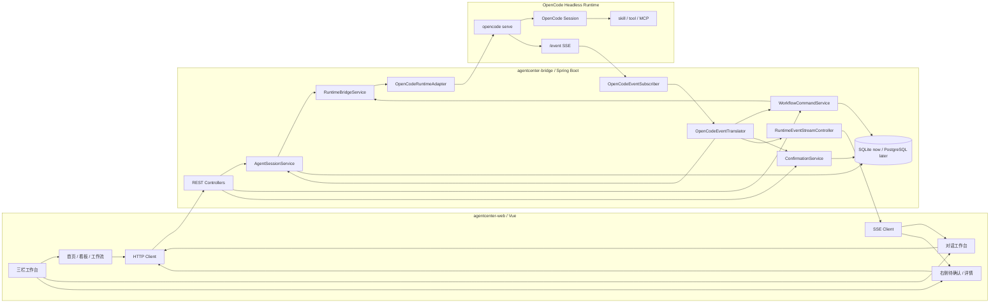
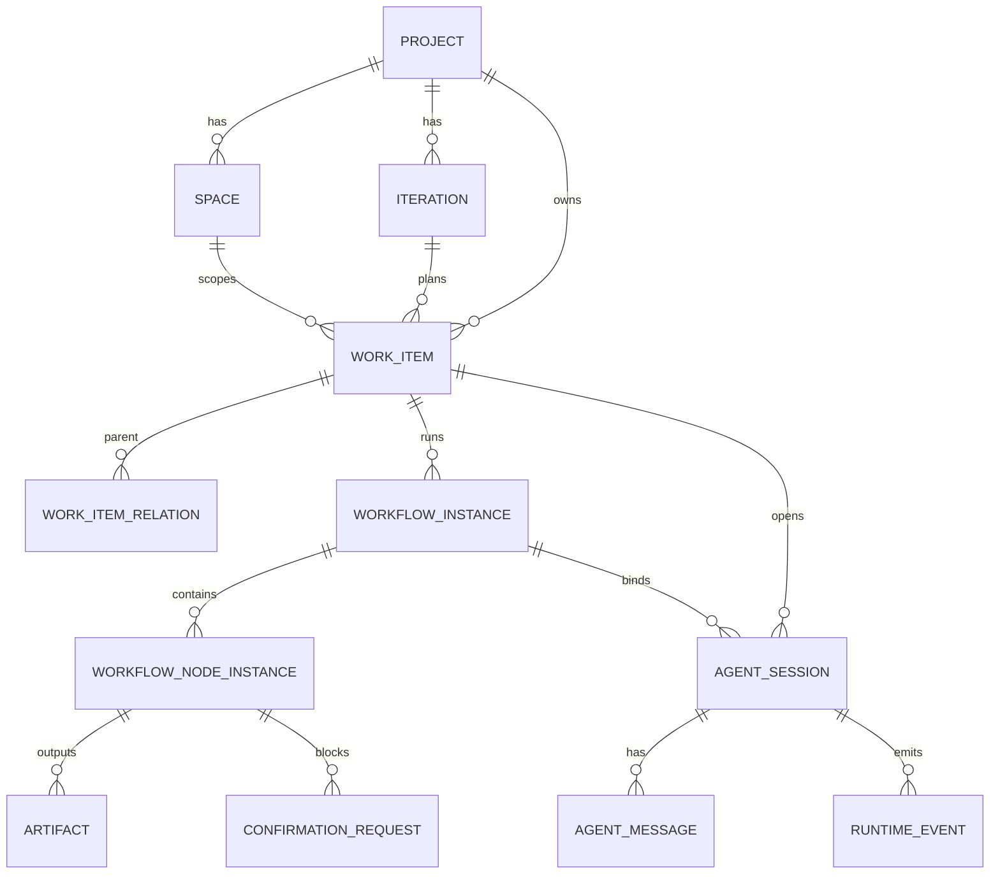
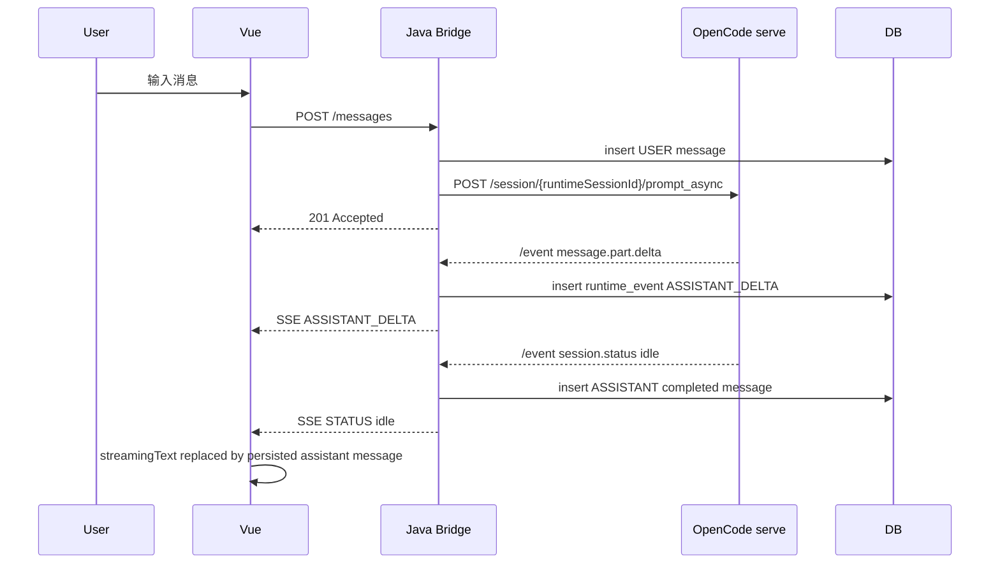
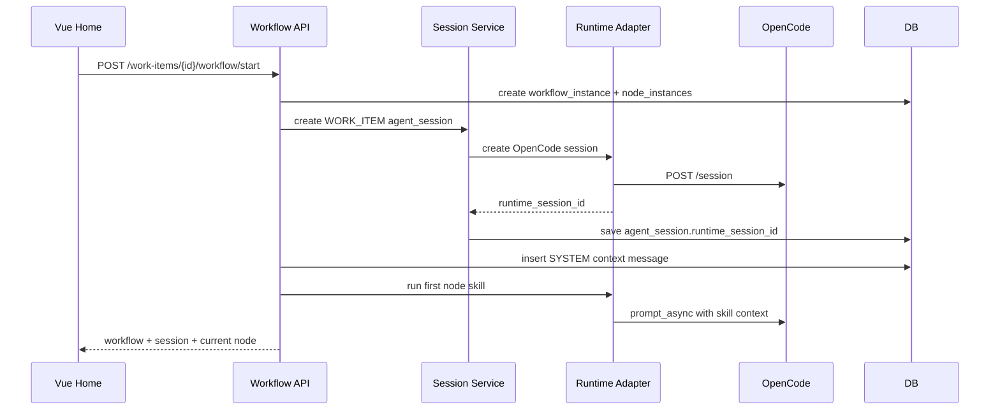

# OpenCode Bridge Execution Design

> 状态：OpenCode 实施交接设计
> 最近更新：2026-05-06
> 目标读者：后续负责实现的 OpenCode / Java / Vue Agent
> 当前决策：M1 使用 HTTP 下发命令 + SSE 返回流式输出，WebSocket 延后到 M2+

## 1. 目标结论

AgentCenter M1 要先跑通一个真实闭环：

```text
Vue 工作台
  -> HTTP POST 用户命令
  -> Java Bridge 管理会话、任务、工作流和权限
  -> OpenCode serve 执行真实对话或 skill
  -> Java Bridge 消费 OpenCode SSE
  -> Java Bridge 转换并推送 AgentCenter SSE
  -> Vue 对话区实时展示输出
  -> Java Bridge 持久化消息、事件、产物和待确认
```

不要再把默认路径做成 Mock，也不要把正式链路做成 `opencode run` 单次调用。

M1 的关键判断标准很简单：用户在网页里点“开始处理”或进入会话后，能看到真实 OpenCode 输出，刷新后消息仍在，右侧“待确认”能进入同一个任务会话继续处理。

## 2. 架构图



## 3. 当前状态与需要补齐的差距

当前已经接近闭环，但还不能交付给用户当成“完成”：

| 方面 | 当前状态 | 必须补齐 |
|------|----------|----------|
| 传输决策 | 已确认 M1 是 HTTP + SSE | 所有文档、代码和测试都要统一这个口径，不再宣传 WebSocket 是 M1 |
| 对话发送 | 前端通过 HTTP POST 发送消息 | 新建会话必须创建或绑定真实 OpenCode session，不允许 fallback 到 AgentCenter session id |
| 流式输出 | Java 可消费 OpenCode SSE 并推 AgentCenter SSE | 前端不能被历史快照覆盖；后端必须在 idle/waiting_user 时落库最终 ASSISTANT 消息 |
| 首页任务 | 页面还有前端样例数据 | 任务、会话、工作流、待确认都要来自 DB seed 或 API |
| 工作流启动 | “开始处理”按钮已有 UI | 必须创建 workflow_instance、node_instance、agent_session，并带完整上下文调用 skill |
| 待确认 | 右侧有待确认入口 | “处理”要精确进入 confirmation.agent_session_id 对应会话 |
| 高保真 | Vue 页面有壳但比例不稳定 | 必须按 `docs/prototype/homepage.html` 的三栏工作台尺寸和交互复刻 |

## 4. 领域模型

### 4.1 事项类型

统一使用 `work_item` 表承载六类对象：

| 类型 | 含义 | 示例 code | 关系 |
|------|------|-----------|------|
| `FE` | Feature，特性/需求包 | `FE1234` | 可拆成多个 US |
| `US` | User Story，用户故事 | `US1203` | 来自 FE 拆解 |
| `TASK` | 研发执行任务 | `TASK2001` | 跟踪实际执行 |
| `WORK` | 平台工作项/运维工作/协作事项 | `WORK3001` | 可承接跨平台事项 |
| `BUG` | 缺陷/DTS 问题单 | `BUG0602` | 修复和验证流程 |
| `VULN` | 安全漏洞 | `VULN0301` | 安全复核和整改流程 |

前端展示用 `code`，后端关联用内部 `id`。

### 4.2 对象关系



## 5. 数据表设计

M1 可以继续 SQLite，但表字段按 PostgreSQL 迁移设计。

### 5.1 `work_item`

```text
id                         ULID / UUID
code                       FE1234 / US1203 / BUG0602
type                       FE / US / TASK / WORK / BUG / VULN
title
description                原始需求或问题描述
status                     BACKLOG / TODO / IN_PROGRESS / IN_REVIEW / DONE / BLOCKED
priority                   LOW / MEDIUM / HIGH / URGENT
project_id
space_id
iteration_id
owner_user_id
assignee_user_id
current_workflow_instance_id
created_at
updated_at
```

建议 seed 至少放 6 条真实样例，不再在前端写死：

| code | type | title |
|------|------|-------|
| `FE1234` | FE | 打地鼠小游戏：从需求到可运行原型 |
| `US1203` | US | 用户可以选择难度并开始游戏 |
| `TASK2001` | TASK | 实现游戏计时、计分和命中反馈 |
| `WORK3001` | WORK | 接入本地 OpenCode Runtime 会话 |
| `BUG0602` | BUG | 顶部面板展开时节点重叠 |
| `VULN0301` | VULN | 检查本地桥接服务权限边界 |

### 5.2 `work_item_relation`

```text
id
source_work_item_id
target_work_item_id
relation_type              SPLITS_TO / TRACKED_BY / BLOCKS / RELATES_TO
created_at
```

推荐关系：

```text
FE1234 SPLITS_TO US1203
US1203 TRACKED_BY TASK2001
WORK3001 RELATES_TO FE1234
BUG0602 RELATES_TO FE1234
VULN0301 RELATES_TO WORK3001
```

### 5.3 `workflow_definition`

```text
id
work_item_type
name
version_no
status                     DRAFT / ENABLED / DISABLED
is_default
created_at
updated_at
```

### 5.4 `workflow_node_definition`

```text
id
workflow_definition_id
node_key                   requirement_refine / solution_design / implementation_plan / final_review
name
order_no
skill_name                 OpenCode skill 名称
input_policy               WORK_ITEM_ONLY / PREVIOUS_ARTIFACT / MERGED_CONTEXT
output_artifact_type       MARKDOWN / JSON / PATCH / REPORT
output_name_template
required_confirmation      true / false
timeout_seconds
retry_limit
```

FE 默认工作流建议：

| order | node_key | skill_name | 输入 | 输出 |
|-------|----------|------------|------|------|
| 1 | `requirement_refine` | `fe.requirement.refine` | work_item.description | `01-requirement.md` |
| 2 | `solution_design` | `fe.solution.design` | previous artifact + work item | `02-solution-design.md` |
| 3 | `implementation_plan` | `fe.implementation.plan` | previous artifact | `03-implementation-plan.md` |
| 4 | `review_and_confirm` | `fe.review.confirm` | all artifacts | `04-review.md` |
| 5 | `done` | none | workflow state | completed |

### 5.5 `workflow_instance` / `workflow_node_instance`

```text
workflow_instance
- id
- work_item_id
- workflow_definition_id
- status                   PENDING / RUNNING / WAITING_CONFIRMATION / FAILED / COMPLETED / CANCELLED
- current_node_instance_id
- agent_session_id
- started_at
- completed_at
- created_at
- updated_at

workflow_node_instance
- id
- workflow_instance_id
- node_definition_id
- status                   PENDING / RUNNING / WAITING_CONFIRMATION / FAILED / COMPLETED / SKIPPED
- input_artifact_id
- output_artifact_id
- agent_session_id
- runtime_session_id
- started_at
- completed_at
- error_message
- version
```

关键规则：

- 节点推进必须按 `workflow_node_definition.order_no`，不能按 ULID 或创建时间。
- 节点成功后，`output_artifact_id` 必须写入下一个节点的 `input_artifact_id`。
- 每个工作流实例绑定一个主 `agent_session_id`，右侧待确认处理也进入这个会话。

### 5.6 `agent_session` / `agent_message`

```text
agent_session
- id
- session_type             GENERAL / WORK_ITEM
- title
- work_item_id             通用会话为空
- workflow_instance_id
- runtime_type             OPENCODE / MOCK
- runtime_session_id       OpenCode session id
- status                   ACTIVE / ARCHIVED / FAILED
- created_by
- created_at
- updated_at

agent_message
- id
- session_id
- role                     USER / ASSISTANT / SYSTEM / TOOL
- content
- content_format           TEXT / MARKDOWN / JSON
- status                   STREAMING / COMPLETED / FAILED
- seq_no
- runtime_message_id
- created_by
- created_at
```

关键规则：

- 普通会话和任务会话都必须创建真实 OpenCode session，并保存 `runtime_session_id`。
- `sendMessage` 只能使用 `agent_session.runtime_session_id` 调 OpenCode，不能 fallback 成 AgentCenter session id。
- seq_no 必须递增，不能用负数临时排序。
- SSE 流式内容可以在前端临时显示，但最终必须落库为 `ASSISTANT COMPLETED` 消息。

### 5.7 `runtime_event`

```text
id
session_id
workflow_instance_id
workflow_node_instance_id
event_type                 STATUS / ASSISTANT_DELTA / SKILL_STARTED / SKILL_COMPLETED / PERMISSION_REQUIRED / ERROR
event_payload              JSON
runtime_event_id           OpenCode 原始 event id
created_at
```

建议加唯一约束：

```text
unique(runtime_type, runtime_event_id)
```

如果 OpenCode event 没有稳定 id，则用 `(runtime_session_id, event_type, event_timestamp, hash(payload))` 做去重键。

### 5.8 `confirmation_request`

```text
id
work_item_id
workflow_instance_id
workflow_node_instance_id
agent_session_id
type                       USER_CONFIRMATION / PERMISSION / EXCEPTION / FAILURE / INPUT_REQUIRED
title
summary
status                     PENDING / RESOLVED / CANCELLED
severity                   INFO / WARNING / CRITICAL
runtime_type
runtime_session_id
runtime_permission_id
created_at
resolved_at
```

右侧栏名称统一为“待确认”。它不是“主动预警”，也不是普通通知。

## 6. HTTP + SSE 接口设计

### 6.1 创建会话

```http
POST /api/agent-sessions
Content-Type: application/json
```

```json
{
  "sessionType": "GENERAL",
  "title": "通用会话",
  "runtimeType": "OPENCODE"
}
```

任务会话：

```json
{
  "sessionType": "WORK_ITEM",
  "workItemId": "wi_fe1234",
  "workflowInstanceId": "wf_xxx",
  "title": "FE1234 · 打地鼠小游戏",
  "runtimeType": "OPENCODE"
}
```

后端行为：

- 创建 `agent_session`。
- 调用 `OpenCodeRuntimeAdapter.createSession()`。
- 保存 `runtime_session_id`。
- 插入一条 SYSTEM 消息，记录当前上下文摘要。

### 6.2 发送用户消息

```http
POST /api/agent-sessions/{sessionId}/messages
Content-Type: application/json
```

```json
{
  "content": "请继续完善方案设计，并给出实现步骤",
  "contentFormat": "TEXT"
}
```

后端行为：

1. 校验 `agent_session` 存在且 `runtime_session_id` 不为空。
2. 插入 USER 消息。
3. 拼装上下文包。
4. 调用 `POST /session/{runtimeSessionId}/prompt_async`。
5. 立即返回 USER 消息和 requestId。
6. 后续输出通过 SSE 到前端。

### 6.3 订阅会话事件

```http
GET /api/agent-sessions/{sessionId}/events
Accept: text/event-stream
```

事件格式：

```json
{
  "id": "evt_xxx",
  "type": "ASSISTANT_DELTA",
  "sessionId": "ags_xxx",
  "payload": {
    "delta": "这里是增量输出"
  },
  "createdAt": "2026-05-06T16:37:00+08:00"
}
```

SSE 规则：

- 前端进入会话时建立连接。
- 同一个 session 已连接时不要重复重连。
- 后端要支持 `Last-Event-ID` 或 `afterEventId`，避免历史 delta 重放覆盖当前输出。
- 如果 M1 来不及做 `Last-Event-ID`，前端必须按 `event.id` 去重。

### 6.4 启动工作流

```http
POST /api/work-items/{workItemId}/workflow/start
Content-Type: application/json
```

Body 可以为空：

```json
{}
```

后端行为：

1. 查询 work_item。
2. 找到对应类型默认 workflow_definition。
3. 创建 workflow_instance。
4. 创建全部 workflow_node_instance。
5. 创建或复用任务 agent_session。
6. 把工作项上下文作为 SYSTEM 消息写入会话。
7. 开始第一个节点。
8. 返回 workflowInstance、agentSession、currentNode。

### 6.5 进入待确认会话

```http
POST /api/confirmations/{confirmationId}/enter-session
```

返回：

```json
{
  "confirmationId": "cr_xxx",
  "agentSessionId": "ags_xxx",
  "workItemId": "wi_xxx",
  "workflowInstanceId": "wf_xxx"
}
```

前端必须使用 `agentSessionId` 精确进入会话，不能只按 `workItemId` 找第一个会话。

### 6.6 处理待确认

```http
POST /api/confirmations/{confirmationId}/resolve
Content-Type: application/json
```

```json
{
  "action": "APPROVE",
  "comment": "确认继续执行"
}
```

后端行为：

- 更新 confirmation 为 RESOLVED。
- 如果是 permission，回调 OpenCode permission API。
- 如果是 workflow confirmation，恢复当前 node 或推进下一节点。
- 所有后续输出仍进入同一个 `agentSessionId`。

## 7. OpenCode Adapter 设计

### 7.1 OpenCode 运行方式

Java Bridge 管理或附着到本机 OpenCode：

```bash
opencode serve --hostname 127.0.0.1 --port 4097
```

配置项：

```yaml
agentcenter:
  runtime:
    default-type: OPENCODE
    opencode:
      base-url: http://127.0.0.1:4097
      workdir: /Users/hzz/workspace/AgentCenter
      auto-start: true
      default-agent: build
```

### 7.2 必须实现的方法

```text
createSession(context) -> runtimeSessionId
sendMessage(agentSessionId, runtimeSessionId, promptContext) -> requestId
runSkill(nodeContext, skillName, inputContext) -> runtimeRequestId
resolvePermission(runtimePermissionId, action) -> void
cancel(runtimeSessionId, requestId) -> void
subscribeEvents() -> background stream
```

### 7.3 OpenCode API 映射

| AgentCenter 动作 | OpenCode API |
|------------------|--------------|
| 创建 runtime session | `POST /session` |
| 发送用户消息 | `POST /session/{id}/prompt_async` |
| 消费流式输出 | `GET /event` |
| 权限确认 | 按当前 OpenCode 实际 permission API |
| skill/tool 事件 | 从 `/event` 的 message/tool/permission 事件翻译 |

必须带 header：

```text
x-opencode-directory: <project workdir>
```

## 8. 事件翻译设计



OpenCode 事件映射：

| OpenCode event | AgentCenter event | 页面动作 |
|----------------|------------------|----------|
| `message.part.delta` | `ASSISTANT_DELTA` | 对话区追加流式文本 |
| `message.part.updated` | `MESSAGE_PART_UPDATED` | 更新中间态，可选 |
| `session.status: busy` | `STATUS running` | 显示生成中 |
| `session.status: idle` | `STATUS idle` | 触发最终消息同步 |
| `permission.asked` | `PERMISSION_REQUIRED` | 创建“待确认” |
| `session.error` | `ERROR` | 右侧待确认或错误提示 |
| tool/skill started | `SKILL_STARTED` | 对话区执行卡片 |
| tool/skill completed | `SKILL_COMPLETED` | 节点产物或执行结果 |

## 9. 前端工作台设计

### 9.1 总体布局

Vue 必须以 `docs/prototype/homepage.html` 为唯一视觉基线：

```text
顶部：项目 / 空间 / 迭代 / 搜索 / 通知 / 设置 / 用户
左侧：首页、看板、工作流；会话列表；设置
中心：首页全景、看板、工作流配置、对话工作台
右侧：待确认、详情
底部：状态栏
```

不要在对话页内部再做第二个右侧栏。任务详情、流程进展、待确认都属于全局右栏。

### 9.2 首页

首页数据全部来自 API：

- 六个指标卡：FE、US、TASK、WORK、缺陷、漏洞。
- 每个指标显示总数和状态摘要，例如 `3 个开发中 · 2 个待评审`。
- 点击指标过滤工作项列表。
- 点击工作项：右侧切到详情 tab。
- 点击“开始处理”：启动工作流，创建任务会话，进入或保持详情。

工作项行右侧按钮：

```text
未启动：开始处理
运行中：进入会话
待确认：处理确认
完成：查看结果
失败：重试
```

### 9.3 左侧会话列表

左侧只分两组：

```text
通用会话
任务会话
```

规则：

- 通用会话默认展开。
- 任务会话默认折叠。
- 点击右侧详情里的“进入会话”或“开始处理”后，如果产生任务会话，要插入任务会话组。
- 任务会话标题使用 `code + title`，副标题使用 `type/status/currentNode`。
- 不再按 FE、US、Task 等六类分组。

### 9.4 右侧待确认

“待确认”承接：

- skill 输出需要用户确认。
- OpenCode permission asked。
- 节点异常，需要用户决定重试、跳过或终止。
- 安全或权限类事项需要审批。
- 输入缺失，需要用户补充。

点击“处理”：

1. 调 `enter-session`。
2. 使用返回的 `agentSessionId` 进入对话页。
3. 对话区展示该确认项上下文。
4. 用户确认后调 `resolve`。
5. 工作流在同一个 session 继续执行。

### 9.5 对话区

对话区数据来自两路：

- 历史消息：REST 查询 `agent_message`。
- 实时输出：SSE `ASSISTANT_DELTA`。

前端状态规则：

- `streamingText` 只展示当前正在生成的 assistant。
- DB 同步回来之前，不用旧消息快照覆盖 `streamingText`。
- 只有拿到 `ASSISTANT COMPLETED` 且 seq_no 大于最后一条 USER，才清空 `streamingText`。
- 同一个 session 不重复建立 SSE。
- 事件按 `event.id` 去重。

## 10. 工作流执行设计

### 10.1 开始处理



### 10.2 节点上下文包

每次 skill 输入都必须带结构化上下文：

```json
{
  "workItem": {
    "code": "FE1234",
    "type": "FE",
    "title": "打地鼠小游戏：从需求到可运行原型",
    "description": "用户希望实现一个浏览器小游戏..."
  },
  "workflow": {
    "instanceId": "wf_xxx",
    "nodeKey": "solution_design",
    "nodeName": "方案设计"
  },
  "previousArtifact": {
    "name": "01-requirement.md",
    "content": "..."
  },
  "instruction": "请基于需求和上一节点输出生成方案设计 Markdown。"
}
```

### 10.3 连续处理规则

点击“处理”后，不一定只是打开会话。推荐行为：

- 如果待确认类型是 `USER_CONFIRMATION`，进入会话，让用户确认。
- 如果用户确认继续，当前节点完成或继续运行。
- 如果当前节点完成，自动推进下一个节点。
- 如果下一个节点不需要确认，自动连续执行。
- 如果遇到新的 permission、异常、失败或输入缺失，再创建新的待确认。

这样符合用户提出的“点击处理后，工作流就自动连续处理”的方向。

## 11. 安全与企业边界

M1 就要保留边界，哪怕先用简化实现：

- Vue 不直连 OpenCode。
- OpenCode 只监听 `127.0.0.1`。
- 所有会话、消息、工作流、待确认都必须经过 Java Bridge。
- `x-opencode-directory` 必须来自服务端配置或项目白名单，不允许前端任意传。
- Skill/MCP 能力要登记到 Java 端，不允许前端自由指定任意命令。
- 所有 runtime event 和确认动作写审计日志。
- 后续接入企业 SSO 后，所有 API 按 project/space/iteration 权限过滤。

## 12. 实施顺序

### P0：先把真实对话闭环压实

1. 清理默认 Mock：开发默认 runtimeType 为 `OPENCODE`。
2. 创建任何会话时都创建或绑定 OpenCode runtime session。
3. `sendMessage` 必须使用 `runtime_session_id`。
4. Java 消费 OpenCode SSE，delta 推给前端并最终落库。
5. 前端不再用旧 DB 快照覆盖正在生成的文本。
6. 刷新页面后能看到 USER 和 ASSISTANT 历史消息。

### P1：工作项和工作流闭环

1. 用 DB seed 创建 FE/US/TASK/WORK/BUG/VULN 样例。
2. 首页和看板全部读取 API，不再写死前端任务。
3. “开始处理”创建 workflow、node、session 并运行第一个 skill。
4. 下一个节点读取上一个 Markdown artifact。
5. 节点阻塞时创建 confirmation_request。
6. “待确认处理”进入精确 `agentSessionId`。

### P2：高保真一致性

1. AppShell 按 `homepage.html` 固定三栏 grid。
2. 左侧只保留通用会话、任务会话两组，任务会话默认折叠。
3. 右侧只保留待确认、详情。
4. 首页、看板、工作流、对话四个中心视图按高保真复刻尺寸、间距、滚动区。
5. 输出 1440x900、1272x862、987x862 截图验收。

### P3：可观测和可靠性

1. Runtime event 支持 `Last-Event-ID`。
2. OpenCode SSE 断线自动重连。
3. prompt_async 请求、事件消费、消息落库都有 requestId。
4. 工作流节点支持重试、跳过、终止。
5. 关键表增加乐观锁和必要唯一约束。

## 13. 验收用例

### 13.1 通用会话

1. 打开 `http://localhost:5173`。
2. 点击左侧通用会话新建。
3. 输入：`请介绍一下当前项目结构`。
4. 预期：HTTP 请求 1 秒内返回；SSE 10 秒内出现真实 assistant delta；完成后消息落库。
5. 刷新页面。
6. 预期：历史消息仍在。

### 13.2 FE 开始处理

1. 首页点击 `FE1234` 的“开始处理”。
2. 预期：创建任务会话，左侧任务会话组出现 `FE1234 · 打地鼠小游戏`。
3. 预期：右侧详情显示当前节点和 skill。
4. 预期：对话区出现系统上下文和 OpenCode 输出。
5. 预期：节点产出 Markdown artifact。

### 13.3 待确认处理

1. 让 FE 节点进入 `WAITING_CONFIRMATION`。
2. 右侧“待确认”出现确认项。
3. 点击“处理”。
4. 预期：进入该 confirmation 的 `agentSessionId` 对应会话。
5. 用户输入“确认继续”。
6. 预期：工作流继续下一个节点，并把新的输出显示在同一会话。

### 13.4 SSE 覆盖问题

1. 在同一会话连续发送两条消息。
2. 预期：第一条 assistant 输出不会因为第二条消息或 DB 快照刷新而消失。
3. 预期：streamingText 只在最终 ASSISTANT 消息落库后清空。

## 14. 明确不做

M1 不做这些事：

- 不把 WebSocket 作为主对话通道。
- 不让浏览器直连 OpenCode。
- 不用 `opencode run` 实现持续会话。
- 不把 Mock 作为默认 runtime。
- 不在前端硬编码 FE/US/TASK 等工作项数据。
- 不让“处理”按钮只做页面跳转而不绑定 workflow/session。

## 15. 给 OpenCode 的开发提示

可以直接按下面这段作为任务说明：

```text
请以 docs/architecture/OPENCODE-BRIDGE-EXECUTION-DESIGN.md 为权威设计，实现 AgentCenter 的 HTTP+SSE OpenCode 闭环。

优先级：
1. 确保普通会话和任务会话都创建真实 OpenCode session，并保存 agent_session.runtime_session_id。
2. sendMessage 只能通过 runtime_session_id 调 opencode serve /session/{id}/prompt_async。
3. Java 端消费 opencode /event SSE，翻译为 AgentCenter runtime_event，同时通过 /api/agent-sessions/{id}/events 推给 Vue。
4. assistant delta 要实时展示，idle/waiting_user 后要落库成 ASSISTANT completed message。
5. 首页、看板、会话列表、待确认不能使用前端 mock 数据，先用 DB seed 和 API。
6. 开始处理 FE1234 时，创建 workflow_instance、node_instances、任务会话，并把 work_item 上下文带进 OpenCode。
7. 右侧待确认的处理必须用 confirmation.agent_session_id 精确进入一对一会话。
8. Vue 布局以 docs/prototype/homepage.html 为唯一高保真基线。
```

