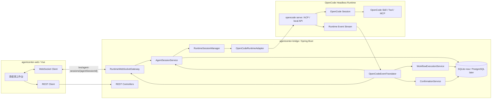
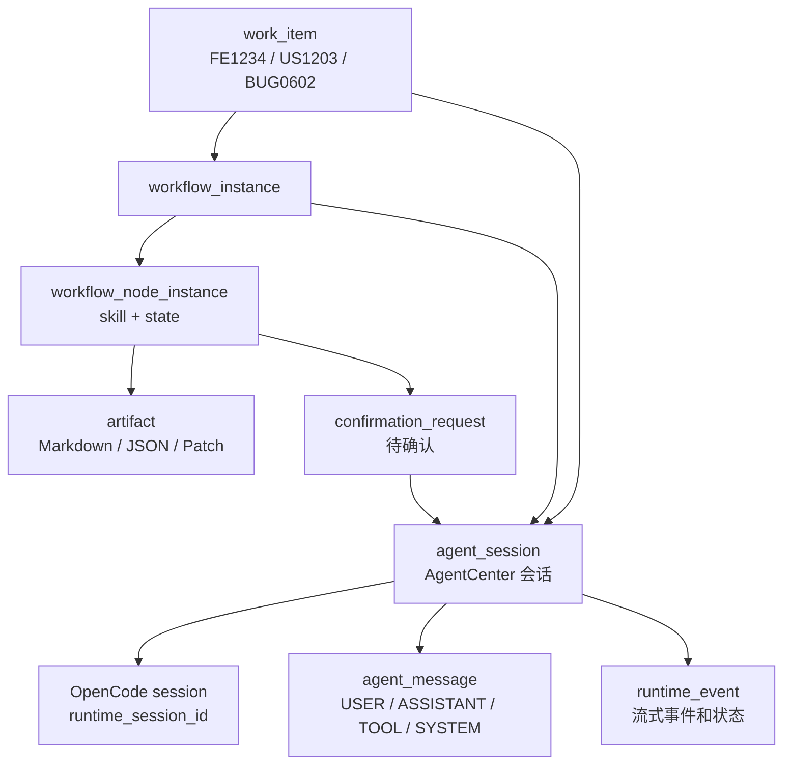

# OpenCode Bridge 目标状态设计

> 状态：目标方案（M1 实施决策见 [ADR-001](./ADR-001-OPENCODE-BRIDGE-SSE-REST.md)）
> 最近更新：2026-05-06
> ⚠️ M1 决策：采用 REST+SSE 方案（非 WebSocket），详见 ADR-001
> 目标读者：接手实现 Java Bridge、Vue 工作台和 OpenCode Runtime 适配的 Agent

## 1. 结论先行

AgentCenter 要做的不是一个 Mock 聊天页，也不是每次调用一次 `opencode run` 的脚本包装器。目标状态是：

- 浏览器只通过 AgentCenter Java Bridge 的 WebSocket 对话。
- Java Bridge 是企业平台控制面，负责会话、消息、事项、工作流、待确认、产物、审计和权限。
- OpenCode 是底层 Agent Runtime，通过常驻运行时接入，优先使用 `opencode serve` 或 OpenCode 提供的等价 headless API。
- `opencode run` 只能作为 CLI 可用性 smoke test，不作为产品对话链路。
- Mock 只能存在于单元测试和本地无 OpenCode 的演示 profile，不能作为默认产品路径。

最终目标：用户在网页输入一句话后，页面能实时看到 OpenCode 的模型输出、tool/skill 执行、待确认项和错误状态；刷新页面后会话和消息仍然存在。

## 2. 总体架构



## 3. 关键运行方式

### 3.1 常驻 OpenCode Runtime

Java Bridge 启动或首次需要运行时时，应该启动或附着到一个本机 OpenCode headless runtime。

推荐方式：

```text
opencode serve --hostname 127.0.0.1 --port <managed-port>
```

实现要求：

- Java 端管理 OpenCode 进程生命周期，或允许通过配置附着到已存在的 OpenCode 服务。
- 每个 AgentCenter 会话绑定一个 OpenCode session。
- OpenCode session id 写入 `agent_session.runtime_session_id`。
- Java 端持续订阅 OpenCode 的事件流，并翻译为 AgentCenter 统一事件。
- 浏览器不直接访问 OpenCode。

参考经验来自 `docs/prototype/opencode-bridge.md`：高保真原型曾记录过 `opencode serve`、`/event` SSE、`/session/{id}/prompt_async` 的接入经验。实现时应以当前本机 OpenCode 实际 API 为准，先做一个 OpenCode client contract test 固定真实接口。

### 3.2 不使用 `opencode run` 作为正式链路

不要把 Java WebSocket 消息实现成：

```text
收到用户消息 -> 启动 opencode run -> 等待进程退出 -> 返回完整文本
```

原因：

- 不是实时双向会话。
- 每条消息都是进程级调用，状态和事件难管理。
- tool/skill、permission、confirmation 等事件无法稳定投影到右侧待确认。
- 无法承载长会话、取消、暂停、恢复、并发控制和企业审计。

`opencode run --session` 可以续接 session，但仍然是命令式单次调用，不是目标架构。

## 4. 领域对象关系



`agent_session` 是 AgentCenter 自己的会话。`runtime_session_id` 只是外部 OpenCode 会话映射，不能直接暴露给前端当主键使用。

## 5. WebSocket 协议

前端连接：

```text
ws://<bridge-host>/ws/agent-sessions/{agentSessionId}
```

### 5.1 前端发送事件

```json
{
  "type": "user.message",
  "requestId": "req_001",
  "payload": {
    "content": "请继续完善 FE1234 的方案设计",
    "contentFormat": "TEXT"
  }
}
```

```json
{
  "type": "runtime.cancel",
  "requestId": "req_002",
  "payload": {
    "reason": "用户停止当前回复"
  }
}
```

```json
{
  "type": "confirmation.resolve",
  "requestId": "req_003",
  "payload": {
    "confirmationId": "cr_xxx",
    "action": "APPROVE",
    "comment": "继续执行"
  }
}
```

### 5.2 后端推送事件

```json
{
  "type": "session.connected",
  "payload": {
    "sessionId": "ags_xxx"
  }
}
```

```json
{
  "type": "message.assistant.delta",
  "payload": {
    "messageId": "msg_xxx",
    "delta": "这里是增量文本"
  }
}
```

```json
{
  "type": "message.assistant.completed",
  "payload": {
    "message": {
      "id": "msg_xxx",
      "role": "ASSISTANT",
      "content": "完整回复",
      "seqNo": 2
    }
  }
}
```

```json
{
  "type": "tool.started",
  "payload": {
    "toolName": "read",
    "runtimeToolCallId": "tool_xxx"
  }
}
```

```json
{
  "type": "confirmation.created",
  "payload": {
    "confirmationId": "cr_xxx",
    "title": "FE1234 build skill 等待确认",
    "agentSessionId": "ags_xxx"
  }
}
```

```json
{
  "type": "runtime.error",
  "payload": {
    "message": "OpenCode runtime disconnected"
  }
}
```

### 5.3 前端展示规则

- `user.message` 发送后，前端立即展示用户气泡，状态为 sending。
- Java 接受并持久化后推送 `message.user.accepted` 或 `session.snapshot`。
- 模型文本用 `message.assistant.delta` 增量展示。
- 完成后用 `message.assistant.completed` 固化消息。
- tool/skill 显示为对话中的执行卡片，同时写入右侧事件或待确认。
- 页面刷新后通过 REST 或 WebSocket snapshot 恢复完整消息。

## 6. Java 模块设计

目标模块：

```text
application/
  AgentSessionService
  RuntimeSessionManager
  RuntimeMessageService
  WorkflowExecutionService
  ConfirmationService

infrastructure/runtime/opencode/
  OpenCodeRuntimeAdapter
  OpenCodeProcessManager
  OpenCodeHttpClient
  OpenCodeEventSubscriber
  OpenCodeEventTranslator

api/websocket/
  RuntimeWebSocketGateway
  SessionWebSocketHandler

infrastructure/event/
  WebSocketSessionRegistry
  RuntimeEventPublisher
```

### 6.1 `RuntimeSessionManager`

职责：

- 创建或恢复 AgentCenter session。
- 创建或恢复 OpenCode session。
- 保存 `runtime_session_id`。
- 管理 session 状态：ACTIVE、RUNNING、WAITING_CONFIRMATION、ERROR、CLOSED。

### 6.2 `OpenCodeRuntimeAdapter`

职责：

- `createSession(context)`：创建 OpenCode session。
- `sendMessage(runtimeSessionId, message)`：向已有 OpenCode session 发送消息。
- `subscribe(runtimeSessionId)`：订阅 OpenCode 事件流。
- `runSkill(runtimeSessionId, skillName, inputContext)`：执行工作流节点 Skill。
- `cancel(runtimeSessionId)`：取消当前 turn。

注意：`sendMessage` 不应该只是返回一个字符串，它应该触发流式事件，最终由事件翻译器写入消息和产物。

### 6.3 `OpenCodeEventTranslator`

职责：

- 将 OpenCode 原始事件翻译成平台事件。
- 持久化 `agent_message`、`runtime_event`、`artifact`。
- 遇到权限、阻塞、异常、失败时生成 `confirmation_request`。
- 通过 WebSocket 推送给前端。

## 7. 工作流和 Skill

用户提到的 FE 节点可以按以下模式实现：

```text
FE1234
  节点 1：需求整理与完善
    skill: fe.requirement.refine
    input: work_item.description + 详情上下文
    output: requirement-design.md

  节点 2：方案设计
    skill: fe.solution.design
    input: 节点 1 markdown + work_item 上下文
    output: solution-design.md

  节点 3：实施计划
    skill: fe.implementation.plan
    input: 节点 2 markdown + 约束
    output: implementation-plan.md

  节点 4：完成
    input: 前序产物
    output: 状态完成和归档记录
```

工作流执行要求：

- 节点必须按 `workflow_node_definition.order_no` 顺序执行。
- 后续节点必须拿到上一个节点的 `output_artifact_id`。
- 每个节点绑定同一个 AgentCenter 任务会话，或明确绑定节点级会话，但前端必须能一键进入对应会话。
- 节点遇到用户确认、审批、权限请求、异常或失败时，写入 `confirmation_request`，右侧显示在“待确认”。
- 用户点击“处理”时进入该确认项绑定的 `agent_session_id`。

## 8. Vue 工作台目标行为

首页、看板、工作流、对话四个中心视图都必须使用同一套会话模型：

- 首页事项卡点击：右侧显示详情。
- 详情点击“进入会话”：创建或打开事项一对一任务会话。
- 首页事项卡点击“开始”：启动对应事项工作流。
- 看板卡片点击：右侧显示详情。
- 详情“进入会话”进入同一个事项任务会话。
- 待确认点击“处理”：进入该确认项绑定的工作流会话。
- 左侧会话列表分为“通用会话”和“任务会话”；任务会话默认折叠。
- 对话区不能空白等待，至少要展示连接状态、用户消息和运行中状态。

## 9. 实现里程碑

### M0：移除误导路径

- 默认 runtime 不再是 MOCK。
- 前端不再写死 `runtimeType: 'MOCK'`。
- `opencode run` 只保留为 smoke test，不进入主链路。
- 健康检查不能在没有真实 adapter 时假报 `opencode` 可用。

### M1：真实 OpenCode 会话

- Java 能启动或附着 `opencode serve`。
- Java 能创建 OpenCode session，并保存 `runtime_session_id`。
- Java 能向同一个 OpenCode session 发送多轮消息。
- Java 能订阅并解析 OpenCode 事件流。
- WebSocket 能把 assistant delta 推到 Vue。

### M2：消息和事件持久化

- USER、ASSISTANT、TOOL、SYSTEM 全部落 `agent_message`。
- tool/skill 状态落 `runtime_event`。
- 刷新页面后恢复完整对话。
- 同一会话第二轮能保留上下文。

### M3：工作流和待确认

- FE 工作流节点串联 OpenCode skill。
- 节点产物落 `artifact`。
- 需要用户确认时生成 `confirmation_request`。
- 待确认“处理”能进入对应会话，并继续工作流。

### M4：验收和回归

- Playwright 覆盖真实网页对话。
- Java 集成测试覆盖 OpenCode adapter contract。
- 页面截图和 WebSocket 消息证据归档。

## 10. 验收标准

必须全部满足：

- 打开 `http://127.0.0.1:5173/`，点击左侧新建通用会话，左侧会话列表立刻出现新会话。
- 输入一句话，页面立即出现用户消息。
- 10 秒内开始出现 OpenCode assistant 文本增量，最终展示完整回复。
- 刷新页面后，用户消息和 assistant 回复仍在。
- 再发送第二句，OpenCode 使用同一个 `runtime_session_id` 继续上下文。
- 点击 FE1234 “开始”或详情“进入会话”，创建任务会话而不是 Mock 会话。
- 右侧“待确认”点击“处理”，进入该确认项绑定的一对一会话。
- `agent_session.runtime_type` 为 `OPENCODE`，非测试路径不出现 `MOCK`。
- 后端日志和 DB 能查到 OpenCode session id、消息、事件和产物。

