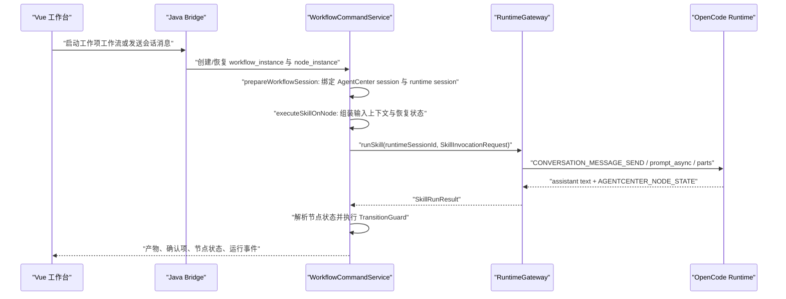

# OpenCode 上下文压缩状态保持方案（1026 分支）

> 状态：1026 分支现状分析与增量修复方案
> 分支：`codex/from-2026-05-14-1026`
> 最近更新：2026-05-15

## 背景

用户反馈：在 OpenCode 上下文压缩之后，页面对话还能继续，但人任务进度容易丢失；底层 OpenCode 也不知道当前工作流已经推进到哪里。最新分支包含一批相关修复，但当前 1026 分支不适合直接合并最新分支，因此本方案只面向 1026 分支做可控增量修复。

本问题的本质不是单纯的“提示词不够长”，而是“Bridge 拥有的工作流状态”和“OpenCode 当前会话记忆”之间缺少足够强的恢复闭环：

- Bridge 才是工作项、工作流、节点、确认项、运行事件的 source of truth。
- OpenCode 只接收每轮注入的输入上下文和节点状态协议，不应成为业务进度主数据源。
- 上下文压缩后，如果用户的继续指令绕开了工作流节点执行入口，就不会重新注入完整进度，OpenCode 会根据压缩后的会话摘要猜测当前做到哪里。

## 当前结论

1. 工作流推进由 `WorkflowCommandService` 驱动，不由 OpenCode 自己推进。OpenCode 只在回复末尾输出 `AGENTCENTER_NODE_STATE`，Bridge 解析后决定是否完成节点、创建待确认或继续等待。
2. 提示词注入发生在每次工作流节点执行或节点恢复时：`executeSkillOnNode` 组装工作项、当前节点、上游产物、用户交互回答和恢复状态，再通过 `OpenCodeRuntimeAdapter` 的 `prompt_async` parts 发给 OpenCode。
3. 1026 分支已经有上下文压缩检测和恢复提示，但它只覆盖重新进入 `runSkill` 的路径；大多数 `CONTINUE_CURRENT` 会直接裸发一条 runtime prompt，绕开完整上下文注入，这是当前最主要的丢状态入口。
4. `runtime_operation` 表和 `skill.run` 类型已经存在，但当前 `DefaultRuntimeGateway.runSkill(...)` 没有创建 operation 记录。系统无法稳定回答“底层 OpenCode 这次节点执行到底派发到哪里、是否被接收、是否已经完成”。
5. `workflow_node_instance.agent_state_payload_json` 当前是在结果返回后才写入，缺少“派发前”的持久化调用账本。服务重启、OpenCode 压缩、权限等待或长时间等待时，恢复逻辑没有一个可靠的 last dispatched invocation。

## 当前工作流如何推进



关键代码位置：

- 用户消息进入工作流路由：`agentcenter-bridge/src/main/java/com/agentcenter/bridge/application/AgentSessionService.java:251`
- `CONTINUE_CURRENT` 当前分支逻辑：`agentcenter-bridge/src/main/java/com/agentcenter/bridge/application/AgentSessionService.java:301`
- 节点调度入口：`agentcenter-bridge/src/main/java/com/agentcenter/bridge/application/WorkflowCommandService.java:1530`
- 节点执行入口：`agentcenter-bridge/src/main/java/com/agentcenter/bridge/application/WorkflowCommandService.java:638`
- 会话准备与上下文注册：`agentcenter-bridge/src/main/java/com/agentcenter/bridge/application/WorkflowCommandService.java:657`
- 节点完成、待确认和自动推进决策：`agentcenter-bridge/src/main/java/com/agentcenter/bridge/application/WorkflowCommandService.java:840`

推进规则：

- `READY_TO_ADVANCE`：如果是自动模式，当前节点完成并调度下一节点；如果是手动模式，创建 `WORKFLOW_ADVANCE` 待确认。
- `NEEDS_USER_INPUT`：创建或复用待确认，节点进入 `WAITING_CONFIRMATION`。
- `BLOCKED`：创建异常确认，节点保持等待处理。
- `IN_PROGRESS`：节点继续保持 `RUNNING`，不产生产物、不推进。

## 什么时候注入提示词

工作流节点每次执行时都会走 `WorkflowCommandService.executeSkillOnNode(...)`：

1. `WorkflowContextAnchorService.decide(...)` 检查最近 runtime events 中是否有 OpenCode compaction，且是否尚未完成 context anchor 注入。
2. `buildInputContext(...)` 组装工作项、当前节点、上游产物、用户交互回答、本轮用户补充输入和可选的 `AGENTCENTER_CONTEXT_ANCHOR`。
3. `buildResumeState(...)` 生成 `workflowInstanceId`、`workflowNodeInstanceId`、`workItemId`、`runtimeSessionId`、当前 gate、工作流顺序、待处理交互和本次 `invocationId`。
4. `WorkflowPromptComposer.composeInvocationRequest(...)` 把 `AGENTCENTER_RESUME_STATE` 追加到用户输入上下文后面。
5. `OpenCodeRuntimeAdapter.buildSkillParts(...)` 生成三个 text parts：
   - Part 1：Skill 调用说明、工作方式、Runtime workspace 边界。
   - Part 2：输入上下文，包括工作项、节点、上游产物、交互回答、恢复状态。
   - Part 3：AgentCenter 节点状态协议。
6. `OpenCodeRuntimeAdapter.dispatchMultiPartPrompt(...)` 通过 `CONVERSATION_MESSAGE_SEND` 发给 OpenCode 的 `prompt_async`。

代码位置：

- 压缩检测：`agentcenter-bridge/src/main/java/com/agentcenter/bridge/application/WorkflowContextAnchorService.java:35`
- 恢复锚点输入：`agentcenter-bridge/src/main/java/com/agentcenter/bridge/application/WorkflowContextAnchorService.java:77`
- 恢复状态组装：`agentcenter-bridge/src/main/java/com/agentcenter/bridge/application/WorkflowCommandService.java:964`
- `AGENTCENTER_RESUME_STATE` 注入：`agentcenter-bridge/src/main/java/com/agentcenter/bridge/application/workflow/WorkflowPromptComposer.java:132`
- OpenCode 多段 prompt 构造：`agentcenter-bridge/src/main/java/com/agentcenter/bridge/infrastructure/runtime/opencode/OpenCodeRuntimeAdapter.java:354`
- OpenCode `prompt_async` 派发：`agentcenter-bridge/src/main/java/com/agentcenter/bridge/infrastructure/runtime/opencode/OpenCodeRuntimeAdapter.java:498`

也就是说，目前不是通过一个独立的“系统提示词注入接口”告诉 OpenCode，而是每轮工作流节点执行时，把 AgentCenter 的状态作为 `prompt_async.parts` 的多段文本一起发送给 OpenCode。

## 1026 分支已有保护

1026 分支已经有三层保护：

1. 压缩事件识别：`OpenCodeRuntimeEventTranslator` 会把 `part.type=compaction` 翻译成 `PROCESS_TRACE`，供后续恢复判断使用。
2. 上下文恢复锚点：`WorkflowContextAnchorService` 如果发现 compaction 晚于上次 anchor，就注入 `AGENTCENTER_CONTEXT_ANCHOR`，明确要求以本轮重新注入的工作项、当前节点、上游产物和用户回答为准。
3. 节点推进守卫：`WorkflowNodeTransitionGuard` 会拒绝明显不安全的 `READY_TO_ADVANCE`，例如当前节点不匹配、仍有待处理交互、或者没有可持久化产物。

相关代码：

- compaction 翻译：`agentcenter-bridge/src/main/java/com/agentcenter/bridge/infrastructure/runtime/opencode/OpenCodeRuntimeEventTranslator.java:413`
- context anchor 发布：`agentcenter-bridge/src/main/java/com/agentcenter/bridge/application/WorkflowContextAnchorService.java:91`
- 节点推进守卫：`agentcenter-bridge/src/main/java/com/agentcenter/bridge/application/workflow/WorkflowNodeTransitionGuard.java:15`

这些机制能解决“重新进入节点执行时如何补上下文”，但还没有解决“所有继续路径都必须重新进入节点执行”和“派发中的节点执行怎么持久追踪”。

## 当前缺口

### 1. `CONTINUE_CURRENT` 可能绕开完整上下文注入

`AgentSessionService.continueCurrentRuntime(...)` 只有在 `recoveryRequired(...)` 返回 true 时才走 `workflowCommandService.resumeNodeAfterInteraction(...)`。否则它会注册一次 workflow context，然后直接 `dispatchToRuntime(session, prompt)`。

这个直接派发路径只给 OpenCode 一条继续指令，不包含：

- 当前工作项详情
- 当前节点 ID 与节点顺序
- 上游产物
- 待处理交互
- 本轮 invocationId
- `AGENTCENTER_RESUME_STATE`
- 节点状态协议约束

因此，只要 OpenCode 压缩检测没有命中、事件缺失、用户刷新后映射不足，或者压缩摘要本身含糊，OpenCode 就可能不知道当前节点实际进度。

### 2. `skill.run` 没有进入 runtime operation 账本

`runtime_operation` 表具备 `agent_session_id`、`runtime_session_id`、`work_item_id`、`workflow_instance_id`、`workflow_node_instance_id`、`command_json`、`ack_json`、状态和外部 operation 字段。`RuntimeOperationType` 也已经有 `SKILL_RUN("skill.run")`。

但 `DefaultRuntimeGateway.runSkill(...)` 当前直接调用 provider，没有创建 `skill.run` operation。结果是：

- 只能看到 `skill.scan`、`mcp.refresh` 等管理类 operation。
- 看不到某个节点执行是否已经派发。
- 看不到 OpenCode 是否 ack。
- 看不到最后一个 runtime event 属于哪次 invocation。
- 服务重启后无法从 operation 还原“底层 OpenCode 进行到哪里”。

### 3. 节点状态 payload 写入太晚

`buildAgentStatePayloadJson(...)` 当前在结果返回后才写 `invocationId`、`currentGate`、`reportedState`、`effectiveState`、`pendingInteractionIds`。

如果在 `runSkill` 等待期间发生以下情况，DB 中没有稳定的“派发前账本”：

- OpenCode 上下文压缩
- Bridge 线程等待超时
- Bridge 重启
- OpenCode 权限确认等待
- OpenCode serve 进程重启
- 用户刷新页面后点继续

### 4. 部分 runtime event 没有完整 workflow/node 绑定

`OpenCodeRuntimeEventTranslator` 中 `buildContextEnvelope(...)` 会从 translation context 带上 work item、workflow、node；但 `buildEnvelope(...)` 生成的通用事件不带这些字段。

当前 `QUESTION_REQUESTED` 已经使用 context envelope，而 `PERMISSION_REQUESTED` 仍使用普通 envelope。权限类待确认如果丢失 workflow/node 绑定，后续用户批准后就难以准确恢复当前节点。

### 5. Skill/MCP 刷新会清理映射并重启 OpenCode

`OpenCodeRuntimeAdapter.refreshSkills(...)`、`refreshMcps(...)` 会清空 `agentToOpencodeSession`、`sessionWorkingDirectories`、`cancelGenerations` 并重启 OpenCode。运行中的工作流如果正好遇到刷新，Bridge 侧 session 到 OpenCode session 的映射会被破坏。

## 1026 分支增量解决方案

### P0：先固定文档和认知

先把本文档作为 1026 分支的分析基线。后续修复只围绕本文档列出的路径，不通过直接合并最新分支解决。

### P1：所有工作流继续都回到节点执行入口

修改 `AgentSessionService.continueCurrentRuntime(...)`：

- 只要存在 `workflowInstanceId` 和 `nodeInstanceId`，`CONTINUE_CURRENT` 都走 `workflowCommandService.resumeNodeAfterInteraction(nodeInstanceId, continuePrompt)`。
- 不再根据 `recoveryRequired(...)` 决定是否裸发 runtime prompt。
- 只有找不到 workflow 或 node 时，才降级为普通 runtime dispatch，并记录 warning。

预期效果：

- 用户点继续、补充、调整、追问时，都会重新注入完整工作项、当前节点、上游产物、待处理交互和 `AGENTCENTER_RESUME_STATE`。
- OpenCode 压缩检测即使没有命中，也能在下一轮收到 Bridge 的权威进度。
- 这是 1026 分支最小、收益最大的修复点。

### P2：在派发前写入节点恢复账本

在 `executeSkillOnNode(...)` 生成 `resumeState` 后、调用 `runtimeGateway.runSkill(...)` 前，先更新 `workflow_node_instance.agent_state_payload_json`。

建议字段：

```json
{
  "phase": "DISPATCHING",
  "invocationId": "ulid",
  "runtimeOperationId": "ulid-or-null-before-p3",
  "currentGate": "NODE_EXECUTION",
  "workflowInstanceId": "xxx",
  "workflowNodeInstanceId": "xxx",
  "runtimeSessionId": "xxx",
  "skillName": "xxx",
  "pendingInteractionIds": [],
  "resumeRequired": true,
  "dispatchedAt": "yyyy-MM-dd HH:mm:ss"
}
```

结果返回后再把 `phase` 更新为 `COMPLETED`、`WAITING_USER`、`FAILED` 或 `REJECTED_TRANSITION`，并保留同一个 `invocationId`。

预期效果：

- 页面或恢复逻辑可以明确知道当前节点最后一次派发的调用。
- Bridge 重启后能从节点实例判断是否需要补发恢复提示，而不是只依赖 OpenCode 对话记忆。

### P3：把 `skill.run` 纳入 `runtime_operation`

扩展 `DefaultRuntimeGateway.runSkill(...)` 或新增 workflow 专用运行入口，使节点执行进入现有 operation 生命周期：

- operationType：`skill.run`
- resourceType：`skill`
- resourceId：`skillName`
- agentSessionId：AgentCenter session ID
- runtimeSessionId：OpenCode session ID
- workItemId / workflowInstanceId / workflowNodeInstanceId：来自 workflow context
- correlationId：`invocationId`
- commandJson：包含 skillName、instructionInjectionMode、prompt parts 摘要或哈希
- ackJson：OpenCode `prompt_async` ack
- 状态：`CREATED -> DISPATCHING -> ACCEPTED/IN_PROGRESS -> SUCCEEDED/FAILED/TIMED_OUT`

1026 分支可以先做轻量版：

- 派发前创建 operation。
- `prompt_async` ack 成功后转 `ACCEPTED`。
- 收到 assistant result 后转 `SUCCEEDED`。
- 等待超时或 transport error 后转 `FAILED` 或 `TIMED_OUT`。

预期效果：

- 可以稳定回答“这次节点执行派发了吗、OpenCode 接收了吗、最后一次事件是什么、是不是超时”。
- 后续恢复可以按 operation 找回工作流和节点，而不是反查不完整事件。

### P4：推进守卫校验 invocation 与 operation

扩展 `WorkflowNodeTransitionGuard`：

- `READY_TO_ADVANCE` 必须来自当前节点最新 `invocationId`。
- 如果存在运行中或等待中的 `runtimeOperationId`，不接受旧 invocation 的完成输出。
- 如果 pending interaction 不为空，继续拒绝 `READY_TO_ADVANCE`。

预期效果：

- OpenCode 压缩后重复输出旧节点结果，不会推进当前节点。
- 子 Agent 或历史摘要中出现的状态块不能代表主 Agent 推进工作流。

### P5：修复权限事件的 workflow/node 绑定

把 `PERMISSION_REQUESTED` 改为使用 `buildContextEnvelope(...)`，并确保 permission confirmation 写入：

- workItemId
- workflowInstanceId
- workflowNodeInstanceId
- agentSessionId
- runtimeSessionId
- runtimeOperationId 或 invocationId

用户批准权限后：

- 如果能定位 node，则回到 `resumeNodeAfterInteraction(...)`。
- 如果缺少 node，则根据 active `skill.run` operation 修复绑定。
- 如果仍无法定位，则创建“需要人工恢复”的异常确认，不直接裸发继续指令。

### P6：刷新 Skill/MCP 时保护活跃会话

1026 分支不需要一次性引入完整运行资源目标态，但至少要避免刷新动作破坏运行中的 workflow session：

- 有活跃 workflow node 时，不清空 session 映射。
- 不直接重启正在使用的 OpenCode 进程。
- 将刷新标记为 `reloadRequired`，等当前节点结束后再生效。
- 如果必须重启，先把相关 operation 标为 interrupted，并让页面显示可恢复状态。

## 推荐实施顺序

1. P1：统一 `CONTINUE_CURRENT` 到 `resumeNodeAfterInteraction`。这是最高优先级，因为它直接解决“继续时丢工作流进度”。
2. P2：派发前写节点恢复账本。让 DB 先拥有 last invocation。
3. P3：补 `skill.run` operation。让运行态可追踪、可恢复、可解释。
4. P5：修复权限事件上下文。防止 permission 待确认脱离工作流节点。
5. P4：增加 invocation/operation 守卫。降低旧输出误推进风险。
6. P6：保护刷新期间活跃会话。避免资源管理操作打断运行中工作流。

## 验收标准

最小可验收闭环：

1. 启动一个工作流节点，OpenCode 发生 compaction 后，用户点“继续当前节点”，下一轮 prompt 中必须包含 `AGENTCENTER_RESUME_STATE`。
2. 用户普通补充输入、`CONTINUE_CURRENT`、待确认回答三种入口，都必须重新进入 `executeSkillOnNode(...)`。
3. `workflow_node_instance.agent_state_payload_json` 在 runtime 返回前就能看到本次 `invocationId` 和 `phase=DISPATCHING`。
4. `runtime_operation` 中能看到 `skill.run`，并能按 workflow/node/session 查到状态。
5. OpenCode 输出旧节点或 pending interaction 未完成时，Bridge 拒绝 `READY_TO_ADVANCE`。
6. 权限确认产生的 confirmation 必须带 workflow/node 绑定，批准后能回到当前节点恢复执行。

建议测试：

- 单元测试：`WorkflowContextAnchorServiceTest`
- 单元测试：`WorkflowPromptComposerTest`
- 单元测试：`WorkflowNodeTransitionGuardTest`
- 集成测试：`WorkflowMidSessionInputRoutingIntegrationTest`
- 新增测试：`CONTINUE_CURRENT` 在 workflow session 中必须调用 `resumeNodeAfterInteraction`
- 新增测试：`skill.run` operation 生命周期
- 新增测试：permission requested event 带 workflow/node context

## 与最新分支的关系

最新分支里已有若干相关修复，例如继续交互可重试、刷新后保留 serve 生命周期、权限批准后继续工作流、runtime failure 状态同步等。但当前 1026 分支不适合直接合并最新分支。

因此，本方案采用“只挑问题机制，不合并整支分支”的策略：

- 不直接 merge 最新分支。
- 不改前端大结构。
- 不引入新的消息队列或 WebSocket 架构。
- 优先复用 1026 已有的 `WorkflowContextAnchorService`、`WorkflowPromptComposer`、`RuntimeOperationService` 和 `runtime_operation` 表。
- 每个补丁都要能用现有 Maven 测试和新增定向测试证明。

## 决策

短期决策：

- 1026 分支先修 Bridge 编排路径，而不是要求 OpenCode 自己记住业务进度。
- 所有工作流多轮输入都必须回到 `executeSkillOnNode(...)`。
- `AGENTCENTER_RESUME_STATE` 是上下文压缩后的权威恢复载体。
- `runtime_operation` 是回答“底层 OpenCode 进行到哪里”的权威运行账本。

长期方向：

- Runtime Adapter 只负责传输和事件翻译，不拥有业务状态。
- Workflow Engine 拥有业务状态、推进守卫和恢复策略。
- Conversation UI 展示 runtime 过程，但不得以 OpenCode 的压缩摘要替代 Bridge 的工作流状态。
