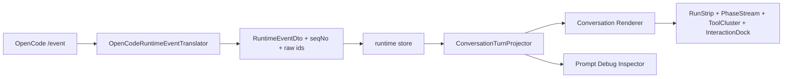

# OpenCode Conversation Live Progress Implementation Plan

> 状态：目标态已确认 / 待实施
> 最近更新：2026-05-11
> 对应设计：[CONVERSATION-UI-EVENT-MAPPING-DESIGN.md](./CONVERSATION-UI-EVENT-MAPPING-DESIGN.md)
> 原型基线：[opencode-conversation-target-hifi.html](../../agentcenter-web/public/prototypes/opencode-conversation-target-hifi.html)

---

## 1. 目标

将 OpenCode 对话 UI 从“事件时间线 / 活动面板”改为目标态动态过程展示：

```text
用户输入
  -> Agent 运行条呼吸
  -> 当前阶段自动展开
  -> 段内文本、工具摘要和主回答流式写入
  -> 阶段结束后自动收起为摘要
  -> 权限/问题交互占用输入区位置
  -> 异常以可恢复块展示
```

核心体验：

- 当前阶段必须自动展开，历史阶段默认摘要化。
- 段内文本必须流式写入，不能整块突然冒出。
- 工具生命周期只展示必要状态和短摘要，完整 payload 进入调试。
- OpenCode 外部目录授权必须展示 `允许一次 / 本次会话允许同类请求 / 拒绝`。
- OpenCode 不响应、SSE 断开、权限提交失败、工具失败都必须可恢复。

不做：

- 不展示私有思维链。
- 不让前端直连 OpenCode。
- 不把 step-start、step-finish、heartbeat 渲染成独立主 UI 行。
- 不把 Prompt Debug 内容塞进主对话。

---

## 2. 目标架构



分工：

- Translator：保留 OpenCode 原始语义和 raw payload。
- Store：保存事件、消息、确认项和运行状态，不决定 UI 层级。
- Projector：排序、合并同一生命周期、生成阶段段落、决定 displayPolicy。
- Renderer：负责流式写入、自动展开/收起、手动钉住和异常块。
- Debug：展示 raw event、prompt、tokens、snapshot、映射说明。

---

## 3. 阶段状态机

```text
pending
  -> active
  -> streaming
  -> settling
  -> summarized

active / streaming
  -> waiting_input
  -> failed

summarized
  -> pinned_expanded
```

规则：

- `active` / `streaming`：自动展开，运行条呼吸。
- `settling`：完成后停留 400-800ms，避免用户错过最后一行。
- `summarized`：自动收起，只保留标题、摘要、状态和“展开详情”。
- `pinned_expanded`：用户手动展开历史后，不被自动收起覆盖。
- `waiting_input`：权限/问题卡占用输入区位置。
- `failed`：异常块可见，提供重连、重试或查看调试。

---

## 4. 实施阶段

### Phase 1：Projector 补 Live Progress 语义

文件候选：

- `agentcenter-web/src/components/conversation/projection/types.ts`
- `agentcenter-web/src/components/conversation/projection/conversationTurnProjector.ts`
- `agentcenter-web/src/components/conversation/projection/conversationTurnProjector.test.ts`

任务：

1. 增加阶段段落、工具组、流式字段、displayPolicy、autoCollapse、pinned 状态表达。
2. 将 `ASSISTANT_DELTA` / text part delta 合并到主回答或当前文本段落，不生成执行步骤。
3. 将 reasoning part 投影为公开摘要段，默认运行中展开、完成后收起。
4. 将 read / glob / grep / bash / MCP_CALL 投影为同一阶段内的工具组。
5. 将 step-start / step-finish / status 映射为运行条和阶段状态。
6. 将 permission/question 投影为输入区交互卡，并保留触发阶段归属。
7. 将 SSE disconnect / runtime timeout / tool failed 投影为可恢复异常段。

验收：

- 同名工具多次调用不会被错误合并。
- 完成工具组可折叠成一行摘要。
- `permission.replied` 不显示成 Agent 输出。
- 历史回放和实时流顺序一致。

### Phase 2：主对话动态渲染

文件候选：

- `agentcenter-web/src/components/conversation/MessageList.vue`
- `agentcenter-web/src/components/conversation/RuntimeErrorInline.vue`
- 新增 `RunStrip.vue`
- 新增 `ConversationPhaseStream.vue`
- 新增 `ToolLifecycleCluster.vue`
- 新增 `StreamText.vue`

任务：

1. `MessageList.vue` 使用 projection 渲染，不再自己按 eventType 分组。
2. `RunStrip` 展示当前阶段、动作摘要和呼吸灯。
3. `ConversationPhaseStream` 实现 active 自动展开、settling 后自动收起。
4. `StreamText` 支持 answer、summary、tool title、tool summary、permission path 的增量写入。
5. `ToolLifecycleCluster` 运行中展开，完成后折叠成摘要。
6. 手动展开历史段落后进入 pinned，不被自动收起。
7. 主回答保持文本优先，不放入工具组或活动面板。
8. 同一回合运行中只保留一个主动输出焦点：活动流运行时正文先缓冲，活动流完成并折叠后再展示正文。
9. 列表滚动只在用户贴近底部时平滑跟随；activity/正文切换用渐入位移过渡，不瞬间跳帧。

验收：

- 用户输入后能看到真实流式过程。
- 当前阶段自动展开，完成后自动收起。
- 历史阶段手动展开后保持展开。
- 工具运行只显示必要状态和短摘要。
- 新内容进入视野时是平滑位移；用户正在读历史时不会被自动拉到底部。

### Phase 3：输入区交互卡与权限三态

文件候选：

- `agentcenter-web/src/components/conversation/ConversationInteractionBar.vue`
- `agentcenter-web/src/components/conversation/ConversationInteractionBar.test.ts`
- `agentcenter-web/src/views/ConversationWorkbench.vue`
- `agentcenter-bridge/src/main/java/com/agentcenter/bridge/application/runtime/translation/PermissionConfirmationHandler.java`
- `agentcenter-bridge/src/test/java/com/agentcenter/bridge/api/ConfirmationResolveRoutingIntegrationTest.java`

任务：

1. 交互卡直接占用输入区位置。
2. 权限卡展示 OpenCode permission、filePath、always scope。
3. 权限按钮固定映射：
   - `允许一次` -> `reply=once`
   - `本次会话允许同类请求` -> `reply=always`
   - `拒绝` -> `reply=reject`
4. 多问题用 tab 切换，最后一个 tab 做预览与提交。
5. 提交失败保持 pending，并显示可恢复错误。

验收：

- 外部目录授权不显示成普通选择题。
- reject / once / always 都能正确发到 OpenCode permission endpoint。
- 交互失败不清空用户待处理状态。

### Phase 4：异常和防呆体系

文件候选：

- `agentcenter-web/src/stores/runtime.ts`
- `agentcenter-web/src/views/ConversationWorkbench.vue`
- `agentcenter-bridge/src/main/java/com/agentcenter/bridge/api/RuntimeEventStreamController.java`
- `agentcenter-bridge/src/main/java/com/agentcenter/bridge/infrastructure/runtime/opencode/OpenCodeEventSubscriber.java`
- `agentcenter-bridge/src/main/java/com/agentcenter/bridge/application/runtime/RuntimeOperationTimeoutScheduler.java`

任务：

1. SSE disconnect：显示可恢复异常块，保留已有消息和 pending interaction。
2. OpenCode no response：运行条进入 timeout 状态，给重试/刷新 Skill/查看调试入口。
3. permission reply failure：确认项保持 pending，不清空输入区卡片。
4. tool failed：当前工具组保持展开，失败行可见。
5. duplicate events：用 event id / seqNo / lifecycle key 去重。
6. stale session：重新进入会话后从 Bridge 回放 projection，恢复 UI 状态。

验收：

- 断线重连后顺序一致。
- OpenCode 无响应时不会无限显示 running。
- 权限请求不会丢在后台活动面板里。
- raw payload 可从 Prompt Debug 复制。

---

## 5. 测试矩阵

| 场景 | 期望 |
|------|------|
| text delta streaming | 主回答逐步增长，不生成独立步骤 |
| reasoning streaming | 当前思考段自动展开，完成后自动收起 |
| read + grep + bash | 工具组运行中展开，完成后摘要折叠 |
| MCP_CALL running | 只显示呼吸状态和短摘要 |
| tool failed | 失败行保持展开，可见错误 |
| external_directory permission | 输入区权限卡显示 once / always / reject |
| permission reject | Agent 收到 reject，确认项不误标 approve |
| permission reply 失败 | 确认项保持 pending，显示可恢复错误 |
| 多问题交互 | tab 切换问题，最终 tab 预览提交 |
| SSE disconnect | 可恢复异常块，已有消息不丢 |
| OpenCode no response | timeout 状态，不无限 running |
| history replay | 回放和实时流顺序一致 |
| duplicate events | 不重复展示工具行或系统行 |
| prompt debug | 能复制原始事件和 UI 映射说明 |

验证命令：

```bash
cd agentcenter-web
npm run typecheck
npm run test -- conversationTurnProjector MessageList ConversationInteractionBar ConversationWorkbench

cd ../agentcenter-bridge
./mvnw -Dtest=OpenCodeRuntimeEventTranslatorTest,ConfirmationResolveRoutingIntegrationTest,RuntimeEventEnvelopeDispatcherTest test
```

UI evidence：

- 流式 reasoning 正在写入。
- 工具组运行中展开。
- 工具组完成后自动收起。
- OpenCode external_directory 权限卡。
- SSE / Runtime 异常可恢复块。

---

## 6. 开放问题

1. 历史回放是否还播放流式动画？
   - 建议：不播放，直接显示完整文本；只有 live event 做流式动画。
2. 手动展开状态是否跨刷新保存？
   - 建议：第一版只保存在前端内存。
3. 工具输出多长进入主 UI？
   - 建议：默认只显示摘要；完整输出进入 Prompt Debug，失败输出截断展示前 20 行。
4. 子 Agent / subtask 是否复用 PhaseStream？
   - 建议：复用阶段模型，子 Agent 作为 `kind=subtask` 段落。
