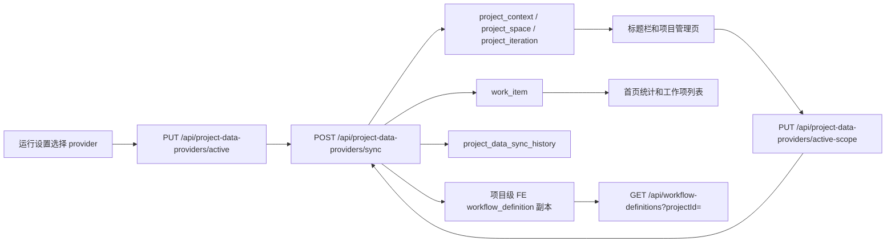

# 项目上下文贯通设计

> 状态：Bridge Provider + Web 消费链路已落地。后续企业内部只需要实现新的 `ProjectDataProvider`，不再改前端 mock。

## 目标

项目上下文是 AgentCenter 的全局运行作用域：当前 provider、项目、CloudeReq 项目、空间、迭代共同决定首页统计、工作项列表、标题栏迭代下拉和任务编排配置。

本版已经取消前端项目/迭代占位数据。测试数据也从后端 fixture provider 返回，和企业内部 provider 使用同一个接口契约。

## 运行链路

切换迭代时，前端重新请求：

- `GET /api/work-items?providerId=&projectId=&spaceId=&iterationId=`
- `GET /api/work-items/overview?providerId=&projectId=&spaceId=&iterationId=`

因此 FE、US、TASK、WORK、BUG、VULN 都会随当前 provider/project/space/iteration 变化。

Scope 参数不使用展示名：

| 参数 | 来源 |
|------|------|
| `providerId` | 当前 `ProjectDataProvider.id()` |
| `projectId` | `${providerId}:${ProjectContextDto.externalProjectId}` |
| `spaceId` | `ProjectContextDto.externalSpaceId` |
| `iterationId` | `ProjectContextDto.externalIterationId` |

项目名、空间名和迭代名只负责展示，企业内部存在同名项目或同名 Sprint 时仍按 external id 隔离。

## 后端端点

| Method | Endpoint | 用途 |
|--------|----------|------|
| `GET` | `/api/project-data-providers` | Provider 列表、当前 provider、当前 active scope |
| `PUT` | `/api/project-data-providers/active` | 切换全局 provider |
| `GET` | `/api/project-data-providers/snapshot` | 读取当前 provider 快照，不写库 |
| `POST` | `/api/project-data-providers/sync` | 拉取 provider 快照并写入通用表 |
| `GET` | `/api/project-data-providers/sync-history?providerId=&limit=` | 查看同步历史 |
| `GET` | `/api/work-items?providerId=&projectId=&spaceId=&iterationId=` | 当前上下文工作项 |
| `GET` | `/api/work-items/overview?providerId=&projectId=&spaceId=&iterationId=` | 当前上下文首页统计 |
| `GET` | `/api/workflow-definitions?projectId=` | 当前项目任务编排 |
| `PUT` | `/api/workflow-definitions/{id}` | 保存当前项目任务编排新版本 |

## 表结构

| 表 | 说明 |
|----|------|
| `project_provider_setting` | 全局 provider、当前生效 context/space/iteration，以及保存后的稳定 scope |
| `project_context` | Provider 下的项目和 CloudeReq 项目 |
| `project_space` | Provider 下的空间 |
| `project_iteration` | Provider 下的迭代 |
| `work_item` | 工作项；新增 `provider_id`、`external_work_item_id`、`project_context_id`、`project_space_id`、`project_iteration_id`、`extra_json` |
| `project_data_sync_history` | 每次同步的 provider、状态、数量、active scope、错误信息 |
| `workflow_definition` | 任务编排；新增 `project_id`，同步项目时为每个项目补齐 FE 默认工作流副本 |

`work_item` 的同步幂等键是 `(provider_id, external_work_item_id)`。前端查询必须带 `providerId` 和稳定 scope key，避免不同实现位返回同名项目/同名 Sprint 时串数据。

FE 工作流的隔离规则是：每个项目使用自己的 `workflow_definition.project_id = providerId + ':' + externalProjectId`。`POST /api/project-data-providers/sync` 会检查本次同步出现的项目，如果没有 FE 工作流，就从默认项目复制一份 FE 默认工作流和节点；如果已经存在项目级 FE 工作流，则保留项目自己的版本，不会被后续同步覆盖。

## Frontend Wiring

主要文件：

- `agentcenter-web/src/App.vue`
- `agentcenter-web/src/api/projectDataProviders.ts`
- `agentcenter-web/src/api/workItems.ts`
- `agentcenter-web/src/stores/runtimeSettings.ts`
- `agentcenter-web/src/stores/workItems.ts`
- `agentcenter-web/src/views/ProjectContextSettings.vue`
- `agentcenter-web/src/views/RuntimeSettings.vue`
- `agentcenter-web/src/views/WorkflowConfig.vue`

启动时：

1. `runtimeSettingsStore.loadProjectDataProviders()`
2. `projectDataProviderApi.sync()`
3. 将后端 `snapshot.contexts/options` 写入页面状态
4. `workItemStore.setScope({ providerId, projectId, spaceId, iterationId })`，其中 `projectId = providerId + ':' + externalProjectId`
5. 加载 work item list、overview、pending confirmations

项目管理页展示业务名称，不直接暴露内部 ID。用户保存选择后，Bridge 保存对应的稳定 scope；后续点击“同步数据”时，Bridge 会把已保存 scope 传给 `ProjectDataProvider.snapshot(selection)`。企业 Provider 可按自己的内部接口策略使用该 scope，也可以自行做降级或补全。

运行设置切换 provider 时，会清空保存的 scope，重新 sync 并刷新项目上下文和工作项 scope。

## Provider Contract

Provider 最小契约：

- `ProjectContextDto[]`：项目、CloudeReq 项目、空间、迭代组合。
- `ProjectContextOptionsDto`：下拉框可选项。
- `ProjectProviderWorkItemDto[]`：FE/US/TASK/WORK/BUG/VULN。

详细接入说明见 [ENTERPRISE-PROJECT-DATA-PROVIDER-GUIDE.md](./ENTERPRISE-PROJECT-DATA-PROVIDER-GUIDE.md)。

## 验收要点

- 项目管理页和标题栏迭代选项不再出现前端硬编码 mock。
- 项目管理页展示业务名称，不把内部 ID 暴露给用户。
- 切换 provider 后，`providerId` 会进入 work item 和 overview 查询。
- 切换迭代后，首页 FE/US/TASK/WORK/BUG/VULN 统计和列表同步变化。
- `project_data_sync_history` 能看到成功/失败记录。
- 任务编排页按当前项目加载，保存后写入当前项目 `project_id`。
- 每个同步出的项目都有自己的 FE 默认工作流副本，重复同步不会重复插入或覆盖项目级配置。
