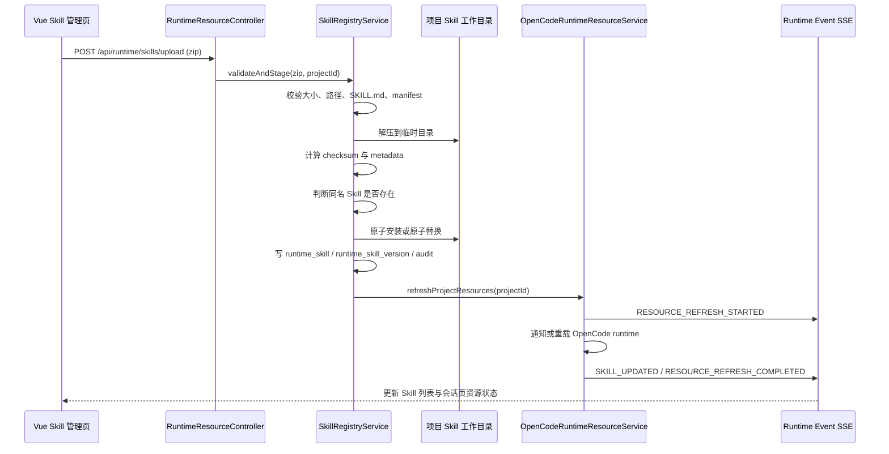
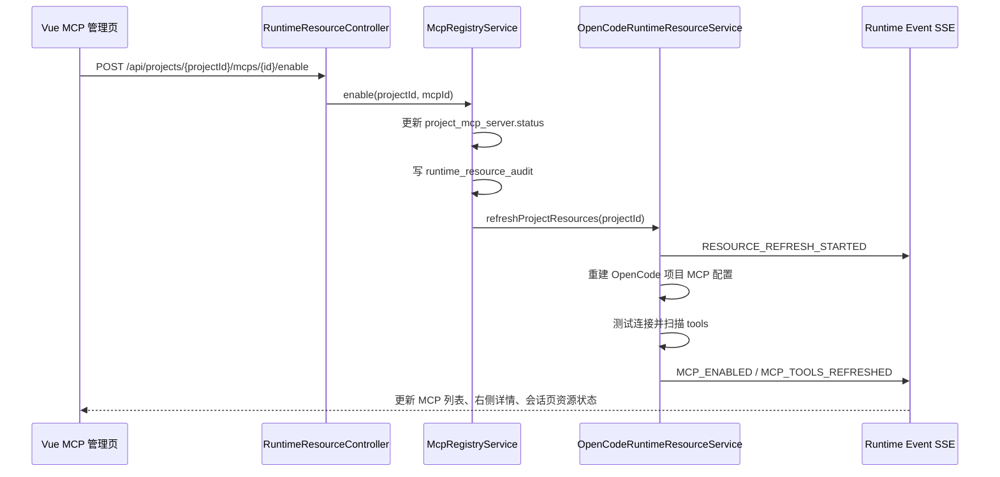

# 运行资源管理设计：Skill 与 MCP

> 状态：M1+ 实施设计
> 最近更新：2026-05-06
> 目标读者：后续负责实现的 OpenCode / Java Bridge / Vue 工作台 Agent
>
> 本文档是左下角“设置”入口中 Skill 管理与 MCP 管理的设计基线。M1 仍以 HTTP 命令 + SSE 输出为主，浏览器不直接连接 OpenCode。

## 1. 设计目标

AgentCenter 需要把 OpenCode 可用的 Skill 与 MCP 变成企业平台可管理、可审计、可刷新、可生效的运行资源。

本设计解决四件事：

1. 用户可以在网页端管理项目可用 Skill：上传 ZIP、同名更新、停用、删除、刷新。
2. 用户可以管理项目级 MCP：查看配置、启用、禁用、测试连接、刷新工具列表。
3. Java Bridge 作为控制面统一校验、落库、写入项目工作目录，并通知 OpenCode Runtime 重新加载。
4. 会话页可以实时看到当前会话可用 Skill / MCP 的加载状态，工作流节点执行时使用最新生效资源。

非目标：

- M1 不做跨租户 Skill 市场。
- M1 不让浏览器直接写 OpenCode 配置文件。
- M1 不让前端提交任意本地目录、命令或密钥明文。
- M1 不强求 OpenCode 热加载；如果 runtime 不支持热加载，可以采用“安全重载当前项目 OpenCode serve”的方式。

## 2. 产品入口与页面结构

左下角“设置”是入口，不直接承载复杂管理内容。点击后弹出轻量菜单：

```text
设置
├─ Skill 管理
├─ MCP 管理
└─ 系统设置
```

选择 `Skill 管理` 或 `MCP 管理` 后，中间栏切换到设置工作台；右侧栏展示当前选中资源的详情、校验结果和操作记录。

```text
左侧栏                    中间栏                                  右侧栏
导航 + 会话列表            运行资源管理工作台                        资源详情 / 校验 / 日志

首页
看板
工作流
设置
  Skill 管理  --->      Skill 列表、上传、刷新、搜索                  Skill 详情
  MCP 管理    --->      MCP 列表、启停、测试、工具快照                 MCP 详情
```

设计原则：

- 中间栏负责“主要操作”，右侧栏负责“详情与辅助操作”。
- Skill / MCP 管理不做弹窗主界面，避免上传、日志、引用关系和校验结果被挤压。
- 当前顶部的项目、空间、迭代筛选继续保留；Skill 与 MCP 的 M1 生效范围先按项目级处理。

## 3. Skill 管理页面设计

### 3.1 中间栏内容

页面标题：

```text
Skill 管理 · OpenCode 运行能力
管理当前项目可用的 OpenCode Skill，上传后可被会话和工作流节点使用
```

顶部概览指标：

| 指标 | 含义 |
|------|------|
| 已安装 Skill | 当前项目目录下可识别的 Skill 总数 |
| 已启用 | 可被 OpenCode Runtime 使用的 Skill 数 |
| 异常 | 校验失败、缺少入口文件、版本冲突或加载失败的 Skill 数 |
| 最近刷新 | 最近一次刷新 OpenCode Skill 索引的时间 |

主操作区：

| 操作 | 说明 |
|------|------|
| 上传 Skill ZIP | 上传一个 Skill 包，后端校验并安装到项目工作目录 |
| 刷新 Skill | 重新扫描项目 Skill 目录，并同步 OpenCode Runtime |
| 只看异常 | 过滤校验失败或加载失败的 Skill |
| 搜索 | 按名称、描述、标签、工作流引用搜索 |

Skill 列表字段：

| 字段 | 示例 | 说明 |
|------|------|------|
| 名称 | `prd-desingn` | Skill 唯一名，同名上传视为更新 |
| 版本 | `1.0.3` | 从 manifest 或 SKILL.md front matter 读取；缺省为 `0.0.0` |
| 状态 | 启用 / 停用 / 校验失败 / 更新中 | 前端状态标签 |
| 来源 | 上传 / 本地扫描 / 内置 | 便于区分治理来源 |
| 安装路径 | `.opencode/skills/prd-desingn` | 只展示相对路径 |
| 引用 | 3 个工作流节点 | 工作流依赖检查 |
| 更新时间 | `2026-05-06 23:20` | 最近安装或刷新时间 |
| 操作 | 更新、停用、删除、查看 | 行级操作 |

### 3.2 右侧详情内容

选中某个 Skill 后，右侧详情展示：

- 基本信息：名称、版本、描述、来源、状态、checksum。
- 文件信息：相对路径、入口文件、文件数量、包大小。
- `SKILL.md` 摘要：只展示前几段描述和触发条件。
- 校验结果：缺文件、manifest 错误、路径越界、包过大、危险文件类型。
- 引用关系：哪些工作流定义和节点引用该 Skill。
- 操作记录：上传、更新、停用、启用、删除、刷新。
- 操作按钮：更新 ZIP、停用/启用、删除、重新校验。

删除规则：

- 如果 Skill 被启用工作流引用，默认不允许删除。
- 可以先停用，或在后续版本提供“强制删除”并要求管理员权限。
- 删除后必须触发 Runtime Resource Refresh，确保 OpenCode 不再继续使用旧索引。

### 3.3 上传与同名更新流程



同名处理策略：

| 场景 | 行为 |
|------|------|
| 同名 checksum 相同 | 视为重复上传，返回已安装，不写新版本 |
| 同名 checksum 不同 | 创建新版本，备份旧目录，原子替换当前目录 |
| 同名但 manifest 名称冲突 | 拒绝上传，提示 ZIP 内声明名称与目录名不一致 |
| 同名 Skill 正在被工作流执行 | 允许安装新版本，但已运行会话继续使用旧 runtime 上下文；新会话使用新版本 |

## 4. MCP 管理页面设计

### 4.1 中间栏内容

页面标题：

```text
MCP 管理 · 项目工具连接
管理当前项目启用的 MCP Server 与工具能力
```

顶部概览指标：

| 指标 | 含义 |
|------|------|
| 项目 MCP | 当前项目登记的 MCP Server 数 |
| 已启用 | 当前启用的 MCP Server 数 |
| 可用工具 | 当前项目扫描到的 MCP tool 总数 |
| 异常连接 | 最近健康检查失败的 MCP Server 数 |

主操作区：

| 操作 | 说明 |
|------|------|
| 刷新 MCP | 重新读取项目级 MCP 配置并扫描工具 |
| 测试全部连接 | 对所有启用 MCP 执行健康检查 |
| 导入配置 | 从项目配置文件或管理员配置导入 MCP |
| 只看启用 | 过滤当前启用的 MCP |
| 搜索 | 按 MCP 名称、工具名、描述搜索 |

MCP 列表字段：

| 字段 | 示例 | 说明 |
|------|------|------|
| 名称 | `gitlab-internal` | 项目内唯一 |
| 类型 | `stdio` / `http` / `sse` | MCP 连接类型 |
| 状态 | 启用 / 停用 / 连接失败 / 测试中 | 前端状态标签 |
| 作用范围 | 项目 | M1 只做项目级 |
| 工具数量 | 12 | 最近一次扫描的 tool 数 |
| 最近健康检查 | `10 分钟前` | 成功或失败时间 |
| 操作 | 启用、停用、测试、查看 | 行级操作 |

### 4.2 右侧详情内容

选中某个 MCP 后，右侧详情展示：

- 基本信息：名称、类型、作用范围、状态。
- 配置摘要：命令、URL、参数、环境变量名；敏感值必须脱敏。
- 工具列表：tool name、description、input schema 摘要。
- 健康检查：最近成功时间、耗时、错误信息。
- 引用关系：哪些 Skill 或工作流节点依赖该 MCP。
- 操作记录：启用、停用、测试、刷新、配置变更。
- 操作按钮：启用/停用、测试连接、刷新工具列表。

空状态：

```text
当前项目暂无 MCP 配置
可以从项目配置文件导入，或由管理员创建项目级 MCP Server。
```

### 4.3 MCP 启停流程



## 5. 前端模块设计

建议新增模块：

```text
agentcenter-web/src/views/SettingsWorkbench.vue
agentcenter-web/src/views/SkillManagement.vue
agentcenter-web/src/views/McpManagement.vue
agentcenter-web/src/stores/runtimeResources.ts
agentcenter-web/src/api/runtimeResources.ts
agentcenter-web/src/components/settings/SkillUploadPanel.vue
agentcenter-web/src/components/settings/RuntimeResourceDetail.vue
```

### 5.1 设置入口

`LeftSidebar.vue` 左下角设置按钮点击后：

- 展示菜单：Skill 管理、MCP 管理、系统设置。
- 选择 Skill 管理：`activeView = 'settings'`，`settingsTab = 'skills'`。
- 选择 MCP 管理：`activeView = 'settings'`，`settingsTab = 'mcps'`。

### 5.2 中间栏路由状态

不一定要引入完整路由，M1 可以沿用现有 AppShell view 状态：

```ts
type WorkbenchView = 'home' | 'board' | 'workflow' | 'conversation' | 'settings'
type SettingsTab = 'skills' | 'mcps' | 'system'
```

### 5.3 runtimeResourceStore

职责：

- 读取 Skill 列表。
- 上传 Skill ZIP。
- 启用、停用、删除 Skill。
- 读取 MCP 列表。
- 启用、停用、测试 MCP。
- 维护 `resourceStatus`：Skill 数量、MCP 工具数、是否刷新中、最近刷新时间。
- 消费 SSE 的资源刷新事件。

建议状态：

```ts
interface RuntimeResourceState {
  skills: RuntimeSkillDto[]
  mcps: ProjectMcpServerDto[]
  selectedResourceId: string | null
  selectedResourceType: 'SKILL' | 'MCP' | null
  refreshStatus: 'IDLE' | 'REFRESHING' | 'FAILED'
  skillCount: number
  mcpToolCount: number
  lastRefreshedAt: string | null
}
```

### 5.4 会话页资源状态展示

会话页右上角建议展示：

```text
SSE 已连接 · Skill 12 · MCP 工具 8
```

点击后可以打开小型资源摘要：

- 当前项目可用 Skill 数。
- 当前项目启用 MCP 数。
- 当前会话可用 MCP 工具数。
- 最近刷新时间。
- 是否需要重载会话。

当收到资源刷新事件时：

- 如果当前会话属于同一项目，更新资源状态。
- 如果 OpenCode runtime 被重载，提示“运行资源已刷新，新会话立即生效；当前会话已重新连接”。
- 如果刷新失败，右上角显示异常状态，并可点击查看右侧详情。

## 6. 后端模块设计

建议新增或扩展服务：

```text
RuntimeResourceController
SkillRegistryService
McpRegistryService
OpenCodeRuntimeResourceService
RuntimeResourceAuditService
```

职责边界：

| 模块 | 职责 | 不做什么 |
|------|------|----------|
| RuntimeResourceController | 对外 API，鉴权，参数校验，上传入口 | 不直接解压 ZIP，不直接写 OpenCode 配置 |
| SkillRegistryService | Skill 包校验、安装、更新、删除、扫描、引用检查 | 不调用 OpenCode prompt |
| McpRegistryService | 项目级 MCP 配置、启停、健康检查、工具扫描 | 不保存明文密钥到响应 |
| OpenCodeRuntimeResourceService | 把平台资源同步给 OpenCode Runtime，刷新或重载 | 不持有业务主数据 |
| RuntimeResourceAuditService | 记录上传、删除、启停、刷新、失败原因 | 不参与运行时决策 |

## 7. 数据模型设计

M1 可以继续 SQLite，但字段按 PostgreSQL 迁移设计。

### 7.1 `runtime_skill`

```text
id
project_id
name
display_name
description
current_version_id
status                  ENABLED / DISABLED / INVALID / UPDATING
source                  UPLOAD / LOCAL_SCAN / BUILTIN
relative_path
checksum
validation_status       VALID / INVALID
validation_message
created_by
created_at
updated_at

unique(project_id, name)
```

### 7.2 `runtime_skill_version`

```text
id
skill_id
version_no
package_checksum
package_size
file_count
installed_relative_path
manifest_json
skill_md_summary
status                  ACTIVE / ARCHIVED / FAILED
created_by
created_at
```

### 7.3 `project_mcp_server`

```text
id
project_id
name
server_type             STDIO / HTTP / SSE
status                  ENABLED / DISABLED / FAILED
config_json             脱敏或引用密钥，不存前端明文
config_checksum
last_health_status      OK / FAILED / UNKNOWN
last_health_message
last_checked_at
created_by
created_at
updated_at

unique(project_id, name)
```

### 7.4 `project_mcp_tool_snapshot`

```text
id
project_id
mcp_server_id
tool_name
description
input_schema_json
snapshot_version
status                  AVAILABLE / UNAVAILABLE
scanned_at

unique(mcp_server_id, tool_name, snapshot_version)
```

### 7.5 `runtime_resource_audit`

```text
id
project_id
resource_type           SKILL / MCP
resource_id
action                  UPLOAD / UPDATE / DELETE / ENABLE / DISABLE / TEST / REFRESH
status                  SUCCESS / FAILED
summary
detail_json
created_by
created_at
```

## 8. API 设计

### 8.1 Skill API

```text
GET    /api/projects/{projectId}/runtime/skills
GET    /api/projects/{projectId}/runtime/skills/{skillId}
POST   /api/projects/{projectId}/runtime/skills/upload
PUT    /api/projects/{projectId}/runtime/skills/{skillId}/zip
POST   /api/projects/{projectId}/runtime/skills/{skillId}/enable
POST   /api/projects/{projectId}/runtime/skills/{skillId}/disable
DELETE /api/projects/{projectId}/runtime/skills/{skillId}
POST   /api/projects/{projectId}/runtime/skills/refresh
GET    /api/projects/{projectId}/runtime/skills/{skillId}/audits
```

上传响应示例：

```json
{
  "skill": {
    "id": "skill_001",
    "name": "prd-desingn",
    "version": "1.0.3",
    "status": "ENABLED",
    "validationStatus": "VALID"
  },
  "refresh": {
    "status": "REFRESHING",
    "eventId": "evt_001"
  }
}
```

### 8.2 MCP API

```text
GET    /api/projects/{projectId}/runtime/mcps
GET    /api/projects/{projectId}/runtime/mcps/{mcpId}
POST   /api/projects/{projectId}/runtime/mcps/import
POST   /api/projects/{projectId}/runtime/mcps/{mcpId}/enable
POST   /api/projects/{projectId}/runtime/mcps/{mcpId}/disable
POST   /api/projects/{projectId}/runtime/mcps/{mcpId}/test
POST   /api/projects/{projectId}/runtime/mcps/{mcpId}/refresh-tools
POST   /api/projects/{projectId}/runtime/mcps/refresh
GET    /api/projects/{projectId}/runtime/mcps/{mcpId}/audits
```

MCP 详情响应必须脱敏：

```json
{
  "id": "mcp_001",
  "name": "gitlab-internal",
  "serverType": "HTTP",
  "status": "ENABLED",
  "configSummary": {
    "url": "https://gitlab.example.com/mcp",
    "headers": ["Authorization: Bearer ****"]
  },
  "toolCount": 12,
  "lastHealthStatus": "OK"
}
```

### 8.3 会话资源状态 API

```text
GET /api/agent-sessions/{sessionId}/runtime-resources
```

返回当前会话可见资源：

```json
{
  "projectId": "agentcenter",
  "skillCount": 12,
  "enabledMcpCount": 3,
  "mcpToolCount": 27,
  "lastRefreshedAt": "2026-05-06T23:30:00+08:00",
  "reloadRequired": false
}
```

## 9. OpenCode 生效策略

### 9.1 Skill 生效

```text
上传/更新 Skill ZIP
-> Java Bridge 校验并安装到项目 Skill 目录
-> 更新 runtime_skill / runtime_skill_version
-> OpenCodeRuntimeResourceService 刷新项目资源
-> OpenCode Runtime 重新扫描 Skill
-> Java Bridge 重新读取 Skill 快照
-> SSE 推送刷新结果
```

建议项目目录：

```text
{projectWorkdir}/.opencode/skills/{skillName}/
```

M1 不允许前端指定任意目录。项目工作目录由服务端根据 `projectId` 映射得到。

### 9.2 MCP 生效

```text
启用/停用 MCP
-> 更新 project_mcp_server.status
-> 生成或刷新项目级 MCP 配置
-> OpenCodeRuntimeResourceService 刷新 OpenCode runtime
-> 扫描 MCP tools
-> 更新 project_mcp_tool_snapshot
-> SSE 推送 MCP_TOOLS_REFRESHED
```

建议项目配置文件由 Java Bridge 生成或维护：

```text
{projectWorkdir}/.opencode/mcp.agentcenter.json
```

如果 OpenCode 只识别固定配置文件，则由 Java Bridge 负责写入 OpenCode 期望的位置。前端永远不直接写文件。

### 9.3 热加载与重载

优先策略：

1. 如果 OpenCode 支持热加载 Skill/MCP，调用热加载接口。
2. 如果只支持重新扫描，调用扫描接口。
3. 如果都不支持，重启当前项目的 OpenCode serve 进程。

重启策略：

- 已有会话需要重新 `ensureSession`。
- 前端 SSE 断线后自动重连。
- 新建会话必须使用最新 Skill/MCP。
- 正在执行的工作流节点不强行中断；刷新完成后从下一个节点开始使用新资源。

## 10. SSE 事件设计

资源刷新事件继续走 AgentCenter SSE，不让浏览器直连 OpenCode。

建议新增事件类型：

```text
RESOURCE_REFRESH_STARTED
RESOURCE_REFRESH_COMPLETED
RESOURCE_REFRESH_FAILED
SKILL_INSTALLED
SKILL_UPDATED
SKILL_DELETED
SKILL_ENABLED
SKILL_DISABLED
MCP_ENABLED
MCP_DISABLED
MCP_HEALTH_CHECKED
MCP_TOOLS_REFRESHED
```

事件 payload 示例：

```json
{
  "projectId": "agentcenter",
  "resourceType": "SKILL",
  "resourceId": "skill_001",
  "resourceName": "prd-desingn",
  "status": "SUCCESS",
  "summary": "Skill prd-desingn updated to 1.0.3",
  "skillCount": 12,
  "mcpToolCount": 27
}
```

前端处理规则：

- 当前页面在 Skill/MCP 管理页：刷新列表和右侧详情。
- 当前页面在会话页：更新右上角资源状态。
- 当前页面在工作流页：更新节点可用 Skill/MCP 状态。
- 如果事件失败，右侧栏显示失败详情和重试入口。

## 11. 安全与校验

### 11.1 Skill ZIP 校验

必须校验：

- ZIP 大小上限。
- 文件数量上限。
- 解压后总大小上限。
- 禁止 `../`、绝对路径、符号链接越界。
- 必须包含 `SKILL.md`。
- 可选包含 manifest；如果包含，名称必须与目录名一致。
- 禁止可疑二进制或超大文件。
- 同名更新必须原子替换，失败自动回滚。

### 11.2 MCP 安全

必须遵守：

- MCP 配置中的密钥不明文返回前端。
- 前端只提交引用或脱敏配置；真实密钥后续接企业密钥系统。
- stdio MCP 的命令白名单由服务端配置，不允许普通用户提交任意 shell 命令。
- http/sse MCP 必须校验 URL scheme 和内网访问策略。
- 启用 MCP 要记录审计。

### 11.3 权限

M1 建议权限分级：

| 操作 | 建议权限 |
|------|----------|
| 查看 Skill/MCP | 项目成员 |
| 刷新 Skill/MCP | 项目维护者 |
| 上传/更新/删除 Skill | 项目管理员 |
| 启用/停用 MCP | 项目管理员 |
| 修改 MCP 密钥 | 平台管理员或密钥管理员 |

## 12. 与工作流和会话的关系

工作流节点引用 Skill 名称，例如 `prd-desingn`、`hld-design`、`lld-design`。

执行前校验：

1. 节点绑定的 Skill 必须存在且启用。
2. 节点依赖的 MCP 必须可用；如果缺失，节点进入 `WAITING_CONFIRMATION` 或 `FAILED`。
3. 会话上下文中写入当前 runtime resource snapshot，便于后续排查。

建议在任务会话里自动写入一条 SYSTEM 消息：

```text
已加载运行资源

- Skill: prd-desingn@1.0.3, hld-design@1.0.1
- MCP: gitlab-internal(12 tools), wiki-search(5 tools)
- 刷新时间: 2026-05-06 23:30
```

这样用户查看工作流会话时，可以知道当时到底使用了哪些 Skill 和 MCP。

## 13. 实施顺序

### P0 页面壳子

- 左下角设置菜单增加 Skill 管理、MCP 管理。
- 新增 `SettingsWorkbench`，中间栏支持两个 Tab。
- 右侧栏支持 `resource-detail` 模式。

### P1 Skill 闭环

- 实现 Skill 列表 API。
- 实现 ZIP 上传、校验、安装。
- 实现同名更新。
- 实现刷新 Skill 并推 SSE 事件。
- 会话页显示 Skill 数量。

### P2 MCP 闭环

- 实现项目 MCP 列表 API。
- 实现启用/禁用。
- 实现测试连接。
- 实现工具快照扫描。
- 会话页显示 MCP 工具数量。

### P3 引用与治理

- Skill 删除前检查工作流引用。
- MCP 停用前检查工作流或 Skill 引用。
- 增加审计日志页面。
- 增加版本回滚。

### P4 权限与密钥

- 对接企业身份认证。
- 接入密钥系统。
- 对高危操作增加二次确认。

## 14. 验收标准

Skill 管理：

- 可以上传一个包含 `SKILL.md` 的 ZIP。
- 上传成功后列表出现该 Skill。
- 同名 ZIP 可以更新版本。
- 删除被工作流引用的 Skill 时被阻止并提示引用关系。
- 刷新后会话页 Skill 数量变化。

MCP 管理：

- 可以看到当前项目 MCP 列表。
- 可以启用/禁用 MCP。
- 可以测试 MCP 连接。
- 可以看到 MCP tools 数量。
- MCP tools 刷新后会话页资源状态变化。

OpenCode 生效：

- 上传新 Skill 后，新建会话可以使用该 Skill。
- 工作流节点执行时能识别最新启用的 Skill。
- 禁用 MCP 后，新会话不再看到对应工具。
- 如果 OpenCode serve 被重启，前端 SSE 能恢复连接并刷新资源状态。

安全：

- 路径穿越 ZIP 被拒绝。
- 缺少 `SKILL.md` 的 ZIP 被拒绝。
- MCP 密钥不会出现在前端响应里。
- 所有上传、删除、启停、刷新都有审计记录。

## 15. 给 OpenCode 的开发提示

请以本文档为运行资源管理的权威设计，优先实现 M1+ 最小闭环：

1. 设置入口打开 Skill 管理 / MCP 管理。
2. 中间栏展示列表和主要操作，右侧栏展示详情。
3. Skill ZIP 只能由 Java Bridge 接收、校验、安装。
4. MCP 只做项目级启停和工具快照，密钥脱敏。
5. 资源变更后必须发布 SSE 事件。
6. 会话页右上角展示最新 Skill/MCP 加载状态。
7. 工作流执行前校验 Skill/MCP 是否可用，并把资源快照写入任务会话上下文。
