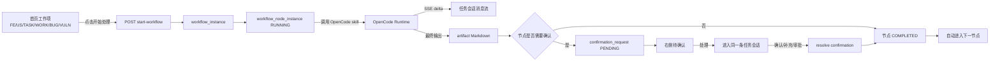
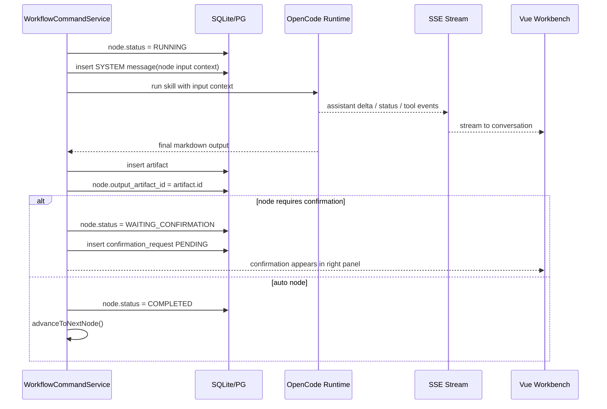

# 工作流与会话闭环设计

> 状态：M1 实施设计
> 最近更新：2026-05-06
> 目标读者：OpenCode / 后续实现 Agent
>
> 本文沉淀首页高保真反馈后的目标状态。实现时以“工作项驱动工作流，工作流沉淀到一条任务会话，待确认承接人工交互”为核心，不再让首页、会话、右侧待确认各自维护独立状态。

## 1. 目标

用户在首页点击某个工作项的“开始处理”后，后台应自动启动该工作项对应的工作流，连续执行 OpenCode skill 节点，直到工作流完成、失败，或进入需要用户确认/补充/审批的节点。

用户进入该工作项对应的任务会话时，应看到完整上下文：

- 工作项基础信息。
- 工作流启动上下文。
- 每个节点的输入上下文。
- OpenCode skill 的流式输出。
- 每个节点产出的 Markdown artifact。
- 待确认创建、用户处理、继续推进的记录。

右侧“待确认”面板只展示真实工作流执行过程中产生、需要人工交互的事项，不展示静态测试数据。

## 2. 关键原则

| 原则 | 说明 |
|------|------|
| 工作流实例是进度状态源 | 首页工作流节点必须来自 `workflow_instance` 和 `workflow_node_instance`，不能再由 `work_item.status` 推断。 |
| 工作项是入口 | 用户从 FE/US/TASK/WORK/BUG/VULN 工作项进入处理。 |
| 任务会话是上下文账本 | 一个工作流实例对应一条 `WORK_ITEM` 类型 agent session，所有节点上下文和 OpenCode 输出都沉淀在这条会话里。 |
| 待确认是阻塞队列 | `confirmation_request` 只承接工作流节点阻塞、确认、审批、异常、权限确认等人工交互。 |
| HTTP 负责命令，SSE 负责输出 | M1 阶段继续采用 HTTP 命令 + SSE 流式事件；WebSocket 后续再适配。 |

## 3. 总体闭环



## 4. 页面交互目标

### 4.1 首页工作项列表

首页卡片展示工作项和真实工作流进度。

当前问题：

- 卡片下方节点使用 `workItem.status` 推断，无法跟随后台工作流节点变化。
- 点击“开始处理”后，前端没有稳定持有并刷新该工作项对应的 workflow instance。

目标行为：

1. 用户点击“开始处理”。
2. 前端调用 `POST /api/work-items/{id}/start-workflow`，请求体 `{ "mode": "AUTO" }`。
3. 后端返回 `StartWorkflowResponse`。
4. 前端保存 `response.workflowInstance` 到 `workflowStore.instancesByWorkItemId[workItemId]`。
5. 首页卡片节点从 `workflowInstance.nodes` 渲染：
   - `PENDING`：空心节点。
   - `RUNNING`：蓝色脉冲节点。
   - `WAITING_CONFIRMATION`：橙色节点，并显示“待确认”。
   - `COMPLETED`：绿色节点。
   - `FAILED`：红色节点，并显示“失败”。
   - `SKIPPED`：灰色节点。
6. 后台工作流推进后，前端通过 SSE 事件或轮询刷新 workflow instance，使节点实时变化。

建议 UI 文案：

| 状态 | 卡片按钮/状态 |
|------|---------------|
| 未启动 | `开始处理` |
| RUNNING | `处理中`，按钮禁用或显示 loading |
| WAITING_CONFIRMATION | `待确认`，点击进入会话或右侧待确认 |
| FAILED | `查看异常` / `重试` |
| COMPLETED | `已完成` / `查看会话` |

### 4.2 对话工作台滚动

当前问题：

- 会话内容很长时，消息区域没有明确滚动容器，导致上下滚动不可控。
- 输入框和顶部信息应固定，只有消息区滚动。

目标结构：

```text
conversation-workbench
└── conversation-workbench__main
    ├── header 固定
    ├── chips 固定
    ├── messages-scroll flex:1; min-height:0; overflow-y:auto
    │   ├── MessageList
    │   └── streaming message
    └── input-area 固定底部
```

实现要求：

- `.conversation-workbench__main`：`height: 100%; display: flex; flex-direction: column; overflow: hidden;`
- 新增 `.conversation-workbench__messages`：`flex: 1; min-height: 0; overflow-y: auto; padding: ...;`
- `MessageList` 不自己撑破父容器。
- 当 `sessionStore.messages` 或 `runtimeStore.streamingText` 变化时，滚动到底部。
- 长 Markdown 内容必须允许换行：`overflow-wrap: anywhere; word-break: break-word;`

### 4.3 右侧待确认

当前问题：

- 右侧出现测试确认，如 `Test Confirmation`。
- 待确认没有明确限定为工作流节点产生的人工交互事项。

目标行为：

- 右侧待确认只展示 `confirmation_request.status in (PENDING, IN_CONVERSATION)`。
- 每张卡片展示：
  - 工作项编号，例如 `FE0002`。
  - 节点名称，例如 `方案设计 (HLD)`。
  - skill 名称，例如 `hld-design`。
  - 类型：确认、审批、补充信息、异常、权限。
  - 产生时间。
  - 操作按钮：`处理`。
- 点击 `处理`：
  - 调用 `POST /api/confirmations/{id}/enter-session`。
  - 使用返回的 `agentSessionId` 进入同一条任务会话。
  - 前端切到 conversation view，并连接该 session 的 SSE。

## 5. 后端状态机

### 5.1 启动工作流

`WorkflowCommandService.startWorkflow(workItemId, request)` 应负责：

1. 校验工作项存在。
2. 如果已有 RUNNING/BLOCKED 实例，则恢复推进并返回已有实例。
3. 解析默认 workflow definition。
4. 创建 `workflow_instance`。
5. 创建全部 `workflow_node_instance`，状态为 `PENDING`。
6. 创建或复用一条 `WORK_ITEM` 类型 agent session。
7. 确保 OpenCode runtime session 已创建并绑定到 agent session。
8. 写入一条 SYSTEM 消息：工作项信息、工作流定义、节点计划。
9. 将第一个节点置为 `RUNNING`。
10. 异步执行第一个节点。

### 5.2 执行节点

节点执行流程：



### 5.3 自动推进

`advanceToNextNode(instance)` 的规则：

1. 按 workflow node definition `order_no` 排序。
2. 找到下一个 `PENDING` 节点。
3. 将上一个 `COMPLETED` 节点的 `outputArtifactId` 写入下一个节点的 `inputArtifactId`。
4. 执行下一个节点。
5. 如果没有 pending 节点，则 `workflow_instance.status = COMPLETED`。

注意：不要按 ULID 或数据库插入顺序判断节点顺序。

### 5.4 待确认处理

待确认处理分两步：

1. `enter-session`
   - 将 confirmation 标记为 `IN_CONVERSATION`，或保持 `PENDING` 但记录已进入。
   - 返回 `agentSessionId`。
   - 前端进入对应任务会话。

2. `resolve`
   - 用户确认、补充或审批后，后端记录确认动作。
   - 当前 `workflow_node_instance` 从 `WAITING_CONFIRMATION` 改为 `COMPLETED`。
   - 调用 `advanceToNextNode(instance)` 自动继续。

## 6. 数据读模型建议

M1 可以不新增复杂 CQRS 表，但前端需要一个方便读取的聚合结果。

建议新增或补齐接口：

```http
GET /api/work-items
```

返回每个 work item 时带上当前工作流摘要：

```json
{
  "id": "wi_001",
  "code": "FE0002",
  "type": "FE",
  "title": "New Feature",
  "status": "BACKLOG",
  "priority": "HIGH",
  "currentWorkflowInstanceId": "wfi_001",
  "workflowSummary": {
    "instanceId": "wfi_001",
    "status": "RUNNING",
    "currentNodeInstanceId": "wni_002",
    "nodes": [
      { "id": "wni_001", "definitionName": "需求转设计 (PRD)", "skillName": "prd-desingn", "status": "COMPLETED" },
      { "id": "wni_002", "definitionName": "方案设计 (HLD)", "skillName": "hld-design", "status": "RUNNING" },
      { "id": "wni_003", "definitionName": "详细设计 (LLD)", "skillName": "lld-design", "status": "PENDING" }
    ]
  }
}
```

如果暂不改 `GET /api/work-items`，前端也可以先通过 `currentWorkflowInstanceId` 再调用 `GET /api/workflow-instances/{id}` 补齐，但会多一次请求。

## 7. 前端实现清单

### HomeOverview.vue

- 删除 `workflowIndex(item)` 这种基于 `workItem.status` 的推断逻辑。
- 新增 `workflowFor(item)`：
  - 优先读 `workflowStore.instancesByWorkItemId[item.id]`。
  - 如果 item 有 `currentWorkflowInstanceId`，按需加载实例。
- `home-overview__flow` 渲染真实节点状态。
- `开始处理` 后：
  - 调用 `startWorkflow`。
  - 更新 workflow store。
  - 可选：进入该任务会话，或留在首页看节点变化。
- 工作流运行中禁用重复启动，避免重复点击。

### workflows store

建议状态：

```ts
const instancesByWorkItemId = ref<Record<string, WorkflowInstanceDto>>({})
const loadingInstanceIds = ref<Set<string>>(new Set())
```

建议方法：

```ts
function upsertInstance(instance: WorkflowInstanceDto): void
async function loadInstanceForWorkItem(workItemId: string, instanceId: string): Promise<void>
async function refreshInstance(instanceId: string): Promise<WorkflowInstanceDto>
```

### runtime store

- 收到 `SKILL_STARTED`、`SKILL_COMPLETED`、`CONFIRMATION_CREATED`、`STATUS` 时，触发相关 workflow instance 刷新。
- `ASSISTANT_DELTA` 只追加到当前 streaming text。
- `idle/waiting_user` 后触发最终消息同步。

### ConversationWorkbench.vue

- 新增消息滚动容器。
- `targetSessionId` 变化时必须重新选择会话并重新连接 SSE。
- 进入任务会话时加载：
  - session messages。
  - workflow instance。
  - artifacts。
  - runtime events。
- 展示完整上下文，不要只显示用户最后一句对话。

### RightPanel / ConfirmationPanel

- 只读取真实 `confirmationApi.list('PENDING')`。
- 点击处理：
  - `confirmationApi.enterSession(id)`。
  - emit `enter-session`，携带 `workItemId` 和 `agentSessionId`。
  - AppShell 切换到 conversation view。

## 8. 后端实现清单

### WorkflowCommandService

- 确保 `startWorkflow` 创建或复用同一条任务会话。
- 确保所有节点使用同一个 `agentSessionId` 和同一个 OpenCode runtime session。
- `advanceToNextNode` 必须按 `order_no` 顺序推进。
- 节点 `RUNNING/WAITING_CONFIRMATION/COMPLETED/FAILED` 变化时发布 runtime event。
- 创建 `confirmation_request` 时，必须带：
  - `workItemId`
  - `workflowInstanceId`
  - `workflowNodeInstanceId`
  - `agentSessionId`
  - `runtimeSessionId`
  - `skillName`

### WorkItem API

- 返回 work item 时建议带 `workflowSummary`，或保证 `currentWorkflowInstanceId` 可用于前端补拉。
- 工作流启动后更新 `work_item.current_workflow_instance_id`。

### Confirmation API

- `enter-session` 必须返回真实 `agentSessionId`。
- `resolve` 后应推进工作流，而不是只更新 confirmation 状态。

### AgentSessionService

- 普通会话发送消息时，必须先 `ensureSession`，再 `sendMessage`。
- 工作流任务会话必须保存 runtime session 绑定，避免 `No opencode session mapped`。
- OpenCode 输出的最终 ASSISTANT 消息应只有一个来源，避免重复落库。

## 9. 验收标准

### UI 验收

- 对话页面有可见滚动能力，长 Markdown 输出不会撑破布局。
- 输入框固定在底部，顶部标题和场景按钮不随消息滚动。
- 首页点击“开始处理”后，卡片节点从 `PENDING` 变为 `RUNNING`。
- 节点完成后变为 `COMPLETED`，下一个节点自动变为 `RUNNING` 或 `WAITING_CONFIRMATION`。
- 右侧待确认只显示真实 confirmation，不出现 `Test Confirmation`。
- 点击待确认“处理”进入对应任务会话。

### 数据验收

- 一个工作流实例只有一条任务会话。
- 每个节点都有明确状态。
- 每个完成节点都有 artifact。
- 需要确认的节点会生成 confirmation_request。
- confirmation resolve 后工作流继续推进。

### 对话验收

- 进入任务会话能看到：
  - 工作流启动上下文。
  - 节点输入上下文。
  - OpenCode 流式输出。
  - Skill 完成记录。
  - 用户确认记录。
- 发送消息后，OpenCode 响应能通过 SSE 实时展示。
- 最终消息落库后不会把前端 streaming 内容覆盖丢失。

## 10. 建议测试

### 后端集成测试

1. `startWorkflow_shouldCreateOneWorkflowSessionAndRunFirstNode`
   - 启动 FE 工作项。
   - 断言 workflow instance RUNNING。
   - 断言第一节点 RUNNING/COMPLETED/WAITING_CONFIRMATION。
   - 断言存在一条 WORK_ITEM agent session。

2. `workflow_shouldAutoAdvanceUntilConfirmation`
   - 使用 mock runtime。
   - 第一个节点完成后自动进入第二节点。
   - 遇到 requiredConfirmation 节点时停止。
   - 断言 confirmation_request PENDING。

3. `resolveConfirmation_shouldContinueWorkflow`
   - 进入待确认会话。
   - resolve confirmation。
   - 断言当前节点 COMPLETED，下一个节点 RUNNING 或 COMPLETED。

4. `workflowSession_shouldContainFullContextMessages`
   - 查询 agent messages。
   - 断言包含 workflow start context、node input context、tool/assistant output。

### 前端测试

1. `HomeOverview` 点击开始处理后更新节点状态。
2. `HomeOverview` 不再根据 `workItem.status` 推断节点。
3. `ConversationWorkbench` 长消息区域可滚动。
4. `ConfirmationPanel` 点击处理后进入指定 `agentSessionId`。
5. `runtimeStore` 收到 `CONFIRMATION_CREATED/SKILL_COMPLETED` 后触发 workflow refresh。

## 11. 不做事项

M1 阶段暂不做：

- WebSocket 替换 SSE。
- 多项目目录自由传入。
- 复杂工作流可视化编辑器。
- 分布式任务队列。
- 多 runtime 并行编排。

这些能力可以在 HTTP+SSE 闭环稳定后再演进。

## 12. 推荐实现顺序

1. 修复 `ConversationWorkbench` 滚动容器。
2. 前端 workflow store 增加 `instancesByWorkItemId`。
3. 首页节点改为真实 workflow node status。
4. 启动工作流后刷新并展示当前实例状态。
5. 右侧待确认清理测试数据，只展示真实 confirmation。
6. 待确认“处理”进入对应任务会话。
7. 后端补齐 confirmation resolve 后自动推进。
8. 补后端集成测试和前端组件测试。

