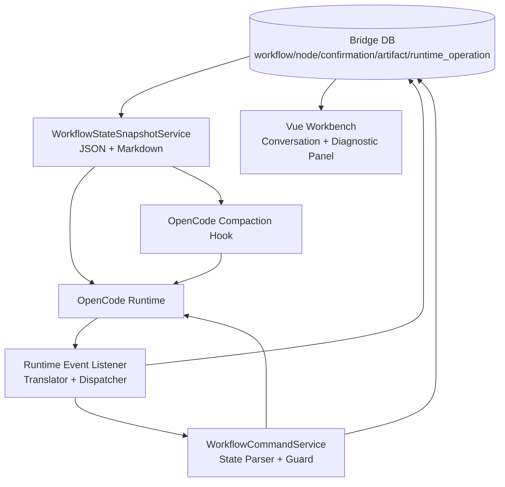
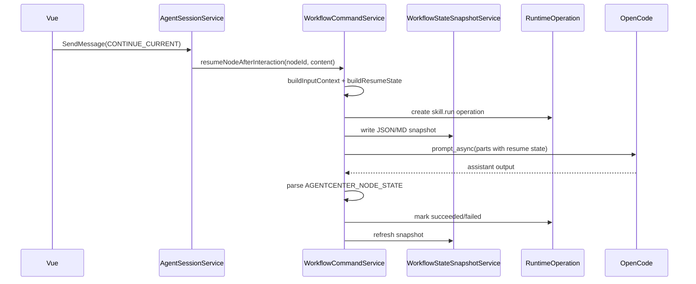
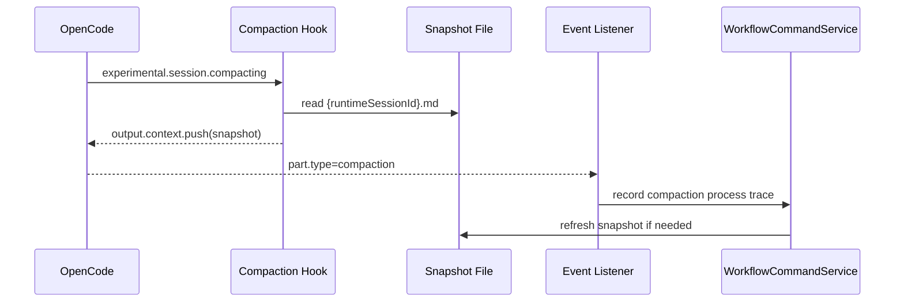

# Workflow State Retention 闭环方案（1026 分支分析）

> 状态：设计方案
> 分析分支：`codex/from-2026-05-14-1026`
> 分析时间：2026-05-19
> 适用范围：AgentCenter 1026 分支中的 OpenCode 上下文压缩、工作流状态恢复、Runtime Adapter 监听和运行账本闭环

## 结论

1026 分支当前不能在 OpenCode 上下文压缩后稳定保持工作流进度，本质原因不是单纯的 prompt 不够强，而是缺少一个完整的“状态保持闭环”：

```text
Bridge DB 权威状态
  -> WorkflowStateSnapshotService 生成 Runtime 可读快照
  -> RuntimeOperation 记录每次 skill.run 派发和结果
  -> Runtime Event Listener 绑定 session/workflow/node/operation
  -> Workflow Engine 解析 AGENTCENTER_NODE_STATE 并推进
  -> OpenCode Compaction Hook 读取快照增强压缩摘要
```

推荐方案是：**后端状态闭环为主，Snapshot 文档作为桥，OpenCode hook 作为增强，Watchdog 兜底恢复**。

权威顺序必须固定：

1. Bridge 数据库：`workflow_instance`、`workflow_node_instance`、`confirmation_request`、`artifact`、`runtime_operation`
2. Snapshot 文件：由 DB 投影生成，可删除、可重建
3. OpenCode 压缩摘要：只作为模型连续性参考，不能作为业务状态源

## 1026 分支分析结果

### 当前已有能力

1026 分支已经具备一部分状态保持能力：

- `WorkflowCommandService.executeSkillOnNode(...)` 会组装工作项、当前节点、上游产物、交互回答和本轮用户补充输入。
- `WorkflowPromptComposer` 会追加 `AGENTCENTER_RESUME_STATE`，要求模型以 Bridge 本轮注入的状态为准。
- `WorkflowContextAnchorService` 能识别 OpenCode compaction event，并在下一次节点执行时注入 `AGENTCENTER_CONTEXT_ANCHOR`。
- `WorkflowNodeTransitionGuard` 会拒绝明显不安全的 `READY_TO_ADVANCE`，例如当前节点不匹配、仍有待处理交互、没有可持久化产物。
- `runtime_operation` 表和 `RuntimeOperationType.SKILL_RUN` 类型已经存在。

这些机制能解决“重新进入节点执行时怎么补上下文”，但还没有解决“所有继续路径都必须重新进入节点执行”和“运行中节点怎么持久追踪”。

### 当前主要缺口

#### 1. `CONTINUE_CURRENT` 可能绕开完整上下文注入

当前 `AgentSessionService.continueCurrentRuntime(...)` 只有在 `WorkflowContextAnchorService.recoveryRequired(...)` 返回 true 时，才调用 `workflowCommandService.resumeNodeAfterInteraction(...)`。

否则会直接走普通 runtime dispatch，只发一条继续提示。这条路径不包含：

- 当前工作项详情
- 当前节点 ID、节点顺序和节点状态
- 上游产物
- 待处理交互
- 本轮 `invocationId`
- `AGENTCENTER_RESUME_STATE`
- `AGENTCENTER_NODE_STATE` 协议约束

这意味着只要 compaction 检测没命中、事件绑定缺失、用户刷新后映射不足，OpenCode 就会依赖压缩摘要猜测当前进度。

#### 2. `skill.run` 没有进入运行账本

`runtime_operation` 已经支持：

- `agent_session_id`
- `runtime_session_id`
- `work_item_id`
- `workflow_instance_id`
- `workflow_node_instance_id`
- `correlation_id`
- `command_json`
- `ack_json`
- `last_event_type`
- `external_operation_id`

但 `DefaultRuntimeGateway.runSkill(...)` 当前直接调用 provider，没有创建 `skill.run` operation。结果是系统无法稳定回答：

- 这次节点执行是否已经派发？
- OpenCode 是否已经 ack？
- 最后一个 runtime event 属于哪次 invocation？
- Bridge 重启后应恢复哪次运行？
- 当前卡住是等待权限、等待用户、runtime 超时，还是模型忘记协议？

#### 3. 节点状态 payload 写入太晚

`workflow_node_instance.agent_state_payload_json` 当前在结果返回后才写入。派发前缺少结构化状态，因此以下情况都没有稳定恢复依据：

- Bridge 线程等待期间被中断
- Bridge 服务重启
- OpenCode 上下文压缩
- OpenCode 权限确认等待
- OpenCode serve 重启或 session 映射丢失
- 用户刷新页面后点击继续

#### 4. Runtime event 监听还不是工作流推进器

当前 `AssistantMessageProjector` 主要负责 assistant 文本缓冲和落库；`RuntimeEventEnvelopeDispatcher` 主要负责事件投影、permission/question 转 confirmation、artifact capture。它们没有形成完整的 operation/node 状态推进闭环。

尤其是 permission event 当前仍有 workflow/node 绑定不足的问题。权限确认如果没有绑定 `workflow_node_instance_id` 和 `runtimeOperationId`，用户批准后容易降级为裸发继续，重新进入丢状态路径。

#### 5. 缺少 `AGENTCENTER_NODE_STATE` 时只能安全卡住

`WorkflowNodeStateParser` 找不到状态块时默认 `IN_PROGRESS`。这是安全降级，但用户会看到“阶段正文已经完成”，而 Bridge 看不到 `READY_TO_ADVANCE`，于是节点不保存最终 artifact、不推进。

这个问题不能只靠 prompt 约束，需要 Bridge 出口增加 state-only repair。

#### 6. Skill/MCP 刷新会破坏活跃 Runtime 映射

`OpenCodeRuntimeAdapter.refreshSkills(...)`、`refreshMcps(...)` 当前会清空 `agentToOpencodeSession`、`sessionWorkingDirectories`、`cancelGenerations` 并重启 OpenCode。运行中的 workflow 如果遇到刷新，后续事件和恢复路径可能失去 session/workflow/node 映射。

## 两类方案对比

### 方案 A：OpenCode hook 增强

OpenCode 插件支持 compaction hook。`experimental.session.compacting` 可以在压缩摘要生成前追加上下文；OpenCode config 也支持 `compaction.auto`、`compaction.prune`、`compaction.reserved` 等配置。

在 AgentCenter 中，hook 可以读取 Runtime workspace 下的状态快照，例如：

```text
runtime-workspace/.agentcenter/state/{runtimeSessionId}.md
```

然后把当前工作项、当前节点、工作流顺序、pending interactions、last invocation、恢复规则注入 compaction prompt。

优点：

- 改动相对轻。
- 能直接改善“压缩摘要忘记当前进度”的体验。
- 对 OpenCode 自身的自然语言连续性有帮助。

缺点：

- 仍然依赖 OpenCode 压缩摘要和模型遵循摘要。
- 不能解决 Bridge 重启后的 operation 恢复。
- 不能解决 permission/question 事件绑定缺失。
- 不能回答“这次节点执行到底派发到哪里”。
- hook 失败时，业务恢复能力仍然不足。

结论：hook 只能作为增强层，不能做 source of truth。

### 方案 B：后端监听适配器 + operation 账本

Bridge 在每次 `skill.run` 前创建 operation，在派发、ack、event、结果、异常、超时各阶段更新 operation 与 node payload。Runtime event listener 将事件绑定到 `agentSessionId + runtimeSessionId + workflowInstanceId + workflowNodeInstanceId + runtimeOperationId + invocationId`。

优点：

- 符合 AgentCenter 架构原则：Bridge 拥有业务状态，Runtime 只执行。
- 可恢复、可审计、可诊断。
- Bridge 重启后可以扫描未终态 operation，生成恢复入口。
- 用户刷新页面后仍能看到当前节点真实 gate。
- 权限、问题、异常、超时都能回到同一节点。

缺点：

- 改动面更大，需要引入 operation context、event correlation、watchdog、测试。
- 需要小心处理同步 `runSkill` 与异步 event 之间的状态竞争。

结论：这是主方案。

### 推荐组合

两者不是二选一：

```text
后端监听适配器 + operation 账本 = 稳定性主干
Workflow State Snapshot = DB 与 Runtime 之间的可读桥
OpenCode compaction hook = 体验增强和摘要补强
Watchdog = 异常恢复兜底
```

## 目标架构



### 组件职责

| 组件 | 职责 | 不做什么 |
|------|------|----------|
| Workflow DB | 权威状态源 | 不把 OpenCode 摘要当进度 |
| RuntimeOperation | 记录每次 runtime 调用生命周期 | 不承载业务判断 |
| WorkflowStateSnapshotService | 把 DB 状态投影为 Runtime 可读文件 | 不成为 source of truth |
| OpenCode Adapter | 派发 prompt、接收 ack、订阅 event | 不拥有工作流状态 |
| Runtime Event Listener | 绑定事件到 session/workflow/node/operation | 不直接绕过 Workflow Guard 推进 |
| Workflow Engine | 解析节点协议、守卫推进、创建确认 | 不相信旧 invocation 或子 Agent 输出 |
| Compaction Hook | 压缩前注入当前状态快照 | 不替代 Bridge 恢复逻辑 |

## Workflow State Snapshot

### 设计原则

新增 `WorkflowStateSnapshotService`，它从 DB 生成两个文件：

```text
runtime-workspace/.agentcenter/state/{runtimeSessionId}.json
runtime-workspace/.agentcenter/state/{runtimeSessionId}.md
```

要求：

- Snapshot 是 DB 投影，可删除、可重建。
- JSON 给 Bridge、hook、自动恢复逻辑读。
- Markdown 给 OpenCode prompt 和 compaction hook 读。
- 文件只写入 Runtime workspace 下的 `.agentcenter/state/`，不要求 Runtime 读取 AgentCenter 源码目录。
- Snapshot 不包含 secrets，不包含完整敏感对话历史。

### 刷新时机

- workflow 启动
- node 派发前
- `skill.run` operation 创建后
- runtime ack 后
- node 进入 `RUNNING`、`WAITING_CONFIRMATION`、`COMPLETED`、`FAILED`
- confirmation 创建/解决
- OpenCode compaction event 被识别后
- Bridge 启动恢复扫描未终态 operation 后

### JSON 示例

```json
{
  "schemaVersion": 1,
  "snapshotVersion": 12,
  "stateHash": "sha256:...",
  "analysisBranch": "codex/from-2026-05-14-1026",
  "workItemId": "wi_xxx",
  "workItemCode": "FE1234",
  "workItemTitle": "登录重构",
  "workflowInstanceId": "wf_xxx",
  "currentNodeInstanceId": "node_hld_xxx",
  "currentGate": "NODE_EXECUTION",
  "nodeStatus": "RUNNING",
  "skillName": "hld-design",
  "invocationId": "inv_xxx",
  "runtimeOperationId": "rop_xxx",
  "runtimeSessionId": "ses_xxx",
  "steps": [
    {"orderNo": 1, "name": "需求澄清 PRD", "status": "COMPLETED"},
    {"orderNo": 2, "name": "方案设计 HLD", "status": "RUNNING", "current": true},
    {"orderNo": 3, "name": "详细设计 LLD", "status": "PENDING"}
  ],
  "pendingInteractions": [],
  "upstreamArtifacts": [
    {"id": "art_prd_xxx", "title": "FE1234-PRD.md", "sourceNodeInstanceId": "node_prd_xxx"}
  ],
  "recoveryRule": "If conversation history or compaction summary conflicts with this snapshot, follow this snapshot.",
  "updatedAt": "2026-05-19 10:22:50"
}
```

### Markdown 示例

```markdown
# AgentCenter Workflow State Snapshot

- workItem: FE1234 登录重构
- workflowInstanceId: wf_xxx
- currentNodeInstanceId: node_hld_xxx
- currentNode: 方案设计 HLD
- currentStatus: RUNNING
- currentGate: NODE_EXECUTION
- skillName: hld-design
- invocationId: inv_xxx
- runtimeOperationId: rop_xxx
- stateHash: sha256:...

## Workflow Steps

1. 需求澄清 PRD - COMPLETED
2. 方案设计 HLD - RUNNING [CURRENT]
3. 详细设计 LLD - PENDING

## Pending Interactions

无

## Recovery Rule

如果历史对话、压缩摘要或子 Agent 输出与本文件冲突，以本文件为准。
只能继续 [CURRENT] 节点。不要跳过节点，不要代表其他节点输出 AGENTCENTER_NODE_STATE。
```

## 关键运行流程

### 1. 用户继续当前节点



规则：只要 session 绑定 workflow/node，就不得裸发普通 runtime prompt。只有找不到 workflow 或 node 时才降级，并发布 warning event。

### 2. OpenCode 上下文压缩



hook 失败不影响 Bridge 恢复。下一轮 workflow node execution 仍会重新注入 `AGENTCENTER_RESUME_STATE`。

### 3. 缺状态协议补签

如果 OpenCode 输出正文但没有 `AGENTCENTER_NODE_STATE`：

1. Bridge 不立即保存 artifact，不推进节点。
2. 发起 state-only repair prompt。
3. repair prompt 只允许输出状态块，不允许重写正文。
4. repair 成功：
   - 用原始正文保存 artifact。
   - 用补签状态推进或创建确认。
5. repair 失败：
   - 创建异常确认。
   - 不自动推进。

## 提升效果的增强项

### State Cursor

每轮 prompt 前置一个短游标，让压缩摘要更容易保留关键状态：

```text
AGENTCENTER_STATE_CURSOR:
workflow=wf_xxx
node=node_hld_xxx
gate=NODE_EXECUTION
invocation=inv_xxx
operation=rop_xxx
stateHash=sha256:...
mustContinueCurrentNode=true
```

### Snapshot Hash

Snapshot JSON 和 prompt 都带 `stateHash`。如果模型返回状态块时带回旧 hash，Bridge 可以拒绝推进并要求重新恢复。

建议状态块扩展：

```markdown
<!-- AGENTCENTER_NODE_STATE
status: READY_TO_ADVANCE
reason: 当前节点已完成
state_hash: sha256:...
invocation_id: inv_xxx
-->
```

### Invocation Guard

`READY_TO_ADVANCE` 必须来自当前 node 最新 invocation：

- 旧 invocation 输出不得推进当前节点。
- 子 Agent 输出不得包含 `AGENTCENTER_NODE_STATE`。
- 当前存在 pending interactions 时拒绝 `READY_TO_ADVANCE`。

### Operation Watchdog

后台定时扫描未终态 operation：

- `DISPATCHING` 超时：标记 `TIMED_OUT`，创建 runtime recovery confirmation。
- `IN_PROGRESS` 长时间无事件：发布诊断事件，提示用户恢复或重试。
- Bridge 启动时：扫描未终态 operation，并刷新 snapshot。

### Permission/Question 补绑定

所有 permission/question confirmation 必须写入：

- `workItemId`
- `workflowInstanceId`
- `workflowNodeInstanceId`
- `agentSessionId`
- `runtimeSessionId`
- `runtimeOperationId`
- `invocationId`

批准后如果能定位 node，必须回到 `resumeNodeAfterInteraction(...)`，不得裸发普通 runtime prompt。

### UI 诊断面板

前端增加折叠状态面板，显示：

- 当前 workflow/node/gate
- 最新 invocationId
- 最新 runtimeOperationId 和状态
- 最近 compaction event
- 最近 context anchor event
- pending confirmations
- snapshotVersion/stateHash

这个面板不参与业务判断，只帮助排查和验证。

## 验收标准

1. 任意 workflow session 中的 `CONTINUE_CURRENT` 都重新进入 `executeSkillOnNode(...)`。
2. 每次 workflow node 派发前，`workflow_node_instance.agent_state_payload_json` 已包含 `phase=DISPATCHING` 和 `invocationId`。
3. `runtime_operation` 能按 workflow/node/session 查到 `skill.run`。
4. Snapshot JSON/MD 能从 DB 重建，删除后不影响业务状态。
5. OpenCode compaction 后，下一轮 prompt 必须包含 `AGENTCENTER_RESUME_STATE` 和最新 state cursor。
6. permission/question confirmation 必须绑定 workflow/node/operation。
7. 缺少 `AGENTCENTER_NODE_STATE` 时，Bridge 自动 state-only repair；repair 失败不推进。
8. 旧 invocation 或 pending interactions 存在时，Bridge 拒绝 `READY_TO_ADVANCE`。
9. Skill/MCP refresh 不得直接破坏活跃 workflow session；必要时标记 reload required 或 interrupted operation。

## 决策

- Bridge DB 是唯一业务状态源。
- Snapshot 是 Runtime 可读投影，不是 source of truth。
- Hook 只增强压缩摘要，不负责业务恢复。
- `runtime_operation` 是 Runtime 运行态的权威账本。
- 所有 workflow 多轮输入必须回到当前节点执行入口。
- 缺状态协议不能静默卡死，必须 state-only repair 或创建异常确认。
