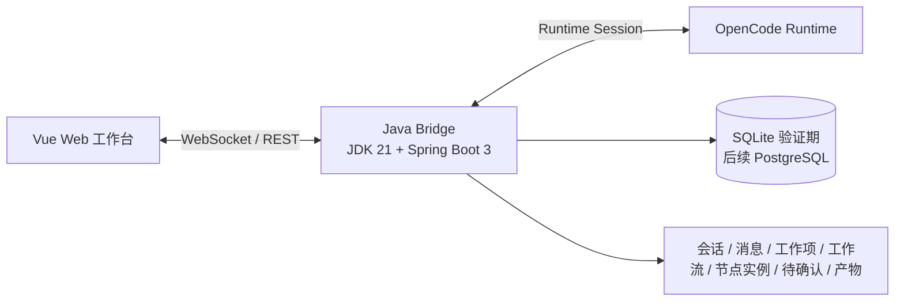

# Homepage Vue Implementation Gap

> 更新时间：2026-05-06  
> 目标读者：后续接手实现的 OpenCode / 前端开发 Agent  
> 结论：`docs/prototype/homepage.html` 是当前首页唯一视觉和交互基线；`agentcenter-web` 里的 Vue 实现还不能作为可用基线。

## 1. 当前结论

本轮没有基于浏览器重新截图复测，因为 `http://127.0.0.1:5173/` 当前不可达；下面基于源码、静态高保真和此前页面反馈梳理差距。

当前 Vue 页面主要问题不是局部样式，而是外壳布局合同没有复刻高保真：

- 高保真是固定的 VS Code 式网页工作台：顶部标题栏、左栏、中栏、右栏、底部状态栏由一个统一 grid 控制。
- Vue 版是 `auto 1fr auto`，左右栏靠组件自身 `width` 撑开，导致缩放、折叠、右侧详情和中间工作台互相挤压。
- 对话页在中心区域内部又放了一个 300px 右侧栏，破坏了全局“左中右三栏”结构。
- Vue 版很多控件、字号、间距、圆角、滚动区和收起状态没有与 `homepage.html` 对齐。
- 真实 OpenCode 对话链路仍然需要按架构文档继续完成，不能用 mock 或一次性 `opencode run` 伪装为实时会话。

## 2. 基线合同

Vue 版必须先对齐这个外壳合同，再谈局部组件：

```css
.workbench-shell {
  --titlebar-height: 56px;
  height: 100vh;
  display: grid;
  grid-template-columns: 16px 280px 16px minmax(640px, 1fr) 16px 320px 16px;
  grid-template-rows: var(--titlebar-height) minmax(0, 1fr) 32px;
  overflow: hidden;
}

.workbench-shell.is-left-collapsed {
  grid-template-columns: 16px 48px 16px minmax(640px, 1fr) 16px 320px 16px;
}

.workbench-shell.is-right-collapsed {
  grid-template-columns: 16px 280px 16px minmax(640px, 1fr) 16px 48px 16px;
}

.workbench-shell.is-titlebar-collapsed {
  --titlebar-height: 32px;
}
```

必须保留的尺寸：

| 区域 | 高保真目标 |
| --- | --- |
| 顶部标题栏 | 默认 56px，收起 32px |
| 左侧栏 | 默认 280px，收起 48px |
| 中间栏 | `minmax(640px, 1fr)` |
| 右侧栏 | 默认 320px，收起 48px |
| 左中右间隔 | 16px gutter |
| 底部状态栏 | 32px |

## 3. 差距清单

| 模块 | 高保真目标 | Vue 现状 | 影响 | 修复要求 |
| --- | --- | --- | --- | --- |
| AppShell 外壳 | 一个 grid 统一控制 titlebar、left、center、right、statusbar | `grid-template-columns: auto 1fr auto`，子组件自己定义宽度 | 缩放和折叠时比例不稳定 | `AppShell.vue` 必须改为高保真的 7 列 grid，不让子组件决定主布局宽度 |
| 顶部栏 | 56px，高度紧凑；项目、空间、迭代、搜索、用户信息在一行稳定排列 | 64px，`max-content max-content minmax(260px,1fr)`，容易挤压 | 小宽度下控件拥挤、位置和高保真不一致 | 复刻 `workbench-titlebar` 密度和标题栏收起逻辑 |
| 左侧栏 | 280px，收起 48px；固定入口：首页、看板、工作流；会话列表：通用会话、任务会话，任务会话默认折叠 | 320px，收起 68px；导航项高度、字号、图标更大 | 左栏占用过多，中间栏被挤窄 | 左栏宽度、收起态、padding、导航高度、会话行密度按高保真统一 |
| 中心栏 | 工作台优先，中间区域承接首页、看板、工作流、对话 | 对话页内部再切出 300px sidebar | 打破全局三栏结构，缩放后混乱 | 删除 `conversation-workbench__sidebar`，工作流进度、产物、详情放到全局右侧栏 |
| 右侧栏 | 320px，收起 48px；tab 为待确认、详情；详情跟随选中的工作项/会话 | 300px，收起 36px；详情仍大量占位 | 视觉宽度不一致，收起态太窄，不利于点击 | 右栏宽度、tab 样式、收起按钮和详情内容按高保真重做 |
| 首页概览 | 六类指标卡 + 工作项列表；点击工作项右侧出现详情，可进入会话或开始处理 | 指标卡和列表已存在，但尺寸、滚动、按钮布局不稳定 | 看起来不像同一个高保真体系 | 指标卡高度、间距、列表行、流程节点和开始处理按钮按 `homepage.html` 重建 |
| 看板 | 顶部筛选为可扩展下拉/多选；卡片点击右侧出详情 | 当前看板较简化，缺少高保真顶部工具条和详情联动 | 不能承接任务筛选和任务会话创建 | 看板顶部筛选、列宽、卡片密度、详情联动按原型补齐 |
| 工作流 | 配置六类任务的节点/状态/skill；用于解释每类任务怎么流转 | 当前偏占位 | 后续流程配置无法被产品讨论 | 先做可视化配置壳：类型、节点、状态、skill、输入输出产物 |
| 对话工作台 | 中心为对话；右侧为任务详情/待确认；左侧会话列表联动 | 输入框存在，但页面无真实大模型响应；左侧会话展示不稳定 | 用户无法确认真实链路是否可用 | WebSocket 真连接、消息落库、左侧会话新增、右侧待确认处理必须形成闭环 |
| 状态栏 | 32px，展示运行状态、工具连接、在线智能体 | 30px | 细节不一致 | 改为 32px，并统一文案和状态点 |
| 设计 token | `homepage.html` 的颜色、边框、字体、hover、阴影是基线 | Vue `app.css` token 不完整且有差异 | 即使结构对，观感仍不同 | 将高保真 token 抽到 Vue 全局 CSS，禁止组件私自散落颜色 |
| 响应式 | 桌面工作台优先；窄屏不能把左右栏挤乱 | 只在部分组件做 media query | 宽度变化后布局全乱 | 在 AppShell 层定义断点：先收右栏，再收左栏，中心最小 640px |

## 4. 最高优先级修复顺序

1. 重写 Vue `AppShell.vue` 外壳 grid，先把三栏比例、收起态、状态栏和标题栏对齐。
2. 把高保真的 CSS token 迁移到 Vue 全局样式，禁止组件内继续散落相似但不一致的颜色、边框、圆角。
3. 重做 `LeftSidebar.vue` 和 `RightPanel.vue` 的宽度、折叠、tab、会话分组密度。
4. 删除对话页内部 300px 右栏，把任务详情、工作流进度、产物、待确认都统一交给全局右栏。
5. 对齐首页、看板、工作流、对话四个中心视图的卡片密度、滚动区、按钮和右侧详情联动。
6. 完成真实 WebSocket 对话链路，再做视觉验收；不能再以 mock 作为“已通”的证明。

## 5. 真实对话链路差距

当前产品目标不是静态高保真，也不是 mock 对话，而是：



目标状态：

- 用户从首页或看板选择 FE/US/Task/Work/缺陷/漏洞工作项。
- 右侧详情展示该工作项。
- 点击“开始处理”或“进入会话”后创建任务会话。
- Java Bridge 创建并绑定底层 OpenCode runtime session。
- 前端通过 WebSocket 加入 AgentCenter session。
- 用户消息写入 `agent_message`，同时转发给 OpenCode。
- OpenCode 流式输出通过 WebSocket 推回页面，并落库为 assistant/tool 消息。
- workflow skill 执行到需要审批、异常、阻塞时创建“待确认”记录。
- 右侧“待确认”点击处理进入该工作流一对一会话，用户确认后工作流继续。

不能接受的实现：

- 用 `opencode run` 做单次命令来冒充持续会话。
- 前端只显示 mock 文案，不显示真实 runtime 输出。
- 后端只写 user message，不消费 runtime assistant 输出。
- 会话列表不新增、不选中、不回放消息。
- 待确认按钮只切页面，不绑定唯一 `agentSessionId`。

## 6. Vue 验收标准

实现完成后，必须输出以下截图证据：

| 场景 | 视口 |
| --- | --- |
| 首页默认三栏 | 1440x900 |
| 首页默认三栏 | 1272x862 |
| 首页较窄宽度 | 987x862 |
| 左栏收起 | 1440x900 |
| 右栏收起 | 1440x900 |
| 对话工作台 | 1440x900 |
| 看板视图 | 1440x900 |
| 待确认处理进入会话 | 1440x900 |

每张截图必须满足：

- 左栏、中栏、右栏边界稳定，不重叠。
- 顶部栏控件不挤压、不换行错位。
- 中心栏最小宽度不被内部 sidebar 破坏。
- 右侧详情和待确认在全局右栏展示。
- 左侧会话列表能看到通用会话和任务会话，任务会话默认折叠。
- 输入消息后，对话区能展示用户消息和真实 OpenCode assistant 输出。

## 7. 推荐给 OpenCode 的实现提示

给 OpenCode 开发时，可以直接要求：

1. 以 `docs/prototype/homepage.html` 为视觉源，逐段迁移布局和 token，不要重新自由设计。
2. 先改 `agentcenter-web/src/components/shell/AppShell.vue`，让它拥有所有页面级尺寸变量。
3. `LeftSidebar.vue`、`RightPanel.vue` 只渲染内容，不再通过自身 width 改变整体布局。
4. `ConversationWorkbench.vue` 不允许再创建内部右栏。
5. `HomeOverview.vue` 和 `BoardView.vue` 的点击必须更新全局右侧详情。
6. 使用 Playwright 对比静态高保真和 Vue 页面截图，确认尺寸、位置、重叠、滚动行为。
7. 对话链路必须使用真实 WebSocket + Java Bridge + OpenCode runtime session，mock 只能作为离线测试开关，不能作为默认路径。

