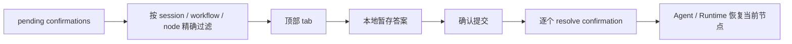

# 对话交互面板顶部 Tab 设计

> 更新时间：2026-05-15  
> 状态：当前基线  
> 高保真参考：[interaction-panel-top-tabs-hifi.html](./interaction-panel-top-tabs-hifi.html)

## 1. 设计结论

对话工作台里的多问题交互以“顶部 tab + 单页暂存 + 最终确认提交”为唯一基线。早期的内层问题 tab、每个问题页独立提交、交互期间底部补充输入框不再保留，也不做兼容。

## 2. PRD

### 2.1 做什么

- 顶部 tab 是唯一导航，按待处理项展示：`问题一 / 问题二 / 问题三 / 权限 / 异常 / 确认提交`。
- 每个问题 tab 只展示一个问题，选项从上到下纵向排列。
- 题型能力必须保留：单选题单选，多选题多选；顶部 tab 只改变导航方式，不改变题型语义。
- 自定义输入作为选项列表里的最后一项，不再放到底部 composer。
- 用户点击单选选项后暂存答案并自动进入下一项；多选题不自动跳转，用户完成勾选后通过顶部 tab 或确认页继续。
- `确认提交` 是普通问题批量提交的唯一提交入口；提交后分别同步到对应 confirmation。
- 权限、异常仍在同一套顶部 tab 中展示，状态点使用权限/异常语义色，避免与普通问题混在一起。

### 2.2 不做什么

- 不再展示内层“问题 tab”或字段分页。
- 不在交互面板下方展示独立补充输入框。
- 不保留单个普通问题页的“提交选择 / 提交补充”按钮。
- 不为旧交互形态做双路径兼容。

### 2.3 验收标准

- 多个待交互项不会串到其他 session、workflow 或 node。
- 页面内只有顶部一套 tab 用于问题切换。
- 选择项纵向排列，移动端和窄屏不横向挤压。
- `selection: "multi"` 和多选字段不能被降级成单选。
- 当前主题切换后，交互面板的背景、边框、文字、状态点、按钮都跟随语义 token。
- 普通问题必须在 `确认提交` 页统一提交；提交失败时回到失败项并提示。

## 3. HLD

## 4. LLD

- `ConversationWorkbench`：交互激活时隐藏普通 composer，只渲染交互面板。
- `ConversationInteractionBar`：持有每个 confirmation 的暂存答案、顶部 tab、确认提交页和批量 resolve。
- `InteractionResponseForm`：只负责渲染当前项的输入控件；bar 模式不再拥有提交动作。
- `InteractionResponseForm` 的多字段输入纵向展开，不再用字段 tab 分页。
- 主题样式必须使用现有 CSS token：`--bg-card`、`--surface-overlay`、`--surface-hover`、`--border-color`、`--text-primary`、`--text-secondary`、`--accent-blue`、`--brand-soft`、`--success`、`--warning`、`--error`、`--on-brand`。

## 5. 高保真说明

`interaction-panel-top-tabs-hifi.html` 只作为交互和密度基线。生产实现必须服从 Vue 工作台现有布局、组件尺寸和主题 token，不复制原型里的固定颜色值。
