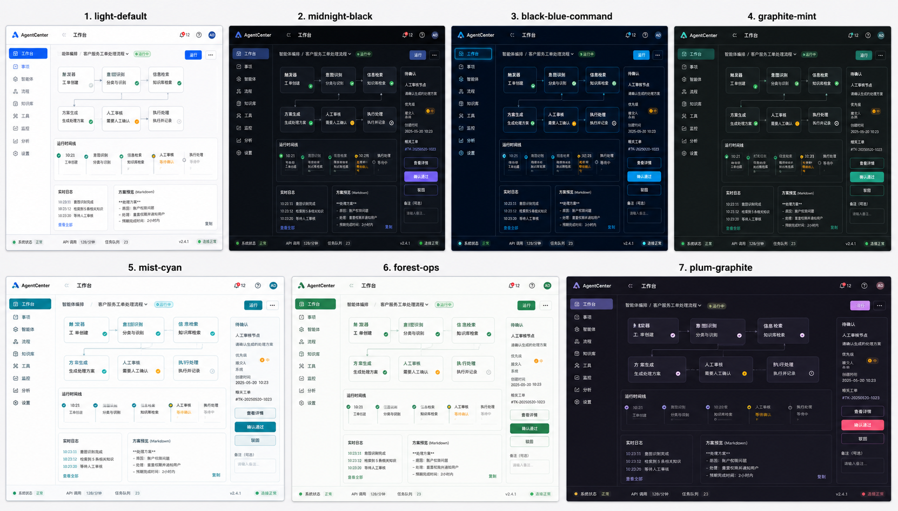
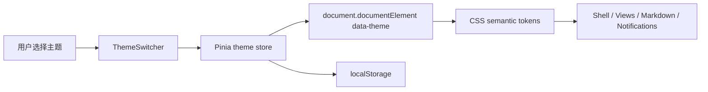

# AgentCenter Theme System Design

> 更新时间：2026-05-07  
> 状态：Draft for review  
> 范围：`agentcenter-web/` Vue 工作台主题切换和配色体系  
> 高保真参考：[theme-system-highfi-board.png](./theme-system-highfi-board.png)

## 1. 设计结论

AgentCenter 当前是浅色企业工作台主题。主题功能应以“语义 token + `data-theme`”实现，而不是在组件里分散判断主题。

本设计保留当前白色主题作为默认基线，并新增 6 套可选主题：

- `light-default`：当前白色经典基线。
- `midnight-black`：墨黑夜间主题。
- `black-blue-command`：黑蓝指挥台主题。
- `graphite-mint`：石墨青绿主题。
- `mist-cyan`：雾白青蓝主题。
- `forest-ops`：松针灰绿主题。
- `plum-graphite`：梅紫石墨主题。

实现上先支持完整 7 套主题注册和切换；如果后续想降低首批上线范围，可以只暴露 `light-default`、`midnight-black`、`black-blue-command`、`mist-cyan` 四套，其余保留在 registry 中。

## 2. PRD

### 2.1 背景

用户需要在白色工作台之外，切换不同视觉主题，尤其是黑色和黑蓝色主题。主题切换用于改善不同光照环境、演示场景和个人偏好下的可读性。

当前代码已有一层全局 CSS 变量：

- 背景：`--bg-primary`、`--bg-secondary`、`--bg-tertiary`、`--bg-card`、`--bg-card-hover`
- 文本：`--text-primary`、`--text-secondary`、`--text-muted`
- 边框：`--border-color`、`--border-color-hover`
- 强调：`--accent-blue`、`--accent-purple`、`--accent-gradient`
- 语义：`--success`、`--warning`、`--error`、`--info`

但组件内仍存在大量硬编码浅色假设，例如白色渐变、浅色状态 chip、通知白底、Markdown 表格白底、Mermaid 浅色变量、蓝紫 logo/avatar 渐变。主题系统必须先收拢这些颜色，否则深色主题会出现局部“白块”和对比度问题。

### 2.2 做什么

- 提供主题切换入口，用户可在工作台中即时切换主题。
- 主题选择持久化到浏览器本地，下次打开保持上次选择。
- 全局背景、面板、卡片、边框、文本、按钮、状态 chip、通知、Markdown、Mermaid 随主题切换。
- 保持工作台布局、数据、路由、会话状态不变。
- 保持当前白色主题视觉基本不变。

### 2.3 不做什么

- 不引入新 UI 框架或新状态层。
- 不改后端 API，不把主题偏好写入 Bridge。
- 不改变首页、看板、工作流、对话工作台的信息架构。
- 不在本次主题设计中重做品牌 logo。
- 不用 `as any`、`@ts-ignore` 或删除测试绕过类型问题。

### 2.4 验收标准

- 用户能从顶栏切换主题，切换后立即生效。
- 刷新页面后仍保持用户选择的主题。
- 7 套主题在首页、看板、工作流配置、对话工作台、设置页中无明显白块、重叠或低对比文本。
- 普通正文对比度满足 WCAG AA 目标：普通文本 4.5:1，较大文本和 UI 边界 3:1。
- `npm run typecheck`、相关组件测试、`npm run build` 通过。
- UI 变更留下截图证据到 `.sisyphus/evidence/`。

## 3. 高保真参考



这张图用于表达主题方向，不是逐像素实现合同。最终实现仍以 Vue 工作台现有布局、组件密度和交互状态为准。

## 4. 主题目录

### 4.1 light-default

当前白色主题，适合默认办公和长时间阅读。

| Token | Value |
|------|-------|
| page | `#f6f8fb` |
| panel | `#ffffff` |
| card | `#ffffff` |
| hover | `#f8fafc` |
| border | `#d9e2ec` |
| text | `#0f172a` |
| muted | `#64748b` |
| brand | `#3b82f6` |
| accent | `#8b5cf6` |

### 4.2 midnight-black

纯黑方向但避免绝对黑压迫感，适合夜间工作。

| Token | Value |
|------|-------|
| page | `#08090c` |
| panel | `#101217` |
| card | `#151922` |
| hover | `#1b202a` |
| border | `#27303d` |
| text | `#f4f7fb` |
| muted | `#9aa7b6` |
| brand | `#8ab4ff` |
| accent | `#c084fc` |

### 4.3 black-blue-command

黑蓝指挥台主题，适合演示“智能编排中枢”和运行监控场景。

| Token | Value |
|------|-------|
| page | `#020817` |
| panel | `#061225` |
| card | `#0a1b33` |
| hover | `#0f2947` |
| border | `#16324f` |
| text | `#e6f2ff` |
| muted | `#8eb4d6` |
| brand | `#38bdf8` |
| accent | `#60a5fa` |

### 4.4 graphite-mint

石墨青绿主题，技术感强，但不完全依赖蓝色。

| Token | Value |
|------|-------|
| page | `#111315` |
| panel | `#181c1f` |
| card | `#1f2528` |
| hover | `#263033` |
| border | `#2e383a` |
| text | `#eef5f2` |
| muted | `#9fb0aa` |
| brand | `#2dd4bf` |
| accent | `#a3e635` |

### 4.5 mist-cyan

雾白青蓝主题，是浅色系的清爽替代款。

| Token | Value |
|------|-------|
| page | `#f4f8f8` |
| panel | `#ffffff` |
| card | `#fbfefe` |
| hover | `#edf7f8` |
| border | `#d7e5e7` |
| text | `#123033` |
| muted | `#5f7478` |
| brand | `#0891b2` |
| accent | `#14b8a6` |

### 4.6 forest-ops

松针灰绿主题，偏企业运维和治理场景。

| Token | Value |
|------|-------|
| page | `#f5f7f3` |
| panel | `#ffffff` |
| card | `#fbfcf8` |
| hover | `#eef4ea` |
| border | `#dce5d6` |
| text | `#182318` |
| muted | `#667466` |
| brand | `#16a34a` |
| accent | `#0f766e` |

### 4.7 plum-graphite

梅紫石墨主题，更有品牌感，适合演示和个人偏好。

| Token | Value |
|------|-------|
| page | `#111016` |
| panel | `#191720` |
| card | `#211e2a` |
| hover | `#2a2535` |
| border | `#332d42` |
| text | `#f5f1fb` |
| muted | `#a99db8` |
| brand | `#a78bfa` |
| accent | `#fb7185` |

## 5. HLD

### 5.1 总体方案



主题切换只影响前端表现层。Bridge、工作流、会话、确认项和 Runtime Adapter 不感知主题。

### 5.2 主题入口

首选入口：顶栏右侧通知/设置附近增加主题按钮。

交互建议：

- 图标按钮：色板或半月图标，`aria-label="切换主题"`。
- 点击打开 popover。
- 每个主题项展示：主题名称、简短说明、5 个色块。
- 当前主题显示选中态。
- 键盘可 Tab 进入，Enter/Space 选择，Esc 关闭。

补充入口：设置菜单里增加“外观主题”，后续可进入设置页管理。

### 5.3 状态持久化

- `localStorage` key：`agentcenter.theme`
- 默认值：`light-default`
- 非法值：回退 `light-default`
- 后续可扩展 `system`，根据 `prefers-color-scheme` 选择浅色或深色；本设计不要求首批实现。

### 5.4 Token 分层

采用三层 token：

1. 主题语义 token：页面、面板、卡片、文本、边框、品牌、状态、阴影。
2. 兼容 token：继续提供当前组件已使用的 `--bg-primary`、`--accent-blue` 等变量，降低迁移风险。
3. 组件 token：必要时为 Markdown、通知、状态 chip、代码块补充局部语义变量。

核心目标：组件只消费语义变量，不感知具体主题 id。

## 6. Token 设计

### 6.1 推荐语义 token

```css
:root {
  --surface-page: #f6f8fb;
  --surface-shell: #ffffff;
  --surface-panel: #ffffff;
  --surface-card: #ffffff;
  --surface-hover: #f8fafc;
  --surface-muted: #eef2f7;
  --surface-input: #f6f8fb;
  --surface-overlay: rgba(255, 255, 255, 0.96);

  --border-default: #d9e2ec;
  --border-hover: #b9c7d8;
  --border-strong: #94a3b8;

  --text-primary: #0f172a;
  --text-secondary: #475569;
  --text-muted: #64748b;
  --text-inverse: #ffffff;

  --brand-primary: #3b82f6;
  --brand-secondary: #8b5cf6;
  --brand-gradient: linear-gradient(135deg, #3b82f6 0%, #8b5cf6 100%);
  --brand-soft: rgba(59, 130, 246, 0.1);
  --brand-border: rgba(59, 130, 246, 0.3);
  --focus-ring: rgba(59, 130, 246, 0.15);

  --success: #10b981;
  --warning: #f59e0b;
  --error: #ef4444;
  --info: #06b6d4;
  --success-soft: rgba(16, 185, 129, 0.12);
  --warning-soft: rgba(245, 158, 11, 0.13);
  --error-soft: rgba(239, 68, 68, 0.1);
  --info-soft: rgba(6, 182, 212, 0.12);

  --shadow-card: 0 2px 8px rgba(15, 23, 42, 0.08);
  --shadow-popover: 0 14px 32px rgba(15, 23, 42, 0.16);
  --code-bg: #0f172a;
  --code-text: #e2e8f0;
}
```

### 6.2 兼容映射

现有变量继续保留，但改为指向新 token：

| 现有变量 | 映射到 |
|---------|--------|
| `--bg-primary` | `--surface-page` |
| `--bg-secondary` | `--surface-shell` |
| `--bg-tertiary` | `--surface-muted` |
| `--bg-card` | `--surface-card` |
| `--bg-card-hover` | `--surface-hover` |
| `--border-color` | `--border-default` |
| `--border-color-hover` | `--border-hover` |
| `--accent-blue` | `--brand-primary` |
| `--accent-purple` | `--brand-secondary` |
| `--accent-gradient` | `--brand-gradient` |
| `--glow-blue` | `--focus-ring` |

这样可以分批迁移组件，不需要一次性重写所有样式。

## 7. LLD

### 7.1 建议文件

| 文件 | 责任 |
|------|------|
| `agentcenter-web/src/styles/app.css` | 保留基础 reset、布局尺寸变量、兼容变量 |
| `agentcenter-web/src/styles/themes.css` | 定义 `:root` 和 `[data-theme='...']` 的主题变量 |
| `agentcenter-web/src/theme/themes.ts` | 主题 registry：id、名称、描述、色块、亮暗类型 |
| `agentcenter-web/src/stores/theme.ts` | Pinia store：读取、设置、持久化主题 |
| `agentcenter-web/src/components/theme/ThemeSwitcher.vue` | 顶栏主题切换 popover |
| `agentcenter-web/src/components/shell/TitleBar.vue` | 接入 `ThemeSwitcher` |
| `agentcenter-web/src/components/conversation/MarkdownContent.vue` | Markdown/Mermaid 颜色改为主题 token |
| `agentcenter-web/src/components/notifications/NotificationBubbles.vue` | 通知背景、tone chip、阴影改为主题 token |

### 7.2 Theme registry

```ts
export type ThemeId =
  | 'light-default'
  | 'midnight-black'
  | 'black-blue-command'
  | 'graphite-mint'
  | 'mist-cyan'
  | 'forest-ops'
  | 'plum-graphite'

export interface ThemeOption {
  id: ThemeId
  label: string
  description: string
  tone: 'light' | 'dark'
  swatches: string[]
}
```

### 7.3 Store 行为

```ts
const STORAGE_KEY = 'agentcenter.theme'

function applyTheme(themeId: ThemeId) {
  document.documentElement.dataset.theme = themeId
  localStorage.setItem(STORAGE_KEY, themeId)
}
```

Store 初始化时读取 `localStorage`，如果值不在 registry 中则回退默认主题。

### 7.4 CSS 主题声明

```css
:root,
[data-theme='light-default'] {
  --surface-page: #f6f8fb;
  --surface-shell: #ffffff;
  --brand-primary: #3b82f6;
}

[data-theme='black-blue-command'] {
  --surface-page: #020817;
  --surface-shell: #061225;
  --surface-card: #0a1b33;
  --brand-primary: #38bdf8;
}
```

### 7.5 需要优先迁移的硬编码颜色

| 区域 | 问题 | 处理 |
|------|------|------|
| 顶栏 logo/avatar | 固定蓝紫渐变 | 改用 `--brand-gradient` |
| 首页统计卡 | 固定白色渐变和浅色 tint | 改用主题 token + 类型色 soft token |
| 状态 chip | 浅色背景 + 深色文字固定 | 增加 `--status-*-soft` 和 `--status-*-text` |
| 通知气泡 | 固定白色半透明背景 | 改用 `--surface-overlay` 和 `--shadow-popover` |
| Markdown 表格 | 固定 `#ffffff` / `#f8fafc` | 改用 `--surface-card` / `--surface-muted` |
| Markdown inline code | 固定浅色代码底 | 改用 `--inline-code-bg` / `--inline-code-text` |
| Mermaid | 初始化时写死浅色变量 | 根据当前 theme 生成 Mermaid themeVariables，并在主题变更后重渲染 |
| 蓝色 `rgba(59, 130, 246, ...)` | 深色和非蓝主题不匹配 | 改用 `--brand-soft`、`--brand-border`、`--focus-ring` |

## 8. 组件视觉规范

### 8.1 工作台外壳

- 主题切换不改变现有 shell 尺寸变量。
- 暗色主题里页面 gutter 可以比面板更暗，用 surface 层级制造深度。
- 边框保持克制，避免暗色主题里到处发光。

### 8.2 状态色

状态色需要跨主题保持语义稳定：

| 语义 | 默认建议 |
|------|----------|
| success | 绿色 |
| warning | 琥珀 |
| error | 红色 |
| info | 青蓝 |
| running | brand primary |
| skipped/pending | neutral muted |

暗色主题下状态 chip 不直接使用浅色 tint，需要使用透明 soft background，并保证文字对比度。

### 8.3 Markdown 和代码块

- 代码块默认保持深底，即使浅色主题也可保留 `#0f172a` 风格，符合开发工作台预期。
- 表格、blockquote、mermaid 容器必须跟随 surface token。
- Mermaid 渲染需要主题变量同步，否则深色主题中图表仍是浅色块。

### 8.4 主题切换动效

建议只使用 120ms 到 180ms 的颜色过渡：

```css
body,
button,
input,
select,
textarea {
  transition: background-color 160ms ease, border-color 160ms ease, color 160ms ease;
}
```

不建议给整个 shell 做复杂动画，避免大面积 repaint 和阅读干扰。

## 9. Verification

### 9.1 命令

按实现影响范围选择：

```bash
cd agentcenter-web
npm run typecheck
npm run test
npm run build
```

### 9.2 截图证据

UI 实现完成后建议生成这些证据：

| 文件 | 场景 |
|------|------|
| `.sisyphus/evidence/theme-light-default-home.png` | 首页白色主题 |
| `.sisyphus/evidence/theme-midnight-black-home.png` | 首页墨黑主题 |
| `.sisyphus/evidence/theme-black-blue-command-home.png` | 首页黑蓝主题 |
| `.sisyphus/evidence/theme-graphite-mint-home.png` | 首页石墨青绿主题 |
| `.sisyphus/evidence/theme-mist-cyan-home.png` | 首页雾白青蓝主题 |
| `.sisyphus/evidence/theme-forest-ops-home.png` | 首页松针灰绿主题 |
| `.sisyphus/evidence/theme-plum-graphite-home.png` | 首页梅紫石墨主题 |
| `.sisyphus/evidence/theme-dark-conversation.png` | 深色主题下对话 + Markdown + Mermaid |
| `.sisyphus/evidence/theme-switcher-popover.png` | 顶栏主题切换菜单 |

截图检查点：

- 左栏、中栏、右栏不因主题切换发生布局位移。
- 顶栏、侧栏、右侧待确认、底部状态栏 surface 层级清晰。
- 所有按钮 hover、active、focus 可见。
- 状态 chip 在浅色和深色主题下都能读清。
- 通知气泡、设置菜单、主题 popover 没有白块。
- Markdown 表格、代码块、Mermaid 在深色主题下不刺眼、不丢边界。

## 10. 实施顺序

1. 新增主题 registry、Pinia theme store、`themes.css`，先只让 `body` 和 shell 级 token 可切换。
2. 在 `TitleBar.vue` 接入 `ThemeSwitcher`，完成选择和持久化。
3. 将 `TitleBar`、`LeftSidebar`、`RightPanel`、`StatusBar` 的硬编码品牌色和透明蓝色迁移为 token。
4. 迁移首页、看板、工作流、对话工作台中的状态 chip、卡片阴影、浅色背景。
5. 迁移 `NotificationBubbles`、`MarkdownContent`、Mermaid 主题变量。
6. 跑 typecheck/test/build，并生成 7 套主题截图证据。

## 11. 待确认问题

- 首批产品入口是否直接展示全部 7 套主题，还是只展示 4 套并把另外 3 套作为隐藏实验主题。
- 是否需要增加 `system` 主题，跟随系统浅色/深色偏好。
- 主题偏好是否后续要进入用户配置 API；当前设计只做浏览器本地持久化。
