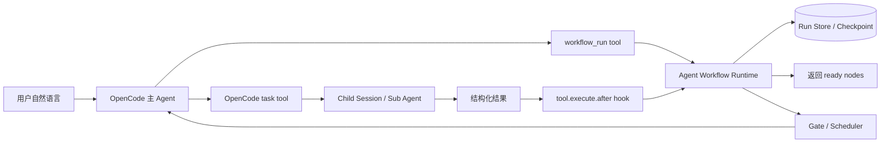

# Agent Workflow Runtime Implementation Plan

Status: Phase 4 implemented — Phase 2 skeleton + Phase 3 reusable definitions + Phase 4 realtime observability
Target first runtime: OpenCode

## Phase 3 reusable workflow definitions

The package now includes a controlled workflow definition layer:

- `workflow_define` creates a draft DAG from a natural-language workflow description;
- `workflow_validate` checks a workflow JSON definition before it can be saved;
- `workflow_save` stores a user-confirmed reusable definition;
- `workflow_list` and `workflow_show` inspect saved definitions;
- `workflow_run workflow_id=<id>` runs a saved definition;
- `workflow_route` can recommend saved workflows, but still never starts one automatically.

Saved definitions live under:

```text
.opencode/agent-workflow/definitions/
```

Runs still live under:

```text
.opencode/agent-workflow/runs/
```

The definition layer is intentionally schema-controlled. The main Agent may help
draft workflow JSON, but saved workflows must pass runtime validation: safe ids,
known agents, supported node types, known dependencies, and an acyclic DAG.

## Phase 4 realtime observability and debugging

The package now includes a local realtime observe server and run diagnostics:

- `workflow_debug` explains ready nodes, blocked nodes, waiting nodes, failed nodes,
  dependency state, task ids, and runner info;
- `workflow_observe` starts or reuses a local HTTP dashboard for one workflow run
  or saved workflow definition.

The observe page is served from localhost and polls the runtime state every
1500ms:

```text
http://127.0.0.1:<port>/runs/<runId>
http://127.0.0.1:<port>/definitions/<workflowId>
```

JSON APIs are available under `/api/runs/<runId>` and
`/api/definitions/<workflowId>` for debugging and smoke tests.

## Phase 2 skeleton

The current package now includes the second-phase collaboration skeleton:

- workflow activation is explicit-or-confirmed, not default routing;
- the default code-change workflow fans out into parallel scout branches;
- `scout_join` auto-completes when scout branches finish or are skipped;
- `synthesizer` reduces parallel scout results before risk review;
- node-level waiting no longer freezes unrelated ready branches;
- `workflow_deviation_request` records reasoned workflow changes and gates medium/high risk changes through user approval;
- run state has versioned, serialized updates and richer compaction capsules.
- workflow execution backend is now a runner abstraction: OpenCode Native is the
  default backup runner, while OMO can be enabled later as an explicit bridge
  without making workflow state depend on OMO.

Detailed scope: [docs/phase-2-plan.md](docs/phase-2-plan.md)

## 当前 V1 已实现的闭环

这个目录现在已经不是纯计划文档，包含一个可被 OpenCode 加载的本地插件包：

```text
packages/agent-workflow/
  src/core/          # workflow definition / run state / DAG scheduler
  src/store/         # fs store / memory store
  src/opencode/      # OpenCode plugin / agents / render helpers
  scripts/           # install / uninstall / pack scripts
  test/              # scheduler tests
```

V1 能做：

- 注册 `workflow_*` 工具；
- 注册一组 OpenCode subagents：`workflow_planner`、`workflow_scout`、`workflow_coder`、`workflow_tester`、`workflow_reviewer`；
- 创建一个默认代码变更 workflow；
- 生成 workflow run 和 node run；
- 计算 DAG ready nodes；
- 通过 `tool.execute.before/after` 监听 OpenCode 原生 `task` tool；
- 记录 task 结果到 workflow node；
- 支持 `WAITING_FOR_USER` 和 `workflow_answer` 恢复；
- 在 system prompt / compaction 里注入 workflow capsule。

## 本地安装到 OpenCode

在仓库根目录执行：

```bash
bun --cwd packages/agent-workflow install:opencode
```

它会创建这个 OpenCode 插件 shim：

```text
.opencode/plugins/agent-workflow.ts
```

OpenCode 会自动扫描并加载 `.opencode/plugins/*.ts`，所以不需要手动改
`.opencode/opencode.jsonc`。

安装后重启 OpenCode session，就能看到这些工具：

```text
workflow_define
workflow_validate
workflow_save
workflow_list
workflow_show
workflow_debug
workflow_observe
workflow_route
workflow_run
workflow_state_get
workflow_answer
workflow_node_result
workflow_cancel
```

默认执行后端是 OpenCode Native：

```text
runner: native
```

这意味着每个 workflow node 会被渲染成 OpenCode 原生 `task` 调用说明，
并通过 `command: workflow:<runId>:<nodeId>` 被 hooks 自动写回状态。

如果同一个 OpenCode 工作区装了 OMO，可以在插件配置里显式打开 OMO bridge：

```json
{
  "runner": "omo",
  "omoTaskBridge": true
}
```

当前阶段 OMO bridge 使用 OMO 的 `task` 同步委托形态：

```text
run_in_background: false
load_skills: []
command: workflow:<runId>:<nodeId>
```

这样 workflow runtime 仍然拥有 DAG 状态、节点状态、等待问题和恢复点。OMO
只作为“怎么执行一个节点”的可选后端；没有 OMO 或未显式启用 OMO 时，会回落到
OpenCode Native runner。

运行状态默认保存到当前 worktree：

```text
.opencode/agent-workflow/runs/
```

## 卸载

```bash
bun --cwd packages/agent-workflow uninstall:opencode
```

卸载只移除插件 shim：

```text
.opencode/plugins/agent-workflow.ts
```

它不会删除已有 run state。如果要清理运行记录，可以手动删除：

```text
.opencode/agent-workflow/
```

## 打包

```bash
bun --cwd packages/agent-workflow pack:local
```

输出：

```text
dist/agent-workflow-runtime.tgz
```

这个包包含 `packages/agent-workflow` 源码和脚本。当前阶段它是本地试用包，
不是 npm 发布包。

## 在 OpenCode 里怎么试

安装并重启 OpenCode 后，在主对话里说：

```text
用 workflow 处理这个任务：帮我实现一个很小的代码改动，先分析再实现再测试。
```

主 Agent 应该调用：

```text
workflow_run
```

`workflow_run` 会返回 ready nodes。主 Agent 接下来要按返回说明调用 OpenCode 原生：

```text
task
```

关键是 task 参数里必须带上 Runtime 返回的 command，例如：

```text
command: workflow:<runId>:planner
```

task 完成后插件会通过 `tool.execute.after` 自动写回节点状态。然后主 Agent
继续调用：

```text
workflow_state_get
```

如果某个节点返回：

```text
<workflow_needs_input>{"question":"...","choices":["..."]}</workflow_needs_input>
```

run 会进入 `waiting`。这时主 Agent 必须先调用 OpenCode 原生 `question`
工具，把问题和选项交给用户选择；不能只在普通文本里问。`question` 返回后，
主 Agent 再调用：

```text
workflow_answer run_id=<runId> node_id=<nodeId> answer=<selected label> source=question
```

然后同一个节点会重新进入 ready 状态，从 checkpoint 继续。

## 创建可复用 workflow

先让 Agent 创建一个草案：

```text
创建一个 workflow：先分析架构影响，高风险先问我，再实现；
同时准备测试方案，最后 review。名字叫 safe-code-change。
```

主 Agent 应调用：

```text
workflow_define
```

草案不能直接保存。主 Agent 要先调用 OpenCode 原生 `question` 工具确认是否保存。
用户选择保存后，主 Agent 再调用：

```text
workflow_save confirmed_by_question=true
```

以后可以运行指定 workflow：

```text
用 safe-code-change workflow 处理这个任务：实现一个小改动并验证。
```

主 Agent 应调用：

```text
workflow_run workflow_id=safe-code-change
```

## 调试和实时观察

如果一个 workflow 看起来卡住了，先让主 Agent 调用：

```text
workflow_debug run_id=<runId>
```

如果只想看某个节点：

```text
workflow_debug run_id=<runId> node_id=coder
```

打开当前 run 的实时观察页：

```text
workflow_observe run_id=<runId>
```

打开已保存定义的实时观察页：

```text
workflow_observe workflow_id=safe-code-change
```

它会返回本地 dashboard URL 和 JSON API URL。页面会轮询最新 run state，
所以节点进入 waiting、并发分支完成、join 解锁、失败或取消都会在页面上继续更新。

## 一句话结论

可以先在 OpenCode 里做完整，但不要把 workflow 逻辑写进
`packages/opencode/src`。第一版放在独立 package：

```text
packages/agent-workflow/
```

OpenCode 只通过插件入口加载它。Workflow Runtime 自己拥有 workflow
definition、run state、node state、checkpoint、artifact 和 evidence。

## 目标

用户用自然语言描述一个工作流程，例如：

```text
先理解现有鉴权，再设计方案，再实现，再跑测试。
如果风险高，先问我；如果测试失败，让修复 Agent 再改一轮。
```

系统把它固化为可运行 DAG：

```text
Planner
  -> Code Scout
  -> Design
  -> Coder
  -> Test
  -> Reviewer
```

每个 Agent 节点可以顺序执行、并行执行、等待用户、失败重试、fallback、
被 reviewer gate 拦住，或者把结果交给下游节点。

## 不做什么

- 不把 workflow 调度器塞进 OpenCode core。
- 不直接改 `TaskTool` 内部实现。
- 不让子 Agent 自由互相聊天导致秩序失控。
- 不在 V1 做复杂可视化画布编辑器。
- 不要求所有 Agent 平台一开始都支持；先跑通 OpenCode。

## 目录边界

建议最终目录如下：

```text
packages/agent-workflow/
  package.json
  README.md
  src/
    index.ts
    core/
      definition.ts
      state.ts
      dag.ts
      scheduler.ts
      gate.ts
      artifact.ts
      event.ts
    store/
      fs-store.ts
      memory-store.ts
    opencode/
      plugin.ts
      agents.ts
      hooks.ts
      tools.ts
      task-protocol.ts
      render.ts
    prompt/
      workflow-builder.md
      node-runner.md
      reviewer.md
    cli/
      index.ts
    test/
      dag.test.ts
      scheduler.test.ts
      state.test.ts
```

唯一允许在外部出现的东西，是很薄的安装/加载入口：

```text
.opencode/plugins/agent-workflow.ts
```

这个入口只 import `packages/agent-workflow/src/opencode/plugin.ts`，不写业务逻辑。
如果 OpenCode config 可以直接引用 package path，就连这个 shim 也可以不要。

## 总体架构



OpenCode 负责真实子 Agent 执行。Workflow Runtime 负责秩序：

- 哪些节点可执行；
- 节点输出是否满足契约；
- 谁依赖谁；
- 谁需要等待用户；
- 失败后重试还是 fallback；
- 哪些 evidence 要保存；
- 下游什么时候解锁。

## OpenCode 接入点

| 接入点 | 用途 | 是否改 OpenCode core |
| --- | --- | --- |
| `config` hook | 注册 workflow agents、命令和默认配置 | 否 |
| plugin tools | 提供 `workflow_create`、`workflow_run`、`workflow_state_get`、`workflow_answer` 等工具 | 否 |
| `tool.execute.before` | 给 task 调用补充 node/run 上下文，必要时拦截权限 | 否 |
| `tool.execute.after` | 监听 `task` 结果，把子 Agent 输出写回节点状态 | 否 |
| `experimental.chat.system.transform` | 注入当前 workflow run capsule，让主 Agent 知道运行状态 | 否 |
| `experimental.session.compacting` | 压缩上下文时保留 workflow checkpoint 摘要 | 否 |
| `permission.ask` | 把高风险权限请求映射为 workflow wait/gate | 否 |

## V1 的关键实现方式

V1 不让插件直接 import OpenCode 内部 `TaskTool`。这样会耦合到
`packages/opencode/src/tool/task.ts`，以后 OpenCode 升级容易断。

V1 采用“Runtime 管状态，主 Agent 调原生 task”的协议：

1. 用户触发 workflow。
2. 主 Agent 调用 `workflow_run`。
3. Runtime 创建 run，生成 DAG，返回当前可运行节点。
4. 主 Agent 按 Runtime 返回的指令调用 OpenCode 原生 `task` tool。
5. task 参数里带上 `command: workflow:<runId>:<nodeId>`。
6. 子 Agent 完成后，OpenCode 触发 `tool.execute.after`。
7. Workflow 插件从 task args/result 识别 runId/nodeId，写回节点状态。
8. Scheduler 判断下游是否解锁。
9. 如果节点需要用户输入，Runtime 返回等待卡片；用户回答后调用 `workflow_answer` 继续。

这样做的好处：

- 不改 OpenCode core；
- 仍然使用 OpenCode 原生 child session；
- 子 Agent 的结果能被 Runtime 记录；
- 未来 Codex 版本只需要换 AgentRunner 适配器。

## Agent 协作模型

第一版支持这些协作方式：

| 协作方式 | V1 支持方式 |
| --- | --- |
| 顺序交接 | 下游节点依赖上游 artifact |
| 并行调研 | Scheduler 同时返回多个 ready nodes |
| 汇聚总结 | Synthesizer 节点依赖多个上游结果 |
| Reviewer gate | Reviewer 输出 pass/fail/change_request |
| 测试修复循环 | Test failed 后路由回 Fix 节点，限制最大轮次 |
| 用户确认 | 节点进入 `WAITING_FOR_USER`，等待 `workflow_answer` |
| 权限确认 | `permission.ask` 映射到 wait/gate |
| 失败 fallback | 节点失败后走 fallback edge 或终止 run |

Agent 之间不直接互聊。它们通过 artifact 交接：

```text
Code Scout output -> Design input
Design output -> Coder input
Coder diff -> Reviewer input
Test result -> Fixer input
```

## 核心数据结构

```ts
type WorkflowDefinition = {
  id: string
  version: string
  name: string
  nodes: WorkflowNode[]
  edges: WorkflowEdge[]
}

type WorkflowNode = {
  id: string
  type: "agent" | "gate" | "join" | "human"
  agent?: string
  prompt: string
  inputFrom?: string[]
  outputContract?: Record<string, unknown>
  retry?: { max: number }
}

type WorkflowRun = {
  id: string
  workflowId: string
  sessionId: string
  status: "running" | "waiting" | "failed" | "succeeded" | "cancelled"
  nodes: Record<string, WorkflowNodeRun>
  artifacts: WorkflowArtifact[]
  updatedAt: number
}

type WorkflowNodeRun = {
  nodeId: string
  status: "pending" | "running" | "waiting" | "succeeded" | "failed" | "skipped"
  taskId?: string
  wait?: WorkflowWait
  input?: unknown
  output?: unknown
  evidence?: WorkflowEvidence[]
  attempts: number
}
```

## 插件工具清单

第一批工具：

| Tool | 作用 |
| --- | --- |
| `workflow_create` | 把自然语言固化成 workflow definition 草稿 |
| `workflow_run` | 创建 run，返回 ready nodes 和 task 调用建议 |
| `workflow_state_get` | 查询 run、node、artifact、wait 状态 |
| `workflow_answer` | 记录原生 `question` 工具返回的用户答案，恢复节点 |
| `workflow_node_result` | 兜底写回节点结果，防止 hook 漏记 |
| `workflow_cancel` | 取消整个 run 或单个节点 |

第二批工具：

| Tool | 作用 |
| --- | --- |
| `workflow_template_save` | 保存可复用 workflow 模板 |
| `workflow_template_list` | 列出项目里的 workflow 模板 |
| `workflow_artifact_get` | 读取节点产物 |
| `workflow_retry_node` | 重试某个失败节点 |

## 实施阶段

### Phase 0: 独立包骨架

交付物：

- `packages/agent-workflow/package.json`
- core 类型和状态机；
- memory store；
- DAG ready-node 计算；
- 单元测试。

验收：

- 可以不用 OpenCode，直接测试 DAG 调度。
- 顺序、并行、join、失败、等待用户状态都能测。

### Phase 1: OpenCode plugin 最小闭环

交付物：

- `src/opencode/plugin.ts`
- `workflow_run`
- `workflow_state_get`
- `workflow_answer`
- `tool.execute.after` 监听 task 结果；
- `experimental.chat.system.transform` 注入 run capsule。

验收：

- 用户一句自然语言能创建一个 3-5 节点 workflow。
- 主 Agent 能按 Runtime 指令调用 `task`。
- 子 Agent 结果能自动写回 node 状态。
- 节点等待用户后可以 resume。

### Phase 2: Agent 协作模板

交付物：

- 内置 Agent 类型：planner、code_scout、designer、coder、tester、reviewer、synthesizer。
- 内置 workflow 模板：调研-设计-实现-测试-审查。
- output contract 和 reviewer gate。

验收：

- 支持顺序、并行 scout、reviewer gate、测试失败回修。
- 每个节点都能产生 artifact/evidence。

### Phase 3: 持久化和恢复

交付物：

- fs store；
- checkpoint；
- run event log；
- compaction capsule；
- session 重开后恢复 workflow 状态。

验收：

- 刷新或压缩上下文后，workflow 不丢状态。
- 等待中的问题还能继续回答。
- 已完成节点不会重复执行。

### Phase 4: UI 呈现

交付物：

- 主对话里的 workflow run 卡片；
- run/node 状态列表；
- wait 卡片；
- artifact/evidence 展开查看；
- 简单 DAG 只读视图。

验收：

- 用户能看懂当前跑到哪；
- 能看到哪个 Agent 在等什么；
- 能回答、取消、重试。

### Phase 5: 平台化适配

交付物：

- `AgentRunner` interface；
- `OpenCodeAgentRunner`；
- 后续 `CodexAgentRunner`；
- CLI/MCP 入口。

验收：

- core 不依赖 OpenCode。
- OpenCode 只是第一个 adapter。
- Codex 后续通过实现 runner 就能复用 DAG、状态机、artifact、gate。

## 风险和处理

| 风险 | 处理 |
| --- | --- |
| 主 Agent 没按 Runtime 指令调用 task | system transform 注入强约束；必要时 V1.1 增加轻量 OpenCode public runner hook |
| task 结果无法稳定映射到 node | task args 必须带 `command: workflow:<runId>:<nodeId>` |
| 子 Agent 输出不结构化 | prompt 要求 JSON summary + evidence；Runtime 做 schema 校验 |
| 等待用户后无法恢复 | node checkpoint 保存 task_id、输入、问题、用户答案 |
| DAG 循环导致无限修复 | loop edge 必须有最大轮次 |
| 插件和 OpenCode core 耦合 | 禁止从 `packages/agent-workflow` import `packages/opencode/src/*` |

## 我建议的第一刀

先做 Phase 0 + Phase 1，不做 UI 画布。

第一刀的真实体验应该是：

```text
用户：按这个目标跑一个 workflow
主 Agent：调用 workflow_run
Runtime：返回 3 个 ready nodes
主 Agent：调用 task 跑 planner/code_scout/risk_review
Runtime：通过 hook 收到结果
Runtime：发现 risk_review 需要用户确认
主对话：展示等待问题
用户：回答
Runtime：workflow_answer 恢复
主 Agent：继续调用 task 跑 coder/tester/reviewer
Runtime：汇总 evidence
```

只要这个闭环跑通，后面的可视化、模板库、Codex adapter 都是加能力，
不是推翻重来。
